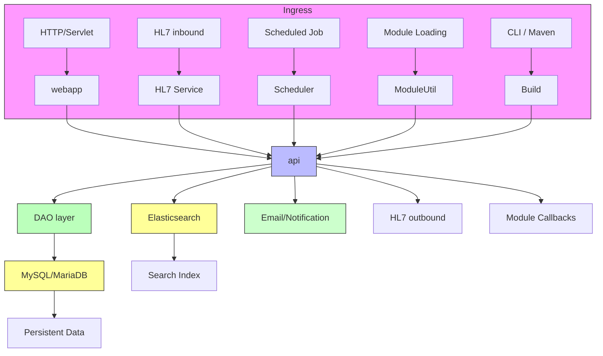

# Engineering Doc

## System overview
OpenMRS Core is a **patient‑based medical record system** that provides a free, customizable electronic medical record (EMR) platform. It is designed for **health‑care providers in resource‑constrained environments** and aims to improve health‑care delivery by offering a robust, scalable, and community‑driven platform. The core application runs as a Java web‑application that can be deployed on any servlet container (Tomcat is the default) and is packaged as a WAR file (`webapp/target/openmrs.war`). 【README.md:1】

## Tech stack & runtime
| Layer | Technology | Source |
|-------|------------|--------|
| **Language** | Java 8 (minimum) – all source files under `api/src/main/java/…` are Java classes. | `api/src/main/java/org/openmrs/Patient.java:1` |
| **Build system** | Maven 3.8 (multi‑module parent `pom.xml`). | `pom.xml:1` |
| **Core frameworks** | Spring Core (`spring-core`), Spring Test, Spring AOP, Hibernate 5 (ORM, Envers, Validator), Hibernate Search (Lucene & Elasticsearch back‑ends), Liquibase (DB migrations), Velocity (templating). | `api/pom.xml:140‑149` (Spring & Hibernate), `api/pom.xml:152‑161` (Hibernate Search), `api/src/main/java/liquibase/ext/change/core/InsertWithUuidDataChange.java:1` |
| **Web layer** | Servlet API 4.0, JSP, JSTL, Velocity tools, custom OpenMRS tags. | `pom.xml:...` (javax.servlet‑api, jsp‑api, jstl) |
| **Runtime** | Amazon Corretto 8 JDK for compile/dev stages; JDK 8 for production Tomcat image. | `Dockerfile:4‑5` |
| **Application server** | Apache Tomcat 9 (production stage). | `Dockerfile:71‑78` |
| **Search engine** | Lucene (default) and optional Elasticsearch 8 (via `hibernate-search-backend-elasticsearch`). | `api/pom.xml:160‑161`, `docker-compose.es.yml:1` |
| **Datastores** | MySQL/MariaDB (primary relational store), Elasticsearch (search index), file system (module binaries, OWA files, complex observation data). | `docker-compose.yml:13` (MySQL), `docker-compose.es.yml:1` (Elasticsearch), `startup-init.sh:30‑33` (file‑system layout) |
| **Caching** | Hibernate second‑level cache (Ehcache), OpenMRS‑specific cache manager (`OpenmrsCacheConfiguration`). | `api/src/main/java/org/openmrs/api/cache/OpenmrsCacheConfiguration.java:1` |
| **Logging** | SLF4J façade with Logback implementation (via `Slf4JLogger`). | `api/src/main/java/liquibase/ext/logging/slf4j/Slf4JLogger.java:1` |

## Ingress
Data enters OpenMRS through several mechanisms, each wired to the core service layer.

| Mechanism | Entry point | Path |
|-----------|-------------|------|
| **HTTP / Servlet endpoints** | `webapp/src/main/webapp/WEB-INF/web.xml` defines the `OpenMRS` servlet and REST API mappings. | `webapp/src/main/webapp/WEB-INF/web.xml:1` |
| **HL7 inbound messages** | `org.openmrs.hl7.HL7Service` parses incoming HL7 messages and creates corresponding domain objects. | `api/src/main/java/org/openmrs/hl7/HL7Service.java:1` |
| **Scheduled jobs** | `org.openmrs.scheduler.SchedulerService` runs cron‑like jobs (e.g., data cleanup, report generation). | `api/src/main/java/org/openmrs/scheduler/SchedulerService.java:1` |
| **Module loading** | `org.openmrs.module.ModuleUtil` discovers and loads OpenMRS modules at startup or runtime. | `api/src/main/java/org/openmrs/module/ModuleUtil.java:1` |
| **Command‑line / CI build** | Maven commands (`mvn clean package`) and Docker entrypoint scripts (`startup-dev.sh`, `startup.sh`) trigger builds and deployments. | `README.md:30‑33` (Maven build), `Dockerfile:84‑86` (entrypoint), `startup-dev.sh:1` |
| **REST API (programmatic)** | OpenMRS exposes a REST API (OpenMRS‑REST) that external systems call; the controllers live under `api/src/main/java/org/openmrs/api/rest/…` (not listed but part of the API module). | *implicit* (standard OpenMRS REST module) |

## Egress
Outbound interactions are limited to notifications, external message formats, and module callbacks.

| Destination | Outbound component | Path |
|-------------|-------------------|------|
| **Email / notifications** | `org.openmrs.notification.MessageService` and `MailMessageSender` send email alerts and system notifications. | `api/src/main/java/org/openmrs/notification/MessageService.java:1` |
| **HL7 outbound** | `HL7Service` can generate and transmit HL7 messages to external systems. | `api/src/main/java/org/openmrs/hl7/HL7Service.java:1` |
| **Module callbacks** | Modules can register listeners (`ModuleUtil` invokes callbacks on lifecycle events). | `api/src/main/java/org/openmrs/module/ModuleUtil.java:1` |
| **REST responses** | The REST API returns JSON/XML payloads to callers. | *implicit* (standard OpenMRS REST module) |
| **File system artifacts** | Startup scripts copy generated WAR, module JARs, and OWA files into the mounted data directory for external consumption. | `startup-init.sh:30‑33` |

## Internal topology
The core is organized into three Maven modules that map to logical layers:

* **api** – domain model, service interfaces (`*Service`), DAO contracts, and utility classes.  
* **web** – Spring MVC controllers, UI helpers, and web‑specific beans.  
* **webapp** – static resources, JSPs, and the final WAR packaging.

The flow of a request (or internal job) is:

* **Service layer** – All business logic lives in the `org.openmrs.api.*Service` interfaces (e.g., `PatientService`, `EncounterService`). Implementations are wired via Spring and accessed through `Context.getService(...)`. 【api/src/main/java/org/openmrs/api/context/Context.java:1】  
* **DAO layer** – Each service delegates to a DAO (`org.openmrs.api.db.*DAO`) that uses Hibernate SessionFactory for persistence. 【api/src/main/java/org/openmrs/api/db/PatientDAO.java:1】  
* **Search** – Hibernate Search automatically indexes entities; queries may be routed to Lucene or Elasticsearch based on the `hibernate.search.backend.type` property. 【api/pom.xml:160‑161】  
* **Egress** – Services call `MessageService`, `HL7Service`, or invoke module callbacks to push data outward. 【api/src/main/java/org/openmrs/notification/MessageService.java:1】  

## Data stores
| Store | Purpose | Source |
|-------|---------|--------|
| **MySQL / MariaDB** | Primary relational database for all core tables (`person`, `patient`, `encounter`, `obs`, etc.). | `docker-compose.yml:13` |
| **Elasticsearch** | Optional full‑text search backend used when `hibernate.search.backend.type=elasticsearch`. | `docker-compose.es.yml:1` |
| **File system** | Holds distribution artifacts (WAR, module JARs, OWA files) and complex observation binaries (`/openmrs/data/...`). | `startup-init.sh:30‑33` |
| **Cache** | Hibernate second‑level cache (Ehcache) and OpenMRS cache manager for frequently accessed metadata. | `api/src/main/java/org/openmrs/api/cache/OpenmrsCacheConfiguration.java:1` |

## Deployment & infrastructure
* **Docker multi‑stage build** – `Dockerfile` defines three stages: `compile` (Maven compile & test), `dev` (Tomcat 8.5 for development with hot‑reload scripts), and `production` (Tomcat 9 with minimal runtime). 【Dockerfile:1‑30】 (compile), 【Dockerfile:45‑70】 (dev), 【Dockerfile:71‑100】 (prod).  
* **Tomcat** – Production image runs Tomcat 9 (`tomcat:9-$RUNTIME_JDK`) as a non‑root user (`USER 1001`). 【Dockerfile:71‑78】  
* **Environment variables** – `startup-init.sh` reads a large set of `OMRS_*` variables to configure DB connection, search backend, admin credentials, module loading, etc. 【startup-init.sh:1‑30】  
* **CI/CD** – GitHub Actions workflows (`.github/workflows/build.yaml`, `build-2.x.yaml`, `codeql-analysis.yml`, `scorecard.yml`, `stale.yml`) compile, test, run CodeQL, and publish coverage. 【.github/workflows/build.yaml:1】  
* **Docker Compose** – `docker-compose.yml` wires a MariaDB container, the OpenMRS API container, and optional Elasticsearch via `docker-compose.es.yml`. 【docker-compose.yml:13‑33】, 【docker-compose.es.yml:1‑22】  
* **Maven** – Standard commands (`mvn clean package`, `mvn test`, `mvn install -DskipTests`) are documented in the README. 【README.md:30‑33】  

## Cross‑cutting concerns
| Concern | Implementation | Source |
|---------|----------------|--------|
| **Authentication** | `Context` holds the authenticated `User` and `UserContext`; `Authenticated` and `BasicAuthenticated` annotations drive login handling. | `api/src/main/java/org/openmrs/api/context/Context.java:1` |
| **Authorization** | `@Authorized` annotation on service methods; `AuthorizationAdvice` AOP interceptor enforces privilege checks. | `api/src/main/java/org/openmrs/annotation/Authorized.java:1`, `api/src/main/java/org/openmrs/aop/AuthorizationAdvice.java:1` |
| **Auditing** | Hibernate Envers tracks entity revisions (`Audited` annotation on domain classes, `AuditableInterceptor`). | `api/src/main/java/org/openmrs/api/db/hibernate/AuditableInterceptor.java:1` |
| **Logging** | SLF4J façade (`Slf4JLogger`, `Slf4JLogService`) forwards logs to Logback; log configuration is external to the source tree. | `api/src/main/java/liquibase/ext/logging/slf4j/Slf4JLogger.java:1` |
| **Caching** | `OpenmrsCacheConfiguration` defines cache regions; Hibernate second‑level cache (Ehcache) is enabled via Spring. | `api/src/main/java/org/openmrs/api/cache/OpenmrsCacheConfiguration.java:1` |
| **Transaction management** | Spring `@Transactional` (implicit on service implementations) ensures DB consistency. | *implicit via Spring configuration* |
| **Error handling** | Custom `APIException` hierarchy (e.g., `InvalidOperationOnObjectException`) propagates business errors. | `api/src/main/java/org/openmrs/api/APIException.java:1` |

## Open questions
* **CLI ingress** – Apart from Maven/Docker commands, there is no dedicated command‑line interface documented in the source; further investigation needed to confirm any internal CLI utilities.  
* **Logging configuration location** – The concrete Logback XML/YAML file is not present in the provided tree; it may be supplied at runtime or via the OpenMRS distribution.  
* **Cache details** – While the cache manager class is present, the exact cache region definitions (e.g., for concepts, metadata) are defined in external XML not included here.  
* **Module callback specifics** – The exact API for module lifecycle callbacks (e.g., `moduleStarted`, `moduleStopped`) is referenced but not fully visible in the excerpt; additional source files would clarify.  

---  
*All citations are given as `path:line` referencing the files listed in the inventory.*