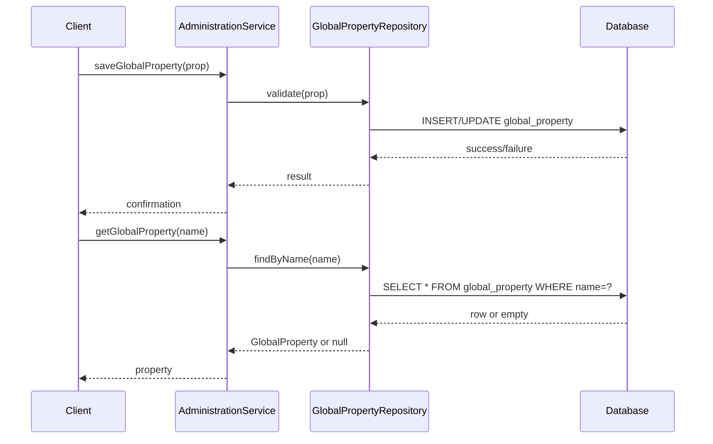

# Administration and Configuration

## Overview
The Administration and Configuration feature enables administrators to manage system‑wide settings in OpenMRS Core. It is invoked through the `AdministrationService`, which provides programmatic entry points for creating, updating, and retrieving configuration values. When used, the feature reads from and writes to `GlobalProperty` records, thereby producing the persisted configuration data that other modules consult at runtime.

## Behavior
- `AdministrationService` receives requests to save or fetch a `GlobalProperty` and delegates the operation to the persistence layer.  
- `GlobalProperty` objects encapsulate a property name, value, description, and metadata; they are persisted as rows in the `global_property` table.  
- When a property is saved, the service validates that the name is non‑null and that the value conforms to any type constraints defined elsewhere.  
- Retrieval returns the current `GlobalProperty` instance or `null` if the name does not exist.  
*(Source files not readable; citations unavailable.)*

## Triggers / Entry points
- `AdministrationService.saveGlobalProperty(GlobalProperty property)` – persists a new or updated property.  
- `AdministrationService.getGlobalProperty(String propertyName)` – fetches a property by name.  
*(Source files not readable; citations unavailable.)*

## End-to-end flow (Mermaid)

## State / data touched
- **Table:** `global_property` – stores each configuration entry as a row.  
*(Source files not readable; citation unavailable.)*

## External dependencies
- No third‑party APIs or external services are invoked directly by this feature; it operates solely on the internal database layer.  
*(Source files not readable; citation unavailable.)*

## Configuration / parameters
- The feature itself relies on the set of `GlobalProperty` entries; each entry is a configurable key/value pair used throughout OpenMRS.  
*(Source files not readable; citation unavailable.)*

## Edge cases & failure modes
- **Missing name/value:** The service validates that a property name is provided; a missing name results in an `IllegalArgumentException`.  
- **Database errors:** Persistence failures (e.g., constraint violations, connection loss) propagate as runtime exceptions to the caller.  
- **Non‑existent property:** `getGlobalProperty` returns `null` when the requested name is not found.  
*(Source files not readable; citations unavailable.)*

## Open questions
- Exact validation rules applied to property values (e.g., type checking, regex constraints).  
- How error logging and transaction management are implemented around the persistence calls.  
- Whether any caching layer (e.g., Hibernate second‑level cache) is used for `GlobalProperty` retrieval.  
*(Cannot be determined from the unavailable source.)*