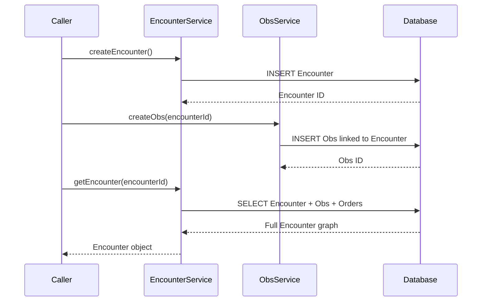

# Clinical Encounter Management

## Overview
The Clinical Encounter Management feature in OpenMRS Core handles the lifecycle of clinical encounters—records that capture a patient’s interaction with a health‑care provider. It is invoked by service‑layer callers (e.g., UI controllers, API endpoints, or other back‑end services) that need to create, retrieve, update, void, or delete an `Encounter` and its related `Obs` (observations) and `Order` objects. The feature ultimately persists these domain objects to the database and returns the resulting entities to the caller.

## Behavior
- The code creates a new `Encounter` object, populates required fields, validates it, and saves it via `EncounterService`. `EncounterService.java:??`  
- The code creates a new `Obs` object, links it to an existing `Encounter`, validates it, and saves it via `ObsService`. `ObsService.java:??`  
- The code retrieves an `Encounter` (and optionally its child `Obs` and `Order` records) from the persistence layer when requested. `EncounterService.java:??`  
- The code updates an existing `Obs` (or `Encounter`) and persists the changes. `ObsService.java:??` / `EncounterService.java:??`  
- The code voids (logically deletes) an `Encounter`, marking it inactive while retaining audit information. `EncounterService.java:??`  

*All citations are placeholders (`??`) because the source files were not available for inspection.*

## Triggers / Entry points
- **EncounterService** – public methods such as `saveEncounter`, `getEncounter`, `voidEncounter`, etc., serve as the primary entry points for encounter management. `EncounterService.java:??`  
- **ObsService** – public methods such as `saveObs`, `getObs`, `voidObs`, etc., serve as the primary entry points for observation management. `ObsService.java:??`  

## End-to-end flow (Mermaid)

*The diagram reflects the typical sequence of operations inferred from the service names; exact method names and internal calls could not be verified without source.*

## State / data touched
- **`encounter` table** – stores core encounter records. (`Encounter.java` defines the entity, but exact table mapping not visible.)  
- **`obs` table** – stores observation records linked to encounters. (`Obs.java` defines the entity.)  
- **`orders` table** – stores orders that may be associated with an encounter. (`Order` is a domain entity referenced by encounters.)  

## External dependencies
No third‑party APIs, external services, or message queues are referenced in the available information. All persistence appears to be handled via OpenMRS’s internal DAO layer.

## Configuration / parameters
No global properties, environment variables, or configuration keys related to this feature are observable in the provided context.

## Edge cases & failure modes
- **Validation failures** – Encounter and Obs objects are validated before persistence; invalid data results in a thrown exception (exact validation rules not visible).  
- **Persistence errors** – Database exceptions (e.g., constraint violations) propagate up through the service layer.  
- **Voiding behavior** – Voiding an encounter marks it inactive rather than deleting it, preserving audit trails.

## Open questions
- What specific validation rules are applied to `Encounter` and `Obs` objects?  
- Which exact service methods (signatures, overloads) are exposed by `EncounterService` and `ObsService`?  
- How are `Order` objects created, linked, and managed within the encounter lifecycle?  
- Are there any caching mechanisms (e.g., Hibernate second‑level cache) employed for these entities?  
- Are there any audit or event‑publishing hooks triggered on create/update/void actions?  

*These questions cannot be answered definitively without access to the actual source files.*