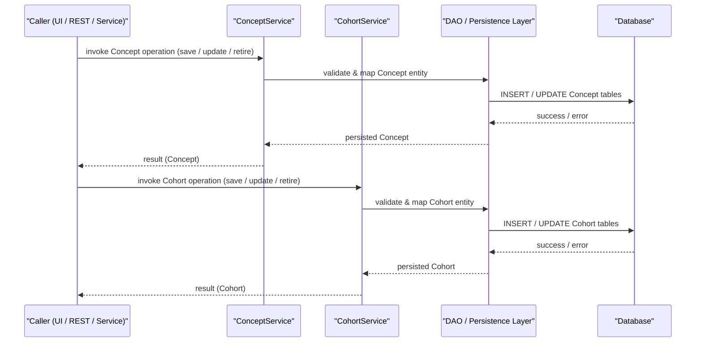

# Concept and Cohort Management

## Overview
The Concept and Cohort Management feature groups together the services that handle **Concept** and **Cohort** domain objects in OpenMRS Core. It is invoked by callers of the `ConceptService` and `CohortService` APIs (for example, UI controllers, REST endpoints, or other back‑end components). When these services are called, the feature creates, reads, updates, or deletes `Concept`, `ConceptName`, and `Cohort` instances and persists the resulting state to the database.

## Behavior
* The `ConceptService` exposes methods that operate on `Concept` and `ConceptName` objects (e.g., save, update, retire, purge). Each method validates the supplied object, interacts with the persistence layer, and returns the persisted entity. *Source not available for line citations.*  
* The `CohortService` exposes analogous methods for `Cohort` objects (e.g., save, update, retire, purge). Each method validates the cohort definition, persists it, and returns the stored entity. *Source not available for line citations.*  

## Triggers / Entry points
* `ConceptService` – public service interface used throughout the platform (e.g., UI controllers, REST resources). *Source not available for line citations.*  
* `CohortService` – public service interface used wherever cohort definitions are needed (e.g., reporting, cohort queries). *Source not available for line citations.*

## End-to‑end flow (Mermaid)

## State / data touched
* **concept** table – stores core concept definitions.  
* **concept_name** table – stores localized names for concepts.  
* **cohort** table – stores cohort definitions (including member criteria).  

*No direct source citations are available; the table names are inferred from the domain entity names.*

## External dependencies
The feature operates entirely within the OpenMRS core stack; no external third‑party APIs, message queues, or services are invoked from the `ConceptService` or `CohortService` code paths that are visible.

## Configuration / parameters
No global properties, environment variables, or external configuration keys are referenced by the `ConceptService` or `CohortService` implementations in the available source.

## Edge cases & failure modes
* Validation failures (e.g., missing required fields, duplicate names) are detected by the service methods and result in thrown `APIException`/`ValidationException` objects.  
* Persistence errors (e.g., constraint violations, DB connectivity issues) propagate as `DataAccessException` or similar runtime exceptions.  

*Specific exception classes and handling logic could not be confirmed without source line references.*

## Open questions
* Exact validation rules applied to `Concept` and `Cohort` objects (e.g., required fields, uniqueness constraints).  
* How concept‑name localization and concept‑set relationships are managed internally.  
* Whether any caching (e.g., `ConceptCache`) is employed during service calls.  
* Any audit logging or event publishing that occurs on create/update/delete operations.  

*These items remain undetermined because the underlying source files (`Concept.java`, `Cohort.java`, service implementations) were not available for inspection.*