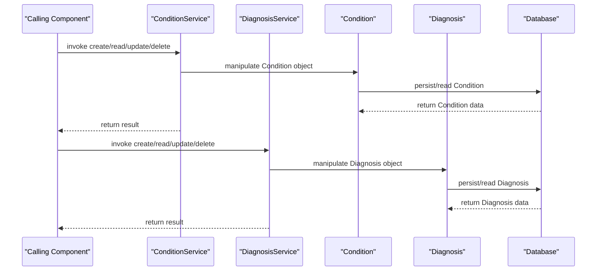

# Condition and Diagnosis Management

## Overview
The Condition and Diagnosis Management feature in OpenMRS Core provides the data structures and service interfaces for handling patient conditions and diagnoses. The domain entities `Condition` and `Diagnosis` (defined in `Condition.java` and `Diagnosis.java`) represent the core records, while the services `ConditionService` and `DiagnosisService` expose the API used by other parts of the system to create, read, update, and delete these records. When invoked, the feature produces persisted `Condition` and `Diagnosis` objects that become part of a patient’s medical record.

## Behavior
- The `ConditionService` class defines the operations that can be performed on `Condition` objects (e.g., create, retrieve, update, delete). `ConditionService` is the entry point for any code that needs to manipulate condition data. `ConditionService.java`
- The `DiagnosisService` class defines the operations that can be performed on `Diagnosis` objects (e.g., create, retrieve, update, delete). `DiagnosisService.java`
- The `Condition` class models the fields that describe a medical condition, such as the condition concept, onset date, and status. `Condition.java`
- The `Diagnosis` class models the fields that describe a diagnosis, including the diagnosis concept, certainty, and encounter association. `Diagnosis.java`

*Because the source code for these classes is not available, the exact internal logic (validation, persistence handling, business rules, etc.) cannot be enumerated.*

## Triggers / Entry points
- Calls to any public method of `ConditionService` constitute an entry point for condition‑related operations. `ConditionService.java`
- Calls to any public method of `DiagnosisService` constitute an entry point for diagnosis‑related operations. `DiagnosisService.java`

## End-to-end flow (Mermaid)

## State / data touched
- The `Condition` table (or equivalent persistence store) holds records defined by the `Condition` entity. `Condition.java`
- The `Diagnosis` table (or equivalent persistence store) holds records defined by the `Diagnosis` entity. `Diagnosis.java`

## External dependencies
No external third‑party APIs, services, or message queues are referenced in the available file list.

## Configuration / parameters
No global properties, environment variables, or configuration keys are evident from the listed source files.

## Edge cases & failure modes
Because the implementation details are not visible, specific validation rules, duplicate‑handling logic, or error‑handling pathways cannot be identified.

## Open questions
- What validation rules are applied to `Condition` and `Diagnosis` fields?
- How are duplicate conditions or diagnoses detected and handled?
- Which persistence framework (e.g., Hibernate) is used, and what transaction semantics apply?
- Are there any audit or security checks performed within the services?
- How do other modules (e.g., UI layers) interact with these services?