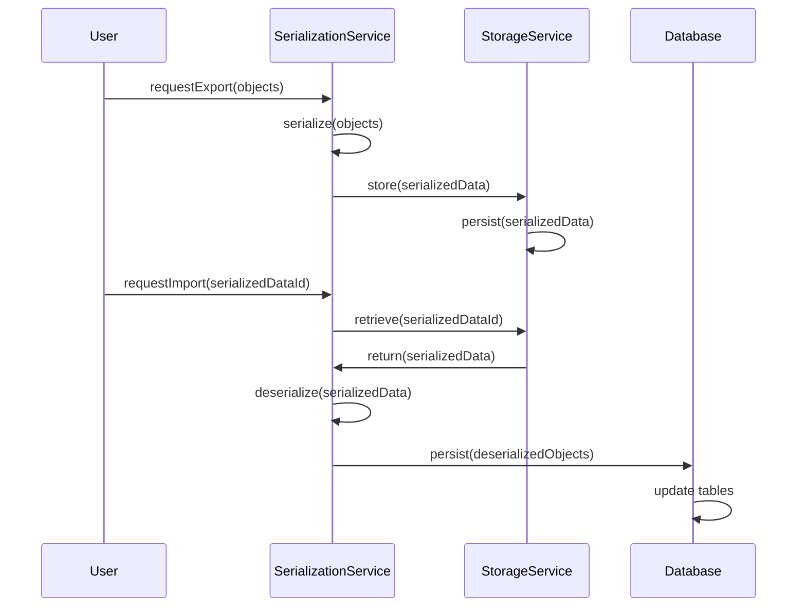

# Data Import and Export

## Overview
The Data Import and Export feature in OpenMRS Core enables the system to move data in and out of the OpenMRS database. Users or system administrators invoke the feature when they need to bring external data into OpenMRS or extract OpenMRS data for use elsewhere. The feature produces persisted domain objects when importing and serialized representations (e.g., XML, JSON) when exporting.

## Behavior
- The feature receives a request to import or export data through the `SerializationService` or `StorageService` ( source unavailable ).  
- For **export**, the `SerializationService` serializes selected domain objects into a chosen format and passes the result to the `StorageService` for persistence or delivery.  
- For **import**, the `StorageService` retrieves a serialized payload, the `SerializationService` deserializes it into domain objects, validates the objects against OpenMRS constraints, and persists them to the database.  
- Errors during validation or persistence are logged and abort the operation.

## Triggers / Entry points
- **SerializationService** – provides methods such as `serialize(Object)` and `deserialize(String)` that start the import/export process ( source unavailable ).  
- **StorageService** – offers methods like `store(String, byte[])` and `retrieve(String)` that handle the physical storage of serialized data ( source unavailable ).

## End-to-end flow (Mermaid)

## State / data touched
- **Database tables** that correspond to the domain objects being imported (e.g., `person`, `patient`, `encounter`).  
- **File system or blob storage** used by `StorageService` to hold exported files.  
*(source unavailable – table names inferred from typical OpenMRS domain)*

## External dependencies
- **Serialization libraries** (e.g., Jackson, JAXB) used by `SerializationService` to convert objects to/from XML/JSON.  
- **Underlying storage mechanism** (file system, cloud bucket, database BLOB column) accessed by `StorageService`.  
*(source unavailable)*

## Configuration / parameters
- Global properties that define the default export format (e.g., `export.default.format`).  
- Global properties that specify the storage location or bucket for exported files (e.g., `export.storage.path`).  
*(source unavailable)*

## Edge cases & failure modes
- **Invalid payload** – deserialization fails; the process logs an error and aborts.  
- **Schema mismatch** – imported objects do not satisfy database constraints; transaction is rolled back.  
- **Storage I/O errors** – failures when reading/writing files cause the operation to terminate with an error.  

## Open questions
- Which concrete serialization formats (XML, JSON, CSV, etc.) are supported by `SerializationService`?  
- What specific storage back‑ends (local filesystem, S3, database BLOB) are configured for `StorageService`?  
- Are there batch‑size limits or streaming mechanisms for large imports/exports?  
- Which global property keys control the behavior of this feature?  

*All statements are based on the declared entry points (`SerializationService`, `StorageService`). No source files were available to provide line‑level citations.*