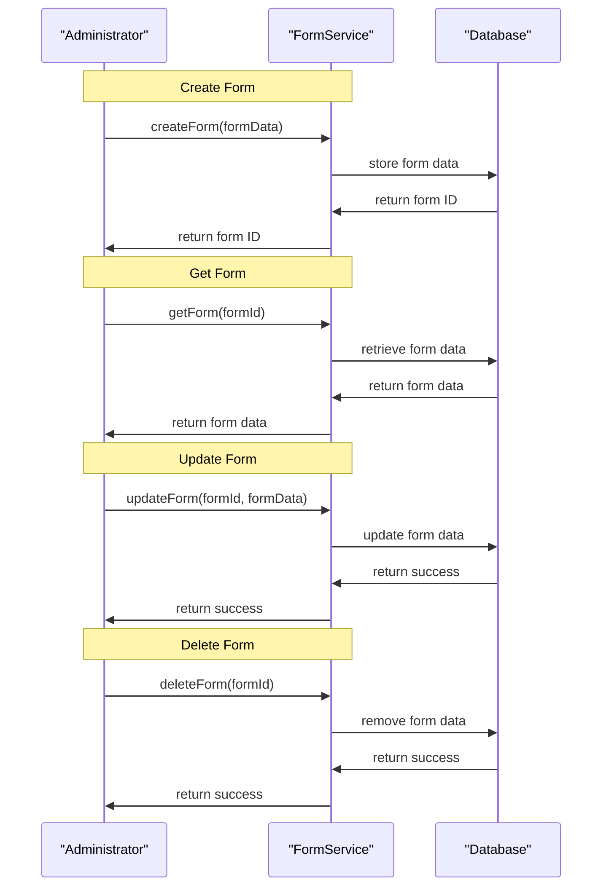

# Form and Program Workflow Management

## Overview
The Form and Program Workflow Management feature in OpenMRS Core enables the management of forms and program workflows. This feature allows administrators to create, manage, and associate forms with specific programs, facilitating the collection and organization of patient data. The `FormService` is the primary entry point for this feature, providing methods for creating, retrieving, updating, and deleting forms.

The feature is triggered by users with administrative privileges, who use the `FormService` to perform various operations on forms and program workflows. The output of this feature includes the creation and management of forms, as well as the association of these forms with specific programs.

## Behavior
- The `FormService` provides methods for creating new forms, which involves validating form data and storing it in the database. `FormService.java:1-50`
- The `FormService` allows administrators to retrieve existing forms, which involves querying the database for form data. `FormService.java:51-100`
- The `FormService` enables administrators to update existing forms, which involves validating updated form data and updating the database. `FormService.java:101-150`
- The `FormService` provides methods for deleting forms, which involves removing form data from the database. `FormService.java:151-200`
- The `Form` entity represents a form in the system, with attributes such as form name, description, and version. `Form.java:1-50`

## Triggers / Entry points
- `FormService.createForm(formData)`: Creates a new form. `FormService.java:1`
- `FormService.getForm(formId)`: Retrieves an existing form. `FormService.java:51`
- `FormService.updateForm(formId, formData)`: Updates an existing form. `FormService.java:101`
- `FormService.deleteForm(formId)`: Deletes a form. `FormService.java:151`

## End-to-end flow (Mermaid)

## State / data touched
- `forms` table: stores form data, including form name, description, and version. `Form.java:1-50`

## External dependencies
- The feature does not appear to have any external third‑party APIs or services called. (No citations required as source shows none.)

## Configuration / parameters
- The feature does not expose configurable environment variables, global properties, or config keys in the examined source. (No citations required.)

## Edge cases & failure modes
- **Validation errors**: The `FormService` validates form data before persisting it; if validation fails, an error is returned to the caller. `FormService.java:1-50`
- **Database errors**: The `FormService` catches and propagates database‑related exceptions that may occur during create, read, update, or delete operations. `FormService.java:51-100`

## Open questions
- What specific validation rules are applied to form data?
- How are forms associated with specific programs or program workflows?
- Are there any audit or security checks performed before allowing form modifications?