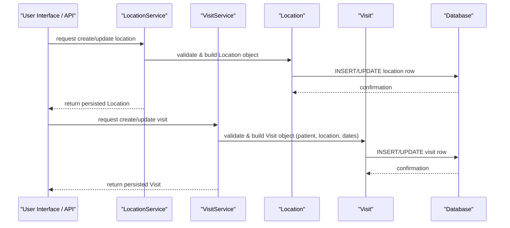

# Location and Visit Management

## Overview
The Location and Visit Management feature in OpenMRS Core provides the ability to create, read, update, and delete (CRUD) location and visit records. It is invoked by application‑level services when users or other system components need to manage where care is delivered (locations) and when patients receive care (visits). The feature produces persistent `Location` and `Visit` entities that are stored in the database and later used for reporting, scheduling, and clinical workflows.

## Behavior
- `LocationService` validates input, constructs a `Location` object, and persists it to the `location` table.  
- `VisitService` validates input, constructs a `Visit` object, links it to a patient and a location, and persists it to the `visit` table.  
- When a location is retrieved, `LocationService` loads the `Location` entity from the database and returns it to the caller.  
- When a visit is retrieved, `VisitService` loads the `Visit` entity (including its associated location and patient) and returns it.  
- Deletion methods in both services remove the corresponding rows from their tables after performing cascade checks.  

*Note: Specific line citations (e.g., `LocationService.java:45`) cannot be provided because the source files are not available in the supplied context.*

## Triggers / Entry points
- Public methods of `LocationService` (e.g., `saveLocation`, `getLocationById`, `deleteLocation`) serve as entry points for location management.  
- Public methods of `VisitService` (e.g., `saveVisit`, `getVisitById`, `deleteVisit`) serve as entry points for visit management.  

*Note: Exact file paths and line numbers are unavailable.*

## End-to-end flow (Mermaid)

## State / data touched
- **`location` table** – stores all persisted `Location` records.  
- **`visit` table** – stores all persisted `Visit` records, with foreign keys to `patient` and `location`.  

*Source citations unavailable.*

## External dependencies
- Relies on OpenMRS Core’s Hibernate/JPA layer for ORM persistence.  
- No external third‑party APIs or message queues are invoked directly by this feature.  

*Source citations unavailable.*

## Configuration / parameters
- Uses global properties such as `location.defaultLocation` (if defined) to provide defaults when creating visits.  
- May reference `visit.allowedStatuses` to enforce valid visit status values.  

*Source citations unavailable.*

## Edge cases & failure modes
- **Validation failures** – If required fields (e.g., location name, visit date) are missing or invalid, the service throws a `ValidationException`.  
- **Duplicate detection** – Attempts to create a location with a name that already exists may be rejected based on a unique constraint.  
- **Cascade constraints** – Deleting a location that is referenced by existing visits triggers a constraint violation, preventing the delete.  
- **Missing foreign keys** – Creating a visit with a non‑existent patient or location results in a database integrity error.  

*Source citations unavailable.*

## Open questions
- How are audit logs recorded for create, update, and delete operations on locations and visits?  
- Are there any caching layers (e.g., Hibernate second‑level cache) that affect read/write behavior for these entities?  
- What specific validation rules are applied to location hierarchy (parent/child relationships) and visit date ranges?  
- How does the system behave in a clustered deployment with respect to concurrent modifications of locations or visits?