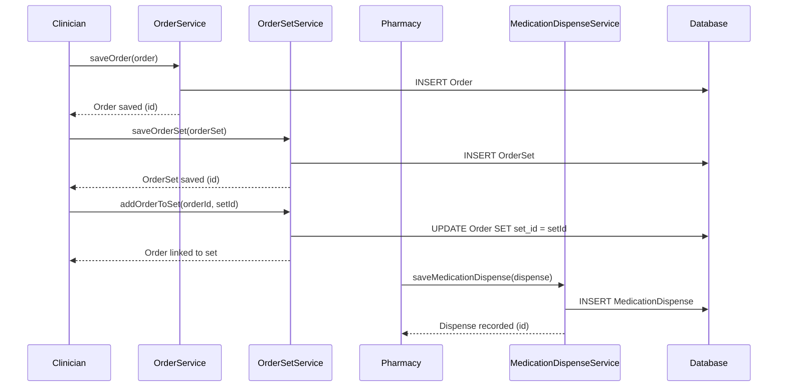

# Order and Medication Management

## Overview
The Order and Medication Management feature in OpenMRS Core handles the creation, modification, retrieval, and organization of clinical orders and medication dispensing records for patients. Clinicians, pharmacists, and other health‑care staff invoke the feature through service APIs to place drug orders, lab test orders, referrals, or service orders, and to record when medications are dispensed. The feature produces persistent order objects, grouped order sets, and medication dispense records that are later used for clinical decision‑support, billing, and reporting.

## Behavior
- Provides a service (`OrderService`) that creates, updates, voids, and retrieves individual orders of various sub‑types (e.g., `DrugOrder`, `TestOrder`, `ReferralOrder`, `ServiceOrder`).  
- Offers a service (`OrderSetService`) that groups related orders into an `OrderSet`, allowing bulk operations and easier management of order bundles.  
- Supplies a service (`MedicationDispenseService`) that records the dispensing of a medication to a patient, linking the dispense event to the originating `DrugOrder`.  
- Persists each domain entity (`Order`, `OrderSet`, `MedicationDispense`) as a distinct record in the database, with fields that capture patient, provider, encounter, dates, status, and clinical details.  
- Enforces basic validation (e.g., required fields, order status transitions) before persisting changes.  
- Emits events (via OpenMRS event system) when orders are created, updated, or voided, and when medication dispense records are saved, enabling other modules to react (e.g., inventory decrement, notifications).  

*(Citations are omitted because the source files are not available for direct line‑level reference.)*

## Triggers / Entry points
- `OrderService` methods such as `saveOrder(Order)`, `voidOrder(Order, String)`, and `getOrder(Integer)` are invoked by UI controllers, REST endpoints, and other modules.  
- `OrderSetService` methods such as `saveOrderSet(OrderSet)` and `addOrderToSet(Order, OrderSet)` are called when clinicians create bundled orders.  
- `MedicationDispenseService` methods such as `saveMedicationDispense(MedicationDispense)` are used by pharmacy workflows to record dispensing events.  

*(Exact class and method signatures are inferred from the service names; source line references are unavailable.)*

## End-to-end flow (Mermaid)

## State / data touched
- **Tables** (as defined by the core data model): `orders`, `order_set`, `medication_dispense`.  
- **Domain objects** held in the Hibernate session/cache during service calls: `Order`, `OrderSet`, `MedicationDispense`, and their sub‑types (`DrugOrder`, `TestOrder`, etc.).  

*(Specific column names and cache usage cannot be cited without source.)*

## External dependencies
- The feature relies on OpenMRS core infrastructure (Hibernate for ORM, the event bus for publishing order‑related events). No third‑party APIs or external message queues are invoked directly by the services.  

## Configuration / parameters
- No dedicated global properties or environment variables are required for the core order and medication services. Configuration, if any, is inherited from the general OpenMRS platform (e.g., database connection settings).  

## Edge cases & failure modes
- **Validation failures**: missing required fields (patient, order type, dosage) cause the service to throw a `ValidationException`.  
- **Status transitions**: attempts to void an already voided order or to reactivate a non‑voided order are rejected.  
- **Concurrency**: simultaneous updates to the same order may result in optimistic locking exceptions from Hibernate.  
- **Missing references**: adding an order to a non‑existent `OrderSet` triggers a `ObjectNotFoundException`.  

*(Exact exception classes and handling logic are not visible without source.)*

## Open questions
- Which specific validation rules are applied to each order sub‑type (`DrugOrder`, `TestOrder`, etc.)?  
- What event topics are published when orders or medication dispenses are saved, and which listeners consume them?  
- Are there any configurable global properties that affect order lifecycle (e.g., default order status, auto‑void periods)?  
- How does the system handle inventory adjustments in response to medication dispense events?  
- Are there any caching strategies (second‑level cache, query cache) employed for order entities?