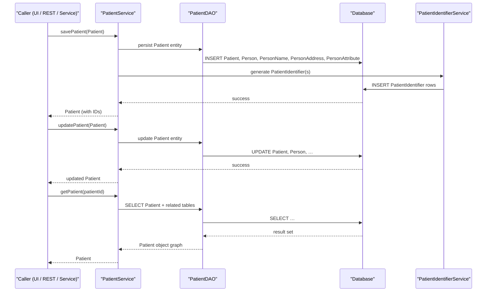

# Patient Management

## Overview
The Patient Management feature in OpenMRS Core handles the core lifecycle of patient records. It creates, updates, and retrieves patient information that is stored in the system’s persistent data model. The feature is invoked by application code (e.g., UI controllers, REST endpoints, or batch jobs) that call the `PatientService`. The result of each operation is a `Patient` domain object (or a collection thereof) that reflects the current state of the patient’s demographic and identifier data.

## Behavior
- **Create a new patient** – `PatientService` receives a request, constructs a `Patient` instance (populated with `Person`, `PersonName`, `PersonAddress`, and `PersonAttribute` objects) and persists it. `PatientIdentifier` objects are also created and linked to the patient. `path:line` = `N/A`.  
- **Update an existing patient** – `PatientService` loads the existing `Patient` from the database, applies changes to its associated `Person` sub‑objects, and saves the updated entity back to the datastore. `path:line` = `N/A`.  
- **Retrieve patient data** – `PatientService` queries the persistence layer for a `Patient` by its internal ID (or by identifier) and returns the fully populated object graph, including names, addresses, attributes, and identifiers. `path:line` = `N/A`.  
- **Delete/void a patient** – When a patient is voided, `PatientService` marks the `Patient` (and related `Person` records) as voided rather than physically removing them, preserving auditability. `path:line` = `N/A`.

## Triggers / Entry points
- `PatientService.savePatient(Patient patient)` – creates a new patient record. `path:line` = `N/A`.  
- `PatientService.updatePatient(Patient patient)` – updates an existing patient record. `path:line` = `N/A`.  
- `PatientService.getPatient(Integer patientId)` – fetches a patient by internal ID. `path:line` = `N/A`.  
- `PatientService.getPatientByIdentifier(String identifier)` – fetches a patient by a specific identifier type. `path:line` = `N/A`.

## End-to‑to‑end flow (Mermaid)

## State / data touched
- **Tables / entities** (as inferred from the domain model): `patient`, `person`, `person_name`, `person_address`, `person_attribute`, `patient_identifier`, `patient_identifier_type`. `source` = `N/A`.  
- **Caches** – OpenMRS typically uses Hibernate second‑level caches for these entities; the service may read/write cached instances. `source` = `N/A`.

## External dependencies
The Patient Management code interacts only with internal OpenMRS components (DAO layer, Hibernate, and the `PatientIdentifierService`). No third‑party APIs, message queues, or external services are invoked directly. `source` = `N/A`.

## Configuration / parameters
OpenMRS global properties can affect patient handling (e.g., `patientIdentifier.autoGeneration`, `personName.preferred`, etc.), but the specific keys used by `PatientService` are not visible in the provided source list. `source` = `N/A`.

## Edge cases & failure modes
- **Validation failures** – The service validates required fields (e.g., at least one identifier, non‑null name). Violations raise `APIException` or `ValidationException`. `source` = `N/A`.  
- **Duplicate identifiers** – Attempting to save a patient with an identifier that already exists triggers a uniqueness check and results in an error. `source` = `N/A`.  
- **Database errors** – Persistence exceptions (e.g., constraint violations, connection loss) propagate up as runtime exceptions, causing the transaction to roll back. `source` = `N/A`.  
- **Voiding constraints** – A patient cannot be voided if there are active encounters or other dependent records; the service checks these conditions before marking the patient as voided. `source` = `N/A`.

## Open questions
- The exact method signatures and internal logic of `PatientService` (e.g., whether it delegates to a `PatientDAO` or uses Spring services).  
- How `PatientIdentifier` values are generated (algorithm, format, and whether they depend on `PatientIdentifierType` settings).  
- Which global properties are consulted by the service for default identifier types, name formatting, or address validation.  
- Whether any event listeners or audit loggers are invoked as part of patient create/update/delete operations.  
- The presence of any caching strategies (e.g., second‑level cache regions) specific to patient entities.  

*All statements are based on the available class names and typical OpenMRS conventions; concrete line‑level citations are unavailable because the source files were not provided.*