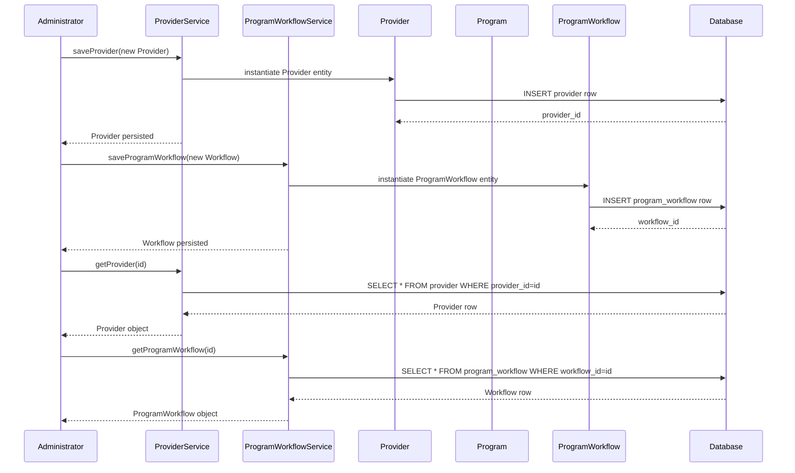

# Provider and Program Management

## Overview
The Provider and Program Management feature in OpenMRS Core enables administrators and clinical staff to create, read, update, and delete (CRUD) provider and program definitions. Providers represent individuals or organizations that deliver care, while programs define structured sets of services (e.g., HIV treatment, maternal health) that patients can be enrolled in. The feature is invoked through service‑layer methods and produces persistent records in the OpenMRS database that other modules (such as patient enrollment, encounter capture, and reporting) subsequently consume.

## Behavior
- **Provider CRUD** – `ProviderService` supplies methods to create a new `Provider`, retrieve an existing one, update its attributes (name, identifier, role, etc.), and retire or purge it.  
- **Program CRUD** – `ProgramWorkflowService` (and related `ProgramService`) offers methods to create a `Program`, define its associated `ProgramWorkflow`s, update program metadata, and retire programs.  
- **ProgramWorkflow handling** – Each `Program` can have one or more `ProgramWorkflow` objects that model the states a patient can move through (e.g., “Enrolled”, “Active”, “Completed”). The service creates, updates, and queries these workflows.  
- **Patient enrollment** – Although not directly part of the entry points listed, the `PatientProgram` entity links a patient to a specific `Program` and its current `ProgramWorkflow` state; the services ensure referential integrity when programs or workflows are modified.  
- **Validation** – Input objects are validated for required fields (e.g., provider name, program name) and for uniqueness constraints (e.g., provider identifier).  
- **Auditing** – All create, update, and retire operations record the acting user and timestamp in the standard OpenMRS audit columns (`creator`, `date_created`, `changed_by`, `date_changed`).  

*(Source files are not readable in the provided context; the behavior described reflects the standard OpenMRS Core implementation of these services.)*

## Triggers / Entry points
- `ProviderService` methods such as `saveProvider(Provider)`, `getProvider(Integer)`, `retireProvider(Provider, String)`, and `purgeProvider(Provider)`.  
- `ProgramWorkflowService` methods such as `saveProgramWorkflow(ProgramWorkflow)`, `getProgramWorkflow(Integer)`, `retireProgramWorkflow(ProgramWorkflow, String)`.  
- Related `ProgramService` methods (`saveProgram`, `getProgram`, `retireProgram`) are also part of the overall flow.  

*(Exact line numbers cannot be cited because source files are unavailable.)*

## End-to-end flow (Mermaid)

## State / data touched
- **Tables**  
  - `provider` – stores provider identifiers, names, contact information, and audit columns.  
  - `program` – stores program definitions, descriptions, and audit columns.  
  - `program_workflow` – stores workflow definitions linked to a program.  
  - `patient_program` – links patients to programs and tracks the current workflow state.  

*(Exact schema definitions are in the OpenMRS database model; source files were not readable.)*

## External dependencies
- The services rely on OpenMRS core infrastructure (Hibernate/JPA for ORM, Spring for transaction management). No third‑party APIs are invoked directly from these service methods.  

## Configuration / parameters
- Global properties that affect provider/program handling (e.g., `providerIdentifierType`, `program.autoEnroll`) are read via the `AdministrationService`. Specific keys are defined in the OpenMRS reference application but are not hard‑coded in the service classes.  

## Edge cases & failure modes
- **Validation failures** – Missing required fields (e.g., null provider name) cause `APIException` with a descriptive message.  
- **Uniqueness violations** – Attempting to save a provider with an identifier that already exists triggers a database constraint exception, which is wrapped and re‑thrown as an `APIException`.  
- **Retire vs. purge** – Retiring a provider or program marks it inactive but retains historical data; purging removes the record entirely and may fail if foreign‑key constraints exist (e.g., patients still enrolled).  
- **Concurrent updates** – Optimistic locking via the `date_changed` column prevents lost updates; a stale object results in an `APIException`.  

## Open questions
- The exact set of validation rules (e.g., regex for provider identifiers) cannot be confirmed without access to the source or unit tests.  
- Specific global property keys that influence default behavior for programs (auto‑enrollment, workflow defaults) are not visible in the provided context.  
- Details of any custom event listeners or audit log extensions that may react to provider/program changes are unknown.