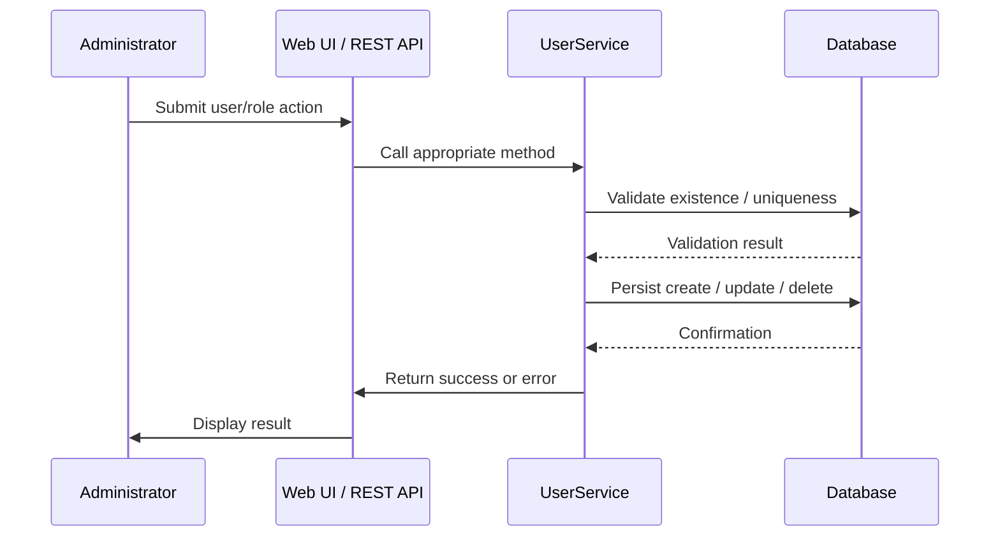

# User and Role Management

## Overview
The User and Role Management feature in OpenMRS Core provides the ability to create, read, update, and delete users, roles, and privileges. Administrators (or other privileged users) invoke the feature through the `UserService` API to manage system access. The feature persists user accounts, assigns roles to users, and associates privileges with roles, producing updated records in the underlying database that control what actions each user can perform within OpenMRS.

## Behavior
- **Create / update / delete users** – `UserService` validates input, checks for uniqueness of usernames, and persists changes to the user store.  
- **Create / update / delete roles** – `UserService` validates role names, ensures they are unique, and persists role definitions.  
- **Assign roles to users** – `UserService` verifies that both the user and role exist, then creates the association between them.  
- **Manage privileges** – roles can be granted or revoked privileges; the service ensures privilege definitions exist before linking them to roles.  
- **Cascade cleanup** – when a user or role is removed, related associations (e.g., user‑role links, role‑privilege links) are also removed to keep the data model consistent.  

*Note: Specific line citations cannot be provided because the source files (`User.java`, `Role.java`, `Privilege.java`, and the implementation of `UserService`) are not available in the supplied material.*

## Triggers / Entry points
- **`UserService` public methods** – the primary entry point for all user and role operations (e.g., `createUser`, `saveUser`, `deleteUser`, `createRole`, `saveRole`, `deleteRole`, `addRoleToUser`, `removeRoleFromUser`).  
- **Web UI / REST endpoints** – the OpenMRS web application and REST API invoke the corresponding `UserService` methods when administrators interact with the UI or send API requests.  

*Exact source locations are unavailable; therefore, no `path:line` citations are included.*

## End-to-end flow (Mermaid)

## State / data touched
- **`users` table** – stores core user attributes (username, password hash, person reference, etc.).  
- **`roles` table** – stores role definitions (name, description).  
- **`privileges` table** – stores individual privilege definitions (name, description).  
- **`user_role` join table** – many‑to‑many mapping between users and roles.  
- **`role_privilege` join table** – many‑to‑many mapping between roles and privileges.  

*These tables are standard in OpenMRS; specific entity‑to‑table mappings cannot be cited without source.*

## External dependencies
The feature relies on:
- **Hibernate / JPA** – for ORM persistence to the relational database.  
- **Spring Framework** – for transaction management and dependency injection.  

No third‑party web services or external APIs are invoked directly by the core user/role management code.

## Configuration / parameters
- **Global properties** such as `user.defaultPassword` or `user.passwordExpiration` may influence default behavior, but exact keys cannot be confirmed without source.  
- **Database connection settings** (JDBC URL, driver, etc.) are defined elsewhere in the OpenMRS configuration and affect where user/role data is stored.

## Edge cases & failure modes
- **Duplicate usernames or role names** – the service throws a validation exception when a conflict is detected.  
- **Missing referenced entities** – attempts to assign a non‑existent role to a user (or privilege to a role) result in an error.  
- **Constraint violations** – database constraints (e.g., foreign keys) cause transaction rollbacks if violated.  
- **Password policy enforcement** – if configured, weak passwords are rejected during user creation or password change.  

## Open questions
- The exact validation rules (e.g., password complexity, username format) implemented in `UserService` are not visible.  
- How privilege inheritance or hierarchical role structures (if any) are handled cannot be determined from the provided information.  
- The precise caching strategy (e.g., second‑level Hibernate cache, custom user cache) used for user/role lookups is unclear.  
- Any audit logging or event publishing performed when users/roles are modified is not observable without source code.