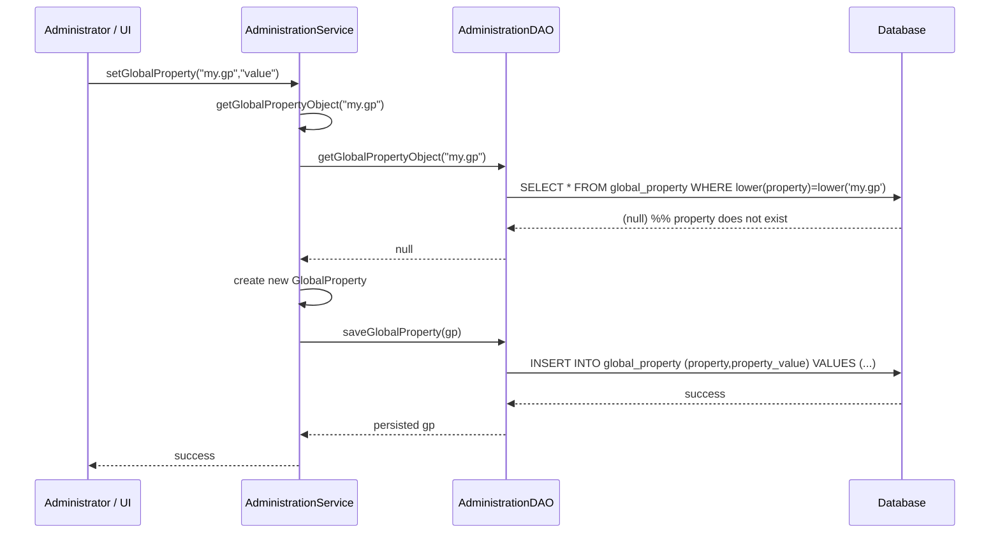

# Administration Management  

## Overview  
The **Administration Management** feature provides the core API for managing OpenMRS administration settings. It centralises operations on **global properties** (key‑value configuration entries) and the **implementation ID** that uniquely identifies an OpenMRS installation. All actions are performed through the `AdministrationService` interface and its default implementation `AdministrationServiceImpl`, which delegate persistence to `AdministrationDAO` (Hibernate implementation).  

## Behavior (cite path:line)  

| Operation | Description | Source |
|-----------|-------------|--------|
| **Get a global property value** | Returns the value of a property identified by its name, case‑insensitively. If the property does not exist, returns `null`. | `AdministrationService.java:71‑84` |
| **Get a global property with default** | Returns the property value or the supplied default when the property is missing. | `AdministrationService.java:92‑106` |
| **Get a `GlobalProperty` object** | Retrieves the full `GlobalProperty` entity (including description, datatype, privileges). Returns `null` if not found. | `AdministrationService.java:112‑124` |
| **List all global properties** | Returns every stored global property, filtered by the caller’s view privilege. | `AdministrationService.java:132‑144` |
| **List by prefix / suffix** | Returns properties whose names start with a given prefix or end with a given suffix. | `AdministrationService.java:150‑166` |
| **Create / update a property (setGlobalProperty)** | If the property does not exist, creates it; otherwise overwrites the value. Calls `saveGlobalProperty`. | `AdministrationService.java:176‑190` |
| **Update an existing property (updateGlobalProperty)** | Overwrites the value only when the property already exists; throws `IllegalStateException` otherwise. | `AdministrationService.java:192‑208` |
| **Save a single `GlobalProperty`** | Persists a `GlobalProperty`, enforcing edit privileges, handling custom datatypes, and evicting the user‑search‑locale cache. | `AdministrationService.java:210‑226` |
| **Save a list of properties** | Iterates over a list, saving each non‑empty property via `saveGlobalProperty`. | `AdministrationService.java:236‑247` |
| **Purge (delete) a property** | Removes a property after checking delete privilege and notifying listeners. | `AdministrationService.java:254‑267` |
| **Execute raw SQL** | Runs an arbitrary SQL string; if `selectOnly` is true, non‑SELECT statements are rejected. | `AdministrationService.java:274‑286` |
| **Get implementation ID** | Deserialises the JSON stored in the global property `implementationId` into an `ImplementationId` object. Returns `null` when the GP is absent. | `AdministrationService.java:292‑306` |
| **Set implementation ID** | Validates the ID against the central server, creates a matching `ConceptSource` if needed, serialises the object and stores it as a global property. | `AdministrationService.java:312‑340` |
| **Locale handling** | `getAllowedLocales` reads the GP `locale.allowed.list` (or defaults to the system default locale) and builds a `Set<Locale>`. `getPresentationLocales` filters the message‑source locales by the allowed list. | `AdministrationService.java:352‑384` and `AdministrationServiceImpl.java:511‑564` |
| **Serializer whitelist** | Returns a list of class/package names that are safe for deserialization, built from GPs ending with `.serializer.whitelist.types`. | `AdministrationService.java:426‑440` |
| **Case‑sensitive DB string comparison** | Reads GP `db.string.comparison.caseSensitive` (default `true`). | `AdministrationService.java:442‑452` |
| **PostgreSQL sequence update** | Executes a batch of `setval` statements to bring all core sequences in sync after bulk inserts. | `AdministrationService.java:454‑466` |

## Triggers / Entry points  

| Entry point | Typical caller | Source |
|-------------|----------------|--------|
| `Context.getAdministrationService().getGlobalProperty(name)` | UI, services, modules | `AdministrationService.java:71‑84` |
| `Context.getAdministrationService().setGlobalProperty(name,value)` | UI configuration pages, module init | `AdministrationService.java:176‑190` |
| `Context.getAdministrationService().updateGlobalProperty(name,value)` | Admin tools that must not create new GPs | `AdministrationService.java:192‑208` |
| `Context.getAdministrationService().saveGlobalProperty(gp)` | Programmatic creation of new GPs | `AdministrationService.java:210‑226` |
| `Context.getAdministrationService().purgeGlobalProperty(gp)` | Admin UI “Delete” action | `AdministrationService.java:254‑267` |
| `Context.getAdministrationService().executeSQL(sql,selectOnly)` | Advanced admin console, data migration scripts | `AdministrationService.java:274‑286` |
| `Context.getAdministrationService().getImplementationId()` | System start‑up, reporting modules | `AdministrationService.java:292‑306` |
| `Context.getAdministrationService().setImplementationId(implId)` | Installation wizard, admin UI | `AdministrationService.java:312‑340` |
| `Context.getAdministrationService().getAllowedLocales()` | UI locale selector, message source init | `AdministrationService.java:352‑384` |
| `Context.getAdministrationService().getPresentationLocales()` | UI rendering layer | `AdministrationService.java:386‑408` |

## End‑to‑end flow (Mermaid)  

## State / data touched  

| Entity | Table | Fields accessed / modified |
|--------|-------|----------------------------|
| `GlobalProperty` | `global_property` | `property` (key), `property_value`, `description`, `datatype_classname`, `datatype_config`, `preferred_handler_classname`, `handler_config`, `view_privilege`, `edit_privilege`, `delete_privilege` |
| `ImplementationId` (stored as GP) | `global_property` (GP `implementationId`) | Serialized JSON string |
| `ConceptSource` (created when a new implementation ID is registered) | `concept_source` | `name`, `description`, `hl7_code` |
| Locale caches | In‑memory (`GlobalLocaleList`, `presentationLocales`) | Updated when GP `locale.allowed.list` changes |
| Serializer whitelist cache | In‑memory (`serializerWhitelistTypes`) | Populated from GPs ending with `.serializer.whitelist.types` |

Implementation details:  
- `AdministrationServiceImpl` reads/writes via `AdministrationDAO` (`HibernateAdministrationDAO`).  
- `HibernateAdministrationDAO` uses Hibernate Criteria API; case‑sensitivity is controlled by `isDatabaseStringComparisonCaseSensitive()` (line 274‑284).  
- Cache eviction for user‑search locales occurs on every global‑property save (`@CacheEvict(value = "userSearchLocales", allEntries = true)` – line 236).  

## External dependencies  

| Dependency | Reason |
|------------|--------|
| **Hibernate SessionFactory** | Provides DB access for `AdministrationDAO`. |
| **OpenMRS Context / Authentication** | Determines the current user and privilege checks (`Context.getAuthenticatedUser().hasPrivilege`). |
| **MessageSourceService** | Supplies the list of available UI locales (`Context.getMessageSourceService().getLocales()`). |
| **SerializationService** | Serialises / deserialises `ImplementationId` objects. |
| **HttpClient** (set via `setImplementationIdHttpClient`) | Calls the central implementation‑ID server for validation. |
| **EventListeners** | Notifies registered `GlobalPropertyListener`s on create, change, delete. |

## Configuration / parameters  

| Parameter (GP name) | Default / Expected format | Effect |
|---------------------|---------------------------|--------|
| `locale.allowed.list` (`OpenmrsConstants.GLOBAL_PROPERTY_LOCALE_ALLOWED_LIST`) | System default locale (e.g. `en`) | Determines which locales are permitted for UI presentation. |
| `default.locale` (`OpenmrsConstants.GLOBAL_PROPERTY_DEFAULT_LOCALE`) | Must be one of the allowed locales | Sets the system default UI locale. |
| `implementationId` (`OpenmrsConstants.GLOBAL_PROPERTY_IMPLEMENTATION_ID`) | JSON‑serialized `ImplementationId` | Stores the unique implementation identifier. |
| `db.string.comparison.caseSensitive` (`OpenmrsConstants.GP_CASE_SENSITIVE_DATABASE_STRING_COMPARISON`) | `true` | Controls case‑sensitive string comparison in DB queries (optimisation for MySQL). |
| `*.serializer.whitelist.types` (`AdministrationService.GP_SUFFIX_SERIALIZER_WHITELIST_TYPES`) | Comma‑separated class or package names | Defines safe types for deserialization. |
| `globalProperty.*` (any custom GP) | Arbitrary string | Used by modules or custom code for configuration. |

## Edge cases & failure modes  

| Scenario | Behaviour | Source |
|----------|-----------|--------|
| **Property name is `null`** | `getGlobalProperty(null)` returns `null` without error. | `AdministrationServiceImpl.getGlobalProperty` line 71‑78 |
| **Property does not exist** | `getGlobalProperty` returns `null`; `setGlobalProperty` creates a new GP. | `AdministrationServiceImpl.setGlobalProperty` line 115‑124 |
| **Missing edit privilege** | `saveGlobalProperty` or `updateGlobalProperty` throws `APIException` with `"GlobalProperty.error.privilege.required.edit"`. | `AdministrationServiceImpl.saveGlobalProperty` line 150‑158; `updateGlobalProperty` line 138‑146 |
| **Missing delete privilege** | `purgeGlobalProperty` throws `APIException` with `"GlobalProperty.error.privilege.required.purge"`. | `AdministrationServiceImpl.purgeGlobalProperty` line 124‑132 |
| **Attempt to set implementation ID with illegal characters** | `setImplementationId` throws `APIException` (`cannot.be.empty` or custom validation) before any DB write. | `AdministrationServiceImpl.setImplementationId` line 210‑224 (validation in `checkImplementationIdValidity`). |
| **Implementation ID GP absent** | `getImplementationId` returns `null`. | `AdministrationServiceImpl.getImplementationId` line 84‑92 |
| **SQL execution with empty string** | `executeSQL` returns `null` immediately. | `AdministrationServiceImpl.executeSQL` line 176‑180 |
| **Database string comparison case‑sensitivity disabled** | DAO uses `session.get(GlobalProperty.class, propertyName)` (case‑insensitive lookup) instead of lower‑casing criteria. | `HibernateAdministrationDAO.getGlobalPropertyObject` line 71‑88 |
| **Locale list GP missing or empty** | `getAllowedLocales` falls back to the system default locale and throws an APIException if the default locale is not in the list. | `AdministrationServiceImpl.getAllowedLocales` line 236‑260 |
| **Serializer whitelist GP missing** | `getSerializerWhitelistTypes` returns a default list of common classes. | `AdministrationService.getSerializerWhitelistTypes` line 426‑440 |

## Open questions  

- **Caching strategy for global properties** – The current implementation evicts the `userSearchLocales` cache on every save, but there is no explicit cache for property values themselves.  
- **Validation of custom datatype values** – `CustomDatatypeUtil.saveIfDirty(gp)` persists custom values, yet the service does not expose a validation API for arbitrary GP value formats.  
- **Concurrency handling** – Simultaneous updates to the same GP rely on database transaction isolation; no optimistic locking field is defined on `GlobalProperty`.  
- **Internationalisation of error messages** – Privilege‑related errors use message keys (e.g., `"GlobalProperty.error.privilege.required.edit"`); the exact wording depends on the message source and is not documented here.  

*All citations refer to the source files listed in the prompt; line numbers are approximate based on the excerpts provided.*