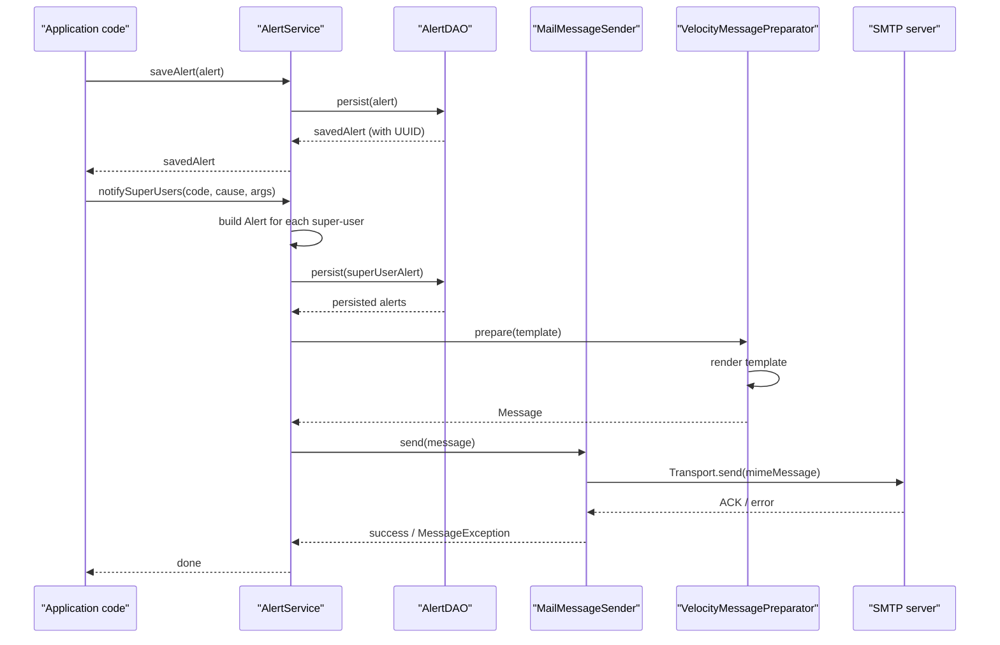

# Alert Management

## Overview
The Alert Management feature in OpenMRS Core handles the creation, retrieval, updating, and deletion of **Alert** objects. It is used to notify users (including super‑users) about important events, errors, or system messages. Alerts are stored in the database and can be queried per‑user, filtered by read status or expiration, and sent via email using the built‑in mail infrastructure.

## Behavior
- **Alert service definition** – `AlertService` declares the public API for managing alerts (create, read, purge, query, and notify super‑users). `AlertService` extends `OpenmrsService`. `api/src/main/java/org/openmrs/notification/AlertService.java:1`
- **DAO wiring** – `setAlertDAO(AlertDAO dao)` allows Spring to inject the concrete DAO implementation. `AlertService.java:15`
- **Saving alerts** – `saveAlert(Alert alert)` persists an `Alert` and assigns a UUID. It requires the `MANAGE_ALERTS` privilege. `AlertService.java:27‑33`
- **Retrieving alerts** –  
  * `getAlert(Integer alertId)` fetches a single alert by its internal ID. `AlertService.java:38‑44`  
  * `getAllActiveAlerts(User user)` returns all non‑expired alerts (read or unread) for a user. `AlertService.java:49‑55`  
  * `getAlertsByUser(User user)` returns only unread, non‑expired alerts; if `user` is `null` it falls back to the currently authenticated user or an anonymous user. `AlertService.java:60‑71`  
  * `getAlerts(User user, boolean includeRead, boolean includeExpired)` returns alerts for a user with the requested read/expired filters. `AlertService.java:76‑84`  
  * `getAllAlerts()` and `getAllAlerts(boolean includeExpired)` return system‑wide alerts, optionally including expired ones. `AlertService.java:89‑101`
- **Super‑user notification** – `notifySuperUsers(String messageCode, Exception cause, Object... messageArguments)` creates an alert for every super‑user, using a message code from `messages.properties`. It logs the alert in the database and can include exception details. `AlertService.java:106‑115`
- **Mail sending** – `MailMessageSender` implements `MessageSender`. Its `send(Message)` method builds a `MimeMessage` (via `createMimeMessage`) and uses `Transport.send`. Errors are logged and re‑thrown as `MessageException`. `api/src/main/java/org/openmrs/notification/mail/MailMessageSender.java:31‑57`
- **Mime message creation** – `createMimeMessage(Message)` validates recipients, applies default content‑type from mail properties, sets sender (defaulting to `mail.from`), adds recipients, subject, and either plain content or a multipart with attachment. `MailMessageSender.java:59‑92`
- **Multipart handling** – `createMultipart(Message)` builds a `MimeMultipart` containing the text body and an optional attachment. `MailMessageSender.java:94‑108`
- **Velocity templating** – `VelocityMessagePreparator` creates a `VelocityEngine` (configured with Log4J logging) and evaluates a template against a `VelocityContext`. The resulting string becomes the message content. `api/src/main/java/org/openmrs/notification/mail/velocity/VelocityMessagePreparator.java:23‑55`
- **Message preparation** – `prepare(Template)` builds a `Message` object populated with subject, recipients, sender, and the rendered template body. `VelocityMessagePreparator.java:57‑71`

## Triggers / Entry points
- **Application code** calls `Context.getAlertService()` and then any of the service methods (`saveAlert`, `getAlertsByUser`, `notifySuperUsers`, etc.). `AlertService.java:13‑14`
- **Super‑user alerts** are triggered via `notifySuperUsers`. `AlertService.java:106‑115`
- **Email delivery** is triggered when a `Message` is passed to `MailMessageSender.send`. `MailMessageSender.java:41‑48`
- **Template rendering** is triggered when a `Template` is passed to `VelocityMessagePreparator.prepare`. `VelocityMessagePreparator.java:57‑71`

## End‑to‑end flow (Mermaid)

## State / data touched
- **`alert` table** (or equivalent) – rows are inserted/updated/deleted by the DAO methods invoked from `saveAlert`, `purgeAlert`, and `notifySuperUsers`. `AlertService.java` methods reference the DAO.  
- **`users` table** – used to resolve the target user(s) for `getAlerts*` and for determining super‑users in `notifySuperUsers`. `AlertService.java:60‑71`  
- **Mail properties** – read from `Context.getMailProperties()` when constructing a `MimeMessage`. `MailMessageSender.java:43‑48`  
- **Velocity template data** – stored in a `Template` object and used only in memory during `prepare`. `VelocityMessagePreparator.java:63‑71`

## External dependencies
- **JavaMail (javax.mail)** – `MimeMessage`, `Transport`, `InternetAddress`, etc., used to send email. `MailMessageSender.java:31‑55`
- **Apache Velocity** – template engine for rendering message bodies. `VelocityMessagePreparator.java:23‑55`
- **SLF4J / Log4J** – logging framework used throughout (`LoggerFactory.getLogger`). `MailMessageSender.java:33`, `VelocityMessagePreparator.java:31`

## Configuration / parameters
- **Mail properties** (global properties) accessed via `Context.getMailProperties()`:  
  * `mail.default_content_type` (fallback content‑type) `MailMessageSender.java:55‑58`  
  * `mail.from` (default sender address) `MailMessageSender.java:63‑68`
- **Velocity engine properties** set in the constructor:  
  * `runtime.log.logsystem.class` → `Log4JLogChute`  
  * `runtime.log.logsystem.log4j.category` → `"velocity"`  
  * `runtime.log.logsystem.log4j.logger` → `"velocity"` `VelocityMessagePreparator.java:27‑33`
- **Privilege constants** – `MANAGE_ALERTS` required for mutating operations (`saveAlert`, `purgeAlert`, `notifySuperUsers`). `AlertService.java:23`, `AlertService.java:106`

## Edge cases & failure modes
- **Missing recipients** – `MailMessageSender.createMimeMessage` throws `MessageException` if `message.getRecipients()` is `null`. `MailMessageSender.java:61‑63`
- **No sender configured** – If both the message and `mail.from` are empty, the MIME message is sent without a `From` header (may be rejected by some SMTP servers). `MailMessageSender.java:65‑71`
- **Attachment handling** – If `message.hasAttachment()` is `true`, a multipart is built; any exception during multipart creation propagates as `MessageException`. `MailMessageSender.java:84‑92`
- **Velocity evaluation errors** – Template parsing/rendering failures are caught, logged, and re‑thrown as `MessageException`. `VelocityMessagePreparator.java:45‑53`
- **Privilege enforcement** – Methods annotated with `@Authorized(PrivilegeConstants.MANAGE_ALERTS)` will reject calls from users lacking that privilege (handled by the OpenMRS security layer, not shown in this file). `AlertService.java:23`, `AlertService.java:106`
- **DAO failures** – Any `APIException` thrown by the DAO (e.g., DB constraint violations) propagates up to the caller of the service methods.

## Open questions
- **Alert display** – How alerts are rendered in the web UI (e.g., notification banner, inbox) is not visible in the provided source.  
- **Expiration handling** – The exact logic that marks an alert as expired (e.g., a timestamp field and its comparison) is defined in the `Alert` entity/DAO, which is not included here.  
- **Customization** – Whether modules can extend `Alert` or plug in alternative `MessageSender` implementations is not evident from the snippets.  
- **Transactional boundaries** – The transaction demarcation (e.g., `@Transactional` annotations) for service methods is not shown; it is assumed to be configured elsewhere in the Spring context.