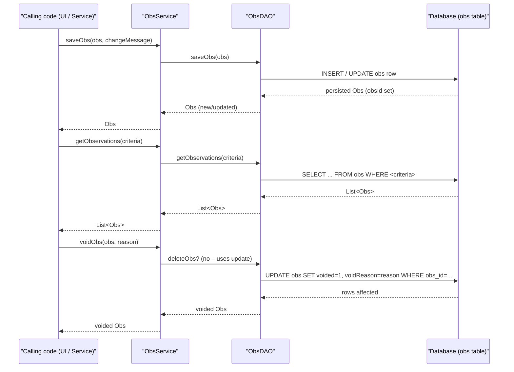

# Clinical Observations  

## Overview  
The Clinical Observations feature lets the OpenMRS system record, retrieve, update, void, and permanently delete individual clinical observations (`Obs`). A user (typically a clinician or a background process) calls methods on `ObsService` to create a new observation, edit an existing one, or query observations based on a wide range of criteria (person, encounter, concept, location, dates, etc.). Each call ultimately reads from or writes to the `obs` table in the database and returns fully‑populated `Obs` objects (or collections of them) to the caller.

## Behavior  

- **Create / Save an observation** – `ObsService.saveObs(Obs, String)` persists a new `Obs` (fills `obsId`) or, when editing, creates a *new* row, voids the original, links the new row via `previousVersion`, and stores the change reason as the void reason. `ObsService.saveObs` is declared at `ObsService.java:87‑124`.  
- **Retrieve a single observation** – `ObsService.getObs(Integer)` and `ObsService.getObsByUuid(String)` fetch a non‑voided `Obs` by primary key or UUID via `ObsDAO.getObs` / `ObsDAO.getObsByUuid`. `ObsService.java:46‑66`.  
- **Retrieve a revision observation** – `ObsService.getRevisionObs(Obs)` returns the most recent revision of an original observation using `ObsDAO.getRevisionObs`. `ObsService.java:71‑78`.  
- **Void an observation** – `ObsService.voidObs(Obs, String)` marks the observation’s `voided` flag, records the void reason, and validates that a non‑empty reason is supplied. `ObsService.java:146‑155`.  
- **Un‑void an observation** – `ObsService.unvoidObs(Obs)` clears the `voided` flag and cascades the un‑void to any child grouped observations. `ObsService.java:166‑174`.  
- **Purge (hard‑delete) an observation** – `ObsService.purgeObs(Obs)` and `ObsService.purgeObs(Obs, boolean)` delegate to `ObsDAO.deleteObs` and optionally cascade to linked orders/obs groups. `ObsService.java:176‑210`.  
- **Query observations** – `ObsService.getObservations(...)` (several overloads) builds a criteria list (person, encounter, concept, answer, person type, location, sort, most‑recent N, obsGroupId, date range, voided flag, accession number, visits) and forwards the request to `ObsDAO.getObservations`. `ObsService.java:226‑260` and overloads.  
- **Count observations** – `ObsService.getObservationCount(...)` forwards to `ObsDAO.getObservationCount` and returns the total matching the same criteria set as the query methods. `ObsService.java:272‑306`.  
- **Complex observation handling** – `ObsService.getComplexObs` (deprecated) and `ObsService.getHandler*` methods retrieve a registered `ComplexObsHandler` for a complex concept and optionally load its `ComplexData`. `ObsService.java:312‑376`.  

## Triggers / Entry points  

| Trigger | Source |
|--------|--------|
| Direct Java call to `ObsService` (e.g., `Context.getObsService()`) | `ObsService.java:1` |
| REST/WEB UI layer (not shown in the provided files) that invokes `ObsService` methods | – |
| Internal code that creates a new observation via `Obs.newInstance(oldObs)` and then calls `saveObs` | `Obs.java:215‑260` |
| DAO layer invoked by the service methods | `ObsDAO.java:1` |

## End‑to‑end flow (Mermaid)  

## State / data touched  

| Entity | Table / Collection | Accessed By |
|--------|-------------------|-------------|
| `Obs` | `obs` table (primary storage) | `ObsDAO.saveObs`, `ObsDAO.getObs`, `ObsDAO.getObservations`, `ObsDAO.deleteObs`, `ObsDAO.getRevisionObs` (`ObsDAO.java:1‑84`) |
| `Concept` (question/answer) | `concept` table (read for `Obs.getConcept()`, `Obs.isComplex()`) | `Obs` methods (`Obs.java:274‑284`) |
| `Person` | `person` table (via foreign key `person_id`) | `Obs` getters/setters (`Obs.java:158‑176`) |
| `Encounter` | `encounter` table (FK) | `Obs` getters/setters (`Obs.java:124‑132`) |
| `Location` | `location` table (FK) | `Obs` getters/setters (`Obs.java:140‑148`) |
| `Visit` | `visit` table (optional filter) | `ObsDAO.getObservations` overload with `visits` (`ObsDAO.java:71‑84`) |
| `ComplexObsHandler` registry | In‑memory `Map<String,ComplexObsHandler>` | `ObsService.getHandler*`, `ObsService.setHandlers`, `ObsService.registerHandler` (`ObsService.java:312‑376`) |

## External dependencies  

- **`Context`** – provides access to other OpenMRS services (e.g., `ConceptService` for boolean handling) used inside `Obs` methods (`Obs.java:306‑317`).  
- **`ComplexObsHandler`** implementations – pluggable handlers for complex data types, retrieved via `ObsService.getHandler(String)` or `ObsService.getHandler(Obs)`. (`ObsService.java:312‑376`)  
- **`DAOException` / `APIException`** – exception types thrown by DAO and service layers (`ObsDAO.java`, `ObsService.java`).  

No third‑party APIs are invoked directly from the provided code.

## Configuration / parameters  

The feature does not read any external configuration files or environment variables in the supplied source. All behavior is driven by method arguments and hard‑coded constants (e.g., `Obs.Interpretation` enum, `Obs.Status` enum).

## Edge cases & failure modes (observed in code)  

- **Void reason validation** – `voidObs` throws an `APIException` if the `reason` string is empty. (`ObsService.java:146‑155`)  
- **No‑change update** – `saveObs` is documented to *not* void an observation when there are no changes, preventing unnecessary versioning. (`ObsService.java:124‑131`)  
- **Complex observation file handling** – When saving a new complex obs, a file is created; updates do **not** overwrite the existing file. (`ObsService.java:124‑131` comment).  
- **Group member sanity** – Adding a group member that is the same instance as the parent throws an `APIException`. (`Obs.java:388‑395`)  
- **Null handling** – Many getters/setters check for `null` before marking the object dirty; `addGroupMember` returns early if the member is `null`. (`Obs.java:376‑382`, `Obs.java:388‑395`)  
- **Revision retrieval** – `getRevisionObs` returns `null` when no revision exists. (`ObsService.java:71‑78`)  

## Open questions  

- **Persistence details** – The exact SQL generated by `ObsDAO` implementations (e.g., cascade behavior for grouped observations) is not visible in the interface files.  
- **Validation rules** – Apart from the void‑reason check, the source does not show validation of required fields (e.g., mandatory concept, person, datetime) before persisting an `Obs`.  
- **Caching** – The code mentions “bypassing any caches” for status retrieval (`ObsDAO.getSavedStatus`), but the caching strategy for observations themselves is not shown.  
- **Complex data storage** – How `ComplexData` objects are serialized to files and retrieved by handlers is abstracted away from the shown code.  

These points would require inspection of the concrete DAO implementations and related service layers.