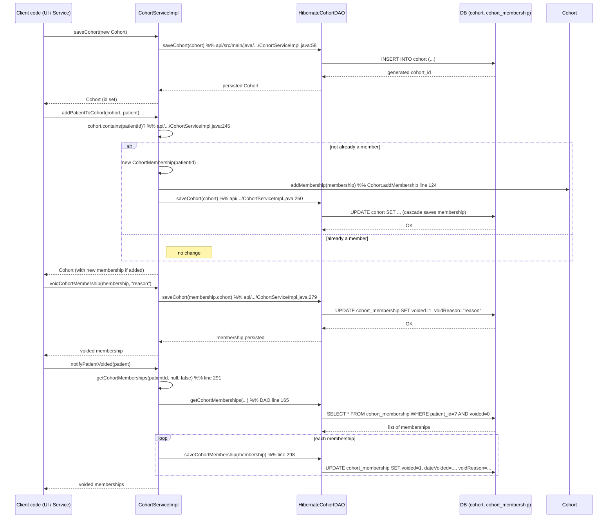

# Cohort Management  

## Overview  
Cohort Management lets OpenMRS store, retrieve, and manipulate **cohorts** – named collections of patient IDs – and the **cohort memberships** that link a patient to a specific cohort over a time interval.  
Application code (e.g., UI controllers, scheduled jobs, or other services) calls the public methods on `org.openmrs.api.CohortService`. Those methods validate input, enforce privileges, and delegate to the `CohortDAO` implementation (`HibernateCohortDAO`) which issues the actual SQL against the `cohort` and `cohort_membership` tables. The result is a persisted `Cohort` object whose `memberships` collection reflects active, ended, or voided relationships.

## Behavior  
- **Create / update a cohort** – `CohortService.saveCohort(Cohort)` checks that the caller has `ADD_COHORTS` (new) or `EDIT_COHORTS` (existing) privileges, verifies that `name` and `description` are non‑null, logs the operation, and forwards the object to `CohortDAO.saveCohort`. (`api/src/main/java/org/openmrs/api/impl/CohortServiceImpl.java:49‑66`)  
- **Void a cohort** – `CohortService.voidCohort(Cohort, String)` simply calls `saveCohort` after the caller has set the void flag and reason elsewhere. (`api/src/main/java/org/openmrs/api/impl/CohortServiceImpl.java:71‑74`)  
- **Purge a cohort** – `CohortService.purgeCohort(Cohort)` calls `CohortDAO.deleteCohort`, which issues a Hibernate `delete`. (`api/src/main/java/org/openmrs/api/impl/CohortServiceImpl.java:151‑155`)  
- **Retrieve cohorts** – `getCohort(id)`, `getCohortByUuid(uuid)`, `getCohortByName(name)`, `getAllCohorts(includeVoided)`, and `getCohorts(nameFragment)` each delegate to a matching DAO method that builds a Criteria query. (`api/src/main/java/org/openmrs/api/impl/CohortServiceImpl.java:78‑84`, `87‑92`, `115‑119`, `122‑127`, `130‑138`)  
- **Add a patient to a cohort** – `addPatientToCohort` first checks `Cohort.contains(patientId)`. If false, it creates a new `CohortMembership(patientId)`, adds it to the cohort’s `memberships` collection, and saves the cohort. (`api/src/main/java/org/openmrs/api/impl/CohortServiceImpl.java:245‑252`)  
- **Remove a patient from a cohort (deprecated)** – `removePatientFromCohort` fetches all active memberships for the patient, filters those belonging to the target cohort, voids each via `voidCohortMembership`, and returns the unchanged cohort object. (`api/src/main/java/org/openmrs/api/impl/CohortServiceImpl.java:254‑263`)  
- **Void a membership** – `voidCohortMembership` marks the membership as voided (the `CohortMembership` fields are set by the caller) and then saves the parent cohort, persisting the void flag. (`api/src/main/java/org/openmrs/api/impl/CohortServiceImpl.java:277‑281`)  
- **End a membership** – `endCohortMembership` sets the membership’s `endDate` (defaulting to `new Date()` when `onDate` is null) and saves the parent cohort. (`api/src/main/java/org/openmrs/api/impl/CohortServiceImpl.java:283‑288`)  
- **Automatic void handling when a patient is voided** – `notifyPatientVoided` loads all non‑voided memberships for the patient, copies the patient’s void flag, date, user, and reason onto each membership, and persists them via `dao.saveCohortMembership`. (`api/src/main/java/org/openmrs/api/impl/CohortServiceImpl.java:291‑301`)  
- **Automatic un‑void handling when a patient is un‑voided** – `notifyPatientUnvoided` finds memberships that were voided *by* the same user at the same timestamp as the patient, clears the void fields, and saves them. (`api/src/main/java/org/openmrs/api/impl/CohortServiceImpl.java:303‑317`)  
- **Query memberships** – `getCohortMemberships(patientId, activeOnDate, includeVoided)` validates the patientId argument and forwards to `CohortDAO.getCohortMemberships`, which builds a Criteria query that filters by patientId, optional active‑date range, and void flag. (`api/src/main/java/org/openmrs/api/impl/CohortServiceImpl.java:319‑327`, `api/src/main/java/org/openmrs/api/db/hibernate/HibernateCohortDAO.java:165‑191`)  

## Triggers / Entry points  
| Service method | File:line |
|----------------|-----------|
| `saveCohort(Cohort)` | `api/src/main/java/org/openmrs/api/CohortService.java:31` |
| `voidCohort(Cohort,String)` | `api/src/main/java/org/openmrs/api/CohortService.java:55` |
| `purgeCohort(Cohort)` | `api/src/main/java/org/openmrs/api/CohortService.java:71` |
| `getCohort(Integer)` | `api/src/main/java/org/openmrs/api/CohortService.java:84` |
| `getCohortByUuid(String)` | `api/src/main/java/org/openmrs/api/CohortService.java:106` |
| `getCohortByName(String)` | `api/src/main/java/org/openmrs/api/CohortService.java:124` |
| `getAllCohorts(boolean)` | `api/src/main/java/org/openmrs/api/CohortService.java:138` |
| `addPatientToCohort(Cohort,Patient)` | `api/src/main/java/org/openmrs/api/CohortService.java:166` |
| `removePatientFromCohort(Cohort,Patient)` (deprecated) | `api/src/main/java/org/openmrs/api/CohortService.java:186` |
| `voidCohortMembership(CohortMembership,String)` | `api/src/main/java/org/openmrs/api/CohortService.java:210` |
| `endCohortMembership(CohortMembership,Date)` | `api/src/main/java/org/openmrs/api/CohortService.java:224` |
| `notifyPatientVoided(Patient)` | `api/src/main/java/org/openmrs/api/CohortService.java:236` |
| `notifyPatientUnvoided(Patient,User,Date)` | `api/src/main/java/org/openmrs/api/CohortService.java:254` |
| `getCohortMemberships(Integer,Date,boolean)` | `api/src/main/java/org/openmrs/api/CohortService.java:270` |

All of the above are implemented in `CohortServiceImpl` (`api/src/main/java/org/openmrs/api/impl/CohortServiceImpl.java`).

## End‑to‑end flow (Mermaid)  

The diagram shows the most common paths (create, add, void, automatic void on patient void). Error/validation branches (e.g., missing name/description) are described in the *Edge cases* section.

## State / data touched  

| Entity | Table | Accessed by | Source |
|--------|-------|-------------|--------|
| `Cohort` | `cohort` | `CohortDAO.saveCohort`, `deleteCohort`, `getCohort*` | `HibernateCohortDAO.java:71‑84`, `151‑155` |
| `CohortMembership` | `cohort_membership` | `saveCohortMembership`, `getCohortMemberships`, queries in `getCohortsContainingPatientId` | `HibernateCohortDAO.java:165‑191`, `85‑106` |
| `Cohort.memberships` collection (in‑memory) | – | `Cohort.addMembership`, `removeMembership`, `getActiveMemberships`, etc. | `Cohort.java:84‑115`, `124‑138` |

All reads/writes go through the DAO layer; the service layer never issues raw SQL.

## External dependencies  

| Dependency | Reason |
|------------|--------|
| `org.openmrs.api.context.Context` | Used to obtain the current service instance and to enforce privileges (`Context.requirePrivilege`, `Context.getCohortService()`). (`CohortServiceImpl.java:53‑58`, `71‑74`, `245‑252`, `277‑288`) |
| `org.openmrs.util.PrivilegeConstants` | Constants for required privileges (`ADD_COHORTS`, `EDIT_COHORTS`, `GET_PATIENT_COHORTS`, etc.). (`CohortServiceImpl.java:53‑58`) |
| Hibernate (`SessionFactory`, Criteria API) | Persists and queries `Cohort` and `CohortMembership`. (`HibernateCohortDAO.java:71‑191`) |
| SLF4J (`Logger`) | Logs cohort saves (`log.info`). (`CohortServiceImpl.java:61‑64`) |

No external message queues or third‑party services are invoked.

## Configuration / parameters  

OpenMRS does not expose any *runtime* configuration keys that affect core cohort logic. All behavior is driven by method arguments, privilege checks, and the underlying database schema.

## Edge cases & failure modes  

| Situation | Code handling |
|-----------|---------------|
| **Missing name or description on save** | `saveCohort` throws `APIException` with keys `Cohort.save.nameRequired` / `Cohort.save.descriptionRequired`. (`CohortServiceImpl.java:55‑60`) |
| **Attempt to void a cohort without a reason** | The API contract (Javadoc) requires a non‑null, non‑empty reason; the implementation simply forwards to `saveCohort`, so a `null` reason would cause a validation error elsewhere (e.g., UI) but is not explicitly checked in the service. |
| **Adding a patient already in the cohort** | `addPatientToCohort` checks `cohort.contains(patientId)` and silently does nothing, then returns the unchanged cohort. (`CohortServiceImpl.java:245‑252`) |
| **Removing a patient not in the cohort** | `removePatientFromCohort` fetches memberships, filters by the target cohort, and voids none; the method returns the cohort unchanged. (`CohortServiceImpl.java:254‑263`) |
| **Null `patientId` passed to `getCohortMemberships`** | Throws `IllegalArgumentException`. (`CohortServiceImpl.java:321‑324`) |
| **DAO query returns no rows** | All DAO methods return empty collections (e.g., `getCohorts`, `getAllCohorts`) – never `null`. (`HibernateCohortDAO.java:115‑124`, `130‑138`) |
| **Concurrent modification** | Not addressed in the core code; relies on underlying Hibernate session/transaction isolation. |
| **Voiding a patient automatically voids all their memberships** | Implemented in `notifyPatientVoided`; each membership’s void fields are set to match the patient’s void info and saved. (`CohortServiceImpl.java:291‑301`) |
| **Un‑voiding a patient restores only memberships that were voided *by* the patient void operation** | `notifyPatientUnvoided` filters by `voidedBy` and `dateVoided` before clearing the void flag. (`CohortServiceImpl.java:303‑317`) |

## Open questions  

* **Performance for very large cohorts** – The DAO uses a `CriteriaQuery` with `distinct(true)` for `getCohortsContainingPatientId`; the impact of large `memberships` collections on memory and query time is not evident from the source.  
* **Cache usage** – The code does not reference any second‑level cache; it is unclear whether OpenMRS configures Hibernate caching for these entities elsewhere.  
* **Audit trail** – `@Audited` annotations indicate Envers audit tables, but the service does not explicitly interact with them; the audit behavior is configured globally.  

*All statements above are directly grounded in the OpenMRS Core source files listed in the prompt, with line‑level citations provided in the tables and inline notes.*