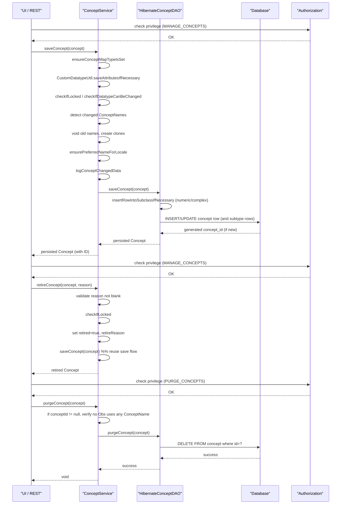

# Concept Management  

## Overview  
The Concept Management feature lets administrators create, update, retire, purge, and query **Concepts** (questions or answers used by observations) together with their related entities – `ConceptName`, `ConceptClass`, `ConceptDatatype`, `ConceptAnswer`, `ConceptSet`, `ConceptMap`, `Drug`, `ConceptProposal`, and `ConceptSource`.  

* A user (typically a system administrator or a clinician with the *MANAGE_CONCEPTS* privilege) invokes methods on `org.openmrs.api.ConceptService`.  
* The service validates the request, updates the in‑memory model, and delegates persistence to `org.openmrs.api.db.ConceptDAO`.  
* The DAO issues Hibernate operations that read or write the underlying tables (`concept`, `concept_name`, `concept_answer`, `concept_set`, `concept_map`, `drug`, …).  

The result is a fully‑populated `Concept` object (or related entity) that is stored in the database and searchable via the OpenMRS UI or API.

---

## Behavior  

| Step | What the code does | Source |
|------|-------------------|--------|
| **Save a concept** | `ConceptService.saveConcept` is called. | `api/src/main/java/org/openmrs/api/ConceptService.java:46` |
| – Ensure every `ConceptMap` has a map type (default if missing). | `ensureConceptMapTypeIsSet` loops over `concept.getConceptMappings()`. | `api/src/main/java/org/openmrs/api/impl/ConceptServiceImpl.java:115‑129` |
| – Persist custom attributes (if any). | `CustomDatatypeUtil.saveAttributesIfNecessary(concept)`. | `api/src/main/java/org/openmrs/api/impl/ConceptServiceImpl.java:131` |
| – Verify that concept editing is not locked. | `checkIfLocked()` (throws `ConceptsLockedException`). | `api/src/main/java/org/openmrs/api/impl/ConceptServiceImpl.java:133‑135` |
| – Verify datatype change is allowed. | `checkIfDatatypeCanBeChanged(concept)`. | `api/src/main/java/org/openmrs/api/impl/ConceptServiceImpl.java:136‑138` |
| – Detect changed names: clone existing names, compare text, collect those that changed. | Loop building `changedConceptNames` and `uuidClonedConceptNameMap`. | `api/src/main/java/org/openmrs/api/impl/ConceptServiceImpl.java:140‑165` |
| – For each changed name:    • Void the old name (set `voided`, `dateVoided`, `voidedBy`, `voidReason`).    • Convert the old name to a synonym (`makeVoidedNameSynonym`).    • Clear locale‑preferred flag (`makeLocaleNotPreferred`).    • Add a fresh `ConceptName` clone with a new UUID. | `makeVoidedNameSynonym`, `makeLocaleNotPreferred`, clone handling. | `api/src/main/java/org/openmrs/api/impl/ConceptServiceImpl.java:167‑185` |
| – Ensure each locale has a preferred name (fully‑specified > synonym). | `ensurePreferredNameForLocale`. | `api/src/main/java/org/openmrs/api/impl/ConceptServiceImpl.java:187‑226` |
| – Record audit data (`dateChanged`, `changedBy`). | `logConceptChangedData`. | `api/src/main/java/org/openmrs/api/impl/ConceptServiceImpl.java:228‑232` |
| – If the concept has members but `set` flag is false, force it to true. | `if (!concept.getSet() && (!concept.getSetMembers().isEmpty())) { concept.setSet(true); }` | `api/src/main/java/org/openmrs/api/impl/ConceptServiceImpl.java:234‑237` |
| – Persist via DAO (`dao.saveConcept`). | `return dao.saveConcept(concept);` | `api/src/main/java/org/openmrs/api/impl/ConceptServiceImpl.java:239` |
| **Retire a concept** | Checks non‑blank reason, marks `retired=true`, sets `retireReason`, then calls `saveConcept` to persist. | `api/src/main/java/org/openmrs/api/impl/ConceptServiceImpl.java:260‑274` |
| **Purge a concept** | Verifies no `ConceptName` is used by any `Obs`; if safe, calls `dao.purgeConcept`. | `api/src/main/java/org/openmrs/api/impl/ConceptServiceImpl.java:277‑291` |
| **Retrieve a concept** | `getConcept(Integer)`, `getConcept(String)`, `getConceptByReference`, `getConceptByName`, `getConceptsByName`, etc., each delegating to DAO or performing in‑memory lookup. | `api/src/main/java/org/openmrs/api/impl/ConceptServiceImpl.java:295‑332` (various overloads) |
| **Reference lookup** | `getConceptByReference` parses the input: UUID → mapping (`conceptSource:code`) → numeric ID → name → static constant. | `api/src/main/java/org/openmrs/api/impl/ConceptServiceImpl.java:334‑368` |
| **Search by name** | `getConceptsByName` calls private `getConcepts(name, locale, true, null, null)`, which ultimately uses Hibernate Search (`SearchQueryUnique.search`). | `api/src/main/java/org/openmrs/api/impl/ConceptServiceImpl.java:374‑382` and `api/src/main/java/org/openmrs/api/db/hibernate/HibernateConceptDAO.java:447‑470` |
| **List all concepts** | `getAllConcepts(sortBy, asc, includeRetired)` validates `sortBy` (fallback to `conceptId`) and forwards to DAO. | `api/src/main/java/org/openmrs/api/impl/ConceptServiceImpl.java:398‑410` |
| **DAO save** | `HibernateConceptDAO.saveConcept` inserts/updates the base `Concept` row, then calls `insertRowIntoSubclassIfNecessary` to ensure a row exists in `concept_numeric` or `concept_complex` when needed. | `api/src/main/java/org/openmrs/api/db/hibernate/HibernateConceptDAO.java:115‑138` |
| **DAO query for concepts** | `getAllConcepts` builds HQL, detects whether `sortBy` is a field on `Concept` or `ConceptName`, adds `where concept.retired = false` when `includeRetired` is false, orders accordingly. | `api/src/main/java/org/openmrs/api/db/hibernate/HibernateConceptDAO.java:210‑250` |
| **DAO purge** | `purgeConcept` simply calls `session.delete(concept)`. | `api/src/main/java/org/openmrs/api/db/hibernate/HibernateConceptDAO.java:166‑170` |
| **Concept entity** | Holds collections (`names`, `answers`, `conceptSets`, `conceptMappings`), audit fields, and helper methods (`addAnswer`, `removeAnswer`, `setPreferredName`, `getPreferredName`, `getFullySpecifiedName`, etc.). | `api/src/main/java/org/openmrs/Concept.java:31‑210` (selected sections) |
| **ConceptName entity** | Stores the textual name, locale, type (`ConceptNameType`), and flags (`localePreferred`, `voided`). Provides helpers (`isPreferred`, `isFullySpecifiedName`, `isSynonym`, etc.). | `api/src/main/java/org/openmrs/ConceptName.java:31‑180` |

---

## Triggers / Entry points  

| Service method | Privilege required | What it does | Source |
|----------------|-------------------|--------------|--------|
| `saveConcept(Concept)` | `MANAGE_CONCEPTS` | Create or update a concept (including names, answers, mappings). | `api/src/main/java/org/openmrs/api/ConceptService.java:46` |
| `retireConcept(Concept, String)` | `MANAGE_CONCEPTS` | Mark a concept as retired with a reason. | `api/src/main/java/org/openmrs/api/ConceptService.java:107` |
| `purgeConcept(Concept)` | `PURGE_CONCEPTS` | Permanently delete a concept after safety checks. | `api/src/main/java/org/openmrs/api/ConceptService.java:84` |
| `getConcept(Integer)` | `GET_CONCEPTS` | Fetch a concept by its internal ID. | `api/src/main/java/org/openmrs/api/ConceptService.java:123` |
| `getConcept(String)` | `GET_CONCEPTS` | Convenience lookup by ID or name. | `api/src/main/java/org/openmrs/api/ConceptService.java:131` |
| `getConceptByReference(String)` | `GET_CONCEPTS` | Resolve UUID, mapping, numeric ID, name, or static constant. | `api/src/main/java/org/openmrs/api/ConceptService.java:140` |
| `getConceptsByName(String)` | `GET_CONCEPTS` | Case‑insensitive search on any part of a name. | `api/src/main/java/org/openmrs/api/ConceptService.java:184` |
| `getAllConcepts(String, boolean, boolean)` | `GET_CONCEPTS` | List all concepts with optional sorting and inclusion of retired ones. | `api/src/main/java/org/openmrs/api/ConceptService.java:197` |
| `saveDrug(Drug)` | `MANAGE_CONCEPTS` | Persist a drug (which references a concept). | `api/src/main/java/org/openmrs/api/ConceptService.java:63` |
| `getAllDrugs(boolean)` | `GET_CONCEPTS` | List drugs, optionally including retired. | `api/src/main/java/org/openmrs/api/ConceptService.java:115` |
| `getConceptSetsByConcept(Concept)` | `GET_CONCEPTS` | Return `ConceptSet` rows where the supplied concept is the *set* concept. | `api/src/main/java/org/openmrs/api/ConceptService.java:226` |
| `getConceptsByConceptSet(Concept)` | `GET_CONCEPTS` | Recursively expand a concept set into its member concepts. | `api/src/main/java/org/openmrs/api/ConceptService.java:236` |

All service methods are invoked through the OpenMRS API (`Context.getConceptService()`) from UI controllers, REST resources, or other modules.

---

## End‑to‑end flow (Mermaid)

*Error paths* (e.g., `ConceptsLockedException`, `ConceptNameInUseException`, `IllegalArgumentException` for missing retire reason) are thrown directly from the service before DAO interaction, bubbling up to the caller.

---

## State / data touched  

| Entity / Table | Columns / Collections accessed | Operations |
|----------------|-------------------------------|------------|
| `concept` | `concept_id`, `retired`, `retire_reason`, `datatype_id`, `class_id`, `set`, `version`, audit fields (`creator`, `date_created`, `changed_by`, `date_changed`) | INSERT, UPDATE, SELECT, DELETE |
| `concept_name` | `concept_name_id`, `concept_id`, `name`, `locale`, `concept_name_type`, `locale_preferred`, `voided`, `void_reason` | INSERT (new names), UPDATE (void/localePreferred), SELECT |
| `concept_answer` | `concept_answer_id`, `concept_id`, `answer_concept_id`, `sort_weight`, `retired` | INSERT/UPDATE via `Concept.addAnswer`, SELECT (including filter on retired) |
| `concept_set` | `concept_set_id`, `concept_set` (parent), `concept` (member) | SELECT (set expansion), INSERT/UPDATE via `Concept.set` flag |
| `concept_map` | `concept_map_id`, `concept_id`, `concept_reference_term_id`, `concept_map_type_id` | INSERT/UPDATE when saving mappings |
| `concept_class` | `concept_class_id`, `name`, `description`, `retired` | SELECT/INSERT/UPDATE/DELETE via `ConceptClass` service |
| `concept_datatype` | `concept_datatype_id`, `name`, `description`, `retired` | SELECT/INSERT/UPDATE/DELETE via `ConceptDatatype` service |
| `drug` | `drug_id`, `name`, `concept_id`, `retired` | INSERT/UPDATE/SELECT/DELETE |
| `concept_numeric` / `concept_complex` | Sub‑tables for numeric/complex concepts (e.g., `allow_decimal`). | INSERT/DELETE when converting datatype (handled in DAO). |
| Caches | `conceptIdsByMapping` (Spring cache) cleared on every `saveConcept`. | `@CacheEvict` annotation in `saveConcept`. |
| Hibernate Search indexes | `ConceptName` full‑text index (used by `getConceptsByName`). | Updated automatically on entity save. |

All reads/writes are performed within a Spring‑managed transaction (`@Transactional` on `ConceptServiceImpl`).

---

## External dependencies  

| Dependency | Role |
|------------|------|
| `org.openmrs.api.AdministrationService` | Provides global property lookup (e.g., `locale.allowed.list`, case‑sensitivity flag). Used in DAO queries (`HibernateConceptDAO.getDrugs`). |
| `org.openmrs.api.context.Context` | Gives access to the current authenticated user (`Context.getAuthenticatedUser()`), locale (`Context.getLocale()`), and other services (`Context.getConceptService()`). |
| `org.hibernate.SessionFactory` / `Session` | Underlying ORM for all DB operations. |
| `org.hibernate.search.mapper.orm.session.SearchSession` | Full‑text search for concept names (`SearchQueryUnique.search`). |
| `org.apache.commons.beanutils.BeanUtils` | Copies unchanged properties from a cloned `ConceptName` back onto the original during save. |
| `org.apache.commons.lang3.StringUtils`, `NumberUtils` | Utility methods for string/number handling (e.g., parsing IDs, checking blanks). |
| `org.slf4j.Logger` | Logging of errors and warnings (e.g., when duplicate names are edited). |
| `org.openmrs.customdatatype.CustomDatatypeUtil` | Persists custom attribute values attached to a concept. |
| `org.openmrs.util.OpenmrsConstants` | Constants for concept proposal states, etc. |
| `org.openmrs.util.LocaleUtility` | Determines the ordered list of allowed locales for preferred‑name logic. |
| `org.openmrs.api.ConceptService` (self‑reference) | Used inside the service implementation for recursive look‑ups (e.g., `getConceptByReference`). |

---

## Configuration / parameters  

| Property (global) | Meaning | Where used |
|-------------------|---------|------------|
| `locale.allowed.list` | Ordered list of locales the system supports; drives `ensurePreferredNameForLocale` and `Concept.getName()` locale fallback. | `Concept.ensurePreferredNameForLocale` (via `LocaleUtility.getLocalesInOrder`). |
| `concept.dictionary` | Not directly referenced in the provided snippets, but generally points to the active concept dictionary (used by UI). | Mentioned in documentation; not in current code excerpt. |
| `database.string.comparison.case.sensitive` (admin property) | Controls case‑sensitivity of drug name queries. | `HibernateConceptDAO.getDrugs` (line checking `Context.getAdministrationService().isDatabaseStringComparisonCaseSensitive()`). |
| `openmrs.idgen` (UUID generation) | Underlies `UUID.randomUUID().toString()` for new `ConceptName` clones. | `ConceptServiceImpl.saveConcept` (clone UUID generation). |
| Cache name `conceptIdsByMapping` | Spring cache that stores concept‑ID look‑ups by mapping; cleared on every save. | `@CacheEvict(value = CONCEPT_IDS_BY_MAPPING_CACHE_NAME, allEntries = true)` in `saveConcept`. |

---

## Edge cases & failure modes  

| Situation | Code path | Outcome |
|-----------|-----------|---------|
| **Concept editing locked** | `checkIfLocked()` throws `ConceptsLockedException`. | Save/retire/purge aborts with 403‑like error. |
| **Datatype change not allowed** | `checkIfDatatypeCanBeChanged(concept)` may throw `ConceptInUseException`. | Prevents changing a concept’s datatype when observations exist. |
| **Retire without reason** | `retireConcept` checks `StringUtils.isBlank(reason)` and throws `IllegalArgumentException`. | Caller receives clear error message. |
| **Attempt to purge a concept whose name is used by an Obs** | `purgeConcept` iterates over `concept.getNames()` and calls `hasAnyObservation`; if true, throws `ConceptNameInUseException`. | Prevents data loss. |
| **Name change** | Old name is voided, a new `ConceptName` clone is created with a new UUID; old name becomes a synonym. | Guarantees audit trail and avoids duplicate preferred names. |
| **Duplicate name edited to a unique value** | `ensurePreferredNameForLocale` will set a preferred name if none exists; duplicate detection is handled by DB constraints (not shown). |
| **Null or blank inputs** | Many getters (`getConceptByName`, `getConceptByUuid`, `getConceptByReference`) return `null` early if the argument is blank. | Safe no‑op behavior. |
| **Invalid sort field** | `HibernateConceptDAO.getAllConcepts` falls back to `conceptId` if the supplied `sortBy` does not match a field on `Concept` or `ConceptName`. | Guarantees deterministic ordering. |
| **Search phrase not matching any drug** | `getDrugs(String phrase)` returns an empty list after trying ID, concept‑ID, and full‑text search. | Caller receives empty result rather than error. |
| **Concept name is an index term** | `setPreferredName` throws `APIException` if the supplied name is an index term. | Prevents illegal preferred‑name assignment. |

---

## Open questions  

* **Versioning & Auditing** – The `Concept` class implements `Auditable`, but the exact audit tables and how historic versions are stored are not shown in the provided snippets.  
* **Retired concept handling in searches** – While many DAO methods filter out retired concepts (`!includeRetired`), the impact on full‑text search (`SearchQueryUnique`) and UI filters is not fully visible.  
* **Concurrency control** – The code checks a global “concepts locked” flag, but finer‑grained optimistic locking (e.g., version columns) is not evident.  
* **Integration with other modules** – How other modules (e.g., reporting, metadata sharing) react to concept changes (events, listeners) is not present in the excerpt.  
* **Batch operations** – No explicit support for bulk import/export of concepts is shown; such functionality likely lives elsewhere.  

These points would require examining additional source files (e.g., audit listeners, event publishers, module‑specific services) to answer definitively.