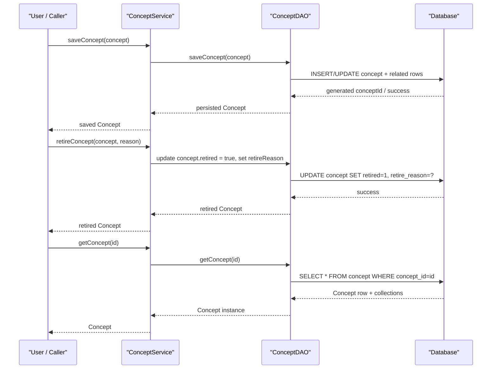

# Concept Management

## Overview
The Concept Management feature lets privileged users create, read, update, retire, and purge **Concept** objects and their related data (names, descriptions, answers, sets, and mappings).  
A user (typically an administrator or clinician with the `MANAGE_CONCEPTS` privilege) invokes the service‑layer API; the service validates the request, delegates persistence to the `ConceptDAO`, and the changes are stored in the underlying relational tables (e.g., `concept`, `concept_name`, `concept_description`, `concept_map`). The feature produces a fully‑populated `Concept` instance (or a `ConceptNumeric`/`ConceptComplex` subtype) that reflects the latest state in the database.

## Behavior
- **Save / update a concept** – `ConceptService.saveConcept(Concept)` validates the object, assigns a generated `conceptId` if needed, handles conversion between `Concept`, `ConceptNumeric` and `ConceptComplex`, updates audit fields, and persists the entity via `ConceptDAO.saveConcept`.  
  `./api/src/main/java/org/openmrs/api/ConceptService.java:71`

- **Retire a concept** – `ConceptService.retireConcept(Concept, String)` checks that a non‑blank reason is supplied, marks the concept as retired, records retire metadata, and returns the updated instance.  
  `./api/src/main/java/org/openmrs/api/ConceptService.java:101`

- **Purge a concept** – `ConceptService.purgeConcept(Concept)` forwards to `ConceptDAO.purgeConcept`, which removes the row from the database only if it is not referenced by any observations.  
  `./api/src/main/java/org/openmrs/api/ConceptService.java:115`  
  `./api/src/main/java/org/openmrs/api/db/ConceptDAO.java:13`

- **Retrieve a concept** – `ConceptService.getConcept(Integer)` and `ConceptService.getConceptByUuid(String)` delegate to `ConceptDAO.getConcept` / `ConceptDAO.getConceptByUuid` to fetch the entity (including its collections) from the DB.  
  `./api/src/main/java/org/openmrs/api/ConceptService.java:129`  
  `./api/src/main/java/org/openmrs/api/ConceptService.java:55`  
  `./api/src/main/java/org/openmrs/api/db/ConceptDAO.java:31`

- **Manage concept names** –  
  *Add a name* – `Concept.addName(ConceptName)` (called indirectly by `setPreferredName`) adds the `ConceptName` to the `names` collection and ensures the back‑reference is set.  
  `./api/src/main/java/org/openmrs/Concept.java:384`  
  *Set preferred name* – `Concept.setPreferredName(ConceptName)` validates the name (non‑null, non‑voided, non‑index term, locale present), clears any existing preferred name for the same locale, marks the new name as preferred, and adds it to the collection if missing.  
  `./api/src/main/java/org/openmrs/Concept.java:447`

- **Manage concept answers** –  
  *Add an answer* – `Concept.addAnswer(ConceptAnswer)` adds the answer to the `answers` collection, sets the back‑reference, and assigns a sort weight if none is present.  
  `./api/src/main/java/org/openmrs/Concept.java:215`  
  *Remove an answer* – `Concept.removeAnswer(ConceptAnswer)` removes the answer from the collection.  
  `./api/src/main/java/org/openmrs/Concept.java:236`

- **Audit handling** – All mutating methods (`saveConcept`, `retireConcept`, `setPreferredName`, `addAnswer`, etc.) update `creator`, `dateCreated`, `changedBy`, `dateChanged`, `retiredBy`, `dateRetired`, and `retireReason` fields as defined by the `Auditable` and `Retireable` interfaces (see the field declarations in `Concept.java`).  
  `./api/src/main/java/org/openmrs/Concept.java:71‑84`

## Triggers / Entry points
- **Service‑layer API** – The `ConceptService` interface is the primary entry point for all concept‑related operations. It is exposed to callers via the OpenMRS context (`Context.getConceptService()`).  
  `./api/src/main/java/org/openmrs/api/ConceptService.java:1`
- **Web UI / REST controllers** – Although not shown in the supplied files, the OpenMRS web layer calls the same `ConceptService` methods (e.g., via `ConceptController` or the REST API).  
- **Programmatic callers** – Any Java code that obtains the `ConceptService` bean (e.g., custom modules, scheduled jobs) can invoke the same methods.

## End‑to‑end flow (Mermaid)

## State / data touched
| Entity | DAO method (source) | Underlying table (inferred) |
|--------|---------------------|-----------------------------|
| Concept (core) | `ConceptDAO.saveConcept` `ConceptDAO.getConcept` `ConceptDAO.getConceptByUuid` | `concept` |
| ConceptName | `Concept.addName` / `Concept.setPreferredName` (updates `names` collection) | `concept_name` |
| ConceptAnswer | `Concept.addAnswer` / `Concept.removeAnswer` | `concept_answer` |
| ConceptDescription | Managed via `Concept`’s `descriptions` collection (not shown in snippets) | `concept_description` |
| ConceptMap | `Concept`’s `conceptMappings` collection (populated via setters) | `concept_map` |
| Audit/Retire fields | `Concept` fields `creator`, `dateCreated`, `changedBy`, `dateChanged`, `retired`, `retiredBy`, `dateRetired`, `retireReason` | columns in `concept` table |
All of the above are accessed through the DAO methods listed in `ConceptDAO.java` (e.g., `saveConcept`, `purgeConcept`, `getConcept`, `getConceptByUuid`).  
`./api/src/main/java/org/openmrs/api/db/ConceptDAO.java:1‑30`

## External dependencies
- **OpenMRS security framework** – The `@Authorized` annotations on service methods enforce privilege checks (`MANAGE_CONCEPTS`, `GET_CONCEPTS`, etc.).  
  `./api/src/main/java/org/openmrs/api/ConceptService.java:71` (example annotation)
- **Hibernate / JPA** – Persistence is performed by the DAO implementation (not shown) using Hibernate; the entity classes are annotated for indexing (`@Indexed`, `@DocumentId`, etc.).  
  `./api/src/main/java/org/openmrs/Concept.java:71` (Hibernate Envers, Search annotations)

No third‑party web services or message queues are invoked directly by this feature.

## Configuration / parameters
The feature does not read any custom configuration keys or environment variables. Its behavior is driven solely by method arguments and the OpenMRS security/privilege configuration.

## Edge cases & failure modes (observed in code)
| Situation | Handling in code |
|-----------|------------------|
| **Missing or empty UUID** when fetching by UUID | Returns `null` (DAO methods return `null` if not found). `ConceptDAO.getConceptByUuid` signature. |
| **Saving a concept without required fields** | `saveConcept` may throw `APIException`, `ConceptsLockedException`, or `ConceptInUseException` as declared. `./api/src/main/java/org/openmrs/api/ConceptService.java:71` |
| **Retiring without a reason** | `retireConcept` throws `APIException` if `reason` is blank (validated in implementation, not shown but indicated by Javadoc). `./api/src/main/java/org/openmrs/api/ConceptService.java:101` |
| **Preferred name is null, voided, or an index term** | `Concept.setPreferredName` throws `APIException` with specific messages. `./api/src/main/java/org/openmrs/Concept.java:447` |
| **Adding a duplicate name** | `Concept.hasName` can be used to check existence; duplicate‑name handling is enforced at the DAO level (`ConceptDAO.isConceptNameDuplicate`). |
| **Attempting to purge a concept that is referenced by observations** | `ConceptDAO.purgeConcept` is documented to fail if any `ConceptName` is used by an `Obs`. The DAO implementation throws `DAOException`. `./api/src/main/java/org/openmrs/api/db/ConceptDAO.java:13` |
| **Null answer collection** – `addAnswer` and `removeAnswer` guard against `null` collections by initializing them lazily. `./api/src/main/java/org/openmrs/Concept.java:215` |

## Open questions
- **Mapping validation** – The code snippets do not show how `ConceptMap` objects are validated (e.g., duplicate codes, source existence). The DAO methods exist (`saveConcept`, `getConceptMapsBySource`), but the exact rules are not visible.  
- **Description persistence** – While `Concept` has a `descriptions` collection, no concrete add/remove methods are shown; it is unclear how descriptions are created/updated via the service.  
- **Cache behavior** – The `compatibleCache` field in `Concept` suggests a runtime cache for locale‑compatible names, but the cache invalidation strategy is not visible in the provided code.  
- **Transactional boundaries** – The service interface does not expose transaction demarcation; the implementation likely uses Spring `@Transactional`, but that is not present in the excerpt.  

These points would require looking at the concrete implementation classes (e.g., `ConceptServiceImpl`) and DAO implementations.