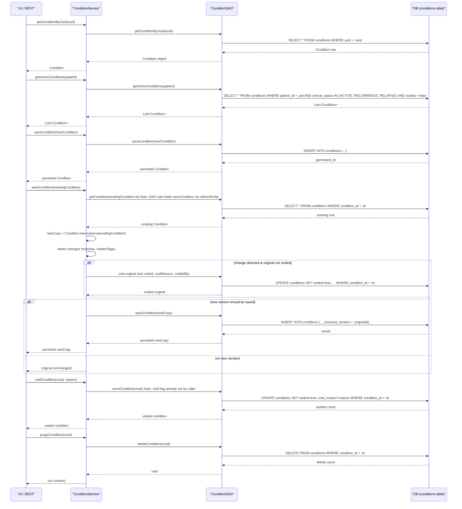

# Condition Management

## Overview
The Condition Management feature records, retrieves, updates, and removes **Condition** objects that capture a patient’s clinical problems, their clinical status (e.g., active, recurrence, relapse) and verification status (e.g., confirmed, unconfirmed).  
Healthcare staff or system integrations invoke the feature through the OpenMRS service layer (e.g., UI forms, REST endpoints, or other modules). The service returns a single `Condition`, a list of a patient’s active conditions, or a complete list of a patient’s non‑voided conditions, depending on the call.

## Behavior
- **Retrieve by UUID** – `ConditionServiceImpl#getConditionByUuid(String)` forwards the request to `HibernateConditionDAO#getConditionByUuid(String)` which runs a unique‑entity lookup (`HibernateUtil.getUniqueEntityByUUID`) and returns the matching `Condition` (`api/src/main/java/org/openmrs/api/impl/ConditionServiceImpl.java:45`, `api/src/main/java/org/openmrs/api/db/hibernate/HibernateConditionDAO.java:55`).
- **Retrieve by ID** – `ConditionServiceImpl#getCondition(Integer)` calls `HibernateConditionDAO#getCondition(Integer)` which uses the current Hibernate session’s `get` method (`api/src/main/java/org/openmrs/api/impl/ConditionServiceImpl.java:53`, `api/src/main/java/org/openmrs/api/db/hibernate/HibernateConditionDAO.java:38`).
- **Get active conditions** – `ConditionServiceImpl#getActiveConditions(Patient)` invokes `HibernateConditionDAO#getActiveConditions(Patient)`. The DAO builds an HQL query filtering on `patientId`, `clinicalStatus` in the set `{ACTIVE, RECURRENCE, RELAPSE}` and `voided = false` (`api/src/main/java/org/openmrs/api/impl/ConditionServiceImpl.java:61`, `api/src/main/java/org/openmrs/api/db/hibernate/HibernateConditionDAO.java:85`).
- **Get all (non‑voided) conditions** – `ConditionServiceImpl#getAllConditions(Patient)` delegates to `HibernateConditionDAO#getAllConditions(Patient)`, which queries only on `patientId` and `voided = false` (`api/src/main/java/org/openmrs/api/impl/ConditionServiceImpl.java:71`, `api/src/main/java/org/openmrs/api/db/hibernate/HibernateConditionDAO.java:105`).
- **Get conditions by encounter** – `ConditionServiceImpl#getConditionsByEncounter(Encounter)` forwards to `HibernateConditionDAO#getConditionsByEncounter(Encounter)`, which selects conditions linked to the encounter and not voided (`api/src/main/java/org/openmrs/api/impl/ConditionServiceImpl.java:78`, `api/src/main/java/org/openmrs/api/db/hibernate/HibernateConditionDAO.java:68`).
- **Save a condition** – `ConditionServiceImpl#saveCondition(Condition)` contains the core mutation logic:
  1. If `condition.getConditionId()` is `null`, the DAO simply `saveOrUpdate` the new instance (`api/src/main/java/org/openmrs/api/impl/ConditionServiceImpl.java:115`).
  2. If an ID exists, a **new copy** is created via `Condition.newInstance(condition)` (`api/src/main/java/org/openmrs/api/impl/ConditionServiceImpl.java:119`).
  3. The original entity is refreshed (`Context.refreshEntity(condition)`) to detach any stale state (`api/src/main/java/org/openmrs/api/impl/ConditionServiceImpl.java:120`).
  4. Change detection:
     - `conditionHasChanged = !newCondition.matches(condition)` (`api/src/main/java/org/openmrs/api/impl/ConditionServiceImpl.java:122`).
     - `existingVoided` and `newVoided` are derived via `BooleanUtils.isTrue` (`api/src/main/java/org/openmrs/api/impl/ConditionServiceImpl.java:123‑124`).
  5. **Void original** when the original is not already voided **and** something changed (`voidOriginal = !existingVoided && conditionHasChanged`) (`api/src/main/java/org/openmrs/api/impl/ConditionServiceImpl.java:125`):
     - Sets `voided`, `voidedBy` (current user if not supplied), and `voidReason` (derived or default) then persists the original (`conditionDAO.saveCondition(condition)`) (`api/src/main/java/org/openmrs/api/impl/ConditionServiceImpl.java:130‑135`).
  6. **Save new version** when the new copy is not voided and a change occurred (`saveNew = !newVoided && conditionHasChanged`) (`api/src/main/java/org/openmrs/api/impl/ConditionServiceImpl.java:126`):
     - Links the new copy to the original via `newCondition.setPreviousVersion(condition)` and persists it (`conditionDAO.saveCondition(newCondition)`) (`api/src/main/java/org/openmrs/api/impl/ConditionServiceImpl.java:138‑140`).
  7. If no change, simply returns the original (`api/src/main/java/org/openmrs/api/impl/ConditionServiceImpl.java:144‑146`).
- **Void a condition** – `ConditionServiceImpl#voidCondition(Condition, String)` validates that `voidReason` is non‑blank (throws `IllegalArgumentException` if not) and then persists the voided entity via the DAO (`api/src/main/java/org/openmrs/api/impl/ConditionServiceImpl.java:152‑158`).
- **Unvoid a condition** – `ConditionServiceImpl#unvoidCondition(Condition)` simply saves the condition after clearing the void flag (`api/src/main/java/org/openmrs/api/impl/ConditionServiceImpl.java:166‑170`).
- **Purge (hard delete)** – `ConditionServiceImpl#purgeCondition(Condition)` calls `HibernateConditionDAO#deleteCondition(Condition)`, which issues a Hibernate `delete` (`api/src/main/java/org/openmrs/api/impl/ConditionServiceImpl.java:176‑180`, `api/src/main/java/org/openmrs/api/db/hibernate/HibernateConditionDAO.java:119‑122`).

## Triggers / Entry points
| Service method | Source |
|----------------|--------|
| `getConditionByUuid(String)` | `api/src/main/java/org/openmrs/api/ConditionService.java:40` |
| `getCondition(Integer)` | `api/src/main/java/org/openmrs/api/ConditionService.java:66` |
| `getActiveConditions(Patient)` | `api/src/main/java/org/openmrs/api/ConditionService.java:55` |
| `getAllConditions(Patient)` | `api/src/main/java/org/openmrs/api/ConditionService.java:70` |
| `getConditionsByEncounter(Encounter)` | `api/src/main/java/org/openmrs/api/ConditionService.java:84` |
| `saveCondition(Condition)` | `api/src/main/java/org/openmrs/api/ConditionService.java:100` |
| `voidCondition(Condition, String)` | `api/src/main/java/org/openmrs/api/ConditionService.java:115` |
| `unvoidCondition(Condition)` | `api/src/main/java/org/openmrs/api/ConditionService.java:129` |
| `purgeCondition(Condition)` | `api/src/main/java/org/openmrs/api/ConditionService.java:144` |

All service methods are protected by the appropriate `@Authorized` annotations (e.g., `GET_CONDITIONS`, `EDIT_CONDITIONS`, `DELETE_CONDITIONS`) (`api/src/main/java/org/openmrs/api/ConditionService.java`).

## End‑to‑end flow (Mermaid)

## State / data touched
- **Table**: `conditions` (core columns: `condition_id`, `condition_coded`, `condition_non_coded`, `clinical_status`, `verification_status`, `previous_version`, `additional_detail`, `onset_date`, `end_date`, `voided`, `void_reason`, `voided_by`, `date_voided`, `patient_id`, `encounter_id`, timestamps). Defined by `@Entity @Table(name = "conditions")` in `Condition.java` (`api/src/main/java/org/openmrs/Condition.java:30‑34`).
- **Enums**: `ConditionClinicalStatus` and `ConditionVerificationStatus` are persisted as strings (`@Enumerated(EnumType.STRING)`) in the same table (`Condition.java:84‑92`).
- **Related objects**: `Patient` (`patient_id` FK), optional `Encounter` (`encounter_id` FK), and a self‑reference `previous_version` (FK to another `conditions` row).

## External dependencies
- **Apache Commons Lang** – `BooleanUtils.isTrue` for safe Boolean handling (`ConditionServiceImpl.java:123‑124`).
- **OpenMRS Context** – `Context.getAuthenticatedUser()` to set the voiding user (`ConditionServiceImpl.java:130`).
- **Hibernate** – SessionFactory for all DAO persistence operations (`HibernateConditionDAO` uses `sessionFactory.getCurrentSession()` throughout `api/src/main/java/org/openmrs/api/db/hibernate/HibernateConditionDAO.java`).
- **OpenMRS Util** – `OpenmrsUtil.nullSafeEquals` used in `Condition.matches` for deep equality checks (`Condition.java:215‑236`).

## Configuration / parameters
No global properties, environment variables, or external configuration keys are consulted by the Condition Management code. All behavior is driven by method arguments and the static enum sets (`ACTIVE, RECURRENCE, RELAPSE`) defined in `ConditionClinicalStatus`.

## Edge cases & failure modes
| Situation | Handling |
|-----------|----------|
| `voidReason` is blank or null when calling `voidCondition` | Throws `IllegalArgumentException` (`ConditionServiceImpl.java:152‑154`). |
| Attempt to save a condition with an existing ID but **no** changes (`matches` returns true) | The method returns the original condition unchanged; no DAO write occurs (`ConditionServiceImpl.java:144‑146`). |
| Saving a condition where the new copy is marked `voided = true` | The original is **not** voided; only the new copy (which is voided) may be persisted depending on `saveNew` flag (`ConditionServiceImpl.java:126‑128`). |
| DAO layer throws `DAOException` / Hibernate exception | Propagates as `APIException` (method signatures declare `throws APIException`). No explicit catch‑and‑wrap in service methods. |
| Null `Condition` passed to `saveCondition` | Would cause a `NullPointerException` when accessing `condition.getConditionId()`; the code does not guard against null input. |
| Deleting a condition that other rows reference (`previous_version` or foreign keys) | `HibernateConditionDAO.deleteCondition` issues a direct `delete`; if DB constraints are violated, Hibernate will raise an exception that bubbles up as `DAOException`. |

## Open questions
- **How are `ConditionClinicalStatus` and `ConditionVerificationStatus` values populated or validated** beyond being stored as strings? (No validation logic appears in the provided source.)
- **What UI or REST endpoints invoke these service methods** and how do they map to HTTP verbs? (Only the service layer is shown.)
- **Are there any caching layers** (e.g., second‑level Hibernate cache) that affect read/write performance? The source does not reference any cache configuration.
- **Business rules for automatically setting `endReason` or `endDate`** based on status changes are not present in the core code; they may be handled elsewhere.