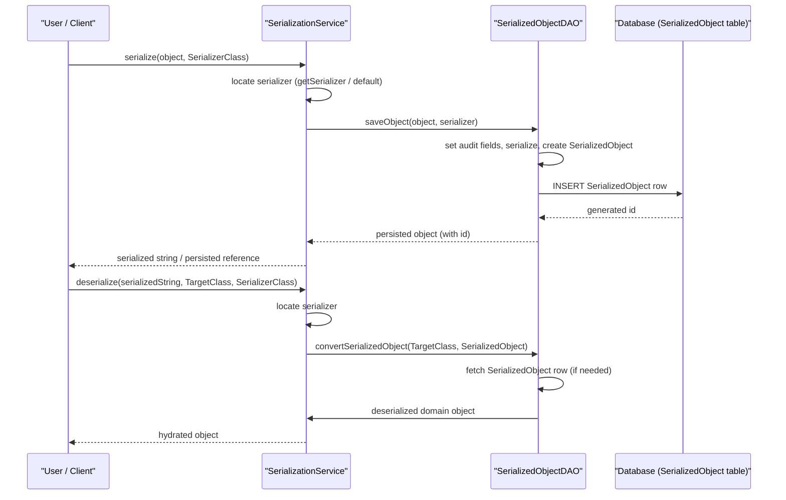

# Data Import/Export

## Overview
The Data Import/Export feature lets users export OpenMRS data (e.g., patient records, clinical observations) as serialized strings and later import that data back into the system.  
A user (or another system component) invokes the service‑level API to serialize an object, which is then persisted as a `SerializedObject` row. Conversely, a user can request deserialization of a stored string to reconstruct the original domain object.

## Behavior
- **Provides a default serializer** – `SerializationService#getDefaultSerializer()` returns the system‑configured `OpenmrsSerializer`. `./api/src/main/java/org/openmrs/api/SerializationService.java:23`
- **Looks up a specific serializer** – `SerializationService#getSerializer(Class)` returns the serializer matching the supplied class or `null`. `./api/src/main/java/org/openmrs/api/SerializationService.java:31`
- **Serializes an object** – `SerializationService#serialize(Object, Class)` converts the supplied object to a `String` using the indicated serializer and may throw `SerializationException`. `./api/src/main/java/org/openmrs/api/SerializationService.java:39`
- **Deserializes a string** – `SerializationService#deserialize(String, Class, Class)` rebuilds an object of the requested type from the stored string using the indicated serializer; it is annotated with `@Logging` (ignores the serialized string in logs) and `@Authorized`. `./api/src/main/java/org/openmrs/api/SerializationService.java:58`
- **Lists registered serializers** – `SerializationService#getSerializers()` returns all `OpenmrsSerializer` beans currently loaded. `./api/src/main/java/org/openmrs/api/SerializationService.java:78`
- **Persists a serialized object** – `SerializedObjectDAO#saveObject(T)` serializes the supplied `OpenmrsObject` with the default serializer, sets audit fields, and stores the resulting `SerializedObject` row. `./api/src/main/java/org/openmrs/api/db/SerializedObjectDAO.java:44`
- **Persists with a specific serializer** – `SerializedObjectDAO#saveObject(T, OpenmrsSerializer)` does the same but uses the provided serializer. `./api/src/main/java/org/openmrs/api/db/SerializedObjectDAO.java:53`
- **Retrieves a deserialized object by id** – `SerializedObjectDAO#getObject(Class<T>, Integer)` fetches the raw `SerializedObject` row, then calls `convertSerializedObject` to obtain the hydrated domain object. `./api/src/main/java/org/openmrs/api/db/SerializedObjectDAO.java:22`
- **Retrieves a deserialized object by UUID** – `SerializedObjectDAO#getObjectByUuid(Class<T>, String)` works like the id version but uses the UUID column. `./api/src/main/java/org/openmrs/api/db/SerializedObjectDAO.java:30`
- **Converts a raw `SerializedObject`** – `SerializedObjectDAO#convertSerializedObject(Class<T>, SerializedObject)` selects the appropriate serializer (based on the stored serializer class name) and invokes it to deserialize. `./api/src/main/java/org/openmrs/api/db/SerializedObjectDAO.java:71`
- **Searches serialized rows** – `SerializedObjectDAO#getAllSerializedObjects(...)` and `...ByName(...)` return raw `SerializedObject` rows matching type, retired flag, and/or name criteria. `./api/src/main/java/org/openmrs/api/db/SerializedObjectDAO.java:78` and `./api/src/main/java/org/openmrs/api/db/SerializedObjectDAO.java:106`
- **Searches deserialized objects** – `SerializedObjectDAO#getAllObjects(...)` and `...ByName(...)` return fully hydrated objects matching the same criteria. `./api/src/main/java/org/openmrs/api/db/SerializedObjectDAO.java:86` and `./api/src/main/java/org/openmrs/api/db/SerializedObjectDAO.java:115`
- **Deletes a serialized entry** – `SerializedObjectDAO#purgeObject(Integer)` removes the row with the given primary key. `./api/src/main/java/org/openmrs/api/db/SerializedObjectDAO.java:124`
- **Manages supported types** – `registerSupportedType`, `unregisterSupportedType`, `getSupportedTypes`, and `getRegisteredTypeForObject` let the DAO declare which `OpenmrsObject` subclasses it can handle. `./api/src/main/java/org/openmrs/api/db/SerializedObjectDAO.java:132`‑`./api/src/main/java/org/openmrs/api/db/SerializedObjectDAO.java:150`

## Triggers / Entry points
- **API layer** – Any service or controller that injects `SerializationService` or `SerializedObjectDAO` can trigger serialization, deserialization, or persistence. The interfaces themselves are the entry points. `./api/src/main/java/org/openmrs/api/SerializationService.java:10` and `./api/src/main/java/org/openmrs/api/db/SerializedObjectDAO.java:10`
- **Module configuration** – Modules can add additional serializers via Spring bean definitions (see the Javadoc example in `SerializationService#getSerializers`). This indirect configuration is a trigger for extending the feature. `./api/src/main/java/org/openmrs/api/SerializationService.java:71`

## End-to‑to‑end flow (Mermaid)

## State / data touched
- **`SerializedObject` table** – stores the raw serialized string, serializer class name, UUID, audit columns, and retired/void flags. Accessed by all DAO methods (`getSerializedObject`, `saveObject`, `purgeObject`, search methods). `./api/src/main/java/org/openmrs/api/db/SerializedObjectDAO.java:10`
- **`serializers` bean collection** – the list of `OpenmrsSerializer` implementations registered in the Spring context, returned by `SerializationService#getSerializers()`. `./api/src/main/java/org/openmrs/api/SerializationService.java:78`

## External dependencies
- **`OpenmrsSerializer` interface** – the pluggable serializer implementation (e.g., XStream, JSON). All (de)serialization calls delegate to an instance of this interface. `./api/src/main/java/org/openmrs/serialization/OpenmrsSerializer.java:10`
- **Spring framework** – used for bean registration of serializers (see Javadoc example). The DAO and service are Spring beans, though the concrete wiring is outside the provided files.

## Configuration / parameters
- **Default serializer bean** – the serializer returned by `SerializationService#getDefaultSerializer()`. The actual bean name/value is defined in the OpenMRS Spring configuration (not shown in the source). `./api/src/main/java/org/openmrs/api/SerializationService.java:20`
- **Supported type registration** – callers can register additional `OpenmrsObject` subclasses via `SerializedObjectDAO#registerSupportedType`. This influences which objects the DAO will accept. `./api/src/main/java/org/openmrs/api/db/SerializedObjectDAO.java:138`

## Edge cases & failure modes (observed in code)
- **Serialization failures** – `SerializationService#serialize` throws `SerializationException` if the chosen serializer cannot handle the object. `./api/src/main/java/org/openmrs/api/SerializationService.java:39`
- **Deserialization failures** – `SerializationService#deserialize` throws `SerializationException` when the stored string is malformed or the serializer cannot reconstruct the target class. `./api/src/main/java/org/openmrs/api/SerializationService.java:58`
- **Unsupported object type** – `SerializedObjectDAO#saveObject` (both overloads) is documented to throw a `DAOException` if the object’s class is not among the registered supported types. `./api/src/main/java/org/openmrs/api/db/SerializedObjectDAO.java:44`
- **Graceful handling of API changes** – The DAO’s “convertSerializedObject” method can be called inside a try/catch by callers to manage deserialization errors caused by schema changes (see Javadoc example). `./api/src/main/java/org/openmrs/api/db/SerializedObjectDAO.java:71`
- **Auditable fields** – When saving with a specific serializer, the DAO sets audit fields (creator, dateCreated, etc.) before persisting. This is mentioned in the Javadoc of `saveObject(T, OpenmrsSerializer)`. `./api/src/main/java/org/openmrs/api/db/SerializedObjectDAO.java:53`

## Open questions
- **Exact serializer selection logic** – The source shows methods to retrieve a serializer by class, but the concrete decision process (e.g., fallback to default, handling of `null` serializerClass) is implemented elsewhere and not visible here.
- **Persistence implementation details** – The DAO is an interface; the actual Hibernate/JPA code that reads/writes the `SerializedObject` table is in an implementation class not included in the provided files.
- **How retired/void flags are managed** – The DAO methods accept an `includeRetired` flag, but the underlying query logic that filters on `retired`/`voided` columns is not shown.
- **Configuration of the default serializer** – The bean name or property that determines which serializer is the default is defined in external Spring XML/Java config, not in the provided source.