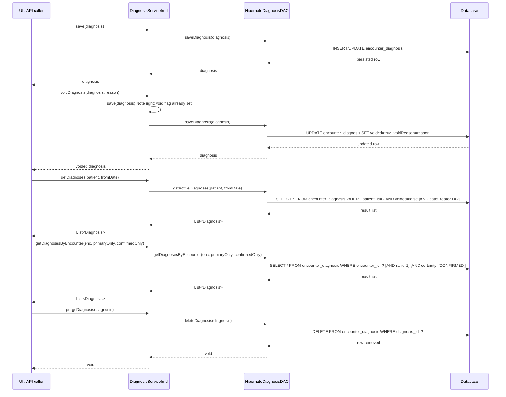

# Diagnosis Management

## Overview
The Diagnosis Management feature lets OpenMRS record, update, and retrieve a patient’s diagnoses and their associated attributes.  
A diagnosis is created during an **Encounter** (or Visit) by a clinician or other health‑care worker and is persisted as a row in the `encounter_diagnosis` table.  
The service also supports managing the metadata that describes diagnosis attributes (`DiagnosisAttributeType`) and the attribute values themselves (`DiagnosisAttribute`).

## Behavior
- **Save a diagnosis** – `DiagnosisServiceImpl.save` delegates to `HibernateDiagnosisDAO.saveDiagnosis`, which calls `Session.saveOrUpdate` to persist the `Diagnosis` entity. `api/src/main/java/org/openmrs/api/impl/DiagnosisServiceImpl.java:47` → `api/src/main/java/org/openmrs/api/db/hibernate/HibernateDiagnosisDAO.java:45`.
- **Void a diagnosis** – `DiagnosisServiceImpl.voidDiagnosis` simply calls the service’s own `save` method; the implementation does **not** set the `voided` flag itself (the void flag must already be set on the passed object). `api/src/main/java/org/openmrs/api/impl/DiagnosisServiceImpl.java:59`.
- **Un‑void a diagnosis** – `DiagnosisServiceImpl.unvoidDiagnosis` also calls `save`, relying on the caller to have cleared the `voided` flag. `api/src/main/java/org/openmrs/api/impl/DiagnosisServiceImpl.java:115`.
- **Purge a diagnosis** – `DiagnosisServiceImpl.purgeDiagnosis` invokes `HibernateDiagnosisDAO.deleteDiagnosis`, which issues a `Session.delete`. `api/src/main/java/org/openmrs/api/impl/DiagnosisServiceImpl.java:129` → `api/src/main/java/org/openmrs/api/db/hibernate/HibernateDiagnosisDAO.java:71`.
- **Retrieve a diagnosis by UUID** – `DiagnosisServiceImpl.getDiagnosisByUuid` forwards to `HibernateDiagnosisDAO.getDiagnosisByUuid`, which uses `HibernateUtil.getUniqueEntityByUUID`. `api/src/main/java/org/openmrs/api/impl/DiagnosisServiceImpl.java:81` → `api/src/main/java/org/openmrs/api/db/hibernate/HibernateDiagnosisDAO.java:84`.
- **Retrieve diagnoses for a patient (optionally from a start date)** – `DiagnosisServiceImpl.getDiagnoses` calls `HibernateDiagnosisDAO.getActiveDiagnoses`, which builds an HQL query filtering on `patientId`, `voided = false`, and an optional `dateCreated` cutoff. `api/src/main/java/org/openmrs/api/impl/DiagnosisServiceImpl.java:95` → `api/src/main/java/org/openmrs/api/db/hibernate/HibernateDiagnosisDAO.java:30`.
- **Retrieve diagnoses for an encounter** – `DiagnosisServiceImpl.getDiagnosesByEncounter` forwards to `HibernateDiagnosisDAO.getDiagnosesByEncounter`. The DAO builds a query that can filter on primary rank (`rank = 1`) and/or certainty (`certainty = CONFIRMED`). `api/src/main/java/org/openmrs/api/impl/DiagnosisServiceImpl.java:106` → `api/src/main/java/org/openmrs/api/db/hibernate/HibernateDiagnosisDAO.java:49`.
- **Retrieve diagnoses for a visit** – analogous to the encounter method, using `HibernateDiagnosisDAO.getDiagnosesByVisit`. `api/src/main/java/org/openmrs/api/impl/DiagnosisServiceImpl.java:119` → `api/src/main/java/org/openmrs/api/db/hibernate/HibernateDiagnosisDAO.java:62`.
- **Get unique diagnoses** – `DiagnosisServiceImpl.getUniqueDiagnoses` first obtains all active diagnoses, then removes duplicates based on the underlying `CodedOrFreeText` value (`diagnosis.getDiagnosis()`). `api/src/main/java/org/openmrs/api/impl/DiagnosisServiceImpl.java:124`.
- **Diagnosis attribute type CRUD** – `DiagnosisServiceImpl` delegates to DAO methods (`saveDiagnosisAttributeType`, `getAllDiagnosisAttributeTypes`, `getDiagnosisAttributeTypeById`, `getDiagnosisAttributeTypeByUuid`, `retireDiagnosisAttributeType`, `unretireDiagnosisAttributeType`, `purgeDiagnosisAttributeType`). See `api/src/main/java/org/openmrs/api/impl/DiagnosisServiceImpl.java:144‑190` and DAO implementations in `HibernateDiagnosisDAO` (`api/src/main/java/org/openmrs/api/db/hibernate/HibernateDiagnosisDAO.java:96‑138`).
- **Get a diagnosis attribute by UUID** – `DiagnosisServiceImpl.getDiagnosisAttributeByUuid` → `HibernateDiagnosisDAO.getDiagnosisAttributeByUuid`. `api/src/main/java/org/openmrs/api/impl/DiagnosisServiceImpl.java:197` → `api/src/main/java/org/openmrs/api/db/hibernate/HibernateDiagnosisDAO.java:144`.

## Triggers / Entry points
| Service method | Description | Source |
|----------------|-------------|--------|
| `save(Diagnosis)` | Persist a new or updated diagnosis | `api/src/main/java/org/openmrs/api/DiagnosisService.java:20` |
| `voidDiagnosis(Diagnosis, String)` | Mark a diagnosis as voided (caller must set `voided=true` and `voidReason`) | `api/src/main/java/org/openmrs/api/DiagnosisService.java:30` |
| `unvoidDiagnosis(Diagnosis)` | Reverse a void operation | `api/src/main/java/org/openmrs/api/DiagnosisService.java:58` |
| `purgeDiagnosis(Diagnosis)` | Hard‑delete a diagnosis | `api/src/main/java/org/openmrs/api/DiagnosisService.java:71` |
| `getDiagnosisByUuid(String)` | Fetch a diagnosis by its UUID | `api/src/main/java/org/openmrs/api/DiagnosisService.java:40` |
| `getDiagnoses(Patient, Date)` | List active diagnoses for a patient, optionally from a start date | `api/src/main/java/org/openmrs/api/DiagnosisService.java:51` |
| `getDiagnosesByEncounter(Encounter, boolean, boolean)` | List diagnoses for an encounter with optional primary/confirmed filters | `api/src/main/java/org/openmrs/api/DiagnosisService.java:65` |
| `getDiagnosesByVisit(Visit, boolean, boolean)` | Same as above but scoped to a visit | `api/src/main/java/org/openmrs/api/DiagnosisService.java:78` |
| `getAllDiagnosisAttributeTypes()` | Retrieve all diagnosis attribute types (including retired) | `api/src/main/java/org/openmrs/api/DiagnosisService.java:96` |
| `saveDiagnosisAttributeType(DiagnosisAttributeType)` | Create or update a diagnosis attribute type | `api/src/main/java/org/openmrs/api/DiagnosisService.java:115` |
| `purgeDiagnosisAttributeType(DiagnosisAttributeType)` | Hard‑delete an attribute type | `api/src/main/java/org/openmrs/api/DiagnosisService.java:138` |
| `getDiagnosisAttributeByUuid(String)` | Fetch a diagnosis attribute by UUID | `api/src/main/java/org/openmrs/api/DiagnosisService.java:150` |

All service methods are secured with `@Authorized` annotations that enforce the appropriate OpenMRS privileges (e.g., `EDIT_DIAGNOSES`, `GET_DIAGNOSES`). See the annotations in `DiagnosisService.java`.

## End‑to‑end flow (Mermaid)

## State / data touched
| Entity | Table | Relevant fields | Source |
|--------|-------|----------------|--------|
| `Diagnosis` | `encounter_diagnosis` | `diagnosis_id`, `encounter_id`, `patient_id`, `diagnosis_coded`, `diagnosis_non_coded`, `condition_id`, `certainty`, `dx_rank`, `voided`, `date_created`, `form_namespace_and_path` | `api/src/main/java/org/openmrs/Diagnosis.java:14‑31` |
| `DiagnosisAttribute` | `diagnosis_attribute` | `diagnosis_attribute_id`, `diagnosis_id`, `attribute_type_id`, `value`, `voided` | `api/src/main/java/org/openmrs/DiagnosisAttribute.java:14` (not shown but implied by generic BaseCustomizableData) |
| `DiagnosisAttributeType` | `diagnosis_attribute_type` | `diagnosis_attribute_type_id`, `name`, `description`, `datatype`, `retired` | `api/src/main/java/org/openmrs/DiagnosisAttributeType.java:14` |
| `Diagnosis` → `attributes` collection | `Set<DiagnosisAttribute>` (mapped by `diagnosis`) | Managed via `@OneToMany` with cascade ALL and orphanRemoval true (`Diagnosis` class). | `api/src/main/java/org/openmrs/Diagnosis.java:71‑78` |

## External dependencies
- **Hibernate** (ORM) for all persistence operations (`SessionFactory`, `Session`, HQL/Criteria). See `HibernateDiagnosisDAO`.  
- **OpenMRS Context** for service self‑reference (`Context.getDiagnosisService()`) used in void/unvoid and attribute‑type retire/unretire methods. `api/src/main/java/org/openmrs/api/impl/DiagnosisServiceImpl.java:59,115,124`.

No external web services, message queues, or third‑party APIs are invoked by this feature.

## Configuration / parameters
The Diagnosis Management code does not read any global properties, environment variables, or external configuration files. All behavior is driven by method parameters and the underlying database schema.

## Edge cases & failure modes
- **Void/unvoid logic** – `voidDiagnosis` and `unvoidDiagnosis` simply call `save`; they rely on the caller to set or clear the `voided` flag and `voidReason`. No explicit check is performed, so a caller could inadvertently save a diagnosis without marking it voided. (`DiagnosisServiceImpl.voidDiagnosis` & `unvoidDiagnosis` lines 59, 115).
- **Purge constraints** – `purgeDiagnosis` calls `diagnosisDAO.deleteDiagnosis`. The DAO comment warns that an error will be thrown if other entities reference the diagnosis, but the code does not perform a pre‑check; the database foreign‑key constraints will raise an exception. (`HibernateDiagnosisDAO.deleteDiagnosis` line 71).
- **Attribute type retrieval** – `getDiagnosisAttributeTypeById` and `getDiagnosisAttributeTypeByUuid` return `null` when the entity is not found, as per DAO `session.get` and `HibernateUtil.getUniqueEntityByUUID` behavior. (`HibernateDiagnosisDAO.getDiagnosisAttributeTypeById` line 96, `getDiagnosisAttributeTypeByUuid` line 104).
- **Primary‑only / confirmed‑only filters** – When `primaryOnly` is true, the DAO adds `rank = 1`; when `confirmedOnly` is true, it adds `certainty = CONFIRMED`. If both are false, the query returns all diagnoses for the encounter/visit. (`HibernateDiagnosisDAO.getDiagnosesByEncounter` lines 49‑61, `getDiagnosesByVisit` lines 66‑78).

## Open questions
- **How are `DiagnosisAttribute` values populated?** The source shows the collection mapping but no service methods that directly add or modify attributes; they are likely managed through the generic `BaseCustomizableData` API elsewhere in the codebase.
- **What UI or REST endpoints invoke these service methods?** The provided files contain only the service and DAO layers; the controllers or REST resources that expose the functionality are not included.