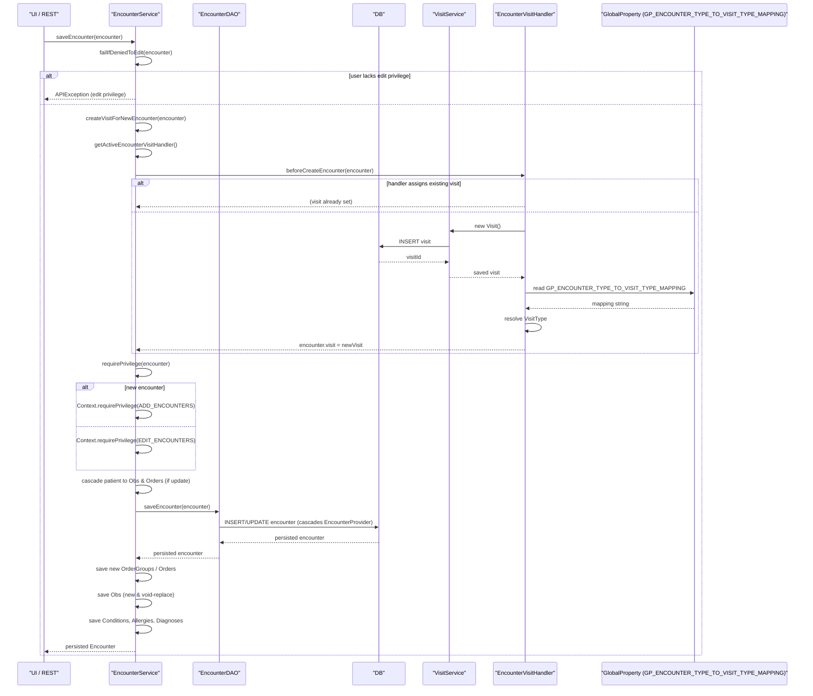

# Encounter Management  

## Overview  
The **Encounter Management** feature lets OpenMRS record, update, retrieve and retire the clinical “encounter” that ties a patient to a point‑in‑time interaction with the health‑care system. An encounter holds a date‑time, location, type, form, observations, orders, diagnoses, conditions, allergies and the providers that participated (via `EncounterProvider`).  

* **Who triggers it** – Any server‑side code that calls the `EncounterService` (e.g. UI controllers, REST resources, scheduled jobs) creates or modifies an encounter. The service checks the caller’s privileges (`ADD_ENCOUNTERS`, `EDIT_ENCOUNTERS`, `GET_ENCOUNTERS`, etc.) before proceeding.  
* **What it produces** – A persisted `Encounter` row (and related rows in `obs`, `order`, `encounter_provider`, `condition`, `allergy`, `diagnosis` tables) and, when appropriate, a `Visit` that groups the encounter.  

All of this runs in the current transaction (`@Transactional` on `EncounterServiceImpl`).  

---

## Behavior  

| Step | What the code does | Source |
|------|-------------------|--------|
| **1. Permission check** – Verify the user may edit the encounter type. | `failIfDeniedToEdit(encounter)` throws `APIException` if the user lacks the edit privilege defined on the encounter’s `EncounterType`. | `EncounterServiceImpl.java:108‑115` |
| **2. Assign a visit (new encounters only)** – Use the active `EncounterVisitHandler`. | `createVisitForNewEncounter(encounter)` obtains `Context.getEncounterService().getActiveEncounterVisitHandler()` and calls `beforeCreateEncounter`. If a handler creates a `Visit`, it is saved via `Context.getVisitService().saveVisit`. | `EncounterServiceImpl.java:117‑135` |
| **3. Determine privilege (add vs edit)** | `requirePrivilege(encounter)` calls `Context.requirePrivilege(ADD_ENCOUNTERS)` for new encounters or `EDIT_ENCOUNTERS` for existing ones. | `EncounterServiceImpl.java:137‑148` |
| **4. Cascade patient to observations** – For updates, fetch original datetime/location and propagate changes to child `Obs`. | Loop over `encounter.getAllFlattenedObs(true)` and adjust `obsDatetime`, `location`, and `person` when the encounter’s datetime or location changed. | `EncounterServiceImpl.java:152‑176` |
| **5. Cascade patient to orders** – Ensure each `Order` points to the same patient. | `for (Order o : encounter.getOrders()) { if (!p.equals(o.getPatient())) o.setPatient(p); }` | `EncounterServiceImpl.java:178‑182` |
| **6. Persist the encounter** | `dao.saveEncounter(encounter)` writes the `encounter` row (and cascades `EncounterProvider` because of `CascadeType.ALL`). | `EncounterServiceImpl.java:184‑186` |
| **7. Persist new order groups** | `Context.getOrderService().saveOrderGroup(orderGroup)` for each new `OrderGroup`. | `EncounterServiceImpl.java:188‑191` |
| **8. Persist new orders without groups** | `Context.getOrderService().saveOrder(o, null)` for orders whose `orderId` is null. | `EncounterServiceImpl.java:193‑197` |
| **9. Persist observations** – New obs are saved via `ObsService.saveObs`. Existing obs are voided and re‑saved, then the old instance is removed from the encounter and the new one added. | Loop over `encounter.getObsAtTopLevel(true)`; new obs → `os.saveObs(o, null)`. Existing obs → `os.saveObs(o, changeMessage)` then `removeGivenObsAndTheirGroupMembersFromEncounter` / `addGivenObsAndTheirGroupMembersToEncounter`. | `EncounterServiceImpl.java:199‑221` |
| **10. Persist conditions, allergies, diagnoses** | `encounter.getConditions().forEach(Context.getConditionService()::saveCondition)`; similar for allergies and diagnoses (setting patient & encounter before saving). | `EncounterServiceImpl.java:223‑232` |
| **11. Return the saved encounter** | The method returns the now‑persistent `Encounter`. | `EncounterServiceImpl.java:234` |
| **12. Retrieval** – Various getters (`getEncounter`, `getEncountersByPatient`, `getEncounters`, `getEncounterByUuid`, etc.) delegate to the DAO, then filter by view permissions. | Example: `getEncounter(Integer)` → `dao.getEncounter(encounterId)` → permission check via `canViewEncounter`. | `EncounterServiceImpl.java:339‑354` |
| **13. Void / Unvoid** – `voidEncounter` marks the encounter voided, voids its top‑level obs and orders, sets `voidReason`, and saves the encounter again. `unvoidEncounter` reverses the process, un‑voiding matching obs/orders. | `EncounterServiceImpl.java:356‑393` (void) and `EncounterServiceImpl.java:395‑424` (unvoid) |
| **14. Purge** – `purgeEncounter` (and overload with `cascade`) deletes the encounter row; if `cascade` is true, associated obs and orders are also purged. | `EncounterServiceImpl.java:426‑452` |
| **15. Encounter type CRUD** – `saveEncounterType`, `retireEncounterType`, `unretireEncounterType`, `purgeEncounterType` delegate to DAO after checking the “encounter types locked” flag. | `EncounterServiceImpl.java:493‑527` (save), `537‑553` (retire), `563‑571` (unretire), `581‑587` (purge) |
| **16. Encounter role CRUD** – `saveEncounterRole`, `retireEncounterRole`, `unretireEncounterRole`, `purgeEncounterRole` delegate to DAO. | `EncounterServiceImpl.java:605‑617` (save), `637‑648` (retire), `659‑666` (unretire), `672‑677` (purge) |
| **17. Provider handling** – `Encounter` exposes `addProvider`, `setProvider`, `removeProvider`, and read‑only maps (`getProvidersByRoles`, `getProvidersByRole`). These manipulate the `encounterProviders` set and set void flags when needed. | `Encounter.java:447‑511` (addProvider), `513‑543` (setProvider), `545‑560` (removeProvider), `562‑585` (maps) |
| **18. Visit assignment handler** – `ExistingOrNewVisitAssignmentHandler.beforeCreateEncounter` first runs the “existing visit” logic (super) then, if still unassigned, creates a new `Visit` with a `VisitType` derived from the global property `GP_ENCOUNTER_TYPE_TO_VISIT_TYPE_MAPPING`. | `ExistingOrNewVisitAssignmentHandler.java:71‑106` (method) and `loadVisitType` logic lines `96‑124`. |
| **19. DAO persistence** – `HibernateEncounterDAO.saveEncounter` does `session.saveOrUpdate(encounter)`. Retrieval methods build JPA Criteria queries (e.g., `getEncountersByPatientId`, `getEncounters(EncounterSearchCriteria)`, `getEncountersByVisit`). | `HibernateEncounterDAO.java:45‑48` (save), `71‑84` (by patientId), `115‑149` (search criteria), `260‑274` (by visit). |
| **20. UUID look‑ups** – Generic `getClassByUuid` uses `HibernateUtil.getUniqueEntityByUUID`. | `HibernateEncounterDAO.java:311‑317` |

---

## Triggers / Entry points  

| Entry point | Description | Source |
|-------------|-------------|--------|
| `EncounterService.saveEncounter(Encounter)` | Main entry for creating or updating an encounter. | `EncounterService.java:71‑84` → impl `EncounterServiceImpl.java:101` |
| `EncounterService.getEncountersByPatient(Patient)` | Retrieves all non‑voided encounters for a patient (sorted). | `EncounterService.java:115‑124` → impl `EncounterServiceImpl.java:221` |
| `EncounterService.getEncounter(Integer)` | Fetches a single encounter by internal ID. | `EncounterService.java:84‑94` → impl `EncounterServiceImpl.java:339` |
| `EncounterService.getEncounterByUuid(String)` | Fetches by UUID. | `EncounterService.java:106‑112` → impl `EncounterServiceImpl.java:475` |
| `EncounterService.saveEncounterType(EncounterType)` | Create / update an encounter type. | `EncounterService.java:210‑218` → impl `EncounterServiceImpl.java:493` |
| `EncounterService.saveEncounterRole(EncounterRole)` | Create / update an encounter role. | `EncounterService.java:306‑312` → impl `EncounterServiceImpl.java:605` |
| `EncounterService.getActiveEncounterVisitHandler()` | Returns the handler that decides how encounters are linked to visits. | `EncounterService.java:260‑268` → impl `EncounterServiceImpl.java:687‑693` |
| `ExistingOrNewVisitAssignmentHandler.beforeCreateEncounter(Encounter)` | Called from `createVisitForNewEncounter` for new encounters. | `ExistingOrNewVisitAssignmentHandler.java:71‑106` |
| `EncounterDAO` methods (`saveEncounter`, `getEncounters…`) | Direct DAO calls from the service layer. | `HibernateEncounterDAO.java` (multiple locations) |

---

## End‑to‑end flow (Mermaid)

*Branches shown*: permission failure, existing‑visit assignment, new‑visit creation (global‑property lookup).  

---

## State / data touched  

| Table / Collection | Accessed by | Operation |
|--------------------|-------------|-----------|
| `encounter` | `HibernateEncounterDAO.saveEncounter`, `getEncounter`, `getEncounters…` | INSERT/UPDATE/SELECT |
| `encounter_type` | `HibernateEncounterDAO.saveEncounterType`, `getEncounterType`, `findEncounterTypes` | INSERT/UPDATE/SELECT |
| `encounter_role` | `HibernateEncounterDAO.saveEncounterRole`, `getEncounterRole`, `getAllEncounterRoles` | INSERT/UPDATE/SELECT |
| `encounter_provider` | `Encounter.encounterProviders` (add/set/remove), DAO `saveEncounter` (cascade) | INSERT/UPDATE/SELECT/VOID |
| `obs` | `ObsService.saveObs` (called from `saveEncounter`), cascade logic in `Encounter` | INSERT/UPDATE/VOID |
| `order`, `order_group` | `OrderService.saveOrder`, `saveOrderGroup` | INSERT/UPDATE |
| `condition`, `allergy`, `diagnosis` | respective services called from `saveEncounter` | INSERT/UPDATE |
| `visit` | `VisitService.saveVisit` (when handler creates a new visit) | INSERT/UPDATE |
| Caches | `HandlerUtil.getHandlersForType` (encounter visit handlers) | read‑only cache of handlers |

All reads/writes are performed inside the transaction started by `EncounterServiceImpl` (`@Transactional`).  

---

## External dependencies  

| Dependency | Role | Source |
|------------|------|--------|
| `Context` (OpenMRS core) | Provides access to services, authentication, privilege checks, message source, location service, etc. | Multiple calls in `EncounterServiceImpl.java` (e.g., `Context.requirePrivilege`, `Context.getObsService`) |
| `ObsService` | Persists observations, handles voiding/re‑saving. | `EncounterServiceImpl.java:199‑221` |
| `OrderService` | Persists orders and order groups. | `EncounterServiceImpl.java:188‑197` |
| `ConditionService`, `PatientService`, `DiagnosisService` | Persist conditions, allergies, diagnoses. | `EncounterServiceImpl.java:223‑232` |
| `VisitService` | Creates and saves `Visit` objects when a visit‑assignment handler needs a new visit. | `ExistingOrNewVisitAssignmentHandler.java:84‑92` |
| `HandlerUtil` | Retrieves the list of `EncounterVisitHandler` implementations. | `EncounterServiceImpl.java:687‑693` |
| `HibernateUtil` (via `getClassByUuid`) | Generic UUID lookup for any entity. | `HibernateEncounterDAO.java:311‑317` |
| Global property `GP_ENCOUNTER_TYPE_TO_VISIT_TYPE_MAPPING` | Maps an `EncounterType` to a `VisitType` for the “existing‑or‑new” handler. | `ExistingOrNewVisitAssignmentHandler.java:96‑124` |

---

## Configuration / parameters  

| Config key | Meaning | Source |
|------------|---------|--------|
| `GP_ENCOUNTER_TYPE_TO_VISIT_TYPE_MAPPING` | CSV mapping `encounterTypeIdOrUuid:visitTypeIdOrUuid` used by `ExistingOrNewVisitAssignmentHandler` to decide which `VisitType` to create for a new encounter. | `ExistingOrNewVisitAssignmentHandler.java:96‑124` |
| `OpenmrsConstants.GP_ENCOUNTER_TYPE_TO_VISIT_TYPE_MAPPING` (constant) | The literal name of the above global property. | `ExistingOrNewVisitAssignmentHandler.java:98` |
| `EncounterService.checkIfEncounterTypesAreLocked()` (called before saving/retiring types) | Throws `EncounterTypeLockedException` if the system admin has disabled editing of encounter types. | `EncounterServiceImpl.java:493‑500` (method call) |
| `PrivilegeConstants` (e.g., `ADD_ENCOUNTERS`, `EDIT_ENCOUNTERS`, `GET_ENCOUNTERS`, `MANAGE_ENCOUNTER_TYPES`, `MANAGE_ENCOUNTER_ROLES`, `PURGE_ENCOUNTERS`) | Required privileges for each service method. | Annotations on `EncounterService` methods (e.g., `@Authorized({ PrivilegeConstants.ADD_ENCOUNTERS, PrivilegeConstants.EDIT_ENCOUNTERS })` at line 71). |

---

## Edge cases & failure modes  

| Situation | Handling in code |
|-----------|-------------------|
| **Missing required privilege** | `Context.requirePrivilege` throws `APIException`. Also `failIfDeniedToEdit` throws if the user lacks the edit privilege of the encounter type. |
| **Null parameters** | Methods such as `getEncountersByPatient(String query)` and `getEncountersByPatientId(Integer patientId)` explicitly check for `null` and throw `IllegalArgumentException`. |
| **Encounter type locked** | `saveEncounterType`, `retireEncounterType`, `unretireEncounterType`, `purgeEncounterType` call `checkIfEncounterTypesAreLocked()` which throws `EncounterTypeLockedException`. |
| **Visit assignment failure** | If the global property mapping cannot be parsed or the referenced `VisitType` does not exist, `loadVisitType` throws `APIException`. |
| **Obs datetime/location mismatch on update** | The code compares original vs. new datetime/location and only updates child obs when they inherited the original values (`OpenmrsUtil.compare`). |
| **Void/Unvoid consistency** | `voidEncounter` voids top‑level obs and orders with the same reason; `unvoidEncounter` only un‑voids those whose `voidReason` matches the encounter’s reason, preserving data integrity. |
| **Cascade delete** | `purgeEncounter(encounter, true)` explicitly deletes related obs and orders; otherwise only the encounter row is removed. |
| **Duplicate provider addition** | `addProvider` first checks whether the same provider/role pair already exists (non‑voided) and returns early to avoid duplicates. |
| **Provider removal** | `removeProvider` marks the `EncounterProvider` as voided rather than deleting it, preserving audit history. |
| **Encounter copy** | `copyAndAssignToAnotherPatient` copies all fields except the `visit` reference, ensuring the new encounter is independent of the original visit. | `Encounter.java:618‑658` |

---

## Open questions  

* **Performance at scale** – The current implementation loads all observations for an encounter into memory (`getAllFlattenedObs`, `getObsAtTopLevel`). It is unclear how this behaves with very large obs groups or high‑throughput bulk imports.  
* **Concurrency** – No explicit locking is performed when multiple users edit the same encounter simultaneously; potential for lost updates exists.  
* **Visit‑assignment handler ordering** – The system can have multiple `EncounterVisitHandler` implementations; the code always uses the *active* handler (`getActiveEncounterVisitHandler`) but the selection criteria (e.g., ordering, configuration) are not shown in the provided sources.  
* **Global‑property change propagation** – When `GP_ENCOUNTER_TYPE_TO_VISIT_TYPE_MAPPING` changes, the handler clears its cache (`globalPropertyChanged`), but existing encounters already linked to a visit are not retroactively updated.  

These points would require additional runtime profiling or inspection of the surrounding configuration code to answer definitively.