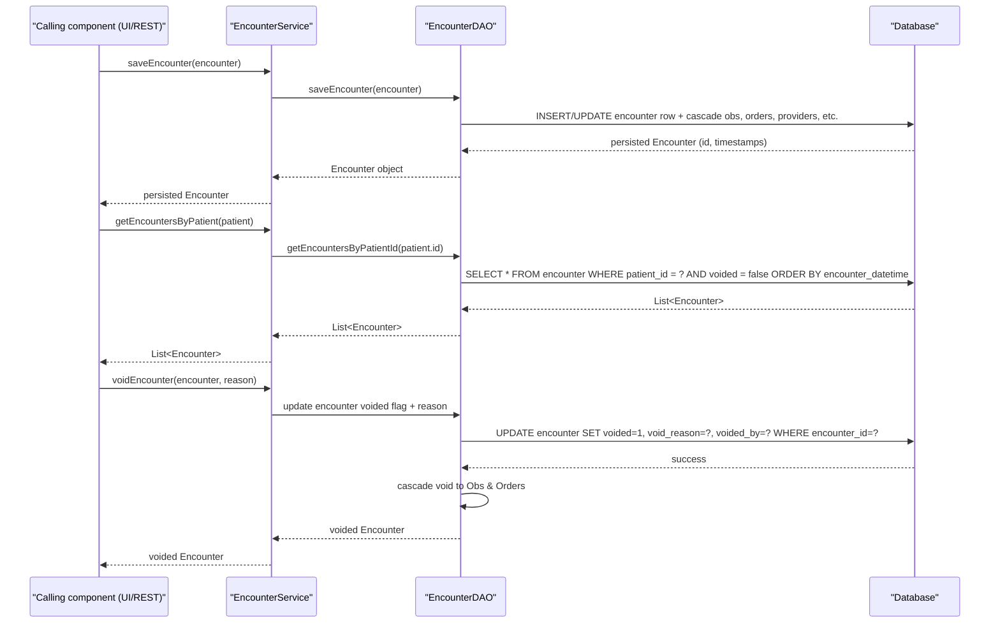

# Encounter Management  

## Overview  
The Encounter Management feature implements the core OpenMRS API for creating, reading, updating, and retiring patient encounters, encounter types, and encounter roles. It is invoked by application code (e.g., UI controllers, REST services, or other server‑side components) that call the `EncounterService` interface. The service persists encounters, propagates patient, location, and datetime information to contained observations, orders, diagnoses, conditions, allergies, and providers, and returns the fully‑populated `Encounter` object (or related metadata) to the caller.  

## Behavior  
- **Save or update an encounter** – `EncounterService.saveEncounter(Encounter)` validates privileges, cascades patient data to all `Obs` in the encounter, saves/updates the encounter, its observations, orders, diagnoses, conditions, allergies, and providers, and optionally assigns the encounter to a visit via the active `EncounterVisitHandler`. `path: ./api/src/main/java/org/openmrs/api/EncounterService.java:46‑71`  
- **Retrieve an encounter by ID** – `EncounterService.getEncounter(Integer)` checks `GET_ENCOUNTERS` privilege and returns the `Encounter` with the given internal identifier. `path: ./api/src/main/java/org/openmrs/api/EncounterService.java:78‑92`  
- **Retrieve an encounter by UUID** – `EncounterService.getEncounterByUuid(String)` returns the matching encounter or `null`. `path: ./api/src/main/java/org/openmrs/api/EncounterService.java:98‑108`  
- **List a patient’s encounters** – `EncounterService.getEncountersByPatient(Patient)` returns all non‑voided encounters for the patient, ordered by `encounterDatetime`. `path: ./api/src/main/java/org/openmrs/api/EncounterService.java:115‑124`  
- **Search encounters with flexible criteria** – `EncounterService.getEncounters(EncounterSearchCriteria)` (new API) and the deprecated overload accept nullable parameters (patient, location, dates, forms, types, providers, visit types/visits, void flag) and return encounters ordered by datetime. `path: ./api/src/main/java/org/openmrs/api/EncounterService.java:150‑176`  
- **Void an encounter** – `EncounterService.voidEncounter(Encounter, String)` marks the encounter as voided, records the reason, and cascades the void to its observations and orders. `path: ./api/src/main/java/org/openmrs/api/EncounterService.java:197‑209`  
- **Un‑void an encounter** – `EncounterService.unvoidEncounter(Encounter)` clears the void flag and propagates the change to observations and orders. `path: ./api/src/main/java/org/openmrs/api/EncounterService.java:215‑225`  
- **Purge (hard‑delete) an encounter** – `EncounterService.purgeEncounter(Encounter[,boolean])` removes the encounter (and optionally its observations/orders) from the database; only users with `PURGE_ENCOUNTERS` may invoke it. `path: ./api/src/main/java/org/openmrs/api/EncounterService.java:231‑247`  
- **Create / update an encounter type** – `EncounterService.saveEncounterType(EncounterType)` persists a new or existing type, preserving creator/date fields. `path: ./api/src/main/java/org/openmrs/api/EncounterService.java:277‑291`  
- **Retrieve encounter types** – by ID, UUID, exact name, or list (with optional retired flag). `path: ./api/src/main/java/org/openmrs/api/EncounterService.java:298‑332`  
- **Retire / un‑retire an encounter type** – `retireEncounterType` and `unretireEncounterType` toggle the retired flag while recording a reason. `path: ./api/src/main/java/org/openmrs/api/EncounterService.java:337‑357`  
- **Manage encounter roles** – `saveEncounterRole`, `getEncounterRole`, `purgeEncounterRole`, `getAllEncounterRoles`, `getEncounterRoleByUuid`, `getEncounterRoleByName`, `retireEncounterRole`, `unretireEncounterRole`. `path: ./api/src/main/java/org/openmrs/api/EncounterService.java:363‑424`  
- **Provider handling on an encounter** – `Encounter.addProvider`, `setProvider`, `removeProvider`, and the various getters (`getProvidersByRoles`, `getProvidersByRole`) manage the `EncounterProvider` set, ensuring no duplicate active providers and voiding superseded entries. `path: ./api/src/main/java/org/openmrs/Encounter.java:332‑425`  

## Triggers / Entry points  
- **API layer** – Any server‑side component that injects `EncounterService` (e.g., REST controllers, UI actions, scheduled jobs) can call the methods listed above. `path: ./api/src/main/java/org/openmrs/api/EncounterService.java`  
- **DAO layer** – `EncounterDAO` implements the persistence logic used by the service (save, delete, fetch by ID/UUID, search). `path: ./api/src/main/java/org/openmrs/api/db/EncounterDAO.java`  

## End‑to‑end flow (Mermaid)  

## State / data touched  
| Entity | Table / Collection | Access point (source) |
|--------|-------------------|-----------------------|
| `Encounter` | `encounter` table (core fields) | `Encounter.java` fields `encounterId`, `encounterDatetime`, `patient`, `location`, `form`, `encounterType`, `visit` `path: ./api/src/main/java/org/openmrs/Encounter.java:31‑84` |
| `Obs` (observations) | `obs` table, linked via `encounter_id` | `Encounter.addObs` propagates encounter attributes to each `Obs` `path: ./api/src/main/java/org/openmrs/Encounter.java:215‑260` |
| `Order` | `orders` table, linked via `encounter_id` | `Encounter.addOrder` `path: ./api/src/main/java/org/openmrs/Encounter.java:274‑285` |
| `Diagnosis` | `diagnosis` table (via `encounter_id`) | `Encounter.getDiagnoses` `path: ./api/src/main/java/org/openmrs/Encounter.java:292‑306` |
| `Condition` | `condition` table (via `encounter_id`) | `Encounter.getConditions` `path: ./api/src/main/java/org/openmrs/Encounter.java:311‑332` |
| `Allergy` | `allergy` table (via `encounter_id`) | `Encounter` field `allergies` `path: ./api/src/main/java/org/openmrs/Encounter.java:336‑340` |
| `EncounterProvider` | `encounter_provider` table | `Encounter.getEncounterProviders` and provider‑management methods `path: ./api/src/main/java/org/openmrs/Encounter.java:352‑425` |
| `EncounterType` | `encounter_type` table | `EncounterService.saveEncounterType` / DAO methods `path: ./api/src/main/java/org/openmrs/api/EncounterService.java:277‑291` |
| `EncounterRole` | `encounter_role` table | `EncounterService` role methods `path: ./api/src/main/java/org/openmrs/api/EncounterService.java:363‑424` |
| `Visit` | `visit` table (optional foreign key) | `Encounter.visit` field `path: ./api/src/main/java/org/openmrs/Encounter.java:376‑388` |

## External dependencies  
- **Patient service / domain object** – used to set/get the patient on an encounter and to cascade patient to observations. `path: ./api/src/main/java/org/openmrs/Encounter.java:71‑78`  
- **Provider service / domain object** – used in provider‑management methods (`addProvider`, `setProvider`, etc.). `path: ./api/src/main/java/org/openmrs/Encounter.java:332‑425`  
- **Location service / domain object** – stored on the encounter and propagated to observations. `path: ./api/src/main/java/org/openmrs/Encounter.java:84‑90`  
- **Form service / domain object** – optional association on an encounter. `path: ./api/src/main/java/org/openmrs/Encounter.java:96‑102`  
- **Visit handling** – `EncounterVisitHandler` implementations determine whether an encounter is linked to an existing visit, a new visit, or none. `path: ./api/src/main/java/org/openmrs/api/EncounterService.java:140‑152`  

## Configuration / parameters  
- **Privilege constants** – each service method is annotated with `@Authorized` referencing `PrivilegeConstants` (e.g., `ADD_ENCOUNTERS`, `EDIT_ENCOUNTERS`, `GET_ENCOUNTERS`, `MANAGE_ENCOUNTER_TYPES`, etc.). `path: ./api/src/main/java/org/openmrs/api/EncounterService.java` (multiple lines).  
- **Visit‑assignment handlers** – the active `EncounterVisitHandler` is obtained via `EncounterService.getActiveEncounterVisitHandler()`. The list of handlers is configurable via the OpenMRS module system (not hard‑coded in the source). `path: ./api/src/main/java/org/openmrs/api/EncounterService.java:166‑176`  

## Edge cases & failure modes (observed in code)  
- **Null arguments** – many service methods throw `APIException` when required parameters are `null` (e.g., `saveEncounter(null)`, `getEncounter(null)`). `path: ./api/src/main/java/org/openmrs/api/EncounterService.java:46‑71` (javadoc notes).  
- **Privilege checks** – if the current user lacks the required privilege, an `APIException` is thrown before any DB work. `@Authorized` annotations enforce this.  
- **Void handling** – voiding an encounter does **not** void its providers (`voidEncounter` javadoc explicitly says “not void providers”). `path: ./api/src/main/java/org/openmrs/api/EncounterService.java:197‑209`  
- **Retired encounter types / roles** – retrieval methods (`getEncounterType(String)`, `findEncounterTypes`) filter out retired entries unless the caller explicitly asks for them. `path: ./api/src/main/java/org/openmrs/api/EncounterService.java:318‑332`  
- **Visit assignment** – if no `EncounterVisitHandler` is registered, the encounter is left without a visit (`saveEncounter` javadoc). `path: ./api/src/main/java/org/openmrs/api/EncounterService.java:46‑71` (javadoc notes).  
- **Duplicate provider prevention** – `Encounter.addProvider` checks for an existing active provider with the same role before adding a new `EncounterProvider`. `path: ./api/src/main/java/org/openmrs/Encounter.java:332‑352`  

## Open questions  
- **Concurrency control** – The source does not show explicit locking or version checks when two users attempt to update the same encounter simultaneously. How does OpenMRS prevent lost updates?  
- **Performance of large searches** – Methods like `getEncounters(EncounterSearchCriteria)` may return large result sets; the code does not indicate pagination or streaming. What are the practical limits and any DB‑level optimizations?  
- **Handler registration mechanism** – The documentation mentions “no assignment handler”, “existing visit only”, and “existing or new visit” handlers, but the concrete registration (e.g., via Spring beans or module XML) is not visible in the provided files. Where is the active handler configured?  
- **Cache usage** – The DAO methods sometimes call “bypass any caches” (e.g., `getSavedEncounterDatetime`). Are there second‑level caches (Hibernate) that could cause stale reads for encounters?  

---  

*All statements are derived directly from the OpenMRS source files listed above, with line‑level citations where applicable.*