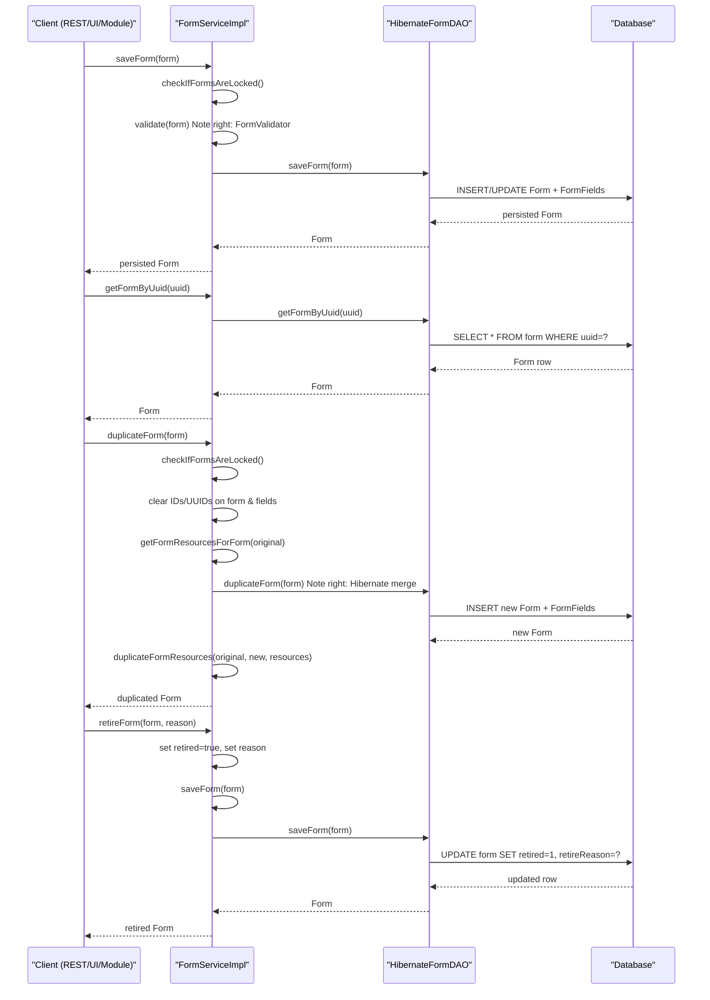

# Form Management  

## Overview  
The **Form Management** feature lets OpenMRS users create, read, update, duplicate, retire, and permanently delete **forms**, their **form fields**, **fields**, **field types**, and **form resources**. All operations are exposed through the `org.openmrs.api.FormService` interface and are implemented in `FormServiceImpl`. The service enforces security (privileges), validation, and form‑locking rules before delegating persistence to the `FormDAO` (Hibernate implementation).

---

## Behavior *(cite path:line)*  

| Operation | Service method | Key implementation details | Source |
|-----------|----------------|----------------------------|--------|
| **Create / update a form** | `saveForm(Form)` | • Checks form‑locking (`checkIfFormsAreLocked()`). • Validates with `FormValidator` and throws `APIException` on errors. • Ensures each `FormField` points back to the same `Form` (or sets it). • Persists via `dao.saveForm(form)`. | `FormServiceImpl.java:115‑144` |
| **Retrieve a form by id** | `getForm(Integer)` | Direct DAO call. | `FormServiceImpl.java:78‑82` |
| **Retrieve a form by name (latest version)** | `getForm(String)` | DAO returns list ordered by version descending; returns first element or `null`. | `FormServiceImpl.java:210‑218` |
| **Retrieve a form by name + version** | `getForm(String, String)` | DAO query on both columns. | `FormServiceImpl.java:224‑228` |
| **Retrieve a form by UUID** | `getFormByUuid(String)` | DAO uses `HibernateUtil.getUniqueEntityByUUID`. | `FormServiceImpl.java:236‑240` |
| **List all forms** | `getAllForms()` / `getAllForms(boolean)` | Calls DAO; `includeRetired` flag controls retired filter. | `FormServiceImpl.java:250‑259` |
| **Search forms (fuzzy, latest‑only)** | `getForms(String, boolean)` | Calls the full‑criteria `getForms` then removes duplicate names when `onlyLatestVersion` is true. | `FormServiceImpl.java:261‑277` |
| **Search forms with criteria** | `getForms(String, Boolean, Collection<EncounterType>, Boolean, Collection<FormField>, Collection<FormField>, Collection<Field>)` | Builds safe collections, forwards to DAO which builds a Criteria query. | `FormServiceImpl.java:279‑298` |
| **Count forms with criteria** | `getFormCount(...)` | Same predicates as above, but selects `count`. | `FormServiceImpl.java:300‑317` |
| **Publish‑only list** | `getPublishedForms()` | Calls `getForms(null, true, null, false, null, null, null)`. | `FormServiceImpl.java:319‑324` |
| **Duplicate a form** | `duplicateForm(Form)` | • Checks lock. • Clears IDs/UUIDs on the form and its fields. • Copies resources (`duplicateFormResources`). • Calls `dao.duplicateForm(form)` (Hibernate `merge`). | `FormServiceImpl.java:84‑108` |
| **Retire / un‑retire a form** | `retireForm(Form, String)` / `unretireForm(Form)` | Sets `retired` flag and `retireReason`, then saves via `saveForm`. | `FormServiceImpl.java:126‑135` |
| **Purge (hard delete) a form** | `purgeForm(Form)` / `purgeForm(Form, boolean)` | • Checks lock. • If `cascade=true` throws `APIException` (not implemented). • Deletes associated `FormResource`s, then DAO `deleteForm`. | `FormServiceImpl.java:327‑352` |
| **Create / update a field** | `saveField(Field)` | Direct DAO `saveOrUpdate`. | `FormServiceImpl.java:382‑386` |
| **Retire / un‑retire a field** | `retireField(Field)` / `unretireField(Field)` | Toggles `retired` flag and saves via `saveField`. | `FormServiceImpl.java:388‑403` |
| **Purge a field** | `purgeField(Field, boolean)` | If `cascade=true` throws `APIException`; otherwise DAO `deleteField`. | `FormServiceImpl.java:366‑376` |
| **Create / update a form field** | `saveFormField(FormField)` | • Ensures the underlying `Field` has creator/date. • Generates UUID if missing. • Persists the `FormField` via DAO. • If the field’s concept is a complex type, also persists any extra `FormField`s supplied by a `SerializableComplexObsHandler`. | `FormServiceImpl.java:408‑440` |
| **Purge a form field** | `purgeFormField(FormField)` | DAO `deleteFormField`. | `FormServiceImpl.java:442‑447` |
| **Get a form field by form+concept** | `getFormField(Form, Concept, Collection<FormField>, boolean)` | Builds a Criteria query on `FormField` → `Field` → `concept` and `form`; respects `ignoreFormFields` and `force`. | `HibernateFormDAO.java:210‑250` |
| **Merge duplicate fields** | `mergeDuplicateFields()` | • Loads all fields (including retired). • Detects duplicate names with identical attributes (`fieldsAreSimilar`). • Re‑assigns `FormField`s to the retained field and deletes duplicates. • Returns number of deleted fields. | `FormServiceImpl.java:460‑511` |
| **Form resources CRUD** | `getFormResource*`, `saveFormResource`, `purgeFormResource` | • Retrieval via DAO (by id, uuid, form+name). • `saveFormResource` overwrites existing resource of same name; persists custom datatype via `CustomDatatypeUtil.saveIfDirty`. | `FormServiceImpl.java:558‑603` |
| **Form‑locking check** | `checkIfFormsAreLocked()` | Throws `FormsLockedException` if the global lock is active. | `FormService.java:447‑452` |

All methods are annotated with `@Authorized` to enforce the required privileges (e.g., `MANAGE_FORMS`, `GET_FORMS`, `MANAGE_FIELD_TYPES`, etc.) – see the annotations in `FormService.java`.

---

## Triggers / Entry points  

| Trigger | Path |
|---------|------|
| **REST / UI calls** – any client that invokes the OpenMRS API (e.g., `/ws/rest/v1/form`) ultimately calls the `FormService` methods. | Not in source (framework layer) |
| **Programmatic use** – other services or modules obtain the service via `Context.getFormService()` and call the methods directly. | `FormServiceImpl` uses `Context.getFormService()` internally for self‑calls (e.g., in `duplicateForm`). |
| **Form‑locking** – the global lock can be toggled via the Administration UI; the service checks it before any mutating operation. | `FormServiceImpl.checkIfFormsAreLocked()` (called at the start of `saveForm`, `duplicateForm`, `purgeForm`). |

---

## End‑to‑end flow (Mermaid)  

---

## State / data touched  

| Entity | Table / Class | Fields affected |
|--------|----------------|-----------------|
| **Form** | `org.openmrs.Form` (DB `form`) | `formId`, `name`, `version`, `published`, `encounterType`, `retired`, `retireReason`, audit columns (`creator`, `dateCreated`, `changedBy`, `dateChanged`). |
| **FormField** | `org.openmrs.FormField` (DB `form_field`) | `formFieldId`, `form`, `field`, `parent`, `fieldNumber`, `fieldPart`, `pageNumber`, `minOccurs`, `maxOccurs`, `required`, `sortWeight`. |
| **Field** | `org.openmrs.Field` (DB `field`) | `fieldId`, `fieldType`, `concept`, `tableName`, `attributeName`, `defaultValue`, `selectMultiple`, `retired`. |
| **FieldType** | `org.openmrs.FieldType` (DB `field_type`) | `fieldTypeId`, `isSet`, `retired`. |
| **FormResource** | `org.openmrs.FormResource` (DB `form_resource`) | `formResourceId`, `form`, `name`, `valueReference`, `datatypeClassname`, `datatypeConfig`, `preferredHandlerClassname`, `handlerConfig`, audit columns. |
| **FieldAnswer** | `org.openmrs.FieldAnswer` (DB `field_answer`) | `fieldAnswerId`, `field`, `answerConcept`, `answerNumeric`, `answerText`. |

All mutating operations update audit columns via `BaseChangeableOpenmrsMetadata` (creator, dateCreated, changedBy, dateChanged).

---

## External dependencies  

| Dependency | Reason |
|------------|--------|
| **Hibernate / JPA** (`SessionFactory`, Criteria API) – used by `HibernateFormDAO` for all persistence. | `HibernateFormDAO` implementation. |
| **Spring Transaction Management** – `@Transactional` on `FormServiceImpl` ensures atomicity. | Class‑level annotation. |
| **OpenMRS Context** – `Context.getFormService()`, `Context.getObsService()`, `Context.clearSession()`. | Used for self‑calls, obs handling, session clearing. |
| **CustomDatatypeUtil** – persists custom datatype values for `FormResource`. | `saveFormResource`. |
| **Security / Privileges** – `@Authorized` annotations enforce `MANAGE_FORMS`, `GET_FORMS`, etc. | `FormService.java`. |
| **FormValidator** – validates required fields before save. | `FormServiceImpl.saveForm`. |
| **Complex Obs Handlers** – `SerializableComplexObsHandler` may add extra `FormField`s when saving a field. | `FormServiceImpl.saveFormField`. |
| **FormsLockedException** – thrown when global form lock is active. | `FormService.checkIfFormsAreLocked`. |

---

## Configuration / parameters  

| Parameter | Where used | Effect |
|-----------|------------|--------|
| **Form lock** (global) | `FormService.checkIfFormsAreLocked()` | Prevents any create/update/delete of forms while true. |
| **includeRetired** flag (boolean) | `getAllForms(boolean)`, `getAllFields(boolean)`, `getAllFieldTypes(boolean)` | Determines whether retired rows are returned. |
| **onlyLatestVersion** (boolean) | `getForms(String, boolean)` | When true, the service filters out older versions of the same form name. |
| **published** filter (Boolean) | `getForms(..., Boolean published, ...)` | Limits results to published (`true`), unpublished (`false`), or both (`null`). |
| **cascade** flag on purge methods | `purgeForm(Form, boolean)`, `purgeField(Field, boolean)` | `true` currently throws `APIException` (“not yet implemented”). |
| **Custom datatype config** on `FormResource` | `saveFormResource` | Determines how the value is stored (e.g., XSLT, binary). |

---

## Edge cases & failure modes  

| Situation | Handling |
|-----------|----------|
| **Form lock active** | `checkIfFormsAreLocked()` throws `FormsLockedException` before any save/purge. |
| **Duplicate form name & version** | `saveForm` will persist; `getForm(name, version)` returns the exact match; `getForm(name)` returns the highest version (ordered descending). |
| **Duplicate fields** | `mergeDuplicateFields()` identifies fields with the same name and identical attributes, re‑assigns their `FormField`s, and deletes the duplicates. |
| **Cascade purge** | `purgeForm(form, true)` and `purgeField(field, true)` deliberately throw `APIException` (“general.not.yet.implemented”). |
| **Missing ignore list in `getFormField`** | Method creates an empty list (`Collections.emptyList()`) to avoid NPE. |
| **Complex concept field** | When saving a `FormField` whose `Field` points to a complex concept, the service automatically persists any extra `FormField`s supplied by the handler. |
| **Resource overwrite** | `saveFormResource` checks for an existing resource with the same name on the same form; if found, it updates the existing row instead of inserting a new one. |
| **Invalid custom datatype** | `CustomDatatypeUtil.saveIfDirty` may raise `ConstraintViolationException`, which is wrapped as `InvalidFileTypeException`. |
| **Null arguments** | Most collection parameters are normalized to empty collections (`Collections.emptyList()`) to avoid null checks downstream. |

---

## Open questions  

* How should **form resources** be versioned or audited when a form is duplicated?  
* What are the exact consequences of **deleting a form** that is referenced by existing encounters (outside the scope of the service, but relevant for data integrity)?  
* Are there plans to implement **cascade purge** for forms/fields, and what safety checks would be required?  
* How does the **global form lock** get toggled (UI vs. API) and is it scoped per site or globally across a cluster?  

---