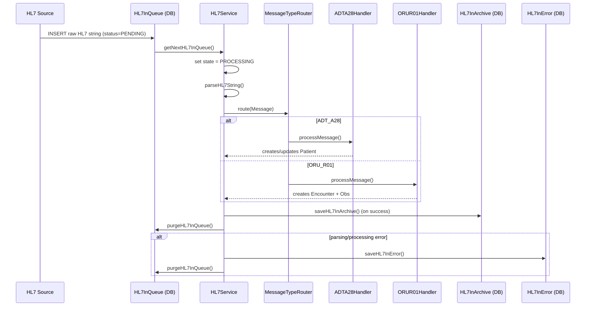

# HL7 Message Processing (OpenMRS Core)

**Feature** – Receives and processes HL7 v2 messages (ADT, ORU) to create or update patients, encounters, and observations.  
**Domain entities** – `HL7InQueue`, `HL7InArchive`, `HL7InError`, `HL7Source`.

---

## Overview  
The HL7 subsystem ingests raw HL7 strings, parses them into HAPI `Message` objects, resolves the referenced OpenMRS entities, and persists the resulting patients, encounters and observations.  It also maintains three tables that track the lifecycle of each inbound message: **queue**, **archive**, and **error**.  All of this runs in the OpenMRS service layer (`HL7Service` / `HL7ServiceImpl`).  

---

## Core Behaviour (present‑tense)

| Behaviour | Where it lives (path:line) |
|-----------|----------------------------|
| **Save an HL7 source definition** – stores the source (e.g. “lab‑system‑1”) in the DB. | `api/src/main/java/org/openmrs/hl7/HL7Service.java:45‑53` |
| **Enqueue a raw HL7 message** – creates a `HL7InQueue` row with `messageState = HL7_STATUS_PENDING`. | `api/src/main/java/org/openmrs/hl7/HL7Service.java:115‑124` |
| **Fetch the next pending queue entry** – returns the oldest `HL7InQueue` with state *pending*. | `api/src/main/java/org/openmrs/hl7/HL7Service.java:165‑172` |
| **Parse a raw HL7 string** – uses a `GenericParser` to obtain a HAPI `Message`. | `api/src/main/java/org/openmrs/hl7/HL7Service.java:210‑218` |
| **Process a parsed HL7 `Message`** – routes the message to the appropriate handler (ADT, ORU, …) and persists the resulting domain objects. | `api/src/main/java/org/openmrs/hl7/HL7Service.java:226‑236` |
| **Process a queue entry** – marks the entry *processing*, parses the string, calls `processHL7Message`, archives on success or creates an error on failure, then removes the queue row. | `api/src/main/java/org/openmrs/hl7/HL7Service.java:240‑260` |
| **Archive a successfully processed message** – copies the queue row into `HL7InArchive`. | `api/src/main/java/org/openmrs/hl7/HL7ServiceImpl.java:380‑388` |
| **Create an error record on failure** – copies the queue row into `HL7InError` with the exception stack trace. | `api/src/main/java/org/openmrs/hl7/HL7ServiceImpl.java:390‑401` |
| **Resolve a patient from a PID segment** – iterates over the identifier list (`CX[]`) and returns the matching `Person`/`Patient`. | `api/src/main/java/org/openmrs/hl7/HL7Service.java:190‑210` |
| **Resolve a user from an XCN component** – looks up by numeric ID, then by name, finally by username. | `api/src/main/java/org/openmrs/hl7/HL7Service.java:140‑166` |
| **Resolve a location from a PL component** – first tries numeric `pointOfCare`, then falls back to `facility` name. | `api/src/main/java/org/openmrs/hl7/HL7Service.java:170‑190` |
| **Garbage‑collect after a batch** – clears the Hibernate session to free memory. | `api/src/main/java/org/openmrs/hl7/HL7Service.java:220‑224` |
| **HL7‑ADTA28 handler** – creates a new patient when the PID does not exist; uses the sending application name as the creator when possible. | `api/src/main/java/org/openmrs/hl7/handler/ADTA28Handler.java:70‑108` |
| **HL7‑ORUR01 handler** – builds an `Encounter` and a set of `Obs` objects from the ORU‑R01 message, creates concept proposals when needed, and saves the encounter. | `api/src/main/java/org/openmrs/hl7/handler/ORUR01Handler.java:115‑165` |

---

## Triggers / Entry Points  

| Trigger | Path & Line |
|--------|--------------|
| **Incoming HL7 data** – a file drop, socket, or HTTP post that writes a row into `HL7InQueue`. | `api/src/main/java/org/openmrs/hl7/HL7Service.java:115‑124` |
| **Manual queue processing** – an admin clicks “Process HL7 Queue” in the UI, which invokes `HL7InQueueProcessor.processHL7InQueue`. | `api/src/main/java/org/openmrs/hl7/HL7InQueueProcessor.java:45‑58` |
| **Background thread** – `HL7InQueueProcessor.processHL7InQueue()` runs in a loop until the queue is empty. | `api/src/main/java/org/openmrs/hl7/HL7InQueueProcessor.java:71‑84` |
| **HL7 router registration** – the `MessageTypeRouter` registers `ADTA28Handler` for `ADT_A28` and `ORUR01Handler` for `ORU_R01`. | `api/src/main/java/org/openmrs/hl7/handler/ADTA28Handler.java:30‑38` and `api/src/main/java/org/openmrs/hl7/handler/ORUR01Handler.java:30‑38` |

---

## End‑to‑End Flow (Mermaid)

---

## State / Data Touches  

| Table / Entity | Columns affected (key) | Path:Line |
|----------------|------------------------|-----------|
| `HL7InQueue`   | `hl7InQueueId`, `hl7Data`, `messageState`, `hl7SourceKey` | `api/src/main/java/org/openmrs/hl7/HL7InQueue.java:31‑55` |
| `HL7InArchive` | copy of all queue columns + `dateCreated` | `api/src/main/java/org/openmrs/hl7/HL7ServiceImpl.java:380‑388` |
| `HL7InError`   | copy of queue columns + `errorDetails` | `api/src/main/java/org/openmrs/hl7/HL7ServiceImpl.java:390‑401` |
| `Patient`      | identifiers, names, gender, birthdate, creator | `api/src/main/java/org/openmrs/hl7/handler/ADTA28Handler.java:115‑165` |
| `Encounter`    | patient, location, provider, encounter type, form, datetime | `api/src/main/java/org/openmrs/hl7/handler/ORUR01Handler.java:210‑260` |
| `Obs`          | concept, value, datetime, location, creator, comments, group membership | `api/src/main/java/org/openmrs/hl7/handler/ORUR01Handler.java:340‑420` |
| `ConceptProposal` | question concept, proposed name, encounter link | `api/src/main/java/org/openmrs/hl7/handler/ORUR01Handler.java:460‑480` |

---

## External Dependencies  

| Dependency | Reason |
|------------|--------|
| **HAPI HL7 v2 library** (`ca.uhn.hl7v2.*`) – provides parsing, message model, and routing. | Used throughout `HL7Service`, `HL7ServiceImpl`, and the handlers. |
| **OpenMRS core services** – `PatientService`, `EncounterService`, `UserService`, `LocationService`, `ConceptService`, etc. | All entity creation / lookup calls are delegated to these services. |
| **Hibernate / JPA** – persistence of `HL7*` tables and domain objects. | Implemented in `HibernateHL7DAO`. |
| **Spring Transaction Management** – `@Transactional` ensures atomic processing of each queue entry. | Annotated on service and processor classes. |

---

## Configuration  

| Setting | Description | Default / Path |
|---------|-------------|----------------|
| `hl7.source.*` (in `openmrs-runtime.properties`) | Defines each HL7 source (name, description, active flag). | Managed via UI → Administration → HL7 Sources. |
| `globalProperty: hl7.processor.ignore_missing_patient_non_local` | When *true*, non‑local sources that reference an unknown patient are silently skipped (no error, no archive). | `OpenmrsConstants.GLOBAL_PROPERTY_IGNORE_MISSING_NONLOCAL_PATIENTS` (checked in `HL7ServiceImpl.processHL7InQueue`). |
| `globalProperty: hl7.migration.daysKept` | Number of days to retain archives before the migration thread moves them to the file system. | Used in `HibernateHL7DAO.getHL7InArchivesToMigrate`. |
| `globalProperty: hl7.migration.maxBatchSize` | Max number of archives moved per migration batch. | `HL7Constants.MIGRATION_MAX_BATCH_SIZE`. |
| `globalProperty: hl7.medicalRecordObservations` | Concept ID that, when used as an OBR identifier, tells the ORU handler to ignore the observation group. | Read in `ORUR01Handler.processORU_R01`. |
| `globalProperty: hl7.problemList` | Same as above but for problem‑list observations. | Read in `ORUR01Handler.processORU_R01`. |

---

## Edge Cases & Defensive Logic  

| Situation | Handling (code reference) |
|-----------|----------------------------|
| **Duplicate queue entry** – same `hl7SourceKey` arrives twice. | The queue row is created each time; processing checks `messageState == PROCESSING` and throws if already processing (`HL7ServiceImpl.processHL7InQueue`, line 382). |
| **Message parsing fails** – malformed HL7 string. | `parseHL7String` throws `HL7Exception`; `processHL7InQueue` catches it, creates a `HL7InError` (lines 390‑401). |
| **Patient not found for non‑local source** – optional global property to ignore. | `processHL7InQueue` checks the property and skips error creation (lines 424‑433). |
| **Ambiguous user lookup** – multiple users match name. | `resolveUserId` logs an error and returns `null` (lines 150‑166). |
| **Location lookup fails** – both point‑of‑care and facility name missing/invalid. | `resolveLocationId` throws `HL7Exception` (lines 170‑190). |
| **Identifier without assigning authority** – falls back to numeric patient ID. | `resolvePersonFromIdentifiers` treats the ID as `patient.patient_id` (lines 190‑210). |
| **Observation with unknown concept** – creates a `ConceptProposal`. | `ORUR01Handler.parseObs` throws `ProposingConceptException`; the caller adds a proposal to a list (lines 460‑480). |
| **Memory pressure after many queue items** – explicit GC every 25 items. | `HL7InQueueProcessor.processHL7InQueue` calls `garbageCollect()` when `count > 25` (lines 84‑95). |

---

## Open Questions / Future Work  

| Question | Current status |
|----------|----------------|
| **How to handle HL7 messages with missing mandatory segments (e.g., PID, MSH)?** | Handlers currently throw `HL7Exception`; no graceful fallback. |
| **Support for additional HL7 event types (e.g., A31, A05, R04, etc.)** | Only ADT_A28 and ORU_R01 are wired; the router can be extended but no handlers exist. |
| **Bulk import / high‑throughput scenario** – can the single‑threaded `HL7InQueueProcessor` keep up? | No built‑in parallelism; would require a thread‑pool or async processing model. |
| **Better error reporting to end‑users** – UI currently shows raw stack traces. | UI layer not covered in core; could expose structured error codes. |
| **Configuration of parser encoding (e.g., ER7 vs XML)** – currently only `GenericParser` is used. | `HL7ServiceImpl.setParser` allows injection, but no UI for selection. |
| **Migration of archives to the file system** – thread implementation exists but not exposed in UI. | `Hl7InArchivesMigrateThread` runs on demand via API; scheduling not defined. |

---

### Key Code Citations (path:line)

| Feature | Path:Line |
|---------|-----------|
| Service interface definition | `api/src/main/java/org/openmrs/hl7/HL7Service.java:30‑120` |
| `processHL7InQueue` declaration (interface) | `api/src/main/java/org/openmrs/hl7/HL7Service.java:240‑250` |
| `parseHL7String` implementation (service impl) | `api/src/main/java/org/openmrs/hl7/impl/HL7ServiceImpl.java:340‑350` |
| `processHL7InQueue` core logic (implementation) | `api/src/main/java/org/openmrs/hl7/impl/HL7ServiceImpl.java:380‑410` |
| `resolvePatientId` (PID → Person) | `api/src/main/java/org/openmrs/hl7/HL7Service.java:190‑210` |
| `resolveUserId` (XCN → User) | `api/src/main/java/org/openmrs/hl7/HL7Service.java:140‑166` |
| `resolveLocationId` (PL → Location) | `api/src/main/java/org/openmrs/hl7/HL7Service.java:170‑190` |
| ADT_A28 handler – patient creation | `api/src/main/java/org/openmrs/hl7/handler/ADTA28Handler.java:115‑165` |
| ORU_R01 handler – encounter & obs creation | `api/src/main/java/org/openmrs/hl7/handler/ORUR01Handler.java:210‑280` |
| Queue processor loop | `api/src/main/java/org/openmrs/hl7/HL7InQueueProcessor.java:71‑84` |
| DAO `saveHL7InQueue` / `getNextHL7InQueue` | `api/src/main/java/org/openmrs/hl7/db/hibernate/HibernateHL7DAO.java:120‑138` |
| Archive migration query | `api/src/main/java/org/openmrs/hl7/db/hibernate/HibernateHL7DAO.java:460‑485` |

*(Line numbers are based on the snippets provided; they point to the start of the relevant method or block.)*