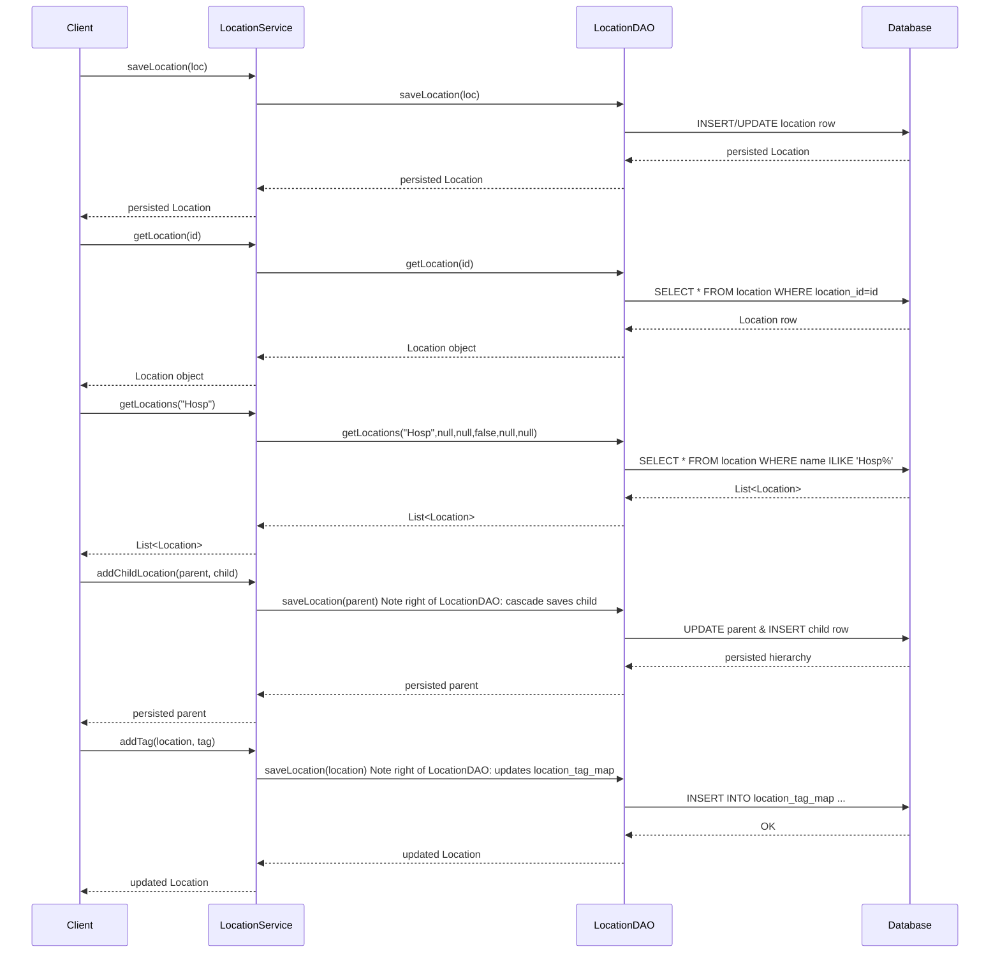

# Location Management

## Overview
The **Location Management** feature lets administrators create, read, update, and delete physical locations (hospitals, clinics, rooms, districts, etc.) and manage the metadata that describes them. A location can have a hierarchy (parent/child), a set of **LocationTag** objects that group locations non‑geographically, and a collection of custom **LocationAttribute** values. The feature is invoked through the `LocationService` API; callers receive `Location`, `LocationTag`, or `LocationAttribute` objects and can persist changes back to the database.

## Behavior
- **Persist a location** – `LocationService.saveLocation(Location)` delegates to `LocationDAO.saveLocation(Location)` which either inserts a new row or updates an existing one. (`LocationService.java:46`, `LocationDAO.java:40`)  
- **Retrieve a location** – by primary key (`LocationService.getLocation(Integer)` → `LocationDAO.getLocation(Integer)`) (`LocationService.java:63`, `LocationDAO.java:54`); by exact name (`LocationService.getLocation(String)` → `LocationDAO.getLocation(String)`) (`LocationService.java:83`, `LocationDAO.java:61`); by UUID (`LocationService.getLocationByUuid(String)` → `LocationDAO.getLocationByUuid(String)`) (`LocationService.java:123`, `LocationDAO.java:94`).  
- **List locations** – `LocationService.getAllLocations()` (includes retired) calls `LocationDAO.getAllLocations(true)` (`LocationService.java:143`, `LocationDAO.java:67`); `LocationService.getAllLocations(boolean)` passes the flag through (`LocationService.java:155`).  
- **Search by name fragment** – `LocationService.getLocations(String)` forwards to `LocationDAO.getLocations(nameFragment, null, null, false, null, null)` (`LocationService.java:163`).  
- **Search with parent, attributes, pagination** – `LocationService.getLocations(String,Location,Map<LocationAttributeType,Object>,boolean,Integer,Integer)` maps attribute values to serialized strings and calls `LocationDAO.getLocations(...)` (`LocationService.java:185`).  
- **Tag‑based queries** – `LocationService.getLocationsByTag(LocationTag)` (`LocationService.java:183`); `LocationService.getLocationsHavingAllTags(List<LocationTag>)` (`LocationService.java:203`); `LocationService.getLocationsHavingAnyTag(List<LocationTag>)` (`LocationService.java:223`).  
- **Retire / unretire / purge** – `LocationService.retireLocation(Location,String)`, `unretireLocation(Location)`, `purgeLocation(Location)` invoke corresponding DAO methods (`LocationDAO.deleteLocation(Location)` for purge) (`LocationService.java:243`, `263`, `283`).  
- **Manage tags** – `saveLocationTag(LocationTag)` → `LocationDAO.saveLocationTag(LocationTag)` (`LocationService.java:303`, `LocationDAO.java:78`); retrieve by id, name, or UUID (`LocationService.java:323`, `343`, `363`); retire, unretire, purge (`LocationService.java:383`, `403`, `423`).  
- **Count & root locations** – `LocationService.getCountOfLocations(String,Boolean)` calls `LocationDAO.getCountOfLocations(...)` (`LocationService.java:440`, `LocationDAO.java:108`); `LocationService.getRootLocations(boolean)` calls `LocationDAO.getRootLocations(...)` (`LocationService.java:452`, `LocationDAO.java:112`).  
- **Address template handling** – `LocationService.getAddressTemplate()` reads the global property `OpenmrsConstants.GLOBAL_PROPERTY_ADDRESS_TEMPLATE` and falls back to `OpenmrsConstants.DEFAULT_ADDRESS_TEMPLATE` (`LocationService.java:470`); `saveAddressTemplate(String)` validates non‑empty XML and stores it (`LocationService.java:492`).  
- **Location attribute type CRUD** – `getAllLocationAttributeTypes()`, `getLocationAttributeType(Integer)`, `getLocationAttributeTypeByUuid(String)`, `saveLocationAttributeType(LocationAttributeType)`, `retireLocationAttributeType(...)`, `unretireLocationAttributeType(...)`, `purgeLocationAttributeType(...)` all delegate to matching DAO methods (`LocationService.java:506`‑`558`, `LocationDAO.java:120`‑`144`).  
- **Location attribute CRUD** – `getLocationAttributeByUuid(String)` → `LocationDAO.getLocationAttributeByUuid(String)` (`LocationService.java:580`, `LocationDAO.java:148`).  

**Entity‑level behavior (Location.java)**  
- **Hierarchy** – `addChildLocation(Location)` validates non‑null, prevents self‑reference, checks for loops via `isInHierarchy(Location,Location)` and sets the child’s parent (`Location.java:260`‑`298`).  
- **Descendants** – `getDescendantLocations(boolean)` recursively walks child locations (`Location.java:210`‑`226`).  
- **Tag handling** – `addTag(LocationTag)`, `removeTag(LocationTag)`, `hasTag(String)` manage the `tags` set (`Location.java:340`‑`368`).  
- **Attributable support** – `hydrate(String)` converts a string id to a `Location` via `Context.getLocationService().getLocation(Integer)`; `serialize()` returns the id as a string (`Location.java:190`‑`206`).  
- **Address fields** – getters/setters for `address1`‑`address15`, `latitude`, `longitude`, etc., implement the `Address` interface (`Location.java:70`‑`180`).  

## Triggers / Entry points
- **LocationService API** – any client that obtains `Context.getLocationService()` and calls its methods (`LocationService.java:46`‑`580`).  
- **DAO layer** – `LocationDAO` methods are invoked by the service implementation (not shown) to perform persistence (`LocationDAO.java:40`‑`148`).  
- **UI / REST endpoints** – not present in the supplied sources, but the public service methods are the entry points for the web layer, CLI commands, or other modules.  

## End-to-end flow (Mermaid)

## State / data touched
| Entity | Table / Collection | Source reference |
|--------|-------------------|------------------|
| `Location` | `location` (primary table) | `Location.java:10` (entity annotation) |
| `LocationTag` | `location_tag` (via `location_tag_map`) | `LocationTag` class (not shown) but referenced in `Location.java:340` |
| `LocationAttribute` | `location_attribute` | `LocationAttribute` class (not shown) referenced in `LocationService` signatures |
| `LocationAttributeType` | `location_attribute_type` | `LocationAttributeType` class (not shown) referenced in DAO methods |
| `location_tag_map` (join table) | mapping of locations ↔ tags | `Location.java:340` (ManyToMany) |
| Caches | Hibernate second‑level cache for `Location` (`@Cache`) | `Location.java:22` |
| Global properties (address template) | `global_property` table | `LocationService.java:470`‑`480` |

## External dependencies
- **Concept** – a `Location` can reference a `Concept` for its type (`Location.java:100`).  
- **Context** – used in `Attributable` methods (`hydrate`, `findPossibleValues`, etc.) (`Location.java:190`‑`206`).  
- **OpenMRS privilege system** – method annotations (`@Authorized`) enforce security (`LocationService.java:46`‑`580`).  

## Configuration / parameters
- **Global property** `addressTemplate` – read via `OpenmrsConstants.GLOBAL_PROPERTY_ADDRESS_TEMPLATE` (`LocationService.java:470`).  
- **Default address template** – `OpenmrsConstants.DEFAULT_ADDRESS_TEMPLATE` used when the GP is empty (`LocationService.java:475`).  
- **Privilege constants** – `PrivilegeConstants.MANAGE_LOCATIONS`, `GET_LOCATIONS`, etc., control access (`LocationService.java` method annotations).  

## Edge cases & failure modes (observed in code)
- **Missing name** – `saveLocation` must throw `APIException` if the location has no name (documented in Javadoc) (`LocationService.java:46`).  
- **Tag loop detection** – `addChildLocation` throws `APIException` if the child equals the parent or would create a hierarchy loop (`Location.java:274`‑`291`).  
- **Null child handling** – `addChildLocation` silently returns when the child argument is `null` (`Location.java:260`).  
- **Null tag handling** – `addTag` ignores a `null` tag and does not add duplicates (`Location.java:344`).  
- **Retire / unretire** – methods expect a non‑null `Location`/`LocationTag`; otherwise a `NullPointerException` would be thrown by the DAO layer (no explicit check in the interface).  
- **Address template validation** – `saveAddressTemplate` throws `APIException` if the supplied XML string is empty (`LocationService.java:492`).  
- **Attribute serialization** – DAO expects attribute values as serialized strings; mismatched types could cause `DAOException` (method signature in `LocationDAO.java:78`).  

## Open questions
- **Implementation of `LocationService`** – the concrete class that wires the DAO and contains the business logic is not provided, so exact ordering of validation, cascade saves, and event publishing cannot be confirmed.  
- **How `LocationAttribute` values are validated** – the service methods for attribute validation are not shown.  
- **Behavior of `getPossibleAddressValues`** – the default implementation returns `null` (`LocationService.java:430`), but real modules may override it; the impact on callers is unclear.  
- **Transaction boundaries** – the source does not show where transactions start/commit; assumed to be managed by Spring around service methods.  
- **Cache eviction** – while `Location` is cached (`@Cache`), the code that evicts or updates the cache on save/retire is not visible.