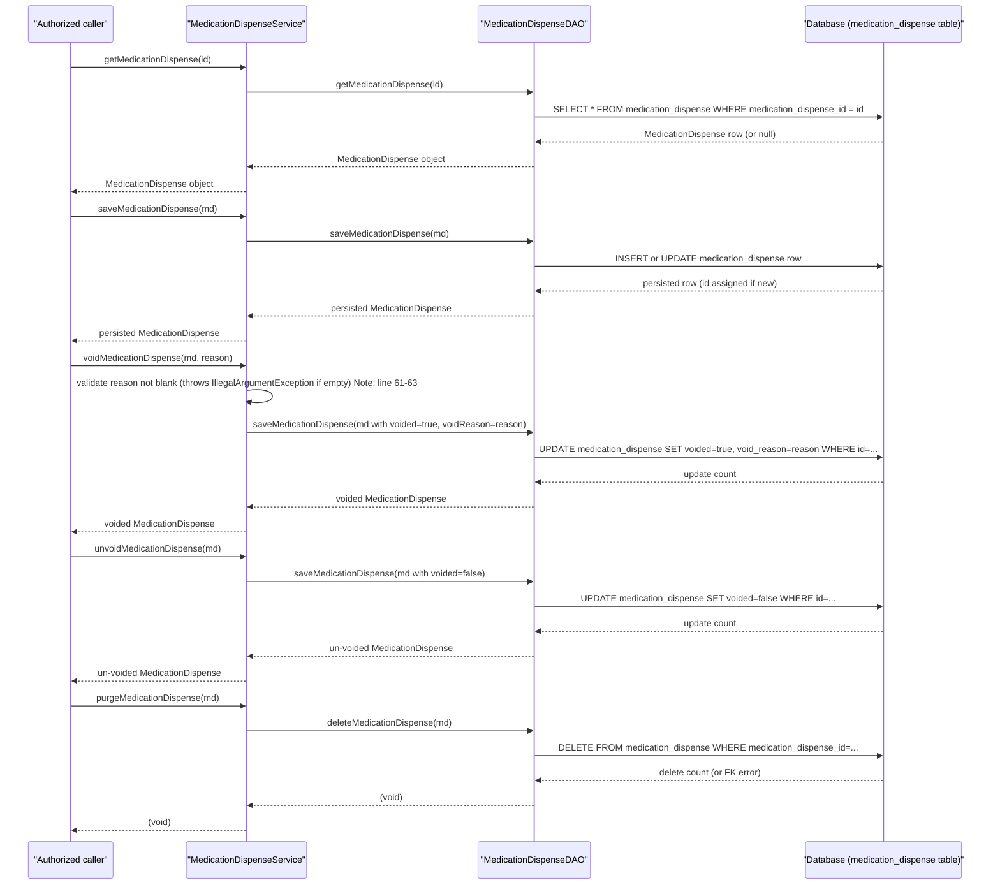

# Medication Dispense Management

## Overview
Medication Dispense Management is the core OpenMRS feature that records, retrieves, updates, voids, un‑voids, and permanently removes **MedicationDispense** objects. A **MedicationDispense** represents the provision of a medication supply to a patient (usually in response to a prescription) and stores details such as patient, encounter, drug, quantity, dates, and status. Authorized users (e.g., clinicians, pharmacists, or system integrations) invoke the service APIs to create or modify dispense records, and the system persists the data in the `medication_dispense` table.

## Behavior
- **Retrieve by ID** – `MedicationDispenseService.getMedicationDispense(Integer)` returns the record with the given primary‑key or `null` if none exists. `api/src/main/java/org/openmrs/api/MedicationDispenseService.java:15`
- **Retrieve by UUID** – `MedicationDispenseService.getMedicationDispenseByUuid(String)` returns the record identified by its UUID. `api/src/main/java/org/openmrs/api/MedicationDispenseService.java:22`
- **Search by criteria** – `MedicationDispenseService.getMedicationDispenseByCriteria(MedicationDispenseCriteria)` builds a dynamic query based on patient, encounter, drug order, and voided flag. `api/src/main/java/org/openmrs/api/MedicationDispenseService.java:30`
- **Save (create or update)** – `MedicationDispenseService.saveMedicationDispense(MedicationDispense)` delegates to the DAO’s `saveOrUpdate`. `api/src/main/java/org/openmrs/api/MedicationDispenseService.java:38` → `api/src/main/java/org/openmrs/api/impl/MedicationDispenseServiceImpl.java:57`
- **Void** – `MedicationDispenseService.voidMedicationDispense(MedicationDispense, String)` validates that a non‑blank reason is supplied, then calls `saveMedicationDispense`. `api/src/main/java/org/openmrs/api/MedicationDispenseService.java:46` → `api/src/main/java/org/openmrs/api/impl/MedicationDispenseServiceImpl.java:61‑68`
- **Un‑void** – `MedicationDispenseService.unvoidMedicationDispense(MedicationDispense)` simply calls `saveMedicationDispense` after the void flag is cleared. `api/src/main/java/org/openmrs/api/MedicationDispenseService.java:54` → `api/src/main/java/org/openmrs/api/impl/MedicationDispenseServiceImpl.java:71‑73`
- **Purge** – `MedicationDispenseService.purgeMedicationDispense(MedicationDispense)` permanently deletes the row via the DAO. `api/src/main/java/org/openmrs/api/MedicationDispenseService.java:62` → `api/src/main/java/org/openmrs/api/impl/MedicationDispenseServiceImpl.java:75‑77`

## Triggers / Entry points
| Service method | Source |
|----------------|--------|
| `getMedicationDispense(Integer)` | `MedicationDispenseService.java:15` |
| `getMedicationDispenseByUuid(String)` | `MedicationDispenseService.java:22` |
| `getMedicationDispenseByCriteria(MedicationDispenseCriteria)` | `MedicationDispenseService.java:30` |
| `saveMedicationDispense(MedicationDispense)` | `MedicationDispenseService.java:38` |
| `voidMedicationDispense(MedicationDispense, String)` | `MedicationDispenseService.java:46` |
| `unvoidMedicationDispense(MedicationDispense)` | `MedicationDispenseService.java:54` |
| `purgeMedicationDispense(MedicationDispense)` | `MedicationDispenseService.java:62` |

All methods are protected by `@Authorized` annotations that map to OpenMRS privilege constants (e.g., `GET_MEDICATION_DISPENSE`, `EDIT_MEDICATION_DISPENSE`, `DELETE_MEDICATION_DISPENSE`). `MedicationDispenseService.java` lines with `@Authorized`.

## End‑to‑end flow (Mermaid)

## State / data touched
- **Table `medication_dispense`** – primary storage for all fields defined in `MedicationDispense.java` (e.g., `medication_dispense_id`, `patient_id`, `encounter_id`, `concept`, `drug_id`, `location_id`, `dispenser`, `drug_order_id`, `status`, `quantity`, `date_prepared`, `date_handed_over`, `voided`, `void_reason`, etc.). `MedicationDispense.java:10‑165`
- **Foreign‑key tables** referenced via many‑to‑one associations:
  - `patient` (`patient_id`) `MedicationDispense.java:35`
  - `encounter` (`encounter_id`) `MedicationDispense.java:41`
  - `concept` (various status, type, reason columns) `MedicationDispense.java:55‑115`
  - `drug` (`drug_id`) `MedicationDispense.java:61`
  - `location` (`location_id`) `MedicationDispense.java:67`
  - `provider` (`dispenser`) `MedicationDispense.java:73`
  - `drug_order` (`drug_order_id`) `MedicationDispense.java:79`
  - `order_frequency` (`frequency`) `MedicationDispense.java:101`
- **Audit fields** (creator, dateCreated, voided, voidReason, etc.) are inherited from `BaseFormRecordableOpenmrsData` and stored in the same table.

## External dependencies
- **Hibernate SessionFactory** – used by `HibernateMedicationDispenseDAO` to obtain the current session and execute CRUD operations. `HibernateMedicationDispenseDAO.java:15‑21`
- **OpenMRS Context & Privilege system** – service methods are annotated with `@Authorized` and rely on the OpenMRS security framework to enforce privileges. `MedicationDispenseService.java` annotations.
- **MedicationDispenseDAO interface** – the service implementation delegates all persistence work to this DAO. `MedicationDispenseServiceImpl.java:41‑44`

No external web services, message queues, or third‑party APIs are invoked by this feature.

## Configuration / parameters
The feature does **not** read any custom global properties or environment variables. Its behavior is driven solely by method arguments, the DAO implementation, and the OpenMRS security configuration (privilege constants). All configuration is standard OpenMRS infrastructure (e.g., datasource, Hibernate settings) defined elsewhere.

## Edge cases & failure modes
| Situation | Handling in code |
|-----------|------------------|
| **Void reason missing or blank** | `voidMedicationDispense` checks `StringUtils.isBlank(reason)` and throws `IllegalArgumentException("voidReason cannot be null or empty")`. `MedicationDispenseServiceImpl.java:61‑63` |
| **Unauthorized caller** | `@Authorized` annotation causes OpenMRS security filter to reject the call with an `APIException` before any method body executes. |
| **Attempt to purge a record that is referenced elsewhere** | DAO `deleteMedicationDispense` calls `session.delete`; if foreign‑key constraints exist, Hibernate will raise a `ConstraintViolationException` which propagates as an `APIException`. No explicit catch in service. |
| **Search criteria include voided records** | If `criteria.isIncludeVoided()` is `false`, the DAO adds `voided = false` predicate; otherwise voided records are returned. `HibernateMedicationDispenseDAO.java:46‑55` |
| **Null ID on get** | DAO `session.get` returns `null`; service returns `null` to caller. No explicit NPE guard needed. |
| **Invalid UUID format** | DAO uses `HibernateUtil.getUniqueEntityByUUID`; if no match, returns `null`. |

## Open questions
- **Business logic for derived fields** – The source does not show any calculation of `quantity`, `dose`, or derived status values; those are expected to be set by callers.
- **Integration with other modules** – How other OpenMRS modules (e.g., pharmacy, reporting) invoke these services or listen for dispense‑related events is not visible in the provided files.
- **Versioning / audit of dispense changes** – The code relies on the base class for audit fields, but there is no explicit versioning or change‑log mechanism shown.