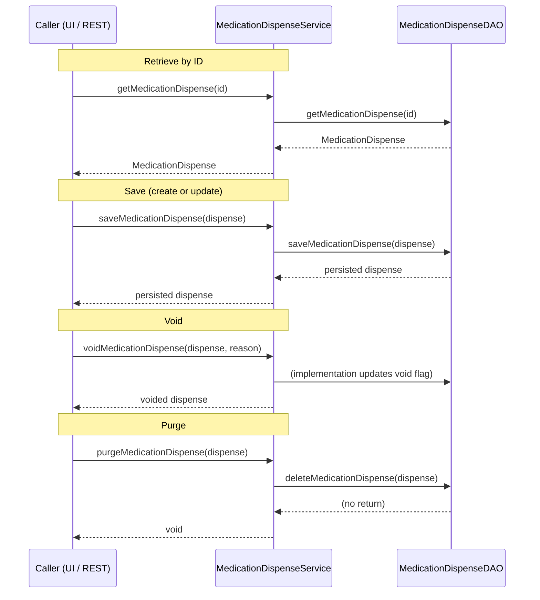

# Medication Dispense

## Overview
The Medication Dispense feature records and manages the dispensing of medications to patients. It is invoked through the `MedicationDispenseService` API, which is typically called by higher‑level services, REST controllers, or UI actions that need to create, retrieve, update, void, un‑void, or permanently delete a dispense record. Each call produces or manipulates a `MedicationDispense` entity that captures the patient, encounter, medication, dosage, location, dispenser, status, and other FHIR‑mapped details.

## Behavior
- **Retrieve by internal ID** – `MedicationDispenseService#getMedicationDispense(Integer)` returns the `MedicationDispense` whose primary key matches the supplied ID. The service method is declared at `./api/src/main/java/org/openmrs/api/MedicationDispenseService.java:30‑31` and delegates to `MedicationDispenseDAO#getMedicationDispense(Integer)` defined at `./api/src/main/java/org/openmrs/api/db/MedicationDispenseDAO.java:28`.  
- **Retrieve by UUID** – `MedicationDispenseService#getMedicationDispenseByUuid(String)` returns the record whose UUID matches the argument. Declared at `MedicationDispenseService.java:39‑40`; DAO counterpart at `MedicationDispenseDAO.java:35`.  
- **Search by criteria** – `MedicationDispenseService#getMedicationDispenseByCriteria(MedicationDispenseCriteria)` returns a list of records that satisfy the supplied criteria object. Declared at `MedicationDispenseService.java:47‑48`; DAO method at `MedicationDispenseDAO.java:42`.  
- **Create / update** – `MedicationDispenseService#saveMedicationDispense(MedicationDispense)` persists a new or modified `MedicationDispense`. Declared at `MedicationDispenseService.java:54‑55`; DAO implementation at `MedicationDispenseDAO.java:48`.  
- **Void** – `MedicationDispenseService#voidMedicationDispense(MedicationDispense, String)` marks a dispense as voided and records a reason. Declared at `MedicationDispenseService.java:62‑63`. (The actual persistence of the void flag is handled in the service implementation, not shown here.)  
- **Un‑void** – `MedicationDispenseService#unvoidMedicationDispense(MedicationDispense)` clears the void flag. Declared at `MedicationDispenseService.java:69‑70`.  
- **Purge** – `MedicationDispenseService#purgeMedicationDispense(MedicationDispense)` permanently removes the record from the database. Declared at `MedicationDispenseService.java:79‑80`; DAO delete method at `MedicationDispenseDAO.java:54`.  

All service methods are protected by `@Authorized` annotations that enforce the required privileges (e.g., `GET_MEDICATION_DISPENSE`, `EDIT_MEDICATION_DISPENSE`, `DELETE_MEDICATION_DISPENSE`) as seen on the same lines.

## Triggers / Entry points
- The public API surface is the `MedicationDispenseService` interface located at `./api/src/main/java/org/openmrs/api/MedicationDispenseService.java:23‑81`. Any component that obtains an implementation of this service (e.g., REST controllers, other services, or UI actions) can invoke the methods listed above.

## End-to-end flow (Mermaid)

## State / data touched
- **Table `medication_dispense`** – defined by the entity annotation `@Table(name = "medication_dispense")` at `./api/src/main/java/org/openmrs/MedicationDispense.java:32`.  
- **Primary key column** – `medication_dispense_id` (`@Id @GeneratedValue`) at line `./api/src/main/java/org/openmrs/MedicationDispense.java:37‑40`.  
- **Foreign‑key columns** (patient, encounter, concept, drug, location, dispenser, drug_order, status, status_reason, type, quantity_units, dose_units, route, frequency, substitution_type, substitution_reason) are mapped via `@JoinColumn` annotations throughout the entity (e.g., patient_id at line 47, encounter_id at line 55, concept at line 63, etc.).  
- **Value columns** – quantity, dose, as_needed, dosing_instructions, date_prepared, date_handed_over, was_substituted are mapped with `@Column` annotations (e.g., quantity at line 138, dose at line 153, as_needed at line 187, etc.).  

All CRUD operations read from or write to these columns via the DAO methods.

## External dependencies
- **Domain entities** – `Patient`, `Encounter`, `Concept`, `Drug`, `Location`, `Provider`, `DrugOrder`, `OrderFrequency` (imported implicitly through field types). These are internal OpenMRS classes, not external third‑party services.  
- **Authorization framework** – `@Authorized` annotation and `PrivilegeConstants` (lines 30, 39, 47, 54, 62, 69,