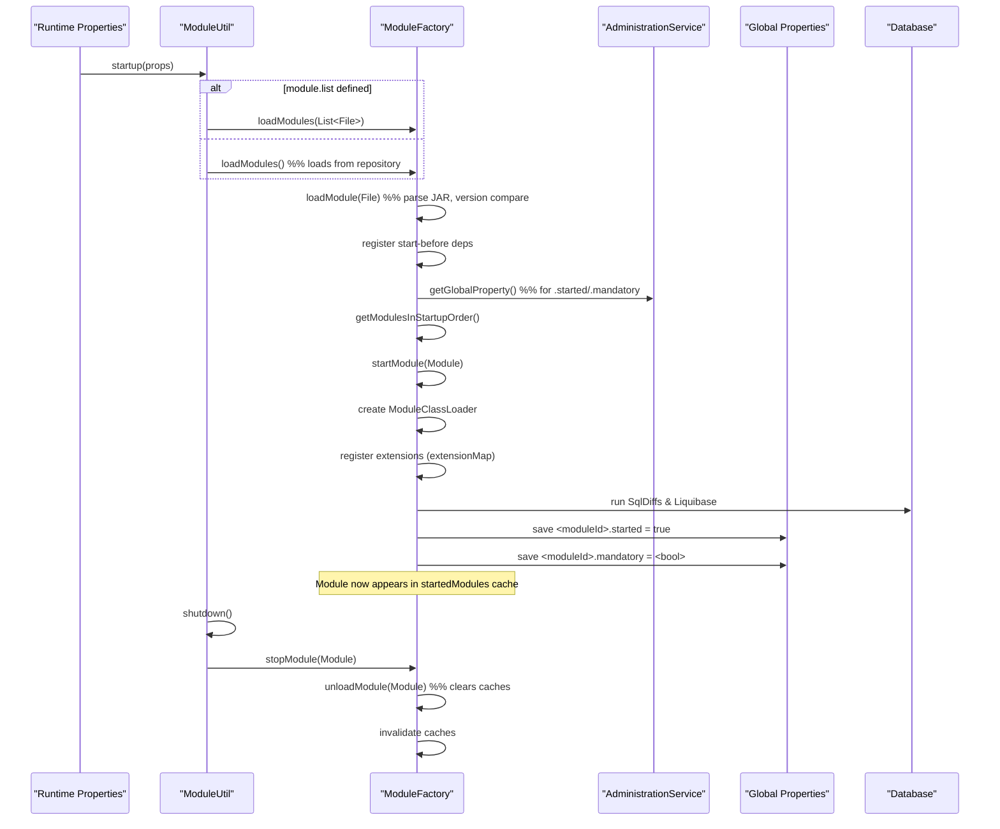

# Module System

## Overview
The Module System in OpenMRS dynamically loads, starts, stops, and manages OpenMRS modules (plugins) at runtime. It treats each module as a `Module` object, stores loaded and started modules in caches, resolves dependencies, and integrates module extensions into the core application context.

## Behavior (cite path:line)

| Action | Description | Source |
|--------|-------------|--------|
| **Load a module file** | `loadModule(File moduleFile, Boolean replaceIfExists)` parses a JAR file into a `Module` object and adds it to the loaded‑module cache. | `api/src/main/java/org/openmrs/module/ModuleFactory.java:71‑84` |
| **Replace an existing module** | If a module with the same `moduleId` is already loaded, `loadModule(Module, Boolean)` compares versions (`ModuleUtil.compareVersion`). A newer version replaces the old one; an equal version replaces only when `replaceIfExists` is true; an older version is ignored. | `api/src/main/java/org/openmrs/module/ModuleFactory.java:92‑115` |
| **Load all modules from repository** | `loadModules()` discovers the module repository (`ModuleUtil.getModuleRepository()`), iterates over files, and calls `loadModule(File, true)` for each JAR. | `api/src/main/java/org/openmrs/module/ModuleFactory.java:124‑138` |
| **Register “start‑before” relationships** | After loading, `loadModules(List<File>)` adds required‑module entries for any module that declares `startBeforeModules`. | `api/src/main/java/org/openmrs/module/ModuleFactory.java:150‑166` |
| **Determine modules that should start** | `getModulesThatShouldStart()` reads global properties `<moduleId>.started` and `<moduleId>.mandatory` (or the module’s `isMandatory()` flag) to decide which loaded modules are eligible for startup. | `api/src/main/java/org/openmrs/module/ModuleFactory.java:184‑207` |
| **Sort modules by dependencies** | `getModulesInStartupOrder(Collection<Module>)` builds a `Graph<Module>` of required and “aware‑of” dependencies and performs a topological sort. A `CycleException` is thrown for cyclic dependencies. | `api/src/main/java/org/openmrs/module/ModuleFactory.java:209‑250` |
| **Start a module** | `startModule(Module)` (or the overloaded version) checks required modules, loads the module’s classloader, registers extensions, runs SQL diffs and Liquibase scripts, marks the module as started, and persists startup state in global properties. | `api/src/main/java/org/openmrs/module/ModuleFactory.java:262‑332` |
| **Stop a module** | `ModuleUtil.shutdown()` iterates over `ModuleFactory.getStartedModules()`, calling `ModuleFactory.stopModule(mod, true, true)` for each. After stopping, static caches are cleared. | `api/src/main/java/org/openmrs/module/ModuleUtil.java:536‑553` |
| **Unload a module** | `unloadModule(Module)` (called internally from `loadModule`) removes the module from the loaded‑module cache, invalidates its classloader, and clears provided packages. | `api/src/main/java/org/openmrs/module/ModuleFactory.java:115‑124` (implicit via `unloadModule` call) |
| **Version checking** | `ModuleUtil.checkRequiredVersion(String, String)` validates that the running OpenMRS version satisfies a module’s `requireOpenmrsVersion` range, using `matchRequiredVersions`. | `api/src/main/java/org/openmrs/module/ModuleUtil.java:311‑327` |
| **Repository location** | `ModuleUtil.getModuleRepository()` resolves the repository folder from the runtime property `moduleRepository.folder` or the global property `moduleRepository.folder`, falling back to a default under the application data directory. | `api/src/main/java/org/openmrs/module/ModuleUtil.java:235‑259` |

## Triggers / Entry points
| Trigger | Entry point | Description |
|---------|-------------|-------------|
| **System startup** | `ModuleUtil.startup(Properties)` | Reads `module.list` runtime property (or loads all modules), calls `ModuleFactory.loadModules()` then `ModuleFactory.startModules()`, and finally verifies mandatory modules. | `api/src/main/java/org/openmrs/module/ModuleUtil.java:55‑84` |
| **Explicit load request** | `ModuleFactory.loadModule(File)` | API call to load a single JAR file at runtime. | `api/src/main/java/org/openmrs/module/ModuleFactory.java:61‑71` |
| **Explicit start request** | `ModuleFactory.startModule(Module)` | Direct request to start a specific module (used by the daemon thread). | `api/src/main/java/org/openmrs/module/ModuleFactory.java:262‑270` |
| **System shutdown** | `ModuleUtil.shutdown()` | Stops all started modules and clears caches. | `api/src/main/java/org/openmrs/module/ModuleUtil.java:536‑553` |
| **Insert module via stream** | `ModuleUtil.insertModuleFile(InputStream, String)` | Persists an uploaded module JAR into the repository folder. | `api/src/main/java/org/openmrs/module/ModuleUtil.java:140‑166` |

## End‑to‑end flow (Mermaid)

## State / data touched
| Data | Description | Source |
|------|-------------|--------|
| `Module` objects | In‑memory representation of each loaded module (id, version, dependencies, extensions, etc.). | `api/src/main/java/org/openmrs/module/Module.java` |
| `ModuleFactory.loadedModules` | Guava cache (`Cache<String, Module>`) keyed by `moduleId` holding all loaded modules. | `api/src/main/java/org/openmrs/module/ModuleFactory.java:45` |
| `ModuleFactory.startedModules` | Guava cache (`Cache<String, Module>`) keyed by `moduleId` holding successfully started modules. | `api/src/main/java/org/openmrs/module/ModuleFactory.java:52` |
| `ModuleFactory.extensionMap` | `Map<String, List<Extension>>` mapping extension point IDs to the list of extensions contributed by loaded modules. | `api/src/main/java/org/openmrs/module/ModuleFactory.java:57` |
| `ModuleFactory.moduleClassLoaders` | Cache of `ModuleClassLoader` instances per module, enabling isolation of module classes. | `api/src/main/java/org/openmrs/module/ModuleFactory.java:64` |
| Global properties | `<moduleId>.started`, `<moduleId>.mandatory`, and other module‑specific GP entries stored via `AdministrationService`. | `api/src/main/java/org/openmrs/module/ModuleFactory.java:284‑298` |
| Database schema changes | SQL diffs (`SqlDiffFileParser.getSqlDiffs`) and Liquibase changelog (`liquibase.xml`) applied per module. | `api/src/main/java/org/openmrs/module/ModuleFactory.java:306‑327` |
| `providedPackages` map | Tracks which packages a module’s classloader provides, used for classloader delegation. | `api/src/main/java/org/openmrs/module/ModuleFactory.java:68` |

## External dependencies
| Component | Role |
|-----------|------|
| `AdministrationService` | Reads and writes global properties that control module loading/startup. |
| `Context` (OpenMRS context) | Provides access to services, runtime properties, and proxy privileges for privileged actions (e.g., DB updates). |
| `OpenmrsClassLoader` / `ModuleClassLoader` | Custom classloader that isolates module classes and resolves provided packages. |
| `SqlDiffFileParser` & `Liquibase` | Execute module‑specific database migrations. |
| `Graph<Module>` (utility) | Performs topological sorting of module dependencies. |
| `Cache` (Guava) | Stores loaded and started modules with soft/weak references. |
| `AlertService` | Notifies super users when a module fails to start or when cyclic dependencies are detected. |

## Configuration / parameters
| Parameter | Source | Meaning |
|-----------|--------|---------|
| `module.list` (runtime property `module.list`) | `ModuleUtil.startup` reads `ModuleConstants.RUNTIMEPROPERTY_MODULE_LIST_TO_LOAD` | Comma‑ or space‑separated list of absolute paths (or classpath resources) to modules to load; if absent, all modules in the repository are loaded. |
| `moduleRepository.folder` (runtime property `moduleRepository.folder`) | `ModuleUtil.getModuleRepository` | Directory path where module JARs are stored. Falls back to the global property `moduleRepository.folder` and then to `<appData>/modules`. |
| `<moduleId>.started` (global property) | `ModuleFactory.getModulesThatShouldStart` | If `"true"` (or missing) the module is eligible for startup. |
| `<moduleId>.mandatory` (global property) | `ModuleFactory.getModulesThatShouldStart` | Forces a module to start regardless of the `.started` flag. |
| `module.startupOrder` (internal) | `ModuleFactory.actualStartupOrder` | Ordered set of module IDs reflecting the actual startup sequence after dependency resolution. |

## Edge cases & failure modes
| Situation | Handling |
|-----------|----------|
| **Cyclic dependencies** | `getModulesInStartupOrder` throws `CycleException`; the system logs the error, notifies super users (`notifySuperUsersAboutCyclicDependencies`), and proceeds with the partially ordered list returned in the exception. | `api/src/main/java/org/openmrs/module/ModuleFactory.java:215‑227` |
| **Version conflict** | When loading a module, `compareVersion` determines newer vs. older versions. Older versions are ignored; equal versions cause an exception unless `replaceIfExists` is true. | `api/src/main/java/org/openmrs/module/ModuleFactory.java:92‑115` |
| **Missing required module** | `requiredModulesStarted` returns false; the startup routine logs an error, sets `startupErrorMessage` on the module, and notifies super users. | `api/src/main/java/org/openmrs/module/ModuleFactory.java:202‑215` |
| **SQL/Liquibase failure** | Errors during `runDiff` or `runLiquibase` are caught, logged, and cause the module to be marked as failed (startup error message). | `api/src/main/java/org/openmrs/module/ModuleFactory.java:306‑327` |
| **Invalid repository path** | `getModuleRepository` creates the directory if missing; if the path exists but is not a directory, a `ModuleException` is thrown. | `api/src/main/java/org/openmrs/module/ModuleUtil.java:235‑259` |
| **File not found or unreadable** | `loadModules(List<File>)` skips non‑existent files, logs an error, and continues processing remaining files. | `api/src/main/java/org/openmrs/module/ModuleFactory.java:150‑166` |
| **Extension point conflicts** | Extensions are added to `extensionMap` in the order modules are started; duplicate IDs are allowed but order is preserved by the `order` attribute of each `Extension`. | `api/src/main/java/org/openmrs/module/ModuleFactory.java:274‑298` |

## Open questions
* How are **optional “aware‑of” dependencies** resolved when the referenced module is not present? (The current code adds an edge only if the module exists.)  
* What is the exact lifecycle of a **module’s Spring application context** when `startModule` is called with a non‑null `AbstractRefreshableApplicationContext`?  
* How does the system behave when a **module’s classloader** fails to load a class that is referenced by another module’s extension?  
* Are there any **performance considerations** for the soft/weak caches (`loadedModules`, `startedModules`, `moduleClassLoaders`) under heavy module turnover?  

*These questions arise from the current implementation but are not answered directly in the source files provided.*