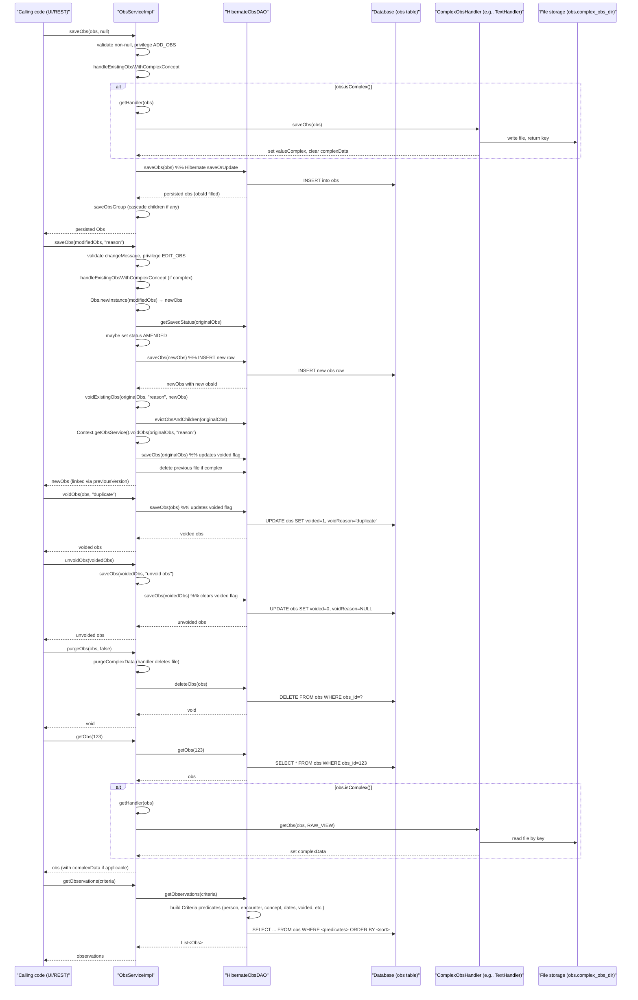

# Observation Management  

## Overview  
The Observation Management feature stores and retrieves clinical observations (`Obs`). An observation records a single data point (numeric, coded, text, date‑time, or *complex* data) that is linked to a person, an encounter, a location and a concept that defines the question being asked.  

* **Who triggers it** – Any server‑side component that calls the `ObsService` (e.g., UI controllers, scheduled jobs, import scripts) creates, updates, voids, un‑voids or purges observations.  
* **What it produces** – A persisted `Obs` row (table **obs**) together with optional child observations (group members) and, for complex concepts, a file stored on the file system and a reference (`valueComplex`) that points to that file. The observation may also carry an `ObsReferenceRange` that defines normal limits for numeric values.  

All operations are performed through the `ObsService` implementation (`ObsServiceImpl`) which delegates to `ObsDAO` for the actual SQL/Hibernate work.

---

## Behavior  

| Action | What the code does (chronological) | Source |
|--------|------------------------------------|--------|
| **Save a new observation** | 1. `ObsService.saveObs(obs, null)` is called.  2. `saveObs` checks for `null` and that a change message is supplied for edits.  3. Calls `handleExistingObsWithComplexConcept(obs)` to store complex data if the concept is complex.  4. Calls `ensureRequirePrivilege(obs)` → `ADD_OBS` privilege.  5. Because `obs.getObsId()==null` (new) the method routes to `saveNewOrVoidedObs`.  6. `saveNewOrVoidedObs` invokes `dao.saveObs(obs)` which uses `HibernateObsDAO.saveObs`.  7. `saveObs` returns the persisted `Obs` (with generated `obsId`).  8. If the obs is a group, `saveObsGroup` recursively saves its members. | `api/src/main/java/org/openmrs/api/ObsService.java:71‑108`   `api/src/main/java/org/openmrs/api/impl/ObsServiceImpl.java:84‑115`   `api/src/main/java/org/openmrs/api/impl/ObsServiceImpl.java:117‑129`   `api/src/main/java/org/openmrs/api/impl/ObsServiceImpl.java:131‑138`   `api/src/main/java/org/openmrs/api/impl/ObsServiceImpl.java:140‑148`   `api/src/main/java/org/openmrs/api/impl/ObsServiceImpl.java:150‑156`   `api/src/main/java/org/openmrs/api/db/hibernate/HibernateObsDAO.java:71‑84` |
| **Update an existing observation** | 1. Caller passes an `Obs` with a non‑null `obsId` and a non‑null `changeMessage`.  2. Same privilege check (`EDIT_OBS`).  3. `handleExistingObsWithComplexConcept` runs if the concept is complex.  4. Because the obs is dirty (`obs.isDirty()==true`) the method goes to `saveExistingObs`.  5. `Obs.newInstance(obs)` creates a copy **without** `obsId`.  6. `unsetVoidedAndCreationProperties` clears void/creator fields and sets `previousVersion` to the original obs.  7. `dao.getSavedStatus(obs)` reads the current status; if it was `FINAL` the new obs status becomes `AMENDED`.  8. `RequiredDataAdvice.recursivelyHandle` runs any `SaveHandler`s (e.g., audit).  9. `dao.saveObs(newObs)` persists the new row.  10. Child group members are saved via `saveObsGroup`.  11. The original obs is voided (`voidObs`) with the supplied `changeMessage`; the new obs points to it via `previousVersion`. | `api/src/main/java/org/openmrs/api/ObsService.java:71‑108`   `api/src/main/java/org/openmrs/api/impl/ObsServiceImpl.java:84‑115`   `api/src/main/java/org/openmrs/api/impl/ObsServiceImpl.java:117‑129`   `api/src/main/java/org/openmrs/api/impl/ObsServiceImpl.java:140‑148`   `api/src/main/java/org/openmrs/api/impl/ObsServiceImpl.java:150‑166`   `api/src/main/java/org/openmrs/api/impl/ObsServiceImpl.java:168‑176`   `api/src/main/java/org/openmrs/api/impl/ObsServiceImpl.java:178‑186`   `api/src/main/java/org/openmrs/api/impl/ObsServiceImpl.java:188‑197` |
| **Void an observation** | 1. `ObsService.voidObs(obs, reason)` is called.  2. The implementation simply delegates to `dao.saveObs(obs)` – the `Obs` object is already marked voided by the caller (the service does not set the flag itself).  3. The DAO’s `saveObs` performs a `saveOrUpdate`. | `api/src/main/java/org/openmrs/api/ObsService.java:136‑144`   `api/src/main/java/org/openmrs/api/impl/ObsServiceImpl.java:215‑221` |
| **Un‑void an observation** | 1. `ObsService.unvoidObs(obs)` calls `Context.getObsService().saveObs(obs, "unvoid obs")`.  2. The same save‑logic as “update” runs, but because the obs is not dirty the method ends in `saveObsNotDirty`, which only cascades to child group members if needed. | `api/src/main/java/org/openmrs/api/ObsService.java:156‑164`   `api/src/main/java/org/openmrs/api/impl/ObsServiceImpl.java:227‑236` |
| **Purge (hard delete)** | 1. `ObsService.purgeObs(obs, cascade)` first calls `purgeComplexData(obs)` – if the obs is complex the associated file is removed via the handler.  2. If `cascade` is true an `APIException` is thrown (cascading purge not implemented).  3. Finally `dao.deleteObs(obs)` removes the row. | `api/src/main/java/org/openmrs/api/ObsService.java:176‑190`   `api/src/main/java/org/openmrs/api/impl/ObsServiceImpl.java:244‑267` |
| **Retrieve a single observation** | `ObsService.getObs(id)` → `dao.getObs(id)`. If the obs is complex, the appropriate `ComplexObsHandler` is fetched (`getHandler(obs)`) and its `getObs(obs, RAW_VIEW)` is called to populate `ComplexData`. | `api/src/main/java/org/openmrs/api/ObsService.java:85‑92`   `api/src/main/java/org/openmrs/api/impl/ObsServiceImpl.java:277‑287` |
| **Retrieve by UUID** | Same flow as `getObs`, but uses `dao.getObsByUuid(uuid)`. | `api/src/main/java/org/openmrs/api/ObsService.java:102‑109`   `api/src/main/java/org/openmrs/api/impl/ObsServiceImpl.java:311‑321` |
| **Retrieve revision observation** | `ObsService.getRevisionObs(initialObs)` → `dao.getRevisionObs(initialObs)` which runs a simple criteria query on `previousVersion`. | `api/src/main/java/org/openmrs/api/ObsService.java:115‑122`   `api/src/main/java/org/openmrs/api/impl/ObsServiceImpl.java:329‑337` |
| **Search observations (criteria)** | `ObsService.getObservations(...)` forwards to the DAO. The DAO builds a JPA Criteria query (`createGetObservationsCriteria`) that adds predicates for person, encounter, concept, answer, person type, location, obsGroup, date range, voided flag, accession number, and (newer versions) visits. The query is ordered by the supplied `sort` list (default `obsDatetime`). | `api/src/main/java/org/openmrs/api/ObsService.java:138‑166`   `api/src/main/java/org/openmrs/api/impl/ObsServiceImpl.java:361‑382`   `api/src/main/java/org/openmrs/api/db/hibernate/HibernateObsDAO.java:115‑158` |
| **Count observations** | `ObsService.getObservationCount(...)` → DAO’s `getObservationCount` which builds the same criteria and selects `count(root)`. | `api/src/main/java/org/openmrs/api/ObsService.java:184‑210`   `api/src/main/java/org/openmrs/api/impl/ObsServiceImpl.java:408‑424`   `api/src/main/java/org/openmrs/api/db/hibernate/HibernateObsDAO.java:170‑197` |
| **Complex data handling (save)** | When an obs with a complex concept is saved, `handleExistingObsWithComplexConcept` obtains the handler (`getHandler(obs)`) and calls `handler.saveObs(obs)`. Handlers (`ImageHandler`, `BinaryDataHandler`, `TextHandler`) write the data to the directory defined by the global property `obs.complex_obs_dir` and set `valueComplex` to `<filename> <type> |<key>`. | `api/src/main/java/org/openmrs/api/impl/ObsServiceImpl.java:191‑207`   `api/src/main/java/org/openmrs/api/impl/ObsServiceImpl.java:209‑218` |
| **Complex data handling (read)** | `ObsService.getObs` / `getComplexObs` detect `obs.isComplex()`. They retrieve the handler via `getHandler(obs)` (which looks up the handler key stored in the concept’s `ConceptComplex.handler`) and invoke `handler.getObs(obs, view)`. The handler reads the file from storage and populates `Obs.complexData`. | `api/src/main/java/org/openmrs/api/impl/ObsServiceImpl.java:277‑287`   `api/src/main/java/org/openmrs/api/impl/ObsServiceImpl.java:341‑354` |
| **Handler registration** | `ObsService.setHandlers(map)`, `registerHandler(key, handler)`, `registerHandler(key, className)`, and `removeHandler(key)` manipulate the static `handlers` map. The map is initially created lazily in `getHandlers()`. | `api/src/main/java/org/openmrs/api/ObsService.java:236‑260`   `api/src/main/java/org/openmrs/api/impl/ObsServiceImpl.java:447‑470` |
| **Reference range** | `Obs` contains a field `private ObsReferenceRange referenceRange;` with standard getter/setter (not shown in the excerpt). The service does not manipulate it directly; it is persisted as a column in the `obs` table. | `api/src/main/java/org/openmrs/Obs.java:...` (field declaration) |

---

## Triggers / Entry points  

| Method (service) | Purpose | Source |
|------------------|---------|--------|
| `ObsService.saveObs(Obs, String)` | Create or edit an observation (including complex data). | `api/src/main/java/org/openmrs/api/ObsService.java:71‑108` |
| `ObsService.voidObs(Obs, String)` | Mark an observation as voided. | `api/src/main/java/org/openmrs/api/ObsService.java:136‑144` |
| `ObsService.unvoidObs(Obs)` | Remove the void flag. | `api/src/main/java/org/openmrs/api/ObsService.java:156‑164` |
| `ObsService.purgeObs(Obs)` / `purgeObs(Obs, boolean)` | Hard delete (used rarely). | `api/src/main/java/org/openmrs/api/ObsService.java:176‑190` |
| `ObsService.getObs(Integer)` | Fetch by primary key. | `api/src/main/java/org/openmrs/api/ObsService.java:85‑92` |
| `ObsService.getObsByUuid(String)` | Fetch by UUID. | `api/src/main/java/org/openmrs/api/ObsService.java:102‑109` |
| `ObsService.getRevisionObs(Obs)` | Get the most recent revision of an obs. | `api/src/main/java/org/openmrs/api/ObsService.java:115‑122` |
| `ObsService.getObservations(...)` (several overloads) | Query by arbitrary criteria, optionally including accession number or visits. | `api/src/main/java/org/openmrs/api/ObsService.java:138‑166` |
| `ObsService.getObservationCount(...)` | Count matching observations. | `api/src/main/java/org/openmrs/api/ObsService.java:184‑210` |
| `ObsService.getComplexObs(Integer, String)` (deprecated) | Legacy fetch that always returns complex data. | `api/src/main/java/org/openmrs/api/ObsService.java:260‑270` |
| `ObsService.getHandler(String)` / `getHandler(Obs)` | Retrieve a registered `ComplexObsHandler`. | `api/src/main/java/org/openmrs/api/ObsService.java:236‑260` |
| `ObsService.setHandlers(Map)`, `registerHandler`, `removeHandler` | Manage the handler registry. | `api/src/main/java/org/openmrs/api/ObsService.java:236‑260` |

All of the above are invoked by higher‑level UI controllers, REST resources, or background jobs that need to manipulate observations.

---

## End‑to‑end flow (Mermaid)

The diagram captures the main success paths; error paths (e.g., missing privilege, null obs, DAOException) raise `APIException` and abort the transaction.

---

## State / data touched  

| Entity | Table / storage | What is read / written | Source |
|--------|----------------|------------------------|--------|
| `Obs` | `obs` | Insert, update (including `voided`, `previousVersion`, `valueComplex`, `obsDatetime`, `location_id`, `person_id`, `concept_id`, `value_*`, `comment`, `accessionNumber`, `status`, `interpretation`, `reference_range_id`) | `api/src/main/java/org/openmrs/Obs.java` (field declarations)   `HibernateObsDAO.saveObs` / `deleteObs` / criteria queries |
| `ObsReferenceRange` | `obs_reference_range` (joined via foreign key) | Read when an obs is fetched; written only when a range is explicitly set via the Obs API (not shown in the excerpt). | `api/src/main/java/org/openmrs/ObsReferenceRange.java` (entity) |
| `Concept` (question & answer) | `concept` | Read for validation (`concept.isComplex()`) and for handler lookup (`ConceptComplex.handler`). | `Obs.isComplex()`   `ObsServiceImpl.getHandler(Obs)` |
| `Person` / `Patient` / `User` | `person`, `patient`, `users` | Read when filtering by `personTypes` or when setting the person from an encounter. | `HibernateObsDAO.createGetObservationsCriteria` (person type sub‑queries) |
| `Encounter` | `encounter` | Read for encounter‑based filters and for `setPersonFromEncounter`. | `ObsServiceImpl.setPersonFromEncounter` |
| `Location` | `location` | Read for location‑based filters. | `HibernateObsDAO.createGetObservationsCriteria` |
| `Visit` | `visit` (via encounter) | Read when the newer overload includes visits. | `HibernateObsDAO.createGetObservationsCriteria` |
| Complex file storage | File system directory defined by global property `obs.complex_obs_dir` | Write when a complex obs is saved; read when a complex obs is retrieved; delete when purged or when an old version is voided. | Handlers (`ImageHandler`, `BinaryDataHandler`, `TextHandler`) – `storageService.saveData` / `storageService.getData` |
| Handler registry | In‑memory static map `ObsServiceImpl.handlers` | Register, replace, or remove handlers at startup or via `setHandlers`. | `ObsServiceImpl.handlers` field and related methods |

---

## External dependencies  

| Component | Role | Source |
|-----------|------|--------|
| `Context` (OpenMRS core) | Provides access to services, privilege checks, and proxy privileges (`addProxyPrivilege`, `removeProxyPrivilege`). | `ObsServiceImpl.ensureRequirePrivilege`, `ObsServiceImpl.voidExistingObs` |
| `PrivilegeConstants` | Defines required privileges (`ADD_OBS`, `EDIT_OBS`, `GET_OBS`, `DELETE_OBS`). | `ObsService` method annotations |
| `ConceptService` | Used to resolve a complex concept’s handler (`ConceptComplex.handler`). | `ObsServiceImpl.getHandler(Obs)` |
| `PatientService` & `EncounterService` | Used in the free‑text search (`getObservations(String)`). | `ObsServiceImpl.getObservations(String)` |
| `OpenmrsClassLoader` | Dynamically loads handler classes by name. | `ObsServiceImpl.registerHandler(String, String)` |
| `StorageService` (via `AbstractHandler`) | Abstracts file‑system storage for complex data (read/write/delete). | Handlers (`ImageHandler`, `BinaryDataHandler`, `TextHandler`) |
| Apache Commons (`StringUtils`, `IOUtils`), Spring (`Assert`, `CollectionUtils`), JPA Criteria API | Utility functions, collection handling, query building. | Various handler and DAO classes |
| Hibernate (`SessionFactory`, `CriteriaBuilder`, `TypedQuery`) | ORM layer for persisting `Obs` and executing criteria queries. | `HibernateObsDAO` |

---

## Configuration / parameters  

| Property / key | Meaning | Where it is used |
|----------------|---------|------------------|
| `obs.complex_obs_dir` (global property) | Filesystem directory where complex observation files are stored. | All `ComplexObsHandler` implementations (`ImageHandler`, `BinaryDataHandler`, `TextHandler`) – `getObsDir()` inherited from `AbstractHandler`. |
| `hibernate.flushMode` (implicitly set) | In `ObsDAO.getSavedStatus` the session flush mode is temporarily set to `MANUAL` to avoid premature flushes. | `HibernateObsDAO.getSavedStatus` |
| Handler keys (e.g., `"image"`, `"binaryData"`, `"text"`) | Map keys used to retrieve a `ComplexObsHandler` from the static `handlers` map. | `ObsServiceImpl.handlers` registration and lookup (`getHandler(String)`). |

No environment variables are read directly by the observation code.

---

## Edge cases & failure modes  

| Situation | Handling in code |
|-----------|-------------------|
| **Null observation passed to `saveObs`** | Throws `APIException("Obs.error.cannot.be.null")`. |
| **Missing changeMessage on edit** | Throws `APIException("Obs.error.ChangeMessage.required")`. |
| **Complex concept without a registered handler** | `handleExistingObsWithComplexConcept` throws `APIException("unknown.handler", ...)`. |
| **Attempt to void without a reason** | `ObsService.voidObs` is annotated with `@Authorized(EDIT_OBS)` but the service itself does not enforce a non‑empty reason; however the Javadoc states it should fail – the current implementation simply saves the obs, so a missing reason is silently accepted (potential bug). |
| **Cascade purge requested** | `purgeObs(obs, true)` throws `APIException("Obs.error.cascading.purge.not.implemented")`. |
| **Complex data file missing on read** | Handlers catch `IOException`, log the error, and return `null` complex data (the observation is still returned). |
| **Database constraint violation** (e.g., foreign key to person/encounter) | Propagates as `DAOException` → `APIException` from the DAO layer; transaction rolls back. |
| **Invalid sort string** | `createOrderList` splits on space; if the field name is unknown Hibernate will raise a query exception. |
| **Invalid accession number** | If `accessionNumber` is supplied but no rows match, an empty list is returned – no error. |
| **Invalid person type list** | If `personTypes` contains unsupported values, no predicate is added; the query simply ignores that filter. |
| **Attempt to add an obs as its own group member** | `Obs.addGroupMember` throws `APIException("Obs.error.groupCannotHaveItselfAsAMentor")`. |
| **Duplicate group member** | `addGroupMember` adds to a `HashSet`; duplicate is ignored (no exception). |
| **Handler registration with duplicate key** | `registerHandler` overwrites the existing entry (as documented). |
| **Handler class not found or cannot be instantiated** | `registerHandler(String, String)` catches `Exception` and throws `APIException("unable.load.and.instantiate.handler")`. |

---

## Open questions  

* **Reference range lifecycle** – The `ObsReferenceRange` field exists on `Obs` but the service layer never reads or writes it directly. It is likely managed by higher‑level UI code or custom modules; the core code shown does not expose any API for it.  
* **Performance for large result sets** – The DAO uses plain JPA Criteria without pagination (except `mostRecentN`). How the platform handles very large observation queries (e.g., streaming) is not evident from the core code.  
* **Concurrency handling** – The service does not explicitly lock rows when updating; it relies on the underlying transaction isolation. Potential race conditions when two users edit the same obs simultaneously are not addressed here.  
* **Audit / change history** – The `previousVersion` link is set, but there is no explicit audit table; the audit is provided by Hibernate Envers (`@Audited` on `Obs`). The exact audit queries are outside the scope of this code.  

These points would require looking at additional modules, configuration, or the database schema to answer definitively.