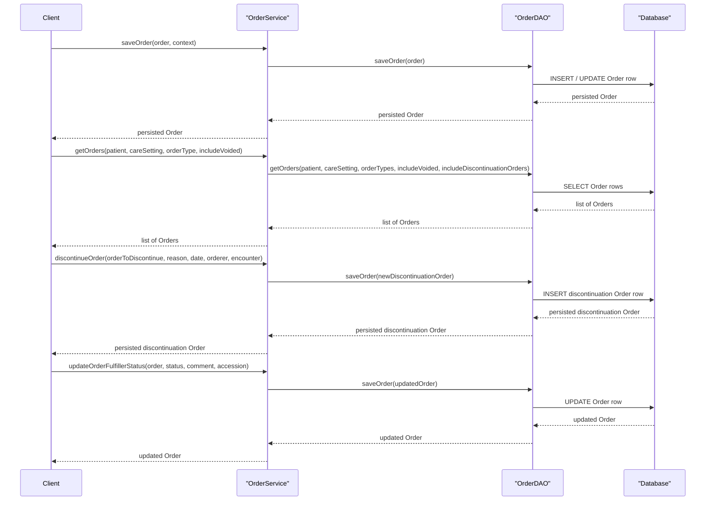

# Order Management

## Overview
The Order Management feature lets clinicians and other authorized users create, modify, retrieve, discontinue, and update the fulfillment status of orders that are tied to a patient.  
An order captures what is being requested (concept, drug, test, etc.), who ordered it, when it becomes effective, and how it should be fulfilled. The service stores the order in the OpenMRS database and returns the persisted object to the caller.

## Behavior
- **Save or update an order** – `OrderService.saveOrder(Order, OrderContext)` validates the order, sets a default `OrderType` (from the context or the concept’s class) and a default `CareSetting` (from the context), then delegates to `OrderDAO.saveOrder(Order)` to persist it. [`./api/src/main/java/org/openmrs/api/OrderService.java:86`]
- **Save a retrospective order** – `OrderService.saveRetrospectiveOrder` follows the same rules as `saveOrder` but is used for back‑dated entry. [`./api/src/main/java/org/openmrs/api/OrderService.java:115`]
- **Purge (hard‑delete) an order** – `OrderService.purgeOrder(Order)` calls `OrderDAO.deleteOrder(Order)`; an overload can also cascade delete related observations. [`./api/src/main/java/org/openmrs/api/OrderService.java:138`‑`152`]
- **Void an order** – `OrderService.voidOrder(Order, String)` marks the order as voided, clears `dateStopped` on the previous order when the voided order is a discontinuation or revision, and returns the voided order. [`./api/src/main/java/org/openmrs/api/OrderService.java:166`‑`176`]
- **Unvoid an order** – `OrderService.unvoidOrder(Order)` reverses a void, re‑stops the previous order if the unvoided order is a discontinuation or revision, and returns the unvoided order. [`./api/src/main/java/org/openmrs/api/OrderService.java:210`‑`224`]
- **Retrieve orders** – Several overloads (`getOrder`, `getOrderByUuid`, `getOrders(Patient, CareSetting, OrderType, boolean)`, `getAllOrdersByPatient`, `getOrders(OrderSearchCriteria)`) delegate to matching `OrderDAO` methods to fetch orders based on identifiers, patient, care setting, type, voided flag, or complex search criteria. [`./api/src/main/java/org/openmrs/api/OrderService.java:190`‑`202`, `226`‑`236`, `258`‑`268`, `280`‑`286`, `298`‑`304`]
- **Discontinue an order** – `OrderService.discontinueOrder` (method signature truncated in the snippet) creates a new order with `action = DISCONTINUE`, links it to the original via `previousOrder`, and saves it. [`./api/src/main/java/org/openmrs/api/OrderService.java:872` (partial line shown in snippet)]
- **Update fulfiller status** – `OrderService.updateOrderFulfillerStatus` sets the `fulfillerStatus`, optional comment, and optional accession number on the order, then persists the change via `OrderDAO`. [`./api/src/main/java/org/openmrs/api/OrderService.java:609`‑`630`]
- **Generate order numbers** – `OrderService.getNextOrderNumberSeedSequenceValue` obtains the next seed from `OrderDAO.getNextOrderNumberSeedSequenceValue`. [`./api/src/main/java/org/openmrs/api/OrderService.java:540`‑`545`]

## Triggers / Entry points
- **OrderService API** – All public methods in `org.openmrs.api.OrderService` constitute the entry points for order management. Calls to these methods are the starting points for the feature’s behavior. [`./api/src/main/java/org/openmrs/api/OrderService.java:1`‑`45`]

## End-to-end flow (Mermaid)

## State / data touched
- **`org.openmrs.Order`** – the domain entity representing an order; fields such as `patient`, `orderType`, `concept`, `dateActivated`, `dateStopped`, `action`, `previousOrder`, `fulfillerStatus`, etc., are read and written. [`./api/src/main/java/org/openmrs/Order.java:1`‑`250`]
- **`OrderDAO`** – the data‑access interface that performs `INSERT`, `UPDATE`, `SELECT`, and `DELETE` against the `orders` table (and related tables for observations, order groups, etc.). [`./api/src/main/java/org/openmrs/api/db/OrderDAO.java:1`‑`250`]
- **Database tables** – the underlying `order` (and related `order_attribute`, `order_group`, `obs` for cascade purge) tables are accessed via the DAO methods. (implicit from DAO signatures)

## External dependencies
- **`OrderDAO`** – `OrderService` depends on this DAO for all persistence operations. [`./api/src/main/java/org/openmrs/api/OrderService.java:55`‑`58`]
- **`OpenMRS` core utilities** – e.g., `OpenmrsUtil.compare` used in `Order.isActivated` and `Order.isDiscontinued`. [`./api/src/main/java/org/openmrs/Order.java:300`‑`340`]

## Configuration / parameters
- **`PARALLEL_ORDERS` constant** – a public static final string defined in `OrderService` that can be used by callers to control parallel order handling. [`./api/src/main/java/org/openmrs/api/OrderService.java:45`]

## Edge cases & failure modes (observed in code)
- **Validation before save** – `saveOrder` must not persist an order that fails validation (as indicated by the Javadoc “Should not save order if order doesn’t validate”). [`./api/src/main/java/org/openmrs/api/OrderService.java:86`]
- **Null required arguments** – `getOrders(Patient, CareSetting, …)` throws an error if `patient` or `careSetting` is null (Javadoc “Should fail if patient is null / careSetting is null”). [`./api/src/main/java/org/openmrs/api/OrderService.java:310`‑`322`]
- **Date consistency** – `Order.isDiscontinued` and `Order.isExpired` throw `APIException` if `dateStopped` is after `autoExpireDate`. [`./api/src/main/java/org/openmrs/Order.java:460`‑`470`]
- **Discontinuation of already discontinued order** – `saveOrder` throws an exception if the order being saved already has `action = DISCONTINUE`. [`./api/src/main/java/org/openmrs/api/OrderService.java:86` Javadoc “Should throw … if action is DISCONTINUE”]
- **Cascade delete** – `purgeOrder(order, true)` also deletes any `Obs` that reference the order. [`./api/src/main/java/org/openmrs/api/OrderService.java:152`‑`159`]

## Open questions
- **Exact validation rules** – The Javadoc mentions “order doesn’t validate” but the concrete validation logic resides in the implementation (not shown). What specific fields are checked?
- **Use of `PARALLEL_ORDERS`** – The constant is defined but no usage appears in the provided source. How do callers employ this flag?
- **How order numbers are generated** – The service can set an order number from the context or a configured generator, but the generator implementation is not present in the snippet. What algorithm or sequence does it use?