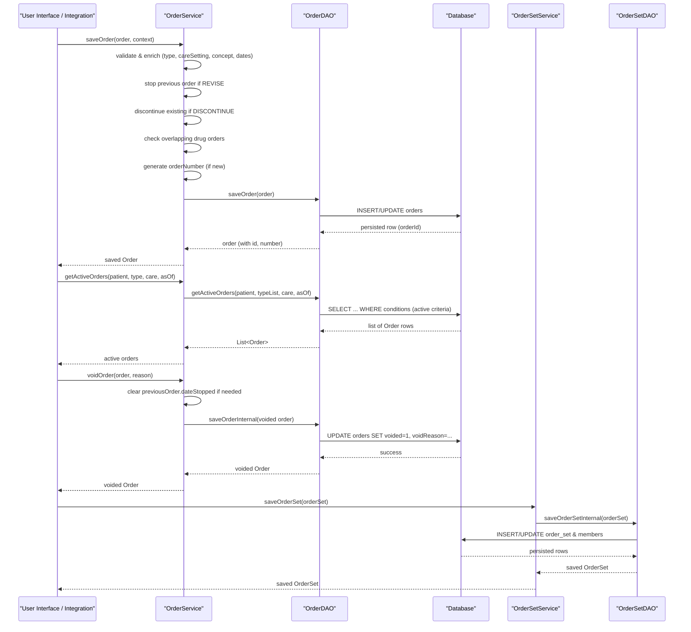

# Order Management  

## Overview  
The **Order Management** feature in OpenMRS Core handles the full lifecycle of clinical orders – creation, revision, discontinuation, voiding, and retrieval – for a patient. It works with the core domain entities `Order`, `DrugOrder`, `TestOrder`, `ReferralOrder`, `ServiceOrder`, `OrderGroup`, `OrderSet`, `OrderType`, `OrderFrequency` and `CareSetting`.  

* A clinician (or any user with the `ADD_ORDERS` / `EDIT_ORDERS` privileges) initiates an order through the UI or an integration point.  
* The request is processed by the `OrderService` (or `OrderSetService` for sets) which validates the order, resolves defaults (order type, care setting, concept), applies business rules (e.g., overlapping drug schedules, order‑type‑class matching), and finally persists the order via the `OrderDAO`.  
* The service returns the saved `Order` (or `OrderSet`) with a generated order number (`ORD‑…`) and any side‑effects (e.g., auto‑expire date roll‑forward, discontinuation of previous active orders).  

## Behavior (step‑by‑step)  

| # | Action | Code location (file:line) |
|---|--------|---------------------------|
| 1 | **Entry** – a caller invokes `OrderService.saveOrder(Order, OrderContext)` (or the retrospective variant). | `api/src/main/java/org/openmrs/api/OrderService.java:45` |
| 2 | **Synchronisation** – the public `saveOrder` method delegates to the private overloaded `saveOrder(order, context, false)`. | `api/src/main/java/org/openmrs/api/impl/OrderServiceImpl.java:84‑86` |
| 3 | **Reject existing DB order** – if `order.getOrderId()!=null` an `UnchangeableObjectException` is thrown. | `api/src/main/java/org/openmrs/api/impl/OrderServiceImpl.java:115‑119` |
| 4 | **Set activation date** – if `dateActivated` is null it is set to `new Date()`. | `api/src/main/java/org/openmrs/api/impl/OrderServiceImpl.java:124‑128` |
| 5 | **Ensure concept** – for drug orders the drug’s concept is copied; if still null a `MissingRequiredPropertyException` is thrown. | `api/src/main/java/org/openmrs/api/impl/OrderServiceImpl.java:130‑144` |
| 6 | **Auto‑expire for drug orders** – `DrugOrder#setAutoExpireDateBasedOnDuration()` is called. | `api/src/main/java/org/openmrs/api/impl/OrderServiceImpl.java:146‑148` |
| 7 | **Resolve OrderType** – if not supplied, the method looks in the `OrderContext`, then maps the concept class, then falls back to hard‑coded UUIDs for drug, test, referral orders. If still null, `OrderEntryException` is thrown. | `api/src/main/java/org/openmrs/api/impl/OrderServiceImpl.java:150‑176` |
| 8 | **Validate OrderType‑class match** – the order’s Java class must be assignable from the `OrderType`’s `javaClass`. | `api/src/main/java/org/openmrs/api/impl/OrderServiceImpl.java:178‑182` |
| 9 | **Resolve CareSetting** – similar to OrderType: use `OrderContext` if present; otherwise require a matching care setting on the previous order. Throws `OrderEntryException` if not found. | `api/src/main/java/org/openmrs/api/impl/OrderServiceImpl.java:184‑199` |
|10| **Previous‑order checks (revision)** – if `action == REVISE` the previous order must exist; it is stopped at a moment before the new order’s activation (`aMomentBefore`). | `api/src/main/java/org/openmrs/api/impl/OrderServiceImpl.java:201‑209` |
|11| **Previous‑order checks (discontinue)** – if `action == DISCONTINUE` the method `discontinueExistingOrdersIfNecessary` is called to locate and stop the active order. | `api/src/main/java/org/openmrs/api/impl/OrderServiceImpl.java:211‑215` |
|12| **Same‑orderable validation** – when a previous order is present, the new order must have the same concept (or drug for drug orders), same `OrderType`, same `CareSetting`, and the same Java class; otherwise `EditedOrderDoesNotMatchPreviousException` is thrown. | `api/src/main/java/org/openmrs/api/impl/OrderServiceImpl.java:221‑236` |
|13| **Active‑order conflict detection** – for non‑discontinue actions the service fetches active orders (`getActiveOrders`) and, unless the order is listed in the `PARALLEL_ORDERS` context attribute, throws `AmbiguousOrderException` if another active drug order of the same orderable overlaps in schedule. | `api/src/main/java/org/openmrs/api/impl/OrderServiceImpl.java:238‑255` |
|14| **Generate order number** – if the order is new (`orderId == null`) the `orderNumber` field is set via the configured `OrderNumberGenerator` (`ORDER_NUMBER_PREFIX + nextSeed`). | `api/src/main/java/org/openmrs/api/impl/OrderServiceImpl.java:267‑277` |
|15| **Auto‑expire date roll‑forward** – if the order is a discontinue (`action == DISCONTINUE`) the `autoExpireDate` is set to `dateActivated`; otherwise, if an `autoExpireDate` has no time component it is rolled to 23:59:59 of that day. | `api/src/main/java/org/openmrs/api/impl/OrderServiceImpl.java:279‑298` |
|16| **Persist** – the order (or order group) is saved via `OrderDAO.saveOrder(order)`. | `api/src/main/java/org/openmrs/api/impl/OrderServiceImpl.java:300‑304` |
|17| **Return** – the persisted order (with generated IDs, order number, timestamps) is returned to the caller. | `api/src/main/java/org/openmrs/api/impl/OrderServiceImpl.java:306‑307` |
|18| **Void / Unvoid** – `voidOrder` clears `dateStopped` on the previous order (if a discontinue/revise) and saves the voided order; `unvoidOrder` reverses the void and re‑stops the previous order if needed. | `api/src/main/java/org/openmrs/api/impl/OrderServiceImpl.java:311‑340` |
|19| **Fulfiller status update** – `updateOrderFulfillerStatus` sets `fulfillerStatus`, optional comment and accession number, then persists via `saveOrderInternal`. | `api/src/main/java/org/openmrs/api/impl/OrderServiceImpl.java:342‑363` |
|20| **OrderSet handling** – `OrderSetService.saveOrderSet` validates members, sets retirement metadata, saves via `OrderSetDAO.save(orderSet)`. | `api/src/main/java/org/openmrs/api/impl/OrderSetServiceImpl.java:45‑61` |
|21| **OrderSet retrieval** – `OrderSetService.getOrderSets` delegates to `OrderSetDAO.getOrderSets(includeRetired)`. | `api/src/main/java/org/openmrs/api/impl/OrderSetServiceImpl.java:85‑89` |

## Triggers / Entry points  

| Service method | Privilege(s) | Purpose | Source |
|----------------|--------------|---------|--------|
| `OrderService.saveOrder(Order, OrderContext)` | `ADD_ORDERS`, `EDIT_ORDERS` | Create or revise a new order | `api/src/main/java/org/openmrs/api/OrderService.java:45` |
| `OrderService.saveRetrospectiveOrder(Order, OrderContext)` | `ADD_ORDERS`, `EDIT_ORDERS` | Same as `saveOrder` but forces retrospective flag | `api/src/main/java/org/openmrs/api/OrderService.java:75` |
| `OrderService.purgeOrder(Order)` | `PURGE_ORDERS` | Hard delete (optionally cascade Obs) | `api/src/main/java/org/openmrs/api/OrderService.java:105` |
| `OrderService.voidOrder(Order, String)` | `DELETE_ORDERS` | Void an order (soft delete) | `api/src/main/java/org/openmrs/api/OrderService.java:135` |
| `OrderService.unvoidOrder(Order)` | `DELETE_ORDERS` | Reverse a void | `api/src/main/java/org/openmrs/api/OrderService.java:165` |
| `OrderService.getOrders(Patient, CareSetting, OrderType, boolean)` | `GET_ORDERS` | Retrieve orders (excluding discontinuations) | `api/src/main/java/org/openmrs/api/OrderService.java:245` |
| `OrderService.getActiveOrders(Patient, OrderType, CareSetting, Date)` | `GET_ORDERS` | Retrieve *active* orders as of a date | `api/src/main/java/org/openmrs/api/OrderService.java:285` |
| `OrderService.updateOrderFulfillerStatus(...)` | `EDIT_ORDERS` | Update fulfiller status & comment | `api/src/main/java/org/openmrs/api/OrderService.java:335` |
| `OrderSetService.saveOrderSet(OrderSet)` | `MANAGE_ORDER_SETS` | Create / update an order set | `api/src/main/java/org/openmrs/api/OrderSetService.java:45` |
| `OrderSetService.getOrderSets(boolean)` | `GET_ORDER_SETS` | List order sets (optionally retired) | `api/src/main/java/org/openmrs/api/OrderSetService.java:55` |

## End‑to‑end flow (Mermaid)

## State / data touched  

| Entity | Table (Hibernate) | Accessed by | Notes |
|--------|-------------------|-------------|-------|
| `Order` | `orders` | `OrderDAO.saveOrder`, `OrderDAO.getOrder`, `OrderDAO.getActiveOrders`, `OrderDAO.getOrderByUuid`, `OrderDAO.getOrderByOrderNumber` | Insert, update, select, delete (purge). |
| `OrderGroup` | `order_group` | `OrderDAO.saveOrderGroup`, `OrderDAO.getOrderGroupByUuid`, `OrderDAO.getOrderGroupById` | Saved when an `OrderGroup` is persisted. |
| `OrderSet` | `order_set` (and `order_set_member`) | `OrderSetDAO.save`, `OrderSetDAO.getOrderSetById`, `OrderSetDAO.getOrderSetByUniqueUuid`, `OrderSetDAO.getOrderSets` | Members are linked via `order_set_id`. |
| `CareSetting` | `care_setting` | `OrderDAO.getCareSetting`, `OrderDAO.getCareSettingByUuid`, `OrderDAO.getCareSettingByName`, `OrderDAO.getCareSettings` | Read‑only for order validation; also returned by service getters. |
| `OrderType` | `order_type` | `OrderDAO.getOrderTypeByName`, `OrderDAO.getOrderTypeByUuid` (via service) | Used to resolve defaults. |
| `OrderFrequency` | `order_frequency` | `OrderDAO.getOrderFrequency*`, `OrderDAO.getOrderFrequencies*` | Used by drug orders for schedule calculations. |
| `GlobalProperty` (order number seed) | `global_property` | `HibernateOrderDAO.getNextOrderNumberSeedSequenceValue` | Incremented atomically for each new order number. |
| `Obs` (when cascade purge) | `obs` | `OrderDAO.deleteObsThatReference` | Deleted only when `purgeOrder(order, true)` is called. |

All reads/writes are performed through the Hibernate session (`sessionFactory.getCurrentSession()`) as shown in `HibernateOrderDAO` methods (e.g., `saveOrder`, `deleteOrder`, `getOrders`, `getActiveOrders`).  

## External dependencies  

| Dependency | Usage | Source |
|------------|-------|--------|
| `Context.getOrderService()` | Service lookup for order‑type defaults, order number generator, etc. | `OrderServiceImpl.java:150‑176` |
| `Context.getAdministrationService().getGlobalProperty` | Retrieves `GP_ORDER_NUMBER_GENERATOR_BEAN_ID` and `GP_NEXT_ORDER_NUMBER_SEED`. | `OrderServiceImpl.java:388‑401` |
| `Context.getAuthenticatedUser()` | Sets `retiredBy` on retired `OrderSetMember`. | `OrderSetServiceImpl.java:71‑78` |
| `CustomDatatypeUtil.saveAttributesIfNecessary` | Persists custom attribute values for `OrderSet` and `OrderGroup`. | `OrderSetServiceImpl.java:55‑58`, `OrderServiceImpl.saveOrderGroup` |
| `OrderUtil.checkScheduleOverlap` | Determines overlapping drug schedules. | `OrderServiceImpl.java:166‑170` |
| `OpenmrsUtil` (date helpers) | Used for date comparisons, rolling auto‑expire dates, etc. | Various locations in `Order.java` and DAO criteria. |
| `OrderNumberGenerator` (default implementation in `OrderServiceImpl`) | Generates order numbers (`ORD-…`). | `OrderServiceImpl.java:424‑440` |

## Configuration / parameters  

| Property / Constant | Description | Where used |
|---------------------|-------------|------------|
| `OpenmrsConstants.GP_ORDER_NUMBER_GENERATOR_BEAN_ID` | Bean ID of a custom `OrderNumberGenerator`. If set, the service loads that bean; otherwise the default generator (`OrderServiceImpl` itself) is used. | `OrderServiceImpl.getOrderNumberGenerator()` |
| `OpenmrsConstants.GP_NEXT_ORDER_NUMBER_SEED` | Global property holding the next numeric seed for order numbers. Incremented atomically in `HibernateOrderDAO.getNextOrderNumberSeedSequenceValue()`. | `HibernateOrderDAO.getNextOrderNumberSeedSequenceValue()` |
| `OrderService.PARALLEL_ORDERS` | Context attribute key that, when present, supplies a list of order UUIDs that are allowed to run in parallel (i.e., bypass overlapping‑drug check). | `OrderServiceImpl.saveOrder` (parallel‑order handling) |
| `Order.FulfillerStatus` enum values (`RECEIVED`, `IN_PROGRESS`, `EXCEPTION`, `ON_HOLD`, `DECLINED`, `COMPLETED`) | Status values that can be set via `updateOrderFulfillerStatus`. | `Order.java` enum definition |
| `Order.Action` enum (`NEW`, `REVISE`, `DISCONTINUE`, `RENEW`) | Determines the business path (revision, discontinuation, etc.). | `Order.java` enum definition |

## Edge cases & failure modes  

| Situation | Handling (exception / logic) | Source |
|-----------|------------------------------|--------|
| **Existing order ID on save** | `UnchangeableObjectException` – prevents editing an existing persisted order. | `OrderServiceImpl.failOnExistingOrder` |
| **Missing required fields** (concept, order type, care setting) | `MissingRequiredPropertyException` or `OrderEntryException` with specific messages. | `ensureConceptIsSet`, `ensureOrderTypeIsSet`, `ensureCareSettingIsSet` |
| **Order type‑class mismatch** | `OrderEntryException` with message `"Order.type.class.does.not.match"`. | `failOnOrderTypeMismatch` |
| **Revision without previous order** | `MissingRequiredPropertyException` (`"Order.previous.required"`). | `saveOrder` REVISE branch |
| **Discontinue without previous order** | `discontinueExistingOrdersIfNecessary` attempts to locate an active order; if ambiguous, throws `AmbiguousOrderException`. | `discontinueExistingOrdersIfNecessary` |
| **Overlapping drug orders** | `AmbiguousOrderException` (`"Order.cannot.have.more.than.one"`). | `saveOrder` active‑order loop |
| **Auto‑expire date without time component** | Rolls to 23:59:59 of the same day. | `saveOrderInternal` |
| **Concurrent order number generation** | `synchronized` on `saveOrder` and `getNextOrderNumberSeedSequenceValue` (requires DB lock). | `OrderServiceImpl.saveOrder` and `HibernateOrderDAO.getNextOrderNumberSeedSequenceValue` |
| **Void without reason** | `IllegalArgumentException` (`"voidReason cannot be empty or null"`). | `OrderServiceImpl.voidOrder` |
| **Unvoid of a discontinued order whose previous order is inactive** | `CannotUnvoidOrderException` with specific action message. | `OrderServiceImpl.unvoidOrder` |
| **Purge with cascade** | Deletes related `Obs` rows before deleting the order. | `OrderServiceImpl.purgeOrder` (cascade branch) |
| **OrderSet member retirement** | Sets `retiredBy` and `dateRetired` before persisting. | `OrderSetServiceImpl.retireOrderSet` |

## Open questions  

* **Pagination / Sorting for `getOrders`** – The DAO methods (`HibernateOrderDAO.getOrders`) build a criteria query but do not apply explicit pagination (`setFirstResult`, `setMaxResults`). It is unclear whether higher‑level services add pagination.  
* **Exact behavior of `saveRetrospectiveOrder`** – The only difference is the `isRetrospective` flag passed to the private `saveOrder`. The flag influences the `asOfDate` used when checking active orders, but the full impact on downstream systems (e.g., audit trails) is not visible in the provided code.  
* **How custom `OrderNumberGenerator` beans are wired** – The code loads a bean by ID from the Spring context, but the configuration file that defines possible custom generators is not shown.  
* **Interaction with external fulfillment systems** – The `fulfillerStatus` fields are persisted, but the mechanism that notifies external labs/pharmacies (e.g., message queues) is not present in the core code excerpt.  

---  

*All citations are given as `path/to/file:line‑range` referencing the OpenMRS Core source excerpts provided.*