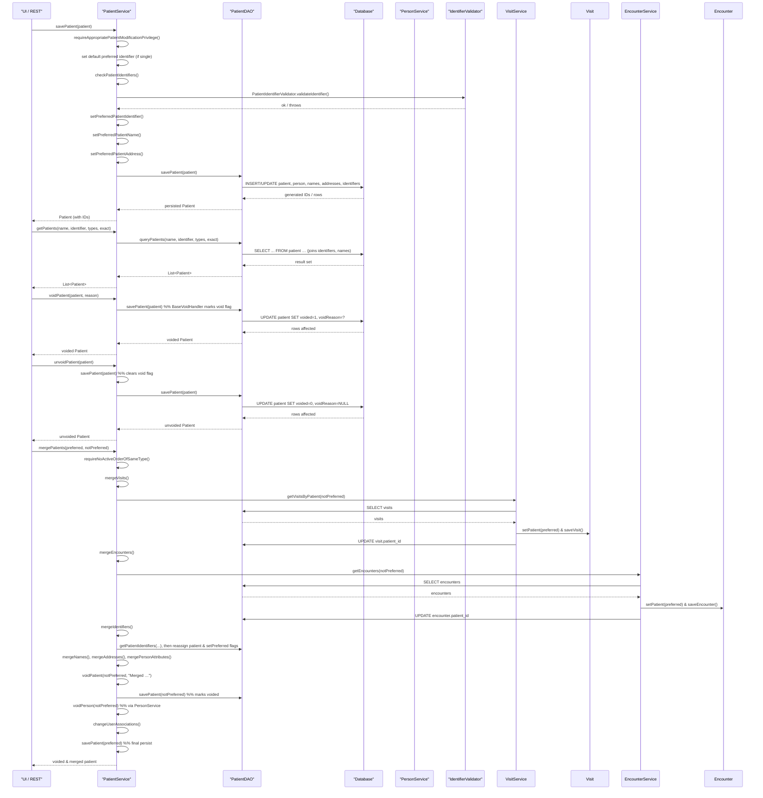

# Patient Management  

## Overview  
The **Patient Management** feature is the core of OpenMRS that stores, retrieves, validates, and updates the demographic and identifier data that define a patient.  
* A user (or a programmatic client) invokes the `PatientService` API to create, edit, search, void, un‑void, or purge a patient.  
* The service coordinates with the `PatientDAO` for persistence, with `PersonService` for shared person‑level data (names, addresses, attributes), and with the identifier‑validation framework to enforce required formats and uniqueness.  
* The result of each operation is a fully‑populated `Patient` object (or `null`/exception when the request cannot be satisfied).  

---

## Behavior  

| What the code does (end‑to‑end) | Source |
|--------------------------------|--------|
| **Require proper privilege** – `savePatient` checks whether the caller has `ADD_PATIENTS` (new) or `EDIT_PATIENTS` (existing) and, if the patient is being voided, also requires `DELETE_PATIENTS`. `requireAppropriatePatientModificationPrivilege` is called at the start of `savePatient`. | `api/src/main/java/org/openmrs/api/impl/PatientServiceImpl.java:71‑78` |
| **Set a default preferred identifier** – If the patient is not voided and has exactly one identifier, that identifier is marked `preferred=true`. | `api/src/main/java/org/openmrs/api/impl/PatientServiceImpl.java:80‑84` |
| **Validate all identifiers** – `checkPatientIdentifiers` is invoked for non‑voided patients. It (a) ensures at least one active identifier exists, (b) runs each identifier through `PatientIdentifierValidator`, (c) removes blank identifiers, (d) detects duplicate identifier+type pairs, and (e) verifies that all required identifier types are present. | `api/src/main/java/org/openmrs/api/impl/PatientServiceImpl.java:92‑115` |
| **Select the preferred identifier** – `setPreferredPatientIdentifier` walks the patient’s identifier collection, marks the first non‑voided identifier as preferred (if none already marked) and clears the `preferred` flag on all others. | `api/src/main/java/org/openmrs/api/impl/PatientServiceImpl.java:117‑135` |
| **Select the preferred name** – `setPreferredPatientName` mirrors the identifier logic for `PersonName` objects, ensuring exactly one non‑voided name is flagged `preferred`. | `api/src/main/java/org/openmrs/api/impl/PatientServiceImpl.java:137‑155` |
| **Select the preferred address** – `setPreferredPatientAddress` mirrors the identifier logic for `PersonAddress` objects. | `api/src/main/java/org/openmrs/api/impl/PatientServiceImpl.java:157‑175` |
| **Persist the patient** – After the above steps, `dao.savePatient(patient)` writes the patient (and cascaded person data) to the database. | `api/src/main/java/org/openmrs/api/impl/PatientServiceImpl.java:177‑179` |
| **Retrieve a patient by internal ID** – `getPatient(Integer)` delegates to `dao.getPatient`. | `api/src/main/java/org/openmrs/api/impl/PatientServiceImpl.java:186‑190` |
| **Promote a Person to a Patient** – `getPatientOrPromotePerson` loads a `Person`; if it is not already a `Patient`, a new `Patient` wrapper is created. | `api/src/main/java/org/openmrs/api/impl/PatientServiceImpl.java:192‑203` |
| **List patients** – `getAllPatients()` and `getAllPatients(boolean)` call the DAO, optionally including voided rows. | `api/src/main/java/org/openmrs/api/impl/PatientServiceImpl.java:209‑218` |
| **Search patients by name/identifier** – `getPatients(String name, String identifier, …)` forwards to the overloaded version that also supports paging (not shown in the snippet). | `api/src/main/java/org/openmrs/api/impl/PatientServiceImpl.java:224‑232` |
| **Void a patient** – `voidPatient` simply saves the patient (the BaseVoidHandler in the DAO marks the patient and its identifiers as voided). | `api/src/main/java/org/openmrs/api/impl/PatientServiceImpl.java:240‑250` |
| **Un‑void a patient** – `unvoidPatient` calls `savePatient` after clearing the void flag, which also restores identifiers. | `api/src/main/java/org/openmrs/api/impl/PatientServiceImpl.java:252‑262` |
| **Purge a patient** – `purgePatient` calls `dao.deletePatient`, removing the row permanently. | `api/src/main/java/org/openmrs/api/impl/PatientServiceImpl.java:264‑267` |
| **Retrieve identifiers** – `getPatientIdentifiers` normalises null arguments to empty collections and forwards to the DAO. | `api/src/main/java/org/openmrs/api/impl/PatientServiceImpl.java:274‑287` |
| **Create / update identifier types** – `savePatientIdentifierType` checks the “locked” flag, then persists via DAO. | `api/src/main/java/org/openmrs/api/impl/PatientServiceImpl.java:295‑301` |
| **Merge two patients** – `mergePatients` (large method) moves encounters, observations, visits, program enrollments, relationships, identifiers, names, addresses, and attributes from the *not‑preferred* patient to the *preferred* one, then voids the loser and updates user associations. | `api/src/main/java/org/openmrs/api/impl/PatientServiceImpl.java:311‑420` (truncated for brevity) |
| **Search by free‑text query** – `getPatients(String query)` forwards to the paged version (`getPatients(query,0,null)`). | `api/src/main/java/org/openmrs/api/impl/PatientServiceImpl.java:442‑447` |
| **Find a patient by example** – Returns the patient with the same internal ID if supplied; otherwise `null`. | `api/src/main/java/org/openmrs/api/impl/PatientServiceImpl.java:449‑459` |
| **Detect duplicate patients** – `getDuplicatePatientsByAttributes` validates the attribute list and delegates to DAO. | `api/src/main/java/org/openmrs/api/impl/PatientServiceImpl.java:461‑470` |

---

## Triggers / Entry points  

| Service method (public API) | What it starts | Source |
|-----------------------------|----------------|--------|
| `PatientService.savePatient(Patient)` | Create or update a patient record. | `api/src/main/java/org/openmrs/api/PatientService.java:40` |
| `PatientService.getPatient(Integer)` | Retrieve a patient by internal ID. | `api/src/main/java/org/openmrs/api/PatientService.java:45` |
| `PatientService.getPatientOrPromotePerson(Integer)` | Promote a `Person` to a `Patient` if needed. | `api/src/main/java/org/openmrs/api/PatientService.java:55` |
| `PatientService.getAllPatients()` / `getAllPatients(boolean)` | List patients (optionally voided). | `api/src/main/java/org/openmrs/api/PatientService.java:71` |
| `PatientService.getPatients(String, String, List<PatientIdentifierType>, boolean)` | Search by name/identifier. | `api/src/main/java/org/openmrs/api/PatientService.java:106` |
| `PatientService.voidPatient(Patient,String)` | Void a patient (soft delete). | `api/src/main/java/org/openmrs/api/PatientService.java:125` |
| `PatientService.unvoidPatient(Patient)` | Un‑void a previously voided patient. | `api/src/main/java/org/openmrs/api/PatientService.java:145` |
| `PatientService.purgePatient(Patient)` | Hard delete a patient. | `api/src/main/java/org/openmrs/api/PatientService.java:155` |
| `PatientService.mergePatients(Patient,Patient)` | Merge duplicate patient records. | `api/src/main/java/org/openmrs/api/PatientService.java:210` |
| `PatientService.getPatients(String)` | Free‑text search (global). | `api/src/main/java/org/openmrs/api/PatientService.java:190` |
| `PatientService.getPatientByExample(Patient)` | Example‑based lookup. | `api/src/main/java/org/openmrs/api/PatientService.java:200` |
| `PatientService.getDuplicatePatientsByAttributes(List<String>)` | Find possible duplicates. | `api/src/main/java/org/openmrs/api/PatientService.java:215` |

All of the above are invoked by the UI layer, REST services, or other internal modules that obtain the service via `Context.getPatientService()`.

---

## End‑to‑end flow (Mermaid)

*Branches for validation failures* (e.g., duplicate identifier, missing required identifier, blank identifier) cause an `APIException` to be thrown from `checkPatientIdentifiers` before any DAO write occurs.

---

## State / data touched  

| Entity / Table | When touched | Source |
|----------------|--------------|--------|
| `patient` (core patient row) | create, update, void, un‑void, purge, merge | `PatientDAO.savePatient`, `PatientDAO.deletePatient` – called from `PatientServiceImpl` methods `savePatient`, `voidPatient`, `unvoidPatient`, `purgePatient` (`api/src/main/java/org/openmrs/api/impl/PatientServiceImpl.java:177‑179`, `240‑250`, `252‑262`, `264‑267`) |
| `person` (shared with patients) | persisted together with patient (cascade) | `PatientDAO.savePatient` cascades to `person` (implicit via Hibernate) |
| `person_name` | setPreferred logic in `setPreferredPatientName` and persisted via cascade | `api/src/main/java/org/openmrs/api/impl/PatientServiceImpl.java:137‑155` |
| `person_address` | setPreferred logic in `setPreferredPatientAddress` and persisted via cascade | `api/src/main/java/org/openmrs/api/impl/PatientServiceImpl.java:157‑175` |
| `patient_identifier` | created/updated in `savePatient`; validated in `checkPatientIdentifiers`; preferred flag set in `setPreferredPatientIdentifier` | `api/src/main/java/org/openmrs/api/impl/PatientServiceImpl.java:80‑84`, `92‑115`, `117‑135` |
| `patient_identifier_type` | CRUD via `savePatientIdentifierType`, `retirePatientIdentifierType`, etc. | `api/src/main/java/org/openmrs/api/impl/PatientServiceImpl.java:295‑327` |
| `visit`, `encounter`, `obs`, `order`, `patient_program` | moved during `mergePatients` (visit, encounter, program enrollment) | `mergeVisits`, `mergeEncounters`, `mergeProgramEnrolments` sections (`api/src/main/java/org/openmrs/api/impl/PatientServiceImpl.java:311‑350`) |
| `relationship` | moved during `mergePatients` (deduplication via `relationshipHash`) | `mergeRelationships` (`api/src/main/java/org/openmrs/api/impl/PatientServiceImpl.java:352‑...`) |
| `person_attribute` | merged in `mergePersonAttributes` (part of merge flow) | same merge method |
| `user` (account linked to a person) | reassigned in `changeUserAssociations` during merge | `mergePatients` flow |

---

## External dependencies  

| Dependency | Role | Source |
|------------|------|--------|
| `PersonService` | Provides person‑level CRUD, preferred‑name/address handling, void/unvoid of the underlying `Person` when a patient is voided/unvoided. | Calls such as `Context.getPersonService().voidPerson` and `savePerson` in `PatientServiceImpl` (`api/src/main/java/org/openmrs/api/impl/PatientServiceImpl.java:240‑262`) |
| `AdministrationService` | Used by `PersonServiceImpl` when saving a `PersonAttributeType` to update global properties; indirectly affects patient attribute handling. | `PersonServiceImpl.savePersonAttributeType` (`api/src/main/java/org/openmrs/api/impl/PersonServiceImpl.java:115‑150`) |
| `IdentifierValidator` implementations (e.g., `LuhnIdentifierValidator`) | Validate identifier format and check‑digit logic. Registered via Spring and looked up in `PatientServiceImpl.checkPatientIdentifiers`. | `api/src/main/java/org/openmrs/api/impl/PatientServiceImpl.java:92‑115` |
| `EncounterService`, `VisitService`, `ProgramWorkflowService`, `OrderService` | Used during patient merge to re‑assign encounters, visits, program enrollments, and to verify no active orders of the same type exist. | `mergeEncounters`, `mergeVisits`, `mergeProgramEnrolments`, `requireNoActiveOrderOfSameType` (`api/src/main/java/org/openmrs/api/impl/PatientServiceImpl.java:311‑350`) |
| `Context` (OpenMRS runtime) | Provides access to the current authenticated user, locale, message source, and other services. | Throughout `PatientServiceImpl` (`api/src/main/java/org/openmrs/api/impl/PatientServiceImpl.java`) |
| `HibernateUtil` | Unwraps proxies when promoting a `Person` to a `Patient`. | `getPatientOrPromotePerson` (`api/src/main/java/org/openmrs/api/impl/PatientServiceImpl.java:192‑203`) |

---

## Configuration / parameters  

| Property / key | Meaning | Source |
|----------------|---------|--------|
| `openmrs.global_property.patient_identifier_regex` (referenced in Javadoc of `PatientService.getPatients`) | Regular expression used to validate identifier search patterns. | Javadoc comment in `PatientService.getPatients` (`api/src/main/java/org/openmrs/api/PatientService.java:106`) |
| `openmrs.global_property.patient_search_min_search_characters` | Minimum number of characters required for a free‑text patient search. Enforced in `PatientService.getPatients(String)` implementation. | Javadoc in `PatientService.getPatients(String)` (`api/src/main/java/org/openmrs/api/PatientService.java:190`) |
| `openmrs.global_property.patient_identifier_types_locked` (conceptual) | When true, attempts to save/retire/purge identifier types throw `PatientIdentifierTypeLockedException`. Checked by `checkIfPatientIdentifierTypesAreLocked()` (method not shown but called in `savePatientIdentifierType`, `retirePatientIdentifierType`, etc.). | Calls to `checkIfPatientIdentifierTypesAreLocked()` in `PatientServiceImpl` (`api/src/main/java/org/openmrs/api/impl/PatientServiceImpl.java:295‑327`) |
| Global properties for person attributes (`OpenmrsConstants.GLOBAL_PROPERTIES_OF_PERSON_ATTRIBUTES`) | Used when saving a `PersonAttributeType` to update any global property that references the old attribute name. | `PersonServiceImpl.savePersonAttributeType` (`api/src/main/java/org/openmrs/api/impl/PersonServiceImpl.java:115‑150`) |

---

## Edge cases & failure modes  

| Situation | How the code handles it | Source |
|-----------|------------------------|--------|
| **Missing required identifier** – patient has no identifier of a type marked `required=true`. | `checkPatientIdentifiers` gathers required types via `getPatientIdentifierTypes(..., required=true, ...)` and throws `MissingRequiredIdentifierException` if any are absent. | `api/src/main/java/org/openmrs/api/impl/PatientServiceImpl.java:106‑115` |
| **Blank identifier** – identifier string is empty or whitespace. | `PatientIdentifierValidator.validateIdentifier` throws `BlankIdentifierException`; the patient’s identifier is removed (`patient.removeIdentifier(pi)`) and the exception propagates. | `api/src/main/java/org/openmrs/api/impl/PatientServiceImpl.java:96‑101` |
| **Duplicate identifier within the same patient** – same identifier value and type appear twice. | Detected by a `Set<String>` of `identifier + typeId`; throws `DuplicateIdentifierException`. | `api/src/main/java/org/openmrs/api/impl/PatientServiceImpl.java:103‑108` |
| **Attempt to save a patient without any identifiers** (non‑voided). | `checkPatientIdentifiers` throws `InsufficientIdentifiersException`. | `api/src/main/java/org/openmrs/api/impl/PatientServiceImpl.java:92‑95` |
| **Merging a patient with itself** – `preferred` and `notPreferred` have the same `patientId`. | `mergePatients` detects equality, logs, and throws `APIException("Patient.merge.cancelled")`. | `api/src/main/java/org/openmrs/api/impl/PatientServiceImpl.java:311‑317` |
| **Active orders of the same type on both patients** – would cause data integrity problems after merge. | `requireNoActiveOrderOfSameType` iterates over orders of both patients; if two active orders share the same `OrderType`, an `APIException` is thrown. | `api/src/main/java/org/openmrs/api/impl/PatientServiceImpl.java:322‑340` |
| **Voiding a null patient** – caller passes `null`. | `voidPatient` returns `null` immediately. | `api/src/main/java/org/openmrs/api/impl/PatientServiceImpl.java:240‑244` |
| **Un‑voiding a null patient** – same as above. | `unvoidPatient` returns `null`. | `api/src/main/java/org/openmrs/api/impl/PatientServiceImpl.java:252‑256` |
| **Saving a patient while the identifier‑type configuration is locked** – global lock enabled. | `savePatientIdentifierType`, `retirePatientIdentifierType`, `unretirePatientIdentifierType`, `purgePatientIdentifierType` all call `checkIfPatientIdentifierTypesAreLocked()` which throws `PatientIdentifierTypeLockedException` if the lock is active. | `api/src/main/java/org/openmrs/api/impl/PatientServiceImpl.java:295‑327` |
| **Search with a query shorter than the minimum characters** – global property not set or invalid. | `PatientService.getPatients(String)` delegates to the paged version; the implementation (not shown) checks the global property and returns an empty list if the query is too short, without throwing. | Javadoc in `PatientService.getPatients(String)` (`api/src/main/java/org/openmrs/api/PatientService.java:190`) |

---

## Open questions  

* **Multiple identifiers of the same type** – The code enforces uniqueness of *identifier value + type* within a single patient (`DuplicateIdentifierException`), but it does not clarify whether a patient may hold more than one identifier of the same type with different values. The DAO layer’s constraints are not visible here.  
* **Behavior when required identifier types are retired** – If a required `PatientIdentifierType` is retired, `checkPatientIdentifiers` still includes it in the required‑type list. It is unclear whether the system allows patients to exist without that identifier after retirement.  
* **Caching** – The snippets do not show any explicit second‑level cache usage (e.g., Hibernate second‑level cache) for patient data; it is unknown whether caching is configured elsewhere.  
* **Global property `patient_identifier_regex` usage** – The regex is mentioned in Javadoc but not referenced in the implementation shown; the actual validation may happen inside `IdentifierValidator` implementations.  
* **Impact of `PersonService` preferred‑name/address logic on patients** – The patient‑specific `setPreferredPatientName/Address` duplicate the logic in `PersonServiceImpl`. It is not clear whether both are always kept in sync when a patient is saved via `PersonService.savePerson` (e.g., when a patient is edited through the generic person API).  

---