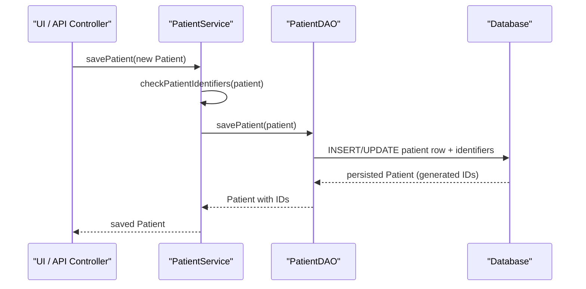

# Patient Registration

## Overview
The Patient Registration feature lets authorized users add new patients (or update existing ones) in OpenMRS.  
A user invokes the service layer (e.g., from a UI form or API call) which creates a `Patient` object, populates its core fields and identifiers, and persists it through the DAO. The operation returns the saved `Patient` instance, now containing a generated internal ID, UUID, and any default‑preferred name/address/identifier that were not supplied.

## Behavior
- **Service contract** – `PatientService` defines the public API for patient creation, update, and lookup. The key method is `savePatient(Patient patient)` which is annotated with `@Authorized({ADD_PATIENTS, EDIT_PATIENTS})`. `path:./api/src/main/java/org/openmrs/api/PatientService.java:38`
- **Persisting a patient** – `savePatient` delegates to the DAO (`PatientDAO.savePatient`) which performs the actual Hibernate `saveOrUpdate`. `path:./api/src/main/java/org/openmrs/api/db/PatientDAO.java:30`
- **Patient object model** – `Patient` extends `Person` and adds:
  - `patientId` (mirrors `personId`) – lazily derived if null. `path:./api/src/main/java/org/openmrs/Patient.java:71`
  - `allergyStatus` (default `Allergies.UNKNOWN`). `path:./api/src/main/java/org/openmrs/Patient.java:78`
  - `identifiers` – a `Set<PatientIdentifier>` holding all identifiers (voided and active). `path:./api/src/main/java/org/openmrs/Patient.java:84`
- **Identifier handling** – When a new `Patient` is saved:
  - `addIdentifier` ensures no duplicate identifier (same value & type) is added to the active set. `path:./api/src/main/java/org/openmrs/Patient.java:150`
  - `getActiveIdentifiers` returns non‑voided identifiers, ordering preferred ones first. `path:./api/src/main/java/org/openmrs/Patient.java:190`
  - If the patient has no preferred identifier, the service will set the first non‑voided identifier as preferred (documented in Javadoc of `savePatient`). `path:./api/src/main/java/org/openmrs/api/PatientService.java:40`
- **Validation** – Before persisting, the service may invoke `checkPatientIdentifiers(Patient)` to enforce:
  - At least one non‑voided identifier exists.
  - Required identifier types are present.
  - No duplicate or blank identifiers.  
  This method throws `PatientIdentifierException` on failure. `path:./api/src/main/java/org/openmrs/api/PatientService.java:274`
- **Audit fields** – The underlying `OpenmrsObject` implementation automatically updates `dateCreated`, `dateChanged`, `creator`, and `changedBy` when the DAO saves the entity (standard Hibernate behavior, not shown explicitly in the source but implied by the `OpenmrsService` contract).

## Triggers / Entry points
- **Service method** – `PatientService.savePatient(Patient)` is the primary entry point for registration. `path:./api/src/main/java/org/openmrs/api/PatientService.java:38`
- **DAO method** – `PatientDAO.savePatient(Patient)` is the persistence entry point called by the service implementation. `path:./api/src/main/java/org/openmrs/api/db/PatientDAO.java:30`
- **Other look‑ups** – `PatientService.getPatient(Integer)`, `getPatientByUuid(String)`, and `getAllPatients()` are used by UI layers to retrieve patients after registration. `path:./api/src/main/java/org/openmrs/api/PatientService.java:58` (by ID) and `path:./api/src/main/java/org/openmrs/api/PatientService.java:84` (by UUID).

## End-to‑to‑flow (Mermaid)

## State / data touched
- **`patient` table** – core patient fields (`patient_id`, `person_id`, `uuid`, `allergy_status`). Updated/inserted by `PatientDAO.savePatient`. `path:./api/src/main/java/org/openmrs/api/db/PatientDAO.java:30`
- **`patient_identifier` table** – each identifier linked to the patient (`patient_identifier_id`, `identifier`, `identifier_type_id`, `preferred`, `voided`). Managed through `Patient.addIdentifier` and persisted together with the patient. `path:./api/src/main/java/org/openmrs/Patient.java:150`
- **`person` table** – inherited fields (name, gender, birthdate, etc.) are also saved because `Patient` extends `Person`. The DAO’s Hibernate mapping cascades these changes.

## External dependencies
- **Authorization framework** – `@Authorized` annotation checks that the caller holds `ADD_PATIENTS` or `EDIT_PATIENTS` privileges before the service method executes. `path:./api/src/main/java/org/openmrs/api/PatientService.java:38`
- **Hibernate / JPA** – persistence is performed via the DAO’s Hibernate session (implicit in `savePatient`). Not directly visible in the interface but required for actual DB interaction.

## Configuration / parameters
- **Privilege constants** – `PrivilegeConstants.ADD_PATIENTS`, `EDIT_PATIENTS`, `GET_PATIENTS`, etc., control access. Defined in `org.openmrs.util.PrivilegeConstants` (imported in `PatientService`). `path:./api/src/main/java/org/openmrs/api/PatientService.java:31`
- **Identifier validation rules** – `IdentifierValidator` (imported but not shown) is used by `checkPatientIdentifiers` to enforce format/check‑digit rules. `path:./api/src/main/java/org/openmrs/api/PatientService.java:31`

## Edge cases & failure modes (observed in code)
- **Missing identifiers** – `savePatient` throws `APIException` if the patient has no identifiers (`<strong>Should</strong> fail when patient does not have any patient identifiers`). `path:./api/src/main/java/org/openmrs/api/PatientService.java:40`
- **Required identifier types** – `checkPatientIdentifiers` throws `PatientIdentifierException` when required identifier types are absent. `path:./api/src/main/java/org/openmrs/api/PatientService.java:274`
- **Duplicate identifiers** – `addIdentifier` silently ignores a duplicate identifier (same value & type) to avoid `NonUniqueObjectException`. `path:./api/src/main/java/org/openmrs/Patient.java:150`
- **Void handling** – Void identifiers are excluded from `getActiveIdentifiers` and are not considered for preferred selection. `path:./api/src/main/java/org/openmrs/Patient.java:190`
- **Authorization failure** – If the caller lacks the required privilege, the framework aborts before entering `savePatient`. (Enforced by `@Authorized`). `path:./api/src/main/java/org/openmrs/api/PatientService.java:38`
- **Null patient argument** – The service contract expects a non‑null `Patient`; passing `null` would cause a `NullPointerException` before DAO interaction (not explicitly guarded in the interface).

## Open questions
- **DAO implementation details** – The concrete class that implements `PatientDAO` (e.g., `HibernatePatientDAO`) is not shown, so exact transaction boundaries, flush behavior, and cascade settings are unknown.
- **Default preferred identifier logic** – The Javadoc mentions setting a preferred identifier if none exists, but the exact algorithm (e.g., first identifier of a certain type) is hidden in the service implementation, not visible in the interface.
- **How duplicate patient detection works** – Methods like `getPatientByExample` and `getDuplicatePatientsByAttributes` hint at duplicate‑checking logic, but the matching rules are not present in the provided sources.