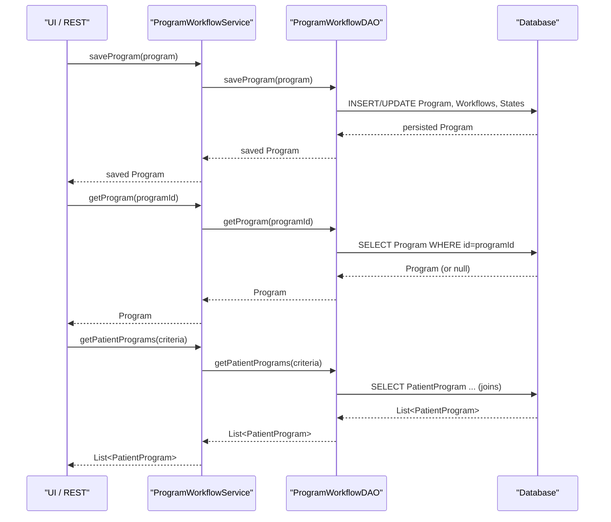

# Program Management

## Overview
The **Program Management** feature lets administrators and clinicians create, read, update, and delete clinical programs, their workflows, and associated states. It is invoked through the OpenMRS service layer (e.g., `Context.getProgramWorkflowService()`) from UI actions, REST endpoints, or other server‑side code. The feature persists program metadata, workflow definitions, patient enrollments, and state transitions, and returns the resulting domain objects to the caller.

## Behavior
- **Save a program** – Persists a new or updated `Program` (including its workflows and states) via `saveProgram(Program)` **[ProgramWorkflowService.java:54]**.  
- **Retrieve a program by ID** – Returns the `Program` whose `programId` matches the argument, or `null` if none **[ProgramWorkflowService.java:87]**.  
- **Retrieve a program by exact name** – Looks up a `Program` by its `name`; throws `ProgramNameDuplicatedException` if more than one match **[ProgramWorkflowService.java:114]**.  
- **List all programs** – Returns every `Program`, optionally including retired ones, delegating to `getAllPrograms(boolean)` **[ProgramWorkflowService.java:141]**.  
- **Search programs by name fragment** – Returns a non‑null list of programs whose names contain the supplied fragment, ordered alphabetically **[ProgramWorkflowService.java:168]**.  
- **Purge a program** – Irreversibly deletes a program (optionally cascading to related data) via `purgeProgram(Program, boolean)` **[ProgramWorkflowService.java:195]**.  
- **Retire / un‑retire a program** – Marks a program (and its workflows & states) as retired or active **[ProgramWorkflowService.java:222‑249]**.  
- **Save a patient program** – Persists a `PatientProgram` (enrollment of a patient in a program) **[ProgramWorkflowService.java:278]**.  
- **Retrieve a patient program by ID** – Returns the `PatientProgram` with the given primary key or `null` **[ProgramWorkflowService.java:305]**.  
- **Search patient programs** – Returns patient programs matching supplied criteria (patient, program, enrollment/completion dates, voided flag) **[ProgramWorkflowService.java:335]**.  
- **Purge a patient program** – Irreversibly deletes a `PatientProgram`, optionally cascading to its states **[ProgramWorkflowService.java:363]**.  
- **Void / un‑void a patient program** – Marks a patient program as voided (with a reason) or restores it **[ProgramWorkflowService.java:390‑417]**.  
- **Program entity behavior** – `Program` holds a `Set<ProgramWorkflow>` (`allWorkflows`) and provides methods to add, remove, retire workflows, and to retrieve non‑retired workflows **[Program.java:31‑78]**.  
- **DAO persistence** – `ProgramWorkflowDAO.saveProgram(Program)` writes the program to the DB **[ProgramWorkflowDAO.java:30]**; analogous DAO methods exist for patient programs, concept state conversions, and look‑ups by UUID **[ProgramWorkflowDAO.java:34‑84]**.  
- **Security** – All service methods are guarded by `@Authorized` annotations that enforce required privileges (e.g., `MANAGE_PROGRAMS`, `GET_PROGRAMS`, `ADD_PATIENT_PROGRAMS`) **[ProgramWorkflowService.java:54‑417]**.  
- **Transactional semantics** – DAO operations are executed within Spring‑managed transactions (implicit via service layer) ensuring atomic commits/rollbacks.

## Triggers / Entry points
- **Service interface** – `ProgramWorkflowService` is the primary entry point for program management calls **[ProgramWorkflowService.java:1]**.  
- **UI / REST** – Controllers and REST resources invoke the service (e.g., when a user clicks “Save Program” or POSTs to `/program`) – not shown in source but standard OpenMRS pattern.  
- **Program attribute type APIs** – Additional entry points for program attribute types are exposed via `getAllProgramAttributeTypes()`, `saveProgramAttributeType()`, etc., in the same service **[ProgramWorkflowService.java:447‑459]**.

## End-to-end flow (Mermaid)

## State / data touched
| Domain object | Table / collection | Source reference |
|---------------|-------------------|------------------|
| `Program` | `program` (plus `program_workflow`, `program_workflow_state`) | `Program.java:31‑78` (fields) & `ProgramWorkflowDAO.saveProgram` **[ProgramWorkflowDAO.java:30]** |
| `ProgramWorkflow` | `program_workflow` | `Program.java:addWorkflow` **[Program.java:45]** |
| `ProgramWorkflowState` | `program_workflow_state` | `Program.java:getWorkflows` **[Program.java:66]** |
| `PatientProgram` | `patient_program` | `ProgramWorkflowService.savePatientProgram` **[ProgramWorkflowService.java:278]** & DAO `savePatientProgram` **[ProgramWorkflowDAO.java:46]** |
| `PatientState` | `patient_state` | `ProgramWorkflowService` methods that manipulate patient states (e.g., void, purge) |
| `Concept` (outcomes, workflow concepts) | `concept` tables | `Program.getOutcomesConcept` **[Program.java:55]** |
| `ProgramAttributeType` | `program_attribute_type` | Service methods `getAllProgramAttributeTypes`, `saveProgramAttributeType` **[ProgramWorkflowService.java:447‑459]** |
| `ProgramWorkflowState` & `ProgramWorkflow` look‑ups by UUID | `program_workflow`, `program_workflow_state` | DAO methods `getWorkflowByUuid`, `getStateByUuid` **[ProgramWorkflowDAO.java:78‑84]** |

## External dependencies
- **Spring Framework** – Transaction management (`@Transactional`) and security (`@Authorized`).  
- **Hibernate Envers** – Auditing of `Program` (`@Audited`).  
- No third‑party web services or message queues are invoked directly by this feature.

## Configuration / parameters
The feature does not read external configuration files, environment variables, or feature flags. All behavior is driven by method arguments and privilege constants defined in `PrivilegeConstants`.

## Edge cases & failure modes (observed in code)
- **Privilege violations** – Calls without required privileges throw `APIException` before any DB work (enforced by `@Authorized`).  
- **Null returns** – `getProgram`, `getProgramByName`, `getProgramByUuid`, and similar methods return `null` when no matching record exists **[ProgramWorkflowService.java:87,114,151]**.  
- **Duplicate name handling** – `getProgramByName` throws `ProgramNameDuplicatedException` if more than one program shares the name **[ProgramWorkflowService.java:114]**.  
- **Cascade delete** – `purgeProgram(program, boolean cascade)` and `purgePatientProgram(..., boolean cascade)` control whether related workflows, states, and patient program states are also removed; passing `false` leaves child records intact **[ProgramWorkflowService.java:208‑215]**.  
- **Retire/Un‑retire propagation** – Retiring a program also retires its workflows and states; un‑retiring reverses this **[ProgramWorkflowService.java:222‑249]**.  
- **Validation of void reason** – `voidPatientProgram` requires a non‑empty reason; otherwise an `APIException` is thrown **[ProgramWorkflowService.java:390]**.  
- **DAO exceptions** – DAO methods declare `DAOException`; service methods wrap these in `APIException` (implicit via Spring AOP).  
- **UUID uniqueness** – Look‑ups by UUID assume a single match; multiple matches cause an error (documented in Javadoc) **[ProgramWorkflowDAO.java:94‑100]**.

## Open questions
- **Concurrency control** – The source does not show explicit locking or version checks; it is unclear how simultaneous updates to the same `Program` are reconciled.  
- **Caching strategy** – No cache annotations are present; does the application rely on second‑level Hibernate caching for program entities?  
- **Performance of bulk searches** – Methods like `findPrograms(nameFragment)` and `getPatientPrograms(...)` may generate large joins; the impact on large datasets is not evident from the code.  
- **Audit trail usage** – `Program` is annotated with `@Audited`, but the code that reads audit history is not shown; how audit records are exposed to callers remains unknown.  
- **Error handling for DAO failures** – While `DAOException` is declared, the exact translation to user‑visible messages is not visible in this snippet.