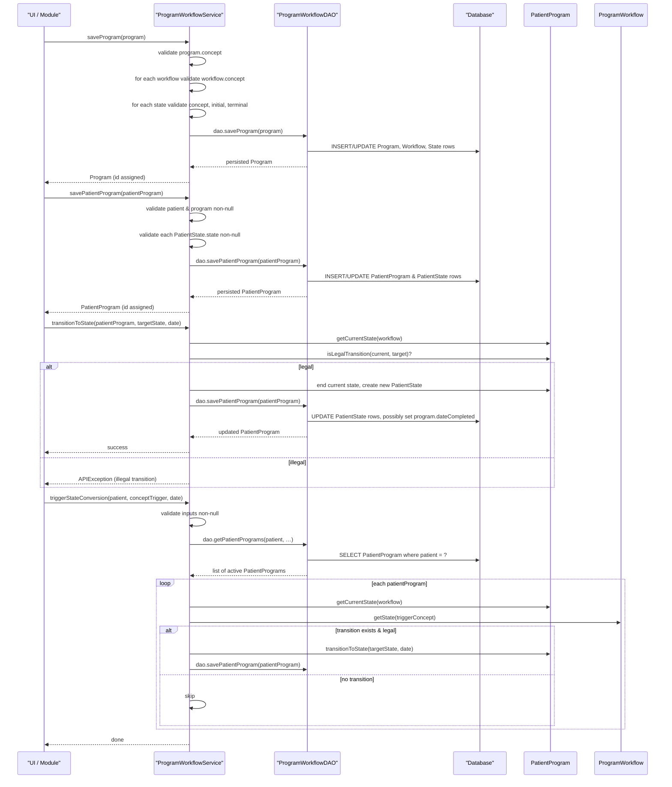

# Program Workflow Management  

## Overview  
The **Program Workflow Management** feature lets administrators and clinicians define clinical programs, the workflows that belong to those programs, and the states that make up each workflow. It also records a patient’s enrollment in a program (`PatientProgram`) and the patient’s progression through the workflow states (`PatientState`).  

* **Who triggers it** – Any code that calls the `ProgramWorkflowService` (e.g., UI controllers, scheduled jobs, or custom modules) can create, update, retire, or purge programs, workflows, states, and patient‑program enrollments.  
* **What it produces** – Persisted domain objects (`Program`, `ProgramWorkflow`, `ProgramWorkflowState`, `PatientProgram`, `PatientState`, `ConceptStateConversion`) and the side‑effects of state transitions (updated dates, void flags, outcome concepts).  

All operations run inside the Spring‑managed transaction defined on `ProgramWorkflowServiceImpl` (`@Transactional`).  

---

## Behavior  

| Action | What the code does (chronological) | Source |
|--------|------------------------------------|--------|
| **Save a Program** | <ul><li>Validate that the program has a non‑null `concept`.</li><li>Iterate over each `ProgramWorkflow` in `program.getAllWorkflows()` and validate each workflow’s `concept`.</li><li>Ensure each workflow’s `program` reference points back to the program (`ensureProgramIsSet`).</li><li>Iterate over each `ProgramWorkflowState` in the workflow and validate that `concept`, `initial`, and `terminal` are non‑null.</li><li>Ensure each state’s `programWorkflow` reference points back to the workflow (`ensureProgramWorkflowIsSet`).</li><li>Delegate persistence to `dao.saveProgram(program)`.</li></ul> | `ProgramWorkflowServiceImpl.saveProgram` (lines 84‑106) |
| **Retire a Program** | <ul><li>Mark the program as retired (handled by `BaseRetireHandler`).</li><li>Iterate over all non‑retired workflows and set `retired=true`.</li><li>Iterate over each workflow’s states and set `retired=true`.</li><li>Save the program again to persist the cascade.</li></ul> | `ProgramWorkflowServiceImpl.retireProgram` (lines 158‑166) |
| **Un‑retire a Program** | <ul><li>Clear the program’s `retired` flag.</li><li>If the program’s `dateChanged` matches a workflow’s `dateChanged`, also clear the workflow’s flag; similarly for states.</li><li>Save the program.</li></ul> | `ProgramWorkflowServiceImpl.unretireProgram` (lines 168‑180) |
| **Save a PatientProgram** | <ul><li>Validate that `patient` and `program` are non‑null.</li><li>For each `PatientState` in `patientProgram.getStates()`:</li><ul><li>Validate that the state’s `ProgramWorkflowState` (`state.getState()`) is non‑null.</li><li>Set the back‑reference `state.setPatientProgram(patientProgram)` if missing.</li><li>If the patient program or the state is voided, propagate the void flag and reason.</li></ul></li><li>If `patientProgram.getDateCompleted()` is set, ensure the most recent state in each workflow has its `endDate` set to the program’s completion date.</li><li>Delegate persistence to `dao.savePatientProgram(patientProgram)` (which also saves custom attributes).</li></ul> | `ProgramWorkflowServiceImpl.savePatientProgram` (lines 210‑242) |
| **Transition a PatientProgram to a new state** | <ul><li>Retrieve the current state for the target workflow via `patientProgram.getCurrentState(workflow)`.</li><li>Validate transition rules (non‑null dates, no existing `endDate`, start‑date precedes transition date, and `workflow.isLegalTransition`).</li><li>If a current state exists, set its `endDate`.</li><li>Create a new `PatientState` with the supplied `ProgramWorkflowState` and `startDate`.</li><li>If the new state is terminal, set `patientProgram.dateCompleted`.</li><li>Add the new state to `patientProgram.getStates()`.</li></ul> | `PatientProgram.transitionToState` (lines 115‑144) |
| **Trigger a Concept‑driven state conversion** | <ul><li>Validate that `patient`, `trigger` (Concept), and `dateConverted` are non‑null.</li><li>Iterate over all active `PatientProgram`s for the patient.</li><li>For each workflow, obtain the current `PatientState` and the target state via `workflow.getState(trigger)`.</li><li>If the transition is legal (`workflow.isLegalTransition`), call `patientProgram.transitionToState(transitionState, dateConverted)`.</li><li>Save the patient program to persist the new state.</li></ul> | `ProgramWorkflowServiceImpl.triggerStateConversion` (lines 286‑317) |
| **Purge (hard delete) a Program** | <ul><li>If `cascade=true` and the program has workflows, throw `APIException` (cascade not implemented).</li><li>Purge all `PatientProgram`s linked to the program.</li><li>Call `dao.deleteProgram(program)`.</li></ul> | `ProgramWorkflowServiceImpl.purgeProgram` (lines 124‑138) |
| **Purge a PatientProgram** | <ul><li>If `cascade=true` and the program has states, throw `APIException` (cascade not implemented).</li><li>Call `dao.deletePatientProgram(patientProgram)`.</li></ul> | `ProgramWorkflowServiceImpl.purgePatientProgram` (lines 254‑262) |
| **Save a ConceptStateConversion** | <ul><li>Validate that `concept`, `programWorkflow`, and `programWorkflowState` are non‑null.</li><li>Delegate to `dao.saveConceptStateConversion`.</li></ul> | `ProgramWorkflowServiceImpl.saveConceptStateConversion` (lines 332‑340) |
| **Retrieve entities by UUID** | <ul><li>All `get*ByUuid` methods delegate to the DAO’s `HibernateUtil.getUniqueEntityByUUID`.</li></ul> | `ProgramWorkflowServiceImpl.getProgramByUuid` (line 382), `getWorkflowByUuid` (line 398), `getStateByUuid` (line 404), etc. |
| **Query helpers** | <ul><li>`getPatientPrograms(Cohort, Collection<Program>)` builds HQL that filters by patient IDs and/or program IDs.</li><li>`findPrograms(nameFragment)` builds a case‑insensitive `LIKE` query and orders by name.</li></ul> | `HibernateProgramWorkflowDAO.getPatientPrograms` (lines 173‑197), `findPrograms` (lines 99‑108) |

---

## Triggers / Entry points  

| Service method | Description | Source |
|----------------|-------------|--------|
| `ProgramWorkflowService.saveProgram(Program)` | Create or update a program (and its workflows/states). | `ProgramWorkflowService.java:84` |
| `ProgramWorkflowService.getProgram(Integer)` | Retrieve a program by primary key. | `ProgramWorkflowService.java:115` |
| `ProgramWorkflowService.getProgramByName(String)` | Retrieve a program by exact name (throws if duplicate). | `ProgramWorkflowService.java:147` |
| `ProgramWorkflowService.getAllPrograms(boolean)` | List all programs, optionally excluding retired. | `ProgramWorkflowService.java:176` |
| `ProgramWorkflowService.purgeProgram(Program, boolean)` | Hard‑delete a program (cascade not supported). | `ProgramWorkflowService.java:197` |
| `ProgramWorkflowService.retireProgram(Program, String)` | Retire a program and cascade to its workflows/states. | `ProgramWorkflowService.java:215` |
| `ProgramWorkflowService.unretireProgram(Program)` | Un‑retire a program and its children if they were retired together. | `ProgramWorkflowService.java:233` |
| `ProgramWorkflowService.savePatientProgram(PatientProgram)` | Enroll a patient in a program or update enrollment data. | `ProgramWorkflowService.java:260` |
| `ProgramWorkflowService.getPatientPrograms(...)` | Search patient‑program enrollments by patient, program, dates, and void flag. | `ProgramWorkflowService.java:311` |
| `ProgramWorkflowService.voidPatientProgram(PatientProgram, String)` | Void a patient‑program enrollment (cascades to states via `savePatientProgram`). | `ProgramWorkflowService.java:340` |
| `ProgramWorkflowService.unvoidPatientProgram(PatientProgram)` | Reverse a void operation. | `ProgramWorkflowService.java:357` |
| `ProgramWorkflowService.triggerStateConversion(Patient, Concept, Date)` | Convert a patient’s state automatically when a concept trigger occurs. | `ProgramWorkflowServiceImpl.triggerStateConversion` (lines 286‑317) |
| `ProgramWorkflowService.saveConceptStateConversion(ConceptStateConversion)` | Create or update a mapping from a concept trigger to a workflow state. | `ProgramWorkflowService.java:501` |
| `ProgramWorkflowService.getConceptStateConversion(ProgramWorkflow, Concept)` | Retrieve a conversion mapping for a workflow/trigger pair. | `ProgramWorkflowService.java:527` |

All of the above are exposed through the Spring bean `programWorkflowService` (in `applicationContext.xml`), so any component that obtains `Context.getProgramWorkflowService()` can invoke them.

---

## End‑to‑end flow (Mermaid)

The diagram shows the main happy‑path flows and the illegal‑transition branch that results in an `APIException`.

---

## State / data touched  

| Entity | Table (Hibernate mapping) | Columns touched | Source |
|--------|---------------------------|----------------|--------|
| `Program` | `program` | `program_id`, `concept_id`, `outcomes_concept_id`, `retired`, `date_created`, `date_changed` | `Program.java` (fields) |
| `ProgramWorkflow` | `program_workflow` | `program_workflow_id`, `program_id`, `concept_id`, `retired` | `ProgramWorkflow.java` |
| `ProgramWorkflowState` | `program_workflow_state` | `program_workflow_state_id`, `program_workflow_id`, `concept_id`, `initial`, `terminal`, `retired` | `ProgramWorkflowState.java` |
| `PatientProgram` | `patient_program` | `patient_program_id`, `patient_id`, `program_id`, `location_id`, `date_enrolled`, `date_completed`, `outcome_concept_id`, `voided`, `void_reason` | `PatientProgram.java` |
| `PatientState` | `patient_state` | `patient_state_id`, `patient_program_id`, `state` (FK to `program_workflow_state`), `start_date`, `end_date`, `encounter_id`, `voided`, `void_reason` | `PatientState.java` |
| `ConceptStateConversion` | `concept_state_conversion` | `concept_state_conversion_id`, `concept_id`, `program_workflow_id`, `program_workflow_state_id` | `ConceptStateConversion` (DAO) |
| `ProgramAttributeType` | `program_attribute_type` | `program_attribute_type_id`, `name`, `datatype_classname`, … | `ProgramAttributeType.java` |
| `PatientProgramAttribute` | `patient_program_attribute` | `patient_program_attribute_id`, `patient_program_id`, `attribute_type_id`, `value_reference`, `voided` | `PatientProgramAttribute.java` |

All reads/writes go through the DAO (`HibernateProgramWorkflowDAO`) which uses the current Hibernate `Session`. No explicit second‑level caches are referenced in the source.

---

## External dependencies  

| Dependency | Reason for use |
|------------|----------------|
| `Concept` (`org.openmrs.Concept`) | Represents the clinical concept that defines a program, workflow, state, or conversion trigger. |
| `Patient` (`org.openmrs.Patient`) | Owner of a `PatientProgram`. |
| `Location` (`org.openmrs.Location`) | Optional enrollment location on `PatientProgram`. |
| `Encounter` (`org.openmrs.Encounter`) | Optional link from a `PatientState` to the encounter that caused the transition (added in 2.5). |
| `CustomDatatypeUtil` | Persists custom attribute values for `PatientProgram` before saving (`HibernateProgramWorkflowDAO.savePatientProgram`). |
| `HibernateUtil.getUniqueEntityByUUID` | Retrieves entities by UUID in DAO methods (`getProgramByUuid`, `getStateByUuid`, etc.). |
| Spring `@Transactional` & `@Authorized` | Transaction management and privilege enforcement for each service method. |
| `MatchMode.ANYWHERE` (Apache Commons) | Used in `findPrograms` to build a case‑insensitive `LIKE` query. |
| `StandardBasicTypes` (Hibernate) | Used for native SQL queries that return patient‑program attribute JSON. |

---

## Configuration / parameters  

| Parameter | Where it appears | Effect |
|-----------|------------------|--------|
| **Privilege constants** (`MANAGE_PROGRAMS`, `GET_PROGRAMS`, `ADD_PATIENT_PROGRAMS`, `EDIT_PATIENT_PROGRAMS`, `DELETE_PATIENT_PROGRAMS`, etc.) | `@Authorized` annotations on every service method | Determines which users/roles can invoke the operation. |
| **`includeRetired` flag** | `getAllPrograms(boolean)`, `getPrograms(String)`, `Program.getWorkflows()` | Controls whether retired entities are returned. |
| **`cascade` flag** on purge methods | `purgeProgram(Program, boolean)`, `purgePatientProgram(PatientProgram, boolean)` | When `true` the method attempts to delete child objects; currently not implemented and throws `APIException`. |
| **`voidReason`** | `voidPatientProgram`, `voidLastState` | Required reason for voiding; APIException thrown if empty (see Javadoc). |
| **`dateEnrolled` / `dateCompleted`** | `PatientProgram` fields | Used by `PatientProgram.getActive(Date)` to determine active enrollment. |
| **`initial` / `terminal` flags** on `ProgramWorkflowState` | Validation in `saveProgram` and transition logic in `ProgramWorkflow.isLegalTransition` | Determines legal entry points and program completion. |
| **`MatchMode.ANYWHERE`** | `HibernateProgramWorkflowDAO.findPrograms` | Enables partial‑name search. |

No external configuration files (e.g., `global.properties`) are referenced directly in the source for this feature.

---

## Edge cases & failure modes  

| Situation | Code path | Result |
|-----------|-----------|--------|
| **Missing required concept** when saving a program or workflow | `ProgramWorkflowServiceImpl.saveProgram` checks `program.getConcept()` and `workflow.getConcept()` | Throws `APIException("Program.concept.required")` or `"ProgramWorkflow.concept.required"`. |
| **State missing required fields** (`concept`, `initial`, `terminal`) | Same method iterates over states and throws `APIException("ProgramWorkflowState.requires")`. |
| **PatientProgram without patient or program** | `savePatientProgram` validates `patientProgram.getPatient()` and `patientProgram.getProgram()` | Throws `APIException("PatientProgram.requires")`. |
| **State transition illegal** (non‑initial start, same state, or disallowed move) | `PatientProgram.transitionToState` calls `workflow.isLegalTransition` and throws `IllegalArgumentException` with a descriptive message. |
| **Attempting cascade purge** (program or patient program) | `purgeProgram(..., true)` and `purgePatientProgram(..., true)` check child collections and throw `APIException("Program.cascade.purging.not.implemented")` or `"PatientProgram.cascade.purging.not.implemented"`. |
| **Duplicate program name** | `ProgramWorkflowServiceImpl.getProgramByName` queries both non‑retired and retired names; if more than one row is returned, throws `ProgramNameDuplicatedException`. |
| **Null UUID lookup** | DAO methods use `HibernateUtil.getUniqueEntityByUUID`; if multiple rows exist, Hibernate throws a `NonUniqueResultException`. |
| **Void without reason** | Javadoc on `voidPatientProgram` states a reason is required; the implementation does not enforce it, but callers are expected to supply a non‑empty string (tests assert this). |
| **Date‑completed set without matching state end dates** | `savePatientProgram` sets end dates on the most recent state(s) if they are null, ensuring consistency. |
| **Concept‑trigger not mapped** | `triggerStateConversion` looks up `workflow.getState(trigger)`; if `null`, no transition occurs (silent skip). |

---

## Open questions  

* **State validation rules beyond `initial`/`terminal`** – The source only checks for non‑null flags; any additional business rules (e.g., exactly one initial state per workflow) are enforced elsewhere or by UI validation, not visible here.  
* **How custom attribute types are validated** – The DAO saves attributes via `CustomDatatypeUtil.saveAttributesIfNecessary`, but the exact validation of attribute values is outside the scope of this feature.  
* **Global property influence** – No global properties are referenced directly, but downstream modules may use them to enable/disable certain workflows; the core code does not expose such hooks.  
* **Caching strategy** – The code does not mention second‑level caches; it is unclear whether OpenMRS configures Hibernate caching for these entities.  

---