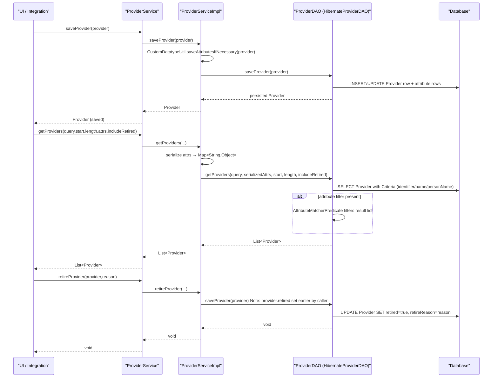

# Provider Management  

## Overview  
The Provider Management feature lets OpenMRS administrators and authorized users create, read, update, and delete **providers** – persons who can deliver care during an encounter – and manage the custom attributes that describe them. All operations are exposed through the `ProviderService` API (`api/src/main/java/org/openmrs/api/ProviderService.java:37‑84`). Calls are typically made from the UI or integration scripts; the service returns `Provider` objects (which wrap a `Person`) and `ProviderAttribute`/`ProviderAttributeType` objects that hold user‑defined metadata (`api/src/main/java/org/openmrs/Provider.java:37‑84`, `api/src/main/java/org/openmrs/ProviderAttribute.java:37‑71`).  

## Behavior  
- **Create / update a provider** – `saveProvider(Provider)` validates the provider’s `Person` reference, persists any custom attributes via `CustomDatatypeUtil.saveAttributesIfNecessary`, and delegates to `ProviderDAO.saveProvider` (`ProviderServiceImpl.saveProvider:71‑78`).  
- **Retrieve providers** – `getAllProviders()` returns all providers (including retired) by delegating to `getAllProviders(true)` (`ProviderServiceImpl.getAllProviders:53‑56`). `getAllProviders(boolean)` forwards the `includeRetired` flag to `ProviderDAO.getAllProviders` (`ProviderServiceImpl.getAllProviders(boolean):61‑64`).  
- **Search providers** – `getProviders(query,start,length,attributes,includeRetired)` serializes attribute values, then calls `ProviderDAO.getProviders` which builds a JPA Criteria query that matches identifier, name, or any `PersonName` fields, applies the global search mode, and optionally filters by retired status (`ProviderServiceImpl.getProviders:96‑104`, `HibernateProviderDAO.getProviders:124‑158`).  
- **Count providers** – `getCountOfProviders(query,includeRetired)` calls `ProviderDAO.getCountOfProviders` which re‑uses the same criteria logic (`ProviderServiceImpl.getCountOfProviders:84‑88`, `HibernateProviderDAO.getCountOfProviders:191‑203`).  
- **Retire / un‑retire** – `retireProvider(provider,reason)` simply saves the provider with the `retired` flag set (`ProviderServiceImpl.retireProvider:57‑60`). `unretireProvider` calls `saveProvider` to clear the flag (`ProviderServiceImpl.unretireProvider:62‑65`).  
- **Purge** – `purgeProvider` invokes `ProviderDAO.deleteProvider` to remove the row (`ProviderServiceImpl.purgeProvider:68‑71`).  
- **Attribute type CRUD** – `saveProviderAttributeType`, `retireProviderAttributeType`, `unretireProviderAttributeType`, and `purgeProviderAttributeType` delegate to the DAO (`ProviderServiceImpl.saveProviderAttributeType:150‑153`, `retire…:156‑159`, `unretire…:162‑165`, `purge…:168‑171`).  
- **Attribute CRUD** – `getProviderAttribute(id)` and `getProviderAttributeByUuid(uuid)` retrieve attribute entities via the DAO (`ProviderServiceImpl.getProviderAttribute:124‑128`, `getProviderAttributeByUuid:132‑136`).  
- **Identifier uniqueness** – `isProviderIdentifierUnique` runs a count query that excludes the current provider ID (`HibernateProviderDAO.isProviderIdentifierUnique:226‑242`).  
- **Unknown provider** – `getUnknownProvider` reads the global property `GP_UNKNOWN_PROVIDER_UUID` and fetches the matching provider (`ProviderServiceImpl.getUnknownProvider:186‑190`).  

## Triggers / Entry points  
- **Service interface** – `ProviderService` methods are the public entry points (`api/src/main/java/org/openmrs/api/ProviderService.java:37‑84`).  
- **Implementation** – `ProviderServiceImpl` is the concrete class wired into the OpenMRS context (`api/src/main/java/org/openmrs/api/impl/ProviderServiceImpl.java:45‑190`).  
- **DAO layer** – All persistence calls go through `ProviderDAO` (`api/src/main/java/org/openmrs/api/db/ProviderDAO.java`) and its Hibernate implementation (`api/src/main/java/org/openmrs/api/db/hibernate/HibernateProviderDAO.java`).  
- **Authorization** – Each service method is annotated with `@Authorized` and the required privilege constant (e.g., `GET_PROVIDERS`, `MANAGE_PROVIDERS`) (`ProviderService.java` lines with `@Authorized`).  

## End‑to‑end flow (Mermaid)  

## State / data touched  
| Entity | Table / Collection | Source |
|--------|-------------------|--------|
| `Provider` | `provider` table (via Hibernate) | `HibernateProviderDAO.saveProvider` (api/src/main/java/org/openmrs/api/db/hibernate/HibernateProviderDAO.java:84‑88) |
| `ProviderAttribute` | `provider_attribute` table | `HibernateProviderDAO.getProviderAttribute` / `saveProviderAttributeType` (api/src/main/java/.../HibernateProviderDAO.java:106‑110, 260‑264) |
| `ProviderAttributeType` | `provider_attribute_type` table | `HibernateProviderDAO.getAllProviderAttributeTypes` (api/src/main/java/.../HibernateProviderDAO.java:215‑226) |
| `Person` (linked) | `person` and related name tables | accessed via joins in `prepareProviderCriteria` (api/src/main/java/.../HibernateProviderDAO.java:138‑166) |
| Global property cache | `global_property` table (for `GP_UNKNOWN_PROVIDER_UUID`) | `ProviderServiceImpl.getUnknownProvider` (api/src/main/java/.../ProviderServiceImpl.java:186‑190) |

## External dependencies  
- **Custom datatype handling** – `CustomDatatypeUtil` saves attribute values before persisting a provider (`ProviderServiceImpl.saveProvider:71‑73`).  
- **Context services** – `Context.getProviderService()` is used for recursive calls and to fetch other services (`ProviderServiceImpl` many lines).  
- **Administration service** – reads global properties (`OpenmrsConstants.GP_UNKNOWN_PROVIDER_UUID`) (`ProviderServiceImpl.getUnknownProvider`).  
- **Hibernate SessionFactory** – underlying persistence (`HibernateProviderDAO` uses `sessionFactory.getCurrentSession()`).  

## Configuration / parameters  
- **`GP_UNKNOWN_PROVIDER_UUID`** – global property that stores the UUID of the “unknown” provider used when a provider cannot be determined (`ProviderServiceImpl.getUnknownProvider:186‑188`).  
- **`provider.search.matchMode`** – global property that controls how name searches are matched (`HibernateProviderDAO.getMatchMode:173‑186`). Values: `START`, `ANYWHERE`, `END`, `EXACT`.  

## Edge cases & failure modes  
- **Null person** – `getProvidersByPerson(Person)` throws `IllegalArgumentException` if the person argument is null (`ProviderServiceImpl.getProvidersByPerson:115‑119`).  
- **Identifier uniqueness** – `isProviderIdentifierUnique` returns `false` when another provider has the same identifier; it treats `null` or blank identifiers as unique (`HibernateProviderDAO.isProviderIdentifierUnique:226‑242`).  
- **Retired handling** – many queries exclude retired providers unless `includeRetired` is true; retired providers are ordered last (`prepareProviderCriteria` adds `cb.isFalse(root.get("retired"))` when `!includeRetired` and adds ordering on `retired` when true).  
- **Attribute filtering** – after the main provider query, `AttributeMatcherPredicate` filters the result list; if attribute map is null, no extra filtering occurs (`HibernateProviderDAO.getProviders:152‑159`).  
- **Global property missing** – if `GP_UNKNOWN_PROVIDER_UUID` is not set, `getUnknownProvider` returns `null` (no explicit null‑check, so callers must handle).  

## Open questions  
- **Concurrency** – The DAO uses simple `saveOrUpdate`; there is no explicit optimistic locking or version checking visible in the source. How concurrent updates are resolved is not evident.  
- **Bulk operations** – No batch‑delete or bulk‑update APIs are present; large‑scale provider imports would need custom code.  
- **Caching** – The code does not reference any second‑level cache or explicit cache eviction; it relies on Hibernate’s default caching behavior.  
- **Event publishing** – No OpenMRS events (e.g., `ProviderSavedEvent`) are emitted in the current implementation; integration points that rely on events would need to be added elsewhere.