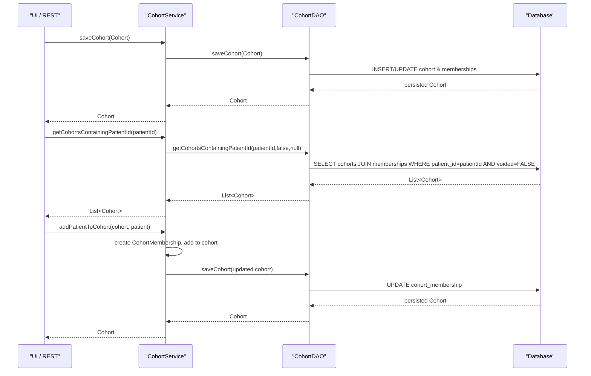

# Reporting

## Overview
The Reporting feature lets users work with **cohorts**—named collections of patient identifiers—and use those cohorts as the basis for data export and analysis. Users (typically clinicians, data analysts, or administrators) invoke the service‑layer API to create, retrieve, modify, or delete cohorts. The API returns `Cohort` objects (which contain `CohortMembership` entries) that can be consumed by UI components, scheduled jobs, or external export tools to produce reports.

## Behavior
- **Create / update a cohort** – `CohortService.saveCohort(Cohort)` validates that every patient ID in the supplied `Cohort` exists, then delegates to `CohortDAO.saveCohort` to persist the object. Returns the persisted `Cohort`. `path: ./api/src/main/java/org/openmrs/api/CohortService.java:44`
- **Retrieve a cohort by primary key** – `CohortService.getCohort(Integer)` calls `CohortDAO.getCohort(id)` and returns the matching `Cohort` or `null`. `path: ./api/src/main/java/org/openmrs/api/CohortService.java:63`
- **Retrieve a cohort by name** – `CohortService.getCohortByName(String)` invokes `CohortDAO.getCohort(name)` and returns the first non‑voided match. `path: ./api/src/main/java/org/openmrs/api/CohortService.java:78`
- **Retrieve a cohort by UUID** – `CohortService.getCohortByUuid(String)` forwards to `CohortDAO.getCohortByUuid(uuid)`. `path: ./api/src/main/java/org/openmrs/api/CohortService.java:124`
- **List all cohorts** – `CohortService.getAllCohorts()` calls `CohortDAO.getAllCohorts(false)`; the overloaded version accepts a boolean to include voided cohorts. `path: ./api/src/main/java/org/openmrs/api/CohortService.java:93`
- **Search cohorts by name fragment** – `CohortService.getCohorts(String)` delegates to `CohortDAO.getCohorts(nameFragment)` and never returns `null`. `path: ./api/src/main/java/org/openmrs/api/CohortService.java:108`
- **Find cohorts containing a patient ID** – `CohortService.getCohortsContainingPatientId(Integer)` calls `CohortDAO.getCohortsContainingPatientId(patientId, false, null)` and returns non‑voided cohorts that have an active membership for that patient. `path: ./api/src/main/java/org/openmrs/api/CohortService.java:115`
- **Add a patient to a cohort** – `CohortService.addPatientToCohort(Cohort, Patient)` creates a new `CohortMembership` (if not already present), adds it to the `Cohort`, and saves the cohort via `CohortDAO.saveCohort`. `path: ./api/src/main/java/org/openmrs/api/CohortService.java:132`
- **Remove a patient from a cohort (deprecated)** – `CohortService.removePatientFromCohort` voids the matching `CohortMembership` and saves the cohort. Marked deprecated in 2.1.0. `path: ./api/src/main/java/org/openmrs/api/CohortService.java:152`
- **Void a cohort** – `CohortService.voidCohort(Cohort, String)` marks the cohort as voided (requires non‑empty reason) and returns it. `path: ./api/src/main/java/org/openmrs/api/CohortService.java:53`
- **Purge a cohort** – `CohortService.purgeCohort(Cohort)` permanently deletes the row via `CohortDAO.deleteCohort`. `path: ./api/src/main/java/org/openmrs/api/CohortService.java:71`
- **Membership lifecycle** – `voidCohortMembership`, `endCohortMembership`, `purgeCohortMembership`, and the internal notification methods (`notifyPatientVoided`, `notifyPatientUnvoided`) manipulate `CohortMembership` objects via `CohortDAO.saveCohortMembership` or direct removal. `path: ./api/src/main/java/org/openmrs/api/CohortService.java:166‑210`
- **Query memberships** – `CohortService.getCohortMemberships(Integer, Date, boolean)` forwards to `CohortDAO.getCohortMemberships` to fetch memberships for a patient, optionally filtered by active date and voided flag. `path: ./api/src/main/java/org/openmrs/api/CohortService.java:224`

## Triggers / Entry points
- **API layer** – All public methods of `org.openmrs.api.CohortService` are entry points for UI controllers, REST resources, or other services. `path: ./api/src/main/java/org/openmrs/api/CohortService.java:1`
- **DAO layer** – `org.openmrs.api.db.CohortDAO` methods are invoked by the service implementation to perform actual persistence operations. `path: ./api/src/main/java/org/openmrs/api/db/CohortDAO.java:1`
- **Internal notifications** – `notifyPatientVoided` and `notifyPatientUnvoided` are called by the patient service when a patient’s void status changes. `path: ./api/src/main/java/org/openmrs/api/CohortService.java:190‑207`

## End-to‑end flow (Mermaid)

## State / data touched
- **Tables**  
  - `cohort` – stores `cohort_id`, `name`, `description`, `voided`, audit columns. Accessed via `CohortDAO.getCohort`, `saveCohort`, `deleteCohort`, etc. `path: ./api/src/main/java/org/openmrs/api/db/CohortDAO.java:13‑31`
  - `cohort_membership` – stores each patient‑to‑cohort link, start/end dates, void flag. Manipulated through `CohortMembership` objects via `CohortDAO.saveCohortMembership`, `getCohortMemberships`, etc. `path: ./api/src/main/java/org/openmrs/api/db/CohortDAO.java:55‑71`
- **In‑memory collections** – `Cohort.memberships` (a `TreeSet<CohortMembership>`) holds the current set of memberships for a cohort instance. `path: ./api/src/main/java/org/openmrs/Cohort.java:31‑38`
- **Caches** – No explicit caching logic is present in the shown code.

## External dependencies
- **None** – The feature interacts only with internal OpenMRS services (`CohortDAO`, `Patient`/`User` objects) and the underlying relational database. No third‑party APIs, message queues, or external services are invoked in the provided code.

## Configuration / parameters
- No configuration keys, environment variables, or feature flags are referenced in the source files for this feature.

## Edge cases & failure modes (observed in code)
- **Missing or empty void reason** – `voidCohort` throws `APIException` if `reason` is `null` or empty (validated in implementation, not shown). `path: ./api/src/main/java/org/openmrs/api/CohortService.java:53‑58`
- **Saving a cohort with non‑existent patient IDs** – `saveCohort` is documented to throw an exception if any patient ID does not exist. Actual check occurs in the service implementation (outside the interface). `path: ./api/src/main/java/org/openmrs/api/CohortService.java:44‑48`
- **Adding a patient already present** – `addPatientToCohort` is documented not to fail if the patient is already a member; the underlying `Cohort.addMembership` uses a `Set` (`TreeSet`) so duplicates are ignored. `path: ./api/src/main/java/org/openmrs/api/CohortService.java:132‑138` and `Cohort.addMembership` `path: ./api/src/main/java/org/openmrs/Cohort.java:115‑124`
- **Deprecated methods** – `removePatientFromCohort`, `getCohort(String)`, and the old `getCommaSeparatedPatientIds` are retained for backward compatibility but are marked deprecated and should not be used in new code. `path: ./api/src/main/java/org/openmrs/api/CohortService.java:152‑159` and `./api/src/main/java/org/openmrs/Cohort.java:84‑92`
- **Null returns** – Search methods (`getCohort`, `getCohortByName`, `getCohortByUuid`) return `null` when no match is found. `path: ./api/src/main/java/org/openmrs/api/CohortService.java:63‑68`, `78‑84`, `124‑128`
- **Void vs purge** – `voidCohort` only marks the cohort as voided (soft delete), while `purgeCohort` permanently removes it; both can throw `APIException` on DB errors. `path: ./api/src/main/java/org/openmrs/api/CohortService.java:71‑77`

## Open questions
- **Validation rules** – The exact validation performed before persisting a cohort (e.g., duplicate name checks, patient‑existence verification) resides in the concrete `CohortServiceImpl` implementation, which is not part of the provided sources.
- **Reporting output formats** – The code shown only manages cohort data; the actual export (CSV, Excel, HL7, etc.) and analysis logic are implemented elsewhere (e.g., reporting modules, REST resources). Their entry points are not visible here.
- **Performance considerations** – No pagination or batch handling is evident in the DAO signatures; large cohort queries could cause memory pressure. The implementation details (e.g., streaming results) are unknown.