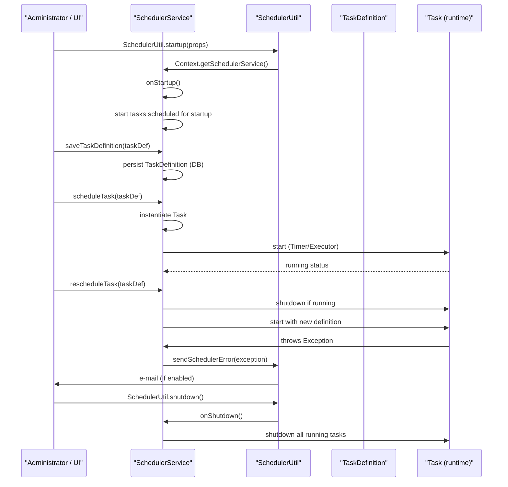

# Scheduler Management

## Overview
The Scheduler Management feature provides the ability to create, start, stop, reschedule, and delete background tasks that run inside OpenMRS.  Administrators (or any code that holds the **Manage Scheduler** privilege) invoke the service methods to manipulate `TaskDefinition` objects, and the scheduler service executes those tasks according to their start time and repeat interval.  The feature produces a live collection of scheduled tasks, updates task status, and can send error‑notification e‑mails when a task fails.

## Behavior
- **Service definition** – `SchedulerService` declares all operations needed to manage tasks, each annotated with `@Authorized({"Manage Scheduler"})` to enforce permission checks.  Methods include:
  - `getStatus(Integer id)` – returns the current status string for a task (`SchedulerService.java:31‑34`).
  - `onStartup()` / `onShutdown()` – lifecycle hooks called when the OpenMRS server starts or stops (`SchedulerService.java:38‑45`).
  - `scheduleTask(TaskDefinition task)` – creates a `Task` from a `TaskDefinition` and adds it to the scheduler (`SchedulerService.java:55‑60`).
  - `rescheduleTask(TaskDefinition task)` – stops the existing task (if any) and starts it again with the new definition (`SchedulerService.java:62‑66`).
  - `rescheduleAllTasks()` – iterates over every started task and re‑creates it, useful after a class‑loader change (`SchedulerService.java:68‑71`).
  - Retrieval methods (`getScheduledTasks()`, `getRegisteredTasks()`, `getTask(Integer)`, `getTaskByUuid(String)`, `getTaskByName(String)`) return collections or single `TaskDefinition` objects (`SchedulerService.java:73‑95`).
  - Persistence methods (`saveTaskDefinition(TaskDefinition)`, `deleteTask(Integer)`) store or remove definitions in the database (`SchedulerService.java:97‑108`).
  - `scheduleIfNotRunning(TaskDefinition)` – convenience method that schedules a task only when it is not already active (`SchedulerService.java:119‑122`).

- **Utility class** – `SchedulerUtil` contains static helpers that are invoked by the OpenMRS core startup/shutdown sequence:
  - `startup(Properties p)` reads deprecated runtime properties (`scheduler.username`, `scheduler.password`) and logs a warning, then obtains the `SchedulerService` via `Context.getSchedulerService()` and calls `onStartup()` under a proxy privilege (`SchedulerUtil.java:30‑55`).
  - `shutdown()` obtains the service (ignoring errors) and calls `onShutdown()` under the same proxy privilege (`SchedulerUtil.java:57‑73`).
  - `sendSchedulerError(Throwable)` builds an e‑mail using global properties (`scheduler.admin.email.enabled`, `scheduler.admin.email`) and sends it via `Context.getMessageService()`; all errors are caught and logged (`SchedulerUtil.java:75‑115`).
  - `getNextExecution(TaskDefinition)` computes the next future execution time based on the task’s start time and repeat interval, handling one‑shot tasks and logging any calculation errors (`SchedulerUtil.java:117‑165`).

- **Task execution** – When `scheduleTask` is called, the implementation (outside the provided interface) creates a concrete `Task` object, registers it with the underlying Java `Timer`/`Executor`, and updates the task’s status.  The `rescheduleAllTasks` method ensures that after a module reload the class loader is refreshed for each task.

## Triggers / Entry points
- **Application startup** – `SchedulerUtil.startup(Properties)` is called from the core server bootstrap; it invokes `SchedulerService.onStartup()` (`SchedulerUtil.java:44‑55`).
- **Application shutdown** – `SchedulerUtil.shutdown()` is called during server shutdown and invokes `SchedulerService.onShutdown()` (`SchedulerUtil.java:61‑73`).
- **Administrative UI / API** – Any UI or REST endpoint that calls the `SchedulerService` methods (e.g., `scheduleTask`, `rescheduleTask`, `deleteTask`) triggers task management (`SchedulerService.java:55‑108`).
- **Error handling** – When a task throws an exception, the scheduler catches it and calls `SchedulerUtil.sendSchedulerError(Throwable)` to notify administrators (`SchedulerUtil.java:75‑115`).

## End‑to‑end flow (Mermaid)

## State / data touched
- **`TaskDefinition` table** – persisted via `saveTaskDefinition` and removed via `deleteTask` (`SchedulerService.java:97‑108`).
- **In‑memory collections** – the scheduler keeps a runtime map of active `Task` objects (referenced by `scheduleTask`, `rescheduleTask`, `rescheduleAllTasks`).
- **System variables** – `SchedulerUtil.getNextExecution` reads the global system variables when logging the next execution time (`SchedulerUtil.java:149‑155`).

## External dependencies
- **`Context`** – provides access to OpenMRS services (`SchedulerUtil.java:44‑55`, `SchedulerUtil.java:61‑73`).
- **`AdministrationService`** – reads global properties for e‑mail configuration (`SchedulerUtil.java:84‑95`).
- **`MessageService`** – sends error e‑mails (`SchedulerUtil.java:101‑108`).
- **`PrivilegeConstants.MANAGE_SCHEDULER`** – used for proxy privilege elevation (`SchedulerUtil.java:46‑53`, `SchedulerUtil.java:65‑71`).
- **Apache Commons Lang (`ExceptionUtils`)** – formats stack traces (`SchedulerUtil.java:119‑122`).
- **SLF4J (`Logger`)** – logs warnings, debug, and error messages throughout (`SchedulerUtil.java:22‑27`, `SchedulerUtil.java:133‑138`).

## Configuration / parameters
- **Runtime properties (deprecated)** – `scheduler.username` and `scheduler.password` can override defaults; a warning is logged when they are present (`SchedulerUtil.java:30‑38`).
- **Global properties for e‑mail** –  
  - `scheduler.admin.email.enabled` (boolean) – enables/disables error e‑mail (`SchedulerUtil.java:84‑86`).  
  - `scheduler.admin.email` – comma‑separated list of recipients (`SchedulerUtil.java:88‑92`).  
  - `SchedulerConstants.SCHEDULER_DEFAULT_FROM` and `SchedulerConstants.SCHEDULER_DEFAULT_SUBJECT` are used as the sender and subject prefix (`SchedulerUtil.java:96‑100`).

## Edge cases & failure modes
- **Missing or invalid task definition** – `scheduleTask` and `rescheduleTask` declare `throws SchedulerException`; callers must handle this (interface signature `SchedulerService.java:55‑66`).
- **One‑shot tasks** – `SchedulerUtil.getNextExecution` returns the original start time when `repeatInterval == 0` (`SchedulerUtil.java:132‑136`).
- **Past start times** – the utility calculates the next future execution to avoid “catch‑up” runs (`SchedulerUtil.java:138‑152`).
- **Global property lookup failures** – `sendSchedulerError` catches any exception while building or sending the e‑mail and logs a warning without propagating (`SchedulerUtil.java:108‑115`).
- **Privilege elevation failures** – both `startup` and `shutdown` wrap the privileged block in a `try/finally` to guarantee `removeProxyPrivilege` even if an exception occurs (`SchedulerUtil.java:46‑53`, `SchedulerUtil.java:65‑71`).

## Open questions
- **Implementation details of `Task`** – the concrete class that represents a running task (e.g., whether it uses `java.util.Timer`, `ScheduledExecutorService`, or a custom thread pool) is not visible in the provided source.
- **Exact persistence schema** – the table name and column mapping for `TaskDefinition` are not shown; only the service methods indicate that the entity is stored in the database.
- **How “registered tasks” are discovered** – `getRegisteredTasks()` returns a collection of tasks that are “available to be scheduled,” but the discovery mechanism (e.g., classpath scanning, module registration) is not present in the supplied files.