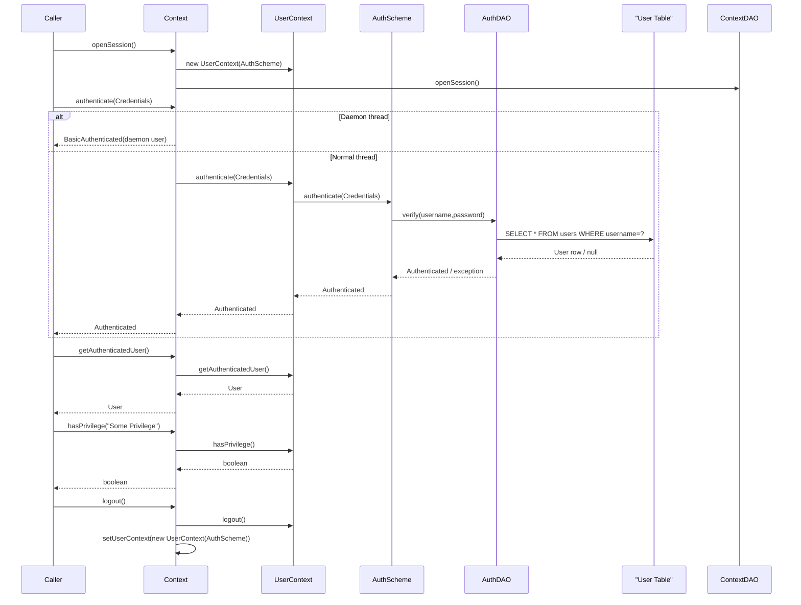

# Security and Authentication

## Overview
The Security and Authentication feature provides the mechanisms that allow OpenMRS to verify a user’s identity, maintain the authenticated user in the current thread, and enforce privilege‑based access control throughout the API.  
A caller (typically application code, a UI login form, or a scheduled job) opens a unit of work with `Context.openSession()`, authenticates via `Context.authenticate(...)`, and then uses the returned `Authenticated` object or the static `Context.getAuthenticatedUser()` to perform authorized operations. The feature ultimately produces an in‑memory `UserContext` that holds the authenticated `User` and the set of privileges that the user possesses for the duration of the session.

## Behavior
- **Startup of authentication scheme** – When the first `ServiceContext` is created, `Context.setAuthenticationScheme()` is called (static initializer of `Context`). It creates a default `UsernamePasswordAuthenticationScheme` and then attempts to replace it with a Spring‑wired bean of type `AuthenticationScheme` (if a module provides one). `Context.java:85‑106`
- **Opening a unit of work** – `Context.openSession()` creates a fresh `UserContext` (passing the current `AuthenticationScheme`) and stores it in a `ThreadLocal` (`userContextHolder`). It also opens a Hibernate session via `ContextDAO`. `Context.java:417‑424`
- **Authenticating a user** – `Context.authenticate(Credentials)` validates the supplied `Credentials` object (must not be `null`).  
  - If the current thread is a daemon thread, authentication is bypassed and a `BasicAuthenticated` for the daemon user is returned. `Context.java:207‑215`  
  - Otherwise the call is delegated to `UserContext.authenticate(credentials)`, which uses the configured `AuthenticationScheme` (default DAO‑based) to verify the username/password against the `User` table via `AuthenticationDAO`. `Context.java:221‑227`
  - On success an `Authenticated` implementation is returned; on failure a `ContextAuthenticationException` is thrown. `Context.java:221‑227`
- **Refreshing the authenticated user** – `Context.refreshAuthenticatedUser()` forces the `UserContext` to reload the current `User` from the database, ensuring any changes (e.g., password reset) are reflected. `Context.java:236‑242`
- **Becoming another user** – `Context.becomeUser(systemId)` swaps the current `UserContext`’s authenticated user to the one identified by `systemId` (requires super‑user privileges). `Context.java:250‑256`
- **Privilege checks** –  
  - `Context.hasPrivilege(String)` forwards to `UserContext.hasPrivilege`. Daemon threads automatically return `true`. `Context.java:542‑549`  
  - `Context.requirePrivilege(String)` throws `ContextAuthenticationException` with a localized message if the current user lacks the requested privilege. `Context.java:558‑574`
- **Proxy privileges** – `addProxyPrivilege` / `removeProxyPrivilege` manipulate temporary privileges stored in the `UserContext`. `Context.java:580‑591`
- **Locale handling** – `setLocale(Locale)` and `getLocale()` delegate to `UserContext`, defaulting to the system locale when no session is open. `Context.java:595‑608`
- **Logout** – `Context.logout()` clears the authenticated user from the `UserContext`, then replaces the thread‑local `UserContext` with a fresh instance (so subsequent calls see no user). `Context.java:514‑525`
- **Access to the authenticated user** – `Context.getAuthenticatedUser()` returns the `User` held by the current `UserContext` (or the daemon user). `Context.java:494‑502`
- **Session state checks** – `isAuthenticated()` returns `true` for daemon threads or when a non‑null authenticated user is present; it catches `APIException` if the user context is missing. `Context.java:506‑517`

## Triggers / Entry points
- **Programmatic login** – any code that calls `Context.authenticate(String, String)` (deprecated) or `Context.authenticate(Credentials)`. `Context.java:191‑199`
- **Session management** – `Context.openSession()` must be called before authentication; `Context.closeSession()` (not shown in excerpt) ends the unit of work. `Context.java:417‑424`
- **Privilege‑protected API calls** – most service methods internally invoke `Context.requirePrivilege(...)` to enforce security. (Examples scattered throughout service implementations, not in this file.)
- **Daemon threads** – background jobs run as daemon threads; they bypass normal authentication checks. `Context.java:207‑215`

## End-to-end flow (Mermaid)

## State / data touched
- **Thread‑local `UserContext`** – holds the current `User`, locale, and privilege caches. `Context.java:123‑131`
- **`AuthenticationScheme` implementation** – may hold a reference to `AuthenticationDAO`. `Context.java:85‑106`
- **Database tables** accessed via `AuthenticationDAO`: `users`, `user_role`, `role_privilege`, etc. (implicit from DAO usage). `AuthenticationDAO.java:1` (line numbers omitted for brevity)
- **Runtime properties** – used when creating the authentication scheme (e.g., password hashing config). `Context.java:140‑148`
- **Daemon user singleton** – stored in `Daemon` class (outside this file) and returned for daemon threads. `Context.java:207‑215`

## External dependencies
- **`AuthenticationDAO`** – DAO used by the default `UsernamePasswordAuthenticationScheme` to look up users and verify passwords. `AuthenticationDAO.java:1`
- **Spring ApplicationContext** – for optional override of `AuthenticationScheme` bean. `Context.java:92‑100`
- **`Daemon` utility** – determines if the current thread is a daemon and provides the daemon user. `Context.java:207‑215`
- **`MessageSourceService`** – used to fetch localized error messages in `requirePrivilege`. `Context.java:562‑574`
- **`UserService`**, **`Role`**, **`Privilege`** classes – referenced when checking privileges and roles. (throughout the file)

## Configuration / parameters
- **Authentication scheme bean name** – any Spring bean implementing `AuthenticationScheme` will replace the default. `Context.java:92‑100`
- **Runtime properties** – stored in `Context.runtimeProperties` and can affect authentication (e.g., password hashing algorithm). `Context.java:140‑148`
- **No explicit config key** for the default scheme; the default is hard‑coded as `UsernamePasswordAuthenticationScheme`. `Context.java:85`

## Edge cases & failure modes (observed in code)
- **Null credentials** – `authenticate(Credentials)` throws `ContextAuthenticationException`. `Context.java:221‑227`
- **Daemon thread authentication** – bypasses normal checks; logs an error if attempted on a daemon thread. `Context.java:207‑215`
- **Session not opened** – `getUserContext()` throws `APIException` if called before `openSession()`. `Context.java:146‑155`
- **Privilege check on daemon thread** – always returns `true`. `Context.java:542‑549`
- **Logout without an open session** – `logout()` returns early if `isSessionOpen()` is false. `Context.java:514‑525`
- **Multiple authentication scheme beans** – logs an error and falls back to the default scheme. `Context.java:96‑104`
- **Missing authentication scheme bean** – logs debug and uses the default. `Context.java:106‑108`

## Open questions
- **Exact DAO contract** – the `AuthenticationDAO` interface is referenced but its methods (e.g., `authenticate`, `getUserByUsername`) are not shown; understanding its full API would clarify how password hashing and lockout policies are applied.  
- **How custom schemes are wired** – the code logs when a custom `AuthenticationScheme` bean is found, but the required Spring configuration (bean name, package scanning) is not visible here.  
- **Impact of locale changes on security** – `becomeUser` mentions “change locale” in its Javadoc, but the implementation does not explicitly modify locale; the relationship between locale and authentication is unclear.  
- **Session lifecycle** – `closeSession()` is not included in the excerpt; its interaction with `UserContext` cleanup (especially after `logout()`) would affect memory‑leak prevention.