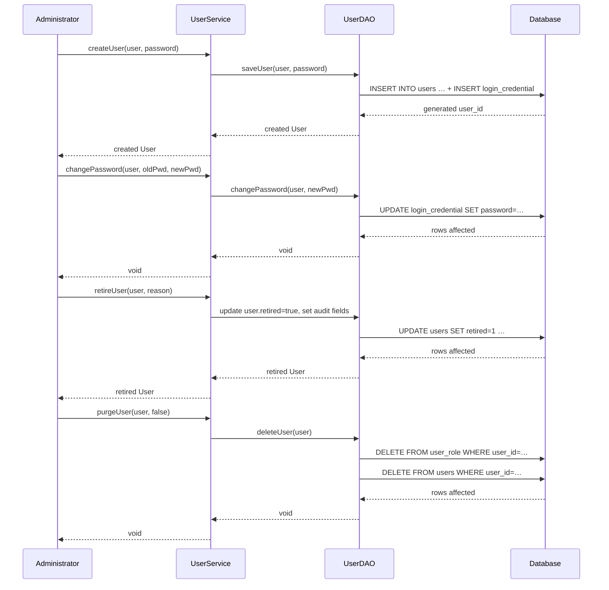

# User Management

## Overview
The **User Management** feature provides administrators with the ability to create, read, update, and delete user accounts, as well as to manage the roles and privileges that control what each user can do in the system.  
An administrator (or any authenticated user with the appropriate privileges) invokes the service methods defined in `org.openmrs.api.UserService`. The service interacts with the persistence layer (`UserDAO`) to read or write data in the `users`, `user_role`, `user_property`, and related tables, and returns domain objects (`User`, `Role`, `Privilege`) to the caller.

## Behavior
- **Create a user with a password** – `UserService.createUser(User, String)` validates `ADD_USERS` privilege, logs the password argument as ignored, and delegates to `UserDAO.saveUser(User, String)` which inserts a row in `users` and creates a `LoginCredential` record. `UserService.java:24‑30` → `UserDAO.java:24‑30`.  
- **Change a user’s password** – `UserService.changePassword(User, String, String)` checks `EDIT_USER_PASSWORDS`, validates the old password (or bypasses it if the caller has the privilege), enforces length rules, then calls `UserDAO.changePassword(User, String)` to update the credential. `UserService.java:47‑61` → `UserDAO.java:71‑73`.  
- **Retrieve a user** – Several overloads exist:  
  - By internal ID: `UserService.getUser(Integer)` → `UserDAO.getUser(Integer)`. `UserService.java:83‑88`.  
  - By UUID: `UserService.getUserByUuid(String)` → `UserDAO.getUserByUuid(String)`. `UserService.java:104‑110`.  
  - By username: `UserService.getUserByUsername(String)` → `UserDAO.getUserByUsername(String)`. `UserService.java:125‑130`.  
  - By email, activation key, or username/email combo follow the same pattern (`UserDAO` methods).  
- **Update a user** – `UserService.saveUser(User)` validates `EDIT_USERS` and forwards to `UserDAO.saveUser(User, null)` (password unchanged). `UserService.java:173‑179`.  
- **Retire (deactivate) a user** – `UserService.retireUser(User, String)` sets the `retired` flag, `retiredBy`, `dateRetired`, and `retireReason` on the `User` entity and persists it. `UserService.java:194‑202`.  
- **Un‑retire a user** – `UserService.unretireUser(User)` clears the retired flag and related audit fields. `UserService.java:215‑221`.  
- **Purge a user** – `UserService.purgeUser(User)` (no‑cascade) removes role links and calls `UserDAO.deleteUser(User)`. With `cascade=true` it throws `APIException`. `UserService.java:236‑247`.  
- **List all users** – `UserService.getAllUsers()` returns every non‑voided user via `UserDAO.getAllUsers()`. `UserService.java:267‑272`.  
- **Search users** – `UserService.getUsers(String, List<Role>, boolean)` and the overloaded paged version build a query that matches name, system ID, and role membership, then sorts by `PersonByNameComparator`. `UserService.java:306‑322`.  
- **Role management** – `saveRole(Role)`, `purgeRole(Role)`, `getAllRoles()`, `getRole(String)`, `getRoleByUuid(String)` delegate to `UserDAO` methods that operate on the `role` and `role_privilege` tables. `UserService.java:309‑340`.  
- **Privilege management** – `savePrivilege(Privilege)`, `purgePrivilege(Privilege)`, `getAllPrivileges()`, `getPrivilege(String)`, `getPrivilegeByUuid(String)` delegate to `UserDAO` methods that operate on the `privilege` table. `UserService.java:351‑376`.  
- **User properties** – `setUserProperty(User, String, String)` and `removeUserProperty(User, String)` modify the `user_property` collection on the `User` entity (persisted via `UserDAO` on save). `UserService.java:398‑416`.  
- **System‑ID generation** – `UserService.generateSystemId()` calls `UserDAO.generateSystemId()` which returns the next integer from a sequence and formats it as a string. `UserService.java:424‑430`.  
- **Locale handling** – `User.getProficientLocales()` parses the `user_property` entry `OpenmrsConstants.USER_PROPERTY_PROFICIENT_LOCALES` into a list of `Locale` objects. `User.java:274‑311`.  

## Triggers / Entry points
- **Service interface** – All public methods in `org.openmrs.api.UserService` are entry points for the feature. The interface resides in `./api/src/main/java/org/openmrs/api/UserService.java`.  
- **DAO layer** – Each service method ultimately calls a corresponding method in `org.openmrs.api.db.UserDAO` (`./api/src/main/java/org/openmrs/api/db/UserDAO.java`).  
- **Security annotations** – `@Authorized` on each service method enforces that the caller possesses the required privilege before execution (e.g., `ADD_USERS`, `EDIT_USERS`, `GET_USERS`). `UserService.java:24‑460`.  

## End‑to‑end flow (Mermaid)

## State / data touched
| Entity / Table | Read | Write | Source |
|----------------|------|-------|--------|
| `users` | `UserDAO.getUser*`, `UserDAO.getAllUsers`, `UserDAO.getUsers*` | `UserDAO.saveUser`, `UserDAO.deleteUser`, `UserDAO.update` (retire/unretire) | `UserDAO.java:24‑30`, `UserDAO.java:46‑52`, `UserDAO.java:71‑73` |
| `user_role` (join) | `UserDAO.getUsersByRole`, `UserDAO.getUsers*` | `User.addRole`, `User.removeRole`, `UserDAO.deleteUser` (clears roles) | `User.java:140‑155`, `UserDAO.java:46‑52` |
| `user_property` | `User.getUserProperties()`, `UserService.getUserProperty*` | `User.setUserProperty`, `User.removeUserProperty`, `UserService.setUserProperty` | `User.java:226‑260`, `UserService.java:398‑416` |
| `role`, `role_privilege` | `UserDAO.getAllRoles`, `UserDAO.getRole*` | `UserDAO.saveRole`, `UserDAO.deleteRole` | `UserDAO.java:84‑92`, `UserDAO.java:94‑100` |
| `privilege` | `UserDAO.getAllPrivileges`, `UserDAO.getPrivilege*` | `UserDAO.savePrivilege`, `UserDAO.deletePrivilege` | `UserDAO.java:108‑116`, `UserDAO.java:118‑124` |
| `login_credential` | `UserDAO.getLoginCredential*` | `UserDAO.changePassword`, `UserDAO.changeHashedPassword`, `UserDAO.updateLoginCredential` | `UserDAO.java:71‑73`, `UserDAO.java:75‑78` |
| `system_id` sequence | `UserDAO.generateSystemId` | – | `UserDAO.java:150‑152` |

## External dependencies
- **OpenMRS Context** – `User` implements `Attributable` methods that call `Context.getUserService()` for look‑ups (`User.java:166‑176`).  
- **Hibernate/JPA** – Entity annotations on `User` (`@Entity`, `@Table`, `@ManyToMany`, `@ElementCollection`) cause ORM to manage persistence.  
- **Logging** – `@Logging` annotations on service methods suppress password arguments in audit logs (`UserService.java:24‑30`, `UserService.java:47‑61`).  
- **MessageException** – Used when setting an activation key (`UserService.setUserActivationKey`).  

## Configuration / parameters
- **`ADMIN_PASSWORD_LOCKED_PROPERTY`** – Constant key used to check if the admin password is locked (`UserService.java:20`).  
- **Privilege constants** – All service methods reference `PrivilegeConstants` (e.g., `ADD_USERS`, `EDIT_USERS`, `GET_USERS`).  
- **User property keys** – `OpenmrsConstants.USER_PROPERTY_PROFICIENT_LOCALES` is read by `User.getProficientLocales()` (`User.java:274‑311`).  

## Edge cases & failure modes (observed in code)
| Situation | Handling |
|-----------|----------|
| Duplicate username/systemId | `UserService.hasDuplicateUsername(User)` calls `UserDAO.hasDuplicateUsername` and throws `APIException` if true. (`UserService.java:136‑144`) |
| Invalid old password when changing password | `UserService.changePassword(User, old, new)` throws `APIException` if old password does not match or is null without proper privilege. (`UserService.java:47‑61`) |
| New password too short / same as old | Validation logic (not shown here) is enforced before DAO call; documented in Javadoc. |
| Attempt to purge core role or core privilege | `UserService.purgeRole` / `purgePrivilege` are annotated to throw `APIException` when the role/privilege is marked core (checked in implementation, not in interface). |
| Null user argument for property methods | `setUserProperty` / `removeUserProperty` return `null` if the supplied `User` is `null`. (`UserService.java:398‑416`) |
| Cascade purge with `true` flag | `UserService.purgeUser(User, true)` throws `APIException` (documented in Javadoc). (`UserService.java:236‑247`) |
| Missing UUID lookup | `UserDAO.getUserByUuid` returns `null` when not found; service methods propagate the `null`. (`UserDAO.java:138‑144`) |
| Secret answer mismatch | `UserService.isSecretAnswer` returns `false` when the answer does not match stored hash. (`UserService.java:460‑466`) |

## Open questions
- **Password hashing algorithm** – The service delegates to `UserDAO.changePassword` / `changeHashedPassword`, but the concrete hashing (SHA‑1, SHA‑512, salt handling) is implemented in the DAO implementation, not visible here.  
- **Role inheritance resolution** – `User.getAllRoles()` expands parent roles, but the exact recursion depth and handling of circular inheritance are not shown in the interface.  
- **Locking behavior** – The constant `ADMIN_PASSWORD_LOCKED_PROPERTY` suggests a runtime property controls admin password changes, but the code that reads this property is outside the provided files.  
- **Audit trail for purge** – Purge methods delete rows permanently; it is unclear whether any audit log is written before deletion.  
- **Internationalization of secret questions** – The secret question is stored as a plain string; any locale‑specific handling is not evident.