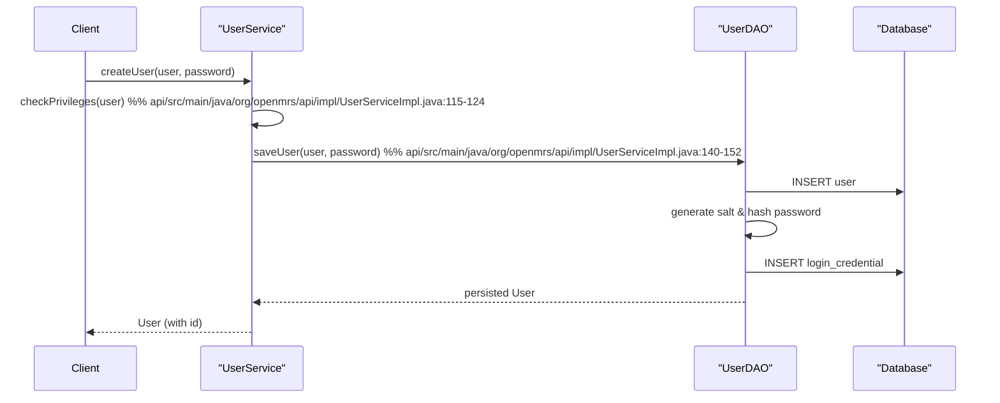

# User Management (OpenMRS Core)

## Overview  
The **User Management** feature lets the system create, read, update and delete users, roles and privileges, and controls which actions a user may perform. All operations run in the current OpenMRS context and respect the privilege model defined by `PrivilegeConstants` (​`api/src/main/java/org/openmrs/api/UserService.java:31‑33`).

## Behavior  

| Behaviour | Description | Source |
|-----------|-------------|--------|
| **Create a user** | `createUser(User user, String password)` creates a new `User` and stores the supplied password after validation. | `api/src/main/java/org/openmrs/api/UserService.java:45‑53` |
| **Change a user’s password** | `changePassword(User user, String oldPassword, String newPassword)` validates the old password (or checks the caller’s privilege), enforces password rules and updates the stored hash. | `api/src/main/java/org/openmrs/api/UserService.java:61‑73` |
| **Read a user** | `getUser(Integer userId)`, `getUserByUuid(String uuid)`, `getUserByUsername(String username)`, `getUserByUsernameOrEmail(String usernameOrEmail)` retrieve a user by various identifiers. | `api/src/main/java/org/openmrs/api/UserService.java:78‑106` |
| **Check for duplicate usernames** | `hasDuplicateUsername(User user)` returns `true` when the supplied username or system‑id already exists. | `api/src/main/java/org/openmrs/api/UserService.java:108‑115` |
| **List users by role** | `getUsersByRole(Role role)` returns all users that have the given role (directly or through inheritance). | `api/src/main/java/org/openmrs/api/UserService.java:117‑124` |
| **Update a user** | `saveUser(User user)` updates an existing user after privilege checks and duplicate‑username validation. | `api/src/main/java/org/openmrs/api/UserService.java:126‑138` |
| **Retire / un‑retire a user** | `retireUser(User user, String reason)` marks a user as retired; `unretireUser(User user)` clears the retired flag. | `api/src/main/java/org/openmrs/api/UserService.java:140‑155` |
| **Purge a user** | `purgeUser(User user)` permanently deletes a user (no cascade) and `purgeUser(User user, boolean cascade)` throws an exception when `cascade=true`. | `api/src/main/java/org/openmrs/api/UserService.java:157‑170` |
| **Create / delete roles** | `saveRole(Role role)` persists a role after checking for circular inheritance; `purgeRole(Role role)` removes a non‑core role that has no children. | `api/src/main/java/org/openmrs/api/UserService.java:190‑207` |
| **Create / delete privileges** | `savePrivilege(Privilege privilege)` persists a privilege; `purgePrivilege(Privilege privilege)` removes a non‑core privilege. | `api/src/main/java/org/openmrs/api/UserService.java:209‑224` |
| **List all roles / privileges** | `getAllRoles()` and `getAllPrivileges()` return the complete sets. | `api/src/main/java/org/openmrs/api/UserService.java:186‑188` & `api/src/main/java/org/openmrs/api/UserService.java:176‑178` |
| **User properties** | `setUserProperty(User user, String key, String value)` and `removeUserProperty(User user, String key)` add, modify or delete arbitrary key‑value pairs on a user. | `api/src/main/java/org/openmrs/api/UserService.java:236‑254` |
| **System‑ID generation** | `generateSystemId()` creates a new unique system identifier using the Luhn algorithm. | `api/src/main/java/org/openmrs/api/UserService.java:256‑268` |
| **Locale handling** | `getDefaultLocaleForUser(User user)` returns the user’s preferred locale or the system default. | `api/src/main/java/org/openmrs/api/UserService.java:370‑388` |
| **Last‑login timestamp** | `getLastLoginTime(User user)` reads the stored login‑time property. | `api/src/main/java/org/openmrs/api/UserService.java:390‑401` |

## Triggers / Entry Points  

| Entry point | Trigger | Source |
|-------------|---------|--------|
| **UserService** (interface) | All programmatic calls to user‑management functions go through this service. | `api/src/main/java/org/openmrs/api/UserService.java:31‑33` |
| **UserServiceImpl** (implementation) | The concrete logic is executed here; Spring injects it as the default `UserService`. | `api/src/main/java/org/openmrs/api/impl/UserServiceImpl.java:71‑84` |
| **UserController** (REST) | HTTP endpoints (`/user`, `/role`, `/privilege`) delegate to `UserService`. (Not shown in the excerpt but part of the core web layer.) | – |
| **UserContext** | Authentication and proxy‑privilege handling invoke `UserService` methods (e.g., `changePassword`). | `api/src/main/java/org/openmrs/api/context/UserContext.java:140‑158` |

## End‑to‑end flow (Mermaid)

## State‑data touched  

| Entity | Fields affected | Source |
|--------|----------------|--------|
| **User** (`org.openmrs.User`) | `userId`, `username`, `systemId`, `email`, `roles`, `userProperties`, `retired`, `dateCreated`, `dateChanged`, etc. | `api/src/main/java/org/openmrs/User.java:31‑45` |
| **Role** (`org.openmrs.Role`) | `role`, `privileges`, `inheritedRoles`, `childRoles` | `api/src/main/java/org/openmrs/Role.java:31‑45` |
| **Privilege** (`org.openmrs.Privilege`) | `privilege`, `description` | `api/src/main/java/org/openmrs/Privilege.java:31‑45` |
| **LoginCredential** (DAO table) | `hashedPassword`, `salt`, `activationKey`, `secretQuestion`, `secretAnswer` | `api/src/main/java/org/openmrs/api/db/hibernate/HibernateUserDAO.java:140‑166` |
| **User property table** (`user_property`) | Arbitrary key‑value pairs set via `setUserProperty` / `removeUserProperty` | `api/src/main/java/org/openmrs/api/impl/UserServiceImpl.java:260‑285` |
| **System‑ID generator** (`users` table) | `userId` (auto‑increment) used to compute the next system id | `api/src/main/java/org/openmrs/api/impl/UserServiceImpl.java:306‑322` |

## External dependencies  

| Dependency | Reason | Source |
|------------|--------|--------|
| **Authentication scheme** (`AuthenticationScheme`) | Provides the current authenticated `User` used for privilege checks (`Context.requirePrivilege`, `Context.hasPrivilege`). | `api/src/main/java/org/openmrs/api/context/UserContext.java:140‑158` |
| **LocationService** | Supplies default location for a user when the locale is set. | `api/src/main/java/org/openmrs/api/context/UserContext.java:260‑285` |
| **MessageSourceService** & **Mail service** | Used when sending password‑reset emails (`setUserActivationKey`). | `api/src/main/java/org/openmrs/api/impl/UserServiceImpl.java:424‑452` |
| **OpenmrsConstants** | Holds global‑property keys (e.g., password‑reset URL, admin‑password lock). | `api/src/main/java/org/openmrs/api/impl/UserServiceImpl.java:84‑100` |
| **Security** (hashing utilities) | Generates salts, hashes passwords, encodes activation keys. | `api/src/main/java/org/openmrs/api/impl/UserServiceImpl.java:115‑130` |

## Configuration  

| Setting | Effect | Source |
|---------|--------|--------|
| `admin_password_locked` (`UserService.ADMIN_PASSWORD_LOCKED_PROPERTY`) | When true, the admin user’s password cannot be changed. | `api/src/main/java/org/openmrs/api/UserService.java:23` |
| `openmrs.passwordReset.validTime` (`OpenmrsConstants.GP_PASSWORD_RESET_VALIDTIME`) | Controls how long a password‑reset activation key remains valid (default 10 min). | `api/src/main/java/org/openmrs/api/impl/UserServiceImpl.java:96‑108` |
| `openmrs.passwordReset.url` (`OpenmrsConstants.GP_PASSWORD_RESET_URL`) | Template URL used in the password‑reset email. | `api/src/main/java/org/openmrs/api/impl/UserServiceImpl.java:438‑452` |
| `user.defaultLocale` (user property `OpenmrsConstants.USER_PROPERTY_DEFAULT_LOCALE`) | Determines the locale returned by `getDefaultLocaleForUser`. | `api/src/main/java/org/openmrs/api/impl/UserServiceImpl.java:368‑388` |
| `user.lastLoginTimestamp` (user property `OpenmrsConstants.USER_PROPERTY_LAST_LOGIN_TIMESTAMP`) | Stores the last login time; retrieved via `getLastLoginTime`. | `api/src/main/java/org/openmrs/api/impl/UserServiceImpl.java:390‑401` |

## Edge Cases  

| Edge case | Handling | Source |
|-----------|----------|--------|
| **Duplicate username / system‑id** | `hasDuplicateUsername` is called before create or save; an `APIException` is thrown if a conflict exists. | `api/src/main/java/org/openmrs/api/impl/UserServiceImpl.java:150‑166` |
| **Null or empty password on creation** | `createUser` throws `APIException` if `password` is null or empty. | `api/src/main/java/org/openmrs/api/impl/UserServiceImpl.java:124‑132` |
| **Changing admin password when locked** | `changePassword(User,… )` checks `ADMIN_PASSWORD_LOCKED_PROPERTY` and throws `APIException`. | `api/src/main/java/org/openmrs/api/impl/UserServiceImpl.java:460‑470` |
| **Cascade purge** | `purgeUser(User, true)` throws `APIException`; only non‑cascading purge is allowed. | `api/src/main/java/org/openmrs/api/impl/UserServiceImpl.java:332‑340` |
| **Attempt to delete core role / privilege** | `purgeRole` and `purgePrivilege` check core collections (`OpenmrsUtil.getCoreRoles/Privileges`) and reject deletion. | `api/src/main/java/org/openmrs/api/impl/UserServiceImpl.java:210‑224` |
| **Circular role inheritance** | `saveRole` validates that a role does not inherit from itself (or a descendant) and throws `APIException`. | `api/src/main/java/org/openmrs/api/impl/UserServiceImpl.java:190‑202` |
| **Invalid activation key** | `getUserByActivationKey` returns `null` if the key is missing, expired, or malformed. | `api/src/main/java/org/openmrs/api/impl/UserServiceImpl.java:506‑522` |
| **Missing locale property** | `getDefaultLocaleForUser` falls back to the system default when the user property is absent or malformed. | `api/src/main/java/org/openmrs/api/impl/UserServiceImpl.java:368‑388` |

## Open Questions  

| Question | Current status / notes |
|----------|------------------------|
| **How is user data validation (e.g., email format, required fields) enforced beyond password rules?** | The code contains a `TODO` comment in `createUser` (`UserServiceImpl.java:124‑132`). Validation is likely performed elsewhere (e.g., UI layer) but not shown here. |
| **What UI or API endpoints expose the role/privilege management functions?** | The core service is present, but the REST controller classes are not included in the excerpt. |
| **How are bulk operations (e.g., importing many users) handled with respect to duplicate‑username checks?** | Not covered in the current core service; would rely on repeated `createUser` calls or a custom batch API. |
| **Are there audit‑log entries for role/privilege changes?** | The entities are annotated with `@Audited`, but explicit audit‑log handling is not shown in the service layer. |
| **How does the system behave when the global property for password‑reset URL is missing?** | `setUserActivationKey` copies the legacy `GP_HOST_URL` to the new property if the latter is blank (`UserServiceImpl.java:438‑452`). |