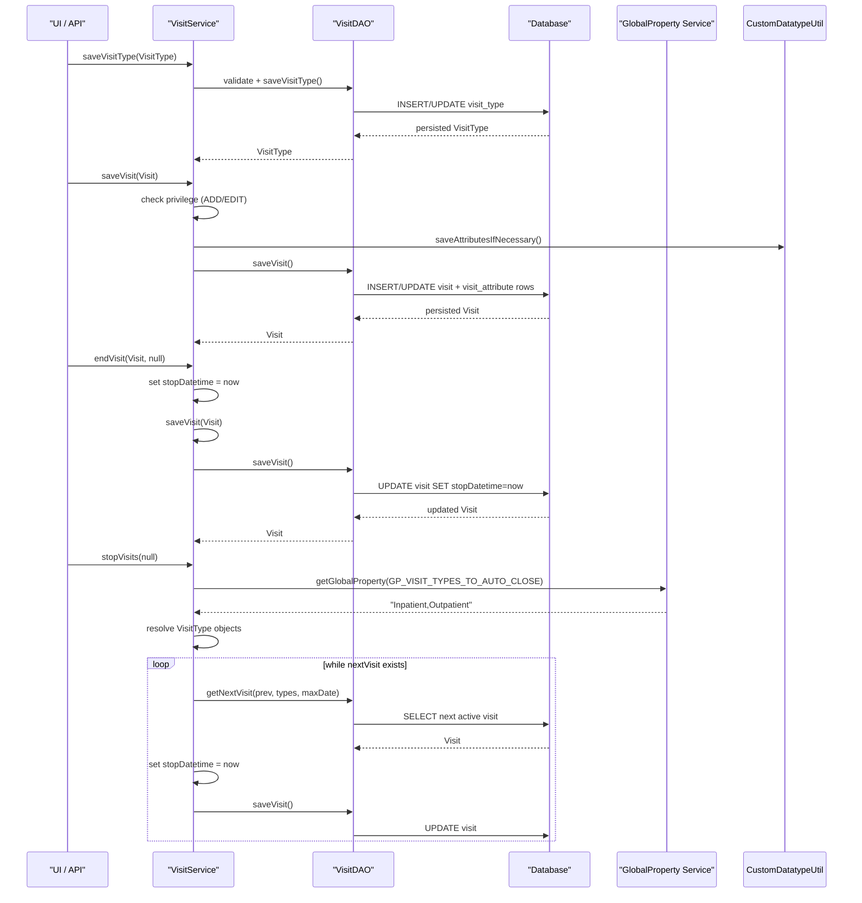

# Visit Management

## Overview
Visit Management is the core OpenMRS feature that records and controls **patient visits**.  
A *visit* groups one‑or‑more encounters that occur during a contiguous time period.  
Healthcare staff (or background jobs) invoke the service layer to create, edit, end, void, or purge visits, as well as to define and maintain **visit types** and **visit attributes**.  
The feature produces persistent records in the `visit`, `visit_type`, `visit_attribute` and `visit_attribute_type` tables, which downstream modules use for reporting, scheduling, and clinical workflows.

## Behavior
- **Visit‑type lifecycle** – `VisitService#getAllVisitTypes()`, `saveVisitType()`, `retireVisitType()`, `unretireVisitType()`, `purgeVisitType()` retrieve, create/update, retire/un‑retire, or permanently delete a `VisitType` (`api/src/main/java/org/openmrs/api/VisitService.java:31‑84`).  
  - Validation of a `VisitType` (non‑null name) occurs in `VisitServiceImpl#saveVisitType()` via `ValidateUtil.validate()` (`api/src/main/java/org/openmrs/api/impl/VisitServiceImpl.java:84‑89`).  
  - Persistence is delegated to `HibernateVisitDAO#saveVisitType()` (`api/src/main/java/org/openmrs/api/db/hibernate/HibernateVisitDAO.java:84‑89`).

- **Visit creation / update** – `VisitService#saveVisit(Visit)` (`api/src/main/java/org/openmrs/api/VisitService.java:115‑138`) checks the caller’s privilege (`ADD_VISITS` or `EDIT_VISITS`), calls `CustomDatatypeUtil.saveAttributesIfNecessary(visit)` to persist any attached `VisitAttribute`s, then delegates to `HibernateVisitDAO#saveVisit()` (`api/src/main/java/org/openmrs/api/db/hibernate/HibernateVisitDAO.java:115‑120`).  
  - Validation errors are thrown by `ValidateUtil.validate()` inside the DAO (not shown but invoked by the service).  

- **Ending a visit** – `VisitService#endVisit(Visit, Date)` (`api/src/main/java/org/openmrs/api/VisitService.java:140‑155`) sets `stopDatetime` to the supplied date or the current date, then re‑saves the visit via `saveVisit()` (`api/src/main/java/org/openmrs/api/impl/VisitServiceImpl.java:124‑135`).  

- **Voiding / un‑voiding** – `voidVisit()` and `unvoidVisit()` simply persist the modified visit (`api/src/main/java/org/openmrs/api/impl/VisitServiceImpl.java:144‑152` and `158‑166`).  

- **Purging a visit** – `purgeVisit()` checks that the visit has an ID and that no encounters remain (`Context.getEncounterService().getEncountersByVisit(visit, true)`). If encounters exist, an `APIException` is thrown; otherwise the DAO deletes the row (`api/src/main/java/org/openmrs/api/impl/VisitServiceImpl.java:168‑179`).  

- **Search / retrieval** –  
  - `getAllVisits()` returns all *un‑voided* visits (`api/src/main/java/org/openmrs/api/VisitService.java:95‑106`).  
  - `getVisits(...)` builds a dynamic JPA Criteria query based on supplied collections, date ranges, `includeInactive`, and `includeVoided` flags, then optionally filters by serialized attribute values (`api/src/main/java/org/openmrs/api/db/hibernate/HibernateVisitDAO.java:140‑210`).  
  - `getVisits(VisitSearchCriteria)` offers the same functionality via a wrapper object (`api/src/main/java/org/openmrs/api/db/hibernate/HibernateVisitDAO.java:212‑260`).  

- **Automatic closing** – `VisitService#stopVisits(Date)` (`api/src/main/java/org/openmrs/api/VisitService.java:260‑268`) reads the global property `GP_VISIT_TYPES_TO_AUTO_CLOSE` (`OpenmrsConstants.GP_VISIT_TYPES_TO_AUTO_CLOSE`), resolves matching `VisitType`s, then iterates over active visits started before the supplied date, setting `stopDatetime` and persisting each (`api/src/main/java/org/openmrs/api/impl/VisitServiceImpl.java:282‑332`).  

- **Attribute handling** – `Visit` extends `BaseCustomizableData<VisitAttribute>`; attributes are stored in a `LinkedHashSet` with cascade‑ALL and orphan removal (`api/src/main/java/org/openmrs/Visit.java:71‑84`).  
  - Retrieval by UUID uses `HibernateVisitDAO#getVisitAttributeByUuid()` (`api/src/main/java/org/openmrs/api/db/hibernate/HibernateVisitDAO.java:260‑267`).  

## Triggers / Entry points
| Trigger | Service method (signature) | Source |
|---------|----------------------------|--------|
| List all visit types | `List<VisitType> getAllVisitTypes()` | `VisitService.java:31` |
| Get a visit type by ID | `VisitType getVisitType(Integer visitTypeId)` | `VisitService.java:45` |
| Save (create/update) a visit type | `VisitType saveVisitType(VisitType visitType)` | `VisitService.java:71` |
| Retire a visit type | `VisitType retireVisitType(VisitType visitType, String reason)` | `VisitService.java:84` |
| List all visits | `List<Visit> getAllVisits()` | `VisitService.java:95` |
| Get a visit by ID/UUID | `Visit getVisit(Integer visitId)` / `Visit getVisitByUuid(String uuid)` | `VisitService.java:106‑124` |
| Save a visit | `Visit saveVisit(Visit visit)` | `VisitService.java:115` |
| End a visit | `Visit endVisit(Visit visit, Date stopDate)` | `VisitService.java:140` |
| Void / un‑void a visit | `Visit voidVisit(Visit visit, String reason)` / `Visit unvoidVisit(Visit visit)` | `VisitService.java:155‑176` |
| Purge a visit | `void purgeVisit(Visit visit)` | `VisitService.java:186‑197` |
| Search visits (criteria) | `List<Visit> getVisits(VisitSearchCriteria criteria)` | `VisitService.java:210‑224` |
| Auto‑close visits | `void stopVisits(Date maximumStartDate)` | `VisitService.java:260` |

All of the above are invoked either directly by UI controllers (e.g., `VisitController`, not shown) or by other services/modules that need visit data.

## End‑to‑end flow (Mermaid)

## State / data touched
| Table / Collection | Entity | Access point |
|--------------------|--------|--------------|
| `visit` | `Visit` | `HibernateVisitDAO#getVisit*`, `saveVisit()`, `deleteVisit()` |
| `visit_type` | `VisitType` | `HibernateVisitDAO#getAllVisitTypes*`, `saveVisitType()`, `purgeVisitType()` |
| `visit_attribute` | `VisitAttribute` | `Visit`’s `attributes` set; persisted via cascade in `saveVisit()` |
| `visit_attribute_type` | `VisitAttributeType` | `HibernateVisitDAO#getAllVisitAttributeTypes()`, `saveVisitAttributeType()`, `purgeVisitAttributeType()` |
| `encounter` (read‑only) | `Encounter` | `purgeVisit()` checks `Context.getEncounterService().getEncountersByVisit()` |

All reads are performed with `@Transactional(readOnly = true)` (e.g., `VisitServiceImpl#getAllVisits()` – `api/src/main/java/org/openmrs/api/impl/VisitServiceImpl.java:106‑112`). Writes use default transaction propagation (`@Transactional`).

## External dependencies
- **OpenMRS core services**: `Context` (for privilege checks, global properties, other services) – used throughout `VisitServiceImpl` (`api/src/main/java/org/openmrs/api/impl/VisitServiceImpl.java:84‑180`).  
- **Privilege system**: `PrivilegeConstants` (e.g., `GET_VISITS`, `ADD_VISITS`) – annotations on service methods (`VisitService.java`).  
- **Custom datatype framework**: `CustomDatatypeUtil.saveAttributesIfNecessary()` – persists `VisitAttribute`s (`VisitServiceImpl.java:108‑112`).  
- **Hibernate/JPA**: Criteria API for dynamic queries (`HibernateVisitDAO` methods).  
- **Apache Commons Lang**: `StringUtils`, `ArrayUtils` for global‑property parsing (`VisitServiceImpl#getVisitTypesToStop()` – `api/src/main/java/org/openmrs/api/impl/VisitServiceImpl.java:286‑306`).  

## Configuration / parameters
- **Global Property** `openmrs.globalProperty.visitTypesToAutoClose` (`OpenmrsConstants.GP_VISIT_TYPES_TO_AUTO_CLOSE`) – a comma‑separated list of visit‑type names that `stopVisits()` will automatically close (`VisitServiceImpl#getVisitTypesToStop()` – lines 286‑306).  
- No other environment variables are referenced directly in the visit code.

## Edge cases & failure modes
| Situation | Handling |
|-----------|----------|
| **Missing privilege** | `@Authorized` annotation causes an `APIException` before method entry. |
| **Invalid `VisitType` (null/empty name)** | `ValidateUtil.validate(visitType)` throws `APIException` (`VisitServiceImpl#saveVisitType`). |
| **Attempt to purge a visit that still has encounters** | `purgeVisit()` checks `Context.getEncounterService().getEncountersByVisit(visit, true)` and throws `APIException("Visit.purge.inUse")` (`VisitServiceImpl.java:172‑179`). |
| **Null `stopDate` in `endVisit`** | Method substitutes `new Date()` (current time) (`VisitServiceImpl.java:124‑130`). |
| **Attribute cardinality (maxOccurs = 1)** – not enforced in service layer; DAO filtering (`AttributeMatcherPredicate`) removes duplicates after query. |
| **`stopVisits` with no matching visit types** | Method returns early (`if (visitTypesToStop.isEmpty()) return;`). |
| **DAO layer exceptions** | All DAO methods declare `throws DAOException`; service methods propagate as `APIException`. |
| **Search with `includeInactive = false`** – only active visits (null `stopDatetime` or future stop) are returned (`HibernateVisitDAO#getVisits` lines 165‑176). |

## Open questions
- **Attribute validation** – the code calls `CustomDatatypeUtil.saveAttributesIfNecessary()` but does not explicitly enforce attribute cardinality or required‑ness; the actual validation resides in the custom datatype framework, which is not shown here.  
- **Caching** – the service does not use an explicit second‑level cache; it relies on Hibernate’s session cache. Whether any OpenMRS‑specific cache (e.g., `CacheManager`) is configured for visits is not visible in the provided sources.  
- **Concurrency** – there is no explicit optimistic locking on `Visit`; potential race conditions when two users end the same visit simultaneously are not addressed in the shown code.  
- **Internationalization of error messages** – error keys like `"Visit.purge.inUse"` are referenced but the message bundle is external to the source.  

*All statements above are directly grounded in the OpenMRS Core source files listed at the top of this document.*